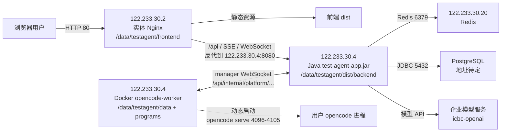

# 企业内 Docker 部署文件

本目录提供企业内部署文件。当前部署采用三机拆分：前端实体 Nginx 单独部署，后端 Java 与 `opencode-worker` 部署在同一台服务器，Redis 独立部署，PostgreSQL 地址待定。Docker Compose 只负责启动 `opencode-worker` 容器，不启动前端、Nginx、Java、Redis 或 PostgreSQL。

企业部署根目录统一使用 `/data/testagent`，建议目录规划如下：

```text
/data/testagent/
  data/       Java 的 SYS_DATA_ROOT_DIR，也是 worker 的数据挂载目录
  frontend/   前端 dist 解压目录，供实体 Nginx 托管
  programs/   外挂 opencode-manager 和 opencode CLI
  dist/       打包脚本输出的 jar、前端包、程序包和镜像 tar
```

## 当前三机部署规划

当前企业内部署按以下服务器拆分：

| 角色 | 地址 | 部署内容 |
|---|---|---|
| 前端入口 | `122.233.30.2` | 实体 Nginx，托管 `/data/testagent/frontend`，把 `/api` 反向代理到 `122.233.30.4:8080`。 |
| 后端与 worker | `122.233.30.4` | JDK 21 直接运行 `test-agent-app.jar`，Docker Compose 运行 `opencode-worker`。 |
| Redis | `122.233.30.20` | Redis 外部依赖，Java 后端连接该地址。 |
| PostgreSQL | 待定 | 确认后写入后端外置配置 `TEST_AGENT_DB_URL/USERNAME/PASSWORD`。 |

部署链路图：



外置配置文件建议固定放在：

```text
/data/testagent/config/
  backend.env     Java 后端运行环境变量，模板见 deploy/internal/backend.env.example
  docker.env      opencode-worker Compose 和打包环境变量，模板见 deploy/internal/env.example
  nginx.env       前端 Nginx 配置生成变量，可按下文内容手工创建
```

其中 `docker.env` 里的 `VITE_TEST_AGENT_API_BASE_URL` 已按当前前端入口写为 `http://122.233.30.2`，`TEST_AGENT_BACKEND` 已按当前后端写为 `122.233.30.4:8080`。

## 每台服务器部署清单

### `122.233.30.2` 前端 Nginx

从打包输出 `dist/` 中只需要放这些到 `122.233.30.2`：

| 打包机文件 | 放到前端服务器哪里 | 用途 |
|---|---|---|
| `/data/testagent/dist/test-agent-frontend-dist.tar.gz` | `/data/testagent/dist/test-agent-frontend-dist.tar.gz` | 前端静态资源压缩包。 |
| 仓库 `deploy/internal/nginx/gateway.conf.template` | 可选，放到 `/data/testagent/deploy/internal/nginx/gateway.conf.template` | 只在使用模板生成 Nginx 配置时需要；不想用模板时可直接按下方完整配置写 Nginx。 |

不要放到前端服务器：

- `test-agent-app.jar`
- `test-agent-opencode-worker_internal-linux-amd64.tar`
- `test-agent-programs.tar.gz`

安装内容：

| 路径 | 内容 | 来源 |
|---|---|---|
| `/data/testagent/frontend/` | 前端静态文件 | 解压 `test-agent-frontend-dist.tar.gz` 后得到的 `frontend/` 目录内容。 |
| `/data/testagent/deploy/internal/nginx/gateway.conf.template` | Nginx 配置模板 | 从仓库 `deploy/internal/nginx/gateway.conf.template` 复制。 |
| `/data/testagent/config/nginx.env` | Nginx 生成配置变量 | 手工创建，内容见下方示例。 |
| `/etc/nginx/conf.d/test-agent.conf` | Nginx 站点配置 | 用 `deploy/internal/nginx/gateway.conf.template` + `nginx.env` 生成。 |

创建基础目录：

```bash
mkdir -p /data/testagent/frontend /data/testagent/config /data/testagent/deploy /data/testagent/dist
rm -rf /data/testagent/deploy/internal
cp -R deploy/internal /data/testagent/deploy/internal
```

解压前端包：

```bash
tar -C /data/testagent -xzf /data/testagent/dist/test-agent-frontend-dist.tar.gz
```

创建 `/data/testagent/config/nginx.env`：

```dotenv
TEST_AGENT_NGINX_LISTEN_PORT=80
TEST_AGENT_FRONTEND_ROOT=/data/testagent/frontend
TEST_AGENT_BACKEND=122.233.30.4:8080
```

通常只需要改：

| 配置项 | 当前值 | 什么时候改 |
|---|---|---|
| `TEST_AGENT_NGINX_LISTEN_PORT` | `80` | 前端入口端口不是 80 时修改。 |
| `TEST_AGENT_FRONTEND_ROOT` | `/data/testagent/frontend` | 前端静态文件放到其他目录时修改。 |
| `TEST_AGENT_BACKEND` | `122.233.30.4:8080` | 后端 IP 或 Java 端口变化时修改。 |

推荐直接写完整 Nginx 配置，不需要手写模板变量，也不需要执行 `envsubst`：

```bash
cat >/etc/nginx/conf.d/test-agent.conf <<'EOF'
map $http_upgrade $connection_upgrade {
    default upgrade;
    '' close;
}

upstream test_agent_backend {
    server 122.233.30.4:8080;
}

server {
    listen 80;
    server_name _;
    root /data/testagent/frontend;
    index index.html;

    location = /health {
        access_log off;
        add_header Content-Type text/plain;
        return 200 "ok\n";
    }

    location = /api {
        proxy_pass http://test_agent_backend;
        proxy_http_version 1.1;
        proxy_set_header Host $host;
        proxy_set_header X-Real-IP $remote_addr;
        proxy_set_header X-Forwarded-For $proxy_add_x_forwarded_for;
        proxy_set_header X-Forwarded-Proto $scheme;
        proxy_set_header Upgrade $http_upgrade;
        proxy_set_header Connection $connection_upgrade;
        proxy_read_timeout 3600s;
        proxy_send_timeout 3600s;
        proxy_buffering off;
        proxy_cache off;
    }

    location /api/ {
        proxy_pass http://test_agent_backend;
        proxy_http_version 1.1;
        proxy_set_header Host $host;
        proxy_set_header X-Real-IP $remote_addr;
        proxy_set_header X-Forwarded-For $proxy_add_x_forwarded_for;
        proxy_set_header X-Forwarded-Proto $scheme;
        proxy_set_header Upgrade $http_upgrade;
        proxy_set_header Connection $connection_upgrade;
        proxy_read_timeout 3600s;
        proxy_send_timeout 3600s;
        proxy_buffering off;
        proxy_cache off;
    }

    location / {
        try_files $uri $uri/ /index.html;
    }
}
EOF

nginx -t
systemctl reload nginx
```

如果希望用仓库模板生成，也可以这样做：

```bash
set -a
. /data/testagent/config/nginx.env
set +a
envsubst '${TEST_AGENT_NGINX_LISTEN_PORT} ${TEST_AGENT_FRONTEND_ROOT} ${TEST_AGENT_BACKEND}' \
  < /data/testagent/deploy/internal/nginx/gateway.conf.template \
  > /etc/nginx/conf.d/test-agent.conf
nginx -t
systemctl reload nginx
```

验证：

```bash
curl -fsS http://122.233.30.2/health
curl -fsS http://122.233.30.2/
```

### `122.233.30.4` 后端 Java 与 Docker Worker

从打包输出 `dist/` 中只需要放这些到 `122.233.30.4`：

| 打包机文件 | 放到后端服务器哪里 | 用途 |
|---|---|---|
| `/data/testagent/dist/backend/test-agent-app.jar` | `/data/testagent/dist/backend/test-agent-app.jar` | Java 后端启动包。 |
| `/data/testagent/dist/test-agent-programs.tar.gz` | `/data/testagent/dist/test-agent-programs.tar.gz` | 解压成 `/data/testagent/programs/`，供 worker 优先使用外挂 opencode 程序。 |
| `/data/testagent/dist/test-agent-opencode-worker_internal-linux-amd64.tar` | `/data/testagent/dist/test-agent-opencode-worker_internal-linux-amd64.tar` | `docker load` 导入 worker 镜像。 |
| 仓库 `deploy/internal/` | `/data/testagent/deploy/internal/` | 运行 `docker-compose.yml`。 |

不要放到后端服务器：

- `test-agent-frontend-dist.tar.gz`，除非这台机器也临时承担前端 Nginx。

安装内容：

| 路径 | 内容 | 来源 |
|---|---|---|
| `/data/testagent/dist/backend/test-agent-app.jar` | Java 后端可执行 jar | 打包产物。 |
| `/data/testagent/dist/test-agent-opencode-worker_internal-linux-amd64.tar` | worker 镜像 tar | 打包产物，目标机 `docker load`。 |
| `/data/testagent/deploy/internal/docker-compose.yml` | worker Compose 文件 | 从仓库 `deploy/internal/` 目录复制。 |
| `/data/testagent/programs/` | 外挂 `opencode-manager` 和 `opencode` CLI | 解压 `test-agent-programs.tar.gz`。 |
| `/data/testagent/data/` | Java 的 `SYS_DATA_ROOT_DIR`，也是 worker 数据挂载目录 | 运行期目录，必须持久化。 |
| `/data/testagent/config/backend.env` | Java 后端外置配置 | 从 `deploy/internal/backend.env.example` 复制后修改。 |
| `/data/testagent/config/docker.env` | Docker Compose 和打包配置 | 从 `deploy/internal/env.example` 复制后修改。 |

创建基础目录：

```bash
mkdir -p /data/testagent/{config,data,dist,programs,deploy}
rm -rf /data/testagent/deploy/internal
cp -R deploy/internal /data/testagent/deploy/internal
```

放置配置文件：

```bash
cp deploy/internal/backend.env.example /data/testagent/config/backend.env
cp deploy/internal/env.example /data/testagent/config/docker.env
```

`/data/testagent/config/backend.env` 必须改：

| 配置项 | 当前模板值 | 必须怎么改 |
|---|---|---|
| `TEST_AGENT_DB_URL` | `jdbc:postgresql://replace-with-pg-host:5432/replace-with-database` | PostgreSQL 确定后改成真实 JDBC URL。 |
| `TEST_AGENT_DB_USERNAME` | `replace-with-pg-username` | 改成 PostgreSQL 用户名。 |
| `TEST_AGENT_DB_PASSWORD` | `replace-with-pg-password` | 改成 PostgreSQL 密码。 |
| `TEST_AGENT_API_TOKEN` | `replace-with-platform-api-token` | 改成平台 API Bearer token。 |
| `TEST_AGENT_OPENCODE_MANAGER_TOKEN` | `replace-with-manager-token` | 改成随机长 token，并与 `docker.env` 完全一致。 |
| `ICBC_OPENAI_AUTH_TOKEN` | `replace-with-icbc-openai-token` | 改成企业模型服务 token。 |

`/data/testagent/config/backend.env` 通常保持不变：

| 配置项 | 当前值 | 说明 |
|---|---|---|
| `SERVER_PORT` | `8080` | Java 监听端口，前端 Nginx 当前反代到该端口。 |
| `TEST_AGENT_SERVER_ADVERTISED_HOST` | `122.233.30.4` | 后端和 worker 所在服务器地址。 |
| `TEST_AGENT_REDIS_HOST` | `122.233.30.20` | 当前 Redis 服务器。 |
| `TEST_AGENT_CORS_ALLOWED_ORIGINS` | `http://122.233.30.2` | 浏览器访问前端的 origin。 |
| `SYS_DATA_ROOT_DIR` | `/data/testagent/data` | 必须与 worker 的 `TEST_AGENT_DATA_ROOT` 对齐。 |

`/data/testagent/config/docker.env` 必须改：

| 配置项 | 当前模板值 | 必须怎么改 |
|---|---|---|
| `TEST_AGENT_OPENCODE_MANAGER_TOKEN` | `change-me-manager-token` | 改成与 `backend.env` 相同的 manager token。 |
| `ICBC_OPENAI_AUTH_TOKEN` | `replace-with-icbc-auth-token` | 如果该文件也用于打包和交付，改成企业模型服务 token；不要提交真实值。 |

`/data/testagent/config/docker.env` 通常保持不变：

| 配置项 | 当前值 | 说明 |
|---|---|---|
| `VITE_TEST_AGENT_API_BASE_URL` | `http://122.233.30.2` | 前端构建时写入浏览器访问入口，不要追加 `/api`。 |
| `TEST_AGENT_BACKEND` | `122.233.30.4:8080` | 仅用于生成前端 Nginx 配置。 |
| `TEST_AGENT_DATA_ROOT` | `/data/testagent/data` | worker 数据挂载目录。 |
| `TEST_AGENT_PROGRAM_ROOT` | `/data/testagent/programs` | worker 外挂程序目录。 |
| `OPENCODE_WORKER_PORT_START` / `OPENCODE_WORKER_PORT_END` | `4096` / `4105` | worker 发布端口池。只有端口冲突或容量不足时修改。 |

安装交付物：

```bash
docker load -i /data/testagent/dist/test-agent-opencode-worker_internal-linux-amd64.tar
tar -C /data/testagent -xzf /data/testagent/dist/test-agent-programs.tar.gz
```

启动 Java：

```bash
set -a
. /data/testagent/config/backend.env
set +a
java -jar /data/testagent/dist/backend/test-agent-app.jar
```

systemd 示例：

```ini
[Unit]
Description=Test Agent Backend
After=network-online.target

[Service]
WorkingDirectory=/data/testagent
EnvironmentFile=/data/testagent/config/backend.env
ExecStart=/usr/bin/java -jar /data/testagent/dist/backend/test-agent-app.jar
Restart=always
RestartSec=5

[Install]
WantedBy=multi-user.target
```

启动 worker：

```bash
cd /data/testagent/deploy/internal
docker compose --env-file /data/testagent/config/docker.env up -d
```

验证：

```bash
curl -fsS http://122.233.30.4:8080/actuator/health
cd /data/testagent/deploy/internal
docker compose --env-file /data/testagent/config/docker.env ps
```

### `122.233.30.20` Redis

安装内容：

| 路径 | 内容 |
|---|---|
| Redis 数据目录 | 由企业 Redis 运维规范决定。 |
| Redis 配置文件 | 由企业 Redis 运维规范决定。 |

应用侧只要求 Java 后端能访问：

```dotenv
TEST_AGENT_REDIS_HOST=122.233.30.20
TEST_AGENT_REDIS_PORT=6379
TEST_AGENT_REDIS_PASSWORD=
```

如果 Redis 设置密码，必须同步修改 `122.233.30.4` 上的 `/data/testagent/config/backend.env`：

```dotenv
TEST_AGENT_REDIS_PASSWORD=<redis-password>
```

### PostgreSQL 待定服务器

PostgreSQL 地址确定后，只需要修改 `122.233.30.4` 上的 `/data/testagent/config/backend.env`：

```dotenv
TEST_AGENT_DB_URL=jdbc:postgresql://<pg-host>:5432/<database>
TEST_AGENT_DB_USERNAME=<pg-username>
TEST_AGENT_DB_PASSWORD=<pg-password>
```

Java 后端启动时会执行 Flyway migration 初始化或校验库表结构。不要把测试、演示或个人开发数据写进生产 migration。

## 打包与分发路径

建议在构建机先准备与目标一致的 `/data/testagent/config/docker.env`，再打包：

```bash
mkdir -p /data/testagent/config
cp deploy/internal/env.example /data/testagent/config/docker.env
vi /data/testagent/config/docker.env
deploy/internal/package-release.sh --env-file /data/testagent/config/docker.env
```

打包产物分发到服务器：

| 产物 | 放到哪台 | 目标路径 |
|---|---|---|
| `test-agent-frontend-dist.tar.gz` | `122.233.30.2` | `/data/testagent/dist/test-agent-frontend-dist.tar.gz` |
| `backend/test-agent-app.jar` | `122.233.30.4` | `/data/testagent/dist/backend/test-agent-app.jar` |
| `test-agent-programs.tar.gz` | `122.233.30.4` | `/data/testagent/dist/test-agent-programs.tar.gz` |
| `test-agent-opencode-worker_internal-linux-amd64.tar` | `122.233.30.4` | `/data/testagent/dist/test-agent-opencode-worker_internal-linux-amd64.tar` |
| `deploy/internal/` | `122.233.30.2`、`122.233.30.4` | `/data/testagent/deploy/internal/`，前端用 Nginx 模板，后端用 Compose 文件。 |

## 端口约束

Java 后端创建用户 opencode 进程时，会从 manager 上报的 `portStart..portEnd` 里选择端口，并用 `TEST_AGENT_SERVER_ADVERTISED_HOST/.serverhost + port` 生成 `baseUrl`。当前协议没有独立的 `containerPort` 和 `publishedPort` 字段。

因此 `opencode-worker` 的端口池必须就是宿主机发布端口：

- `OPENCODE_MANAGER_PORT_START/END` 写宿主机可访问端口。
- Compose 的 `ports` 必须保持 `hostPort:containerPort` 数值一致，例如 `4096-4105:4096-4105`。
- 不要写 `14096:4096` 这类内外不一致映射，否则 Java 会生成错误的 `baseUrl`。

每个 worker 容器内只有 1 个 `opencode-manager run` 常驻进程；manager 按端口池动态启动 0..N 个 `opencode serve` 子进程。

## Java 直接部署前提

当前部署只启动 1 个 Java 后端，部署在 `122.233.30.4`，监听 `8080`；前端 Nginx 部署在 `122.233.30.2`，监听 `80`：

```bash
server.port=8080
SPRING_PROFILES_ACTIVE=prod
TEST_AGENT_DEPLOYMENT_MODE=internal
TEST_AGENT_SERVER_ADVERTISED_HOST=<host-ip-or-dns>
TEST_AGENT_OPENCODE_MANAGER_TOKEN=<same-manager-token>
TEST_AGENT_CORS_ALLOWED_ORIGINS=http://<gateway-host>
TEST_AGENT_RUN_EVENT_REDIS_BUS_ENABLED=true
TEST_AGENT_SERVER_BROADCAST_ENABLED=true
TEST_AGENT_MODEL_CATALOG_SOURCE=internal
TEST_AGENT_INTERNAL_DEFAULT_MODEL=Qwen3.6-35B-A3B
TEST_AGENT_ICBC_OPENAI_BASE_URL=http://ai-code.sdc.icbc:9070/icbc/jdt/model/api/openai/v1
TEST_AGENT_ICBC_OPENAI_TOKEN_ENV=ICBC_OPENAI_AUTH_TOKEN
ICBC_OPENAI_AUTH_TOKEN=<icbc-openai-token>
TEST_AGENT_ICBC_OPENAI_AUTH_MODE=bearer
TEST_AGENT_ICBC_OPENAI_UCID_HEADER_NAME=ucid
```

当前三机部署时，后端服务器 `122.233.30.4` 推荐把 Java 配置单独放到 `/data/testagent/config/backend.env`，从仓库模板复制后改 PostgreSQL、token 和模型密钥：

```bash
mkdir -p /data/testagent/config /data/testagent/data
cp deploy/internal/backend.env.example /data/testagent/config/backend.env
vi /data/testagent/config/backend.env
```

启动 Java 时加载该外置配置：

```bash
set -a
. /data/testagent/config/backend.env
set +a
java -jar /data/testagent/dist/backend/test-agent-app.jar
```

如果使用 systemd，`EnvironmentFile=/data/testagent/config/backend.env` 即可，不需要把环境变量写进服务文件。

Java 的 `SYS_DATA_ROOT_DIR` 需要与 worker 挂载的 `TEST_AGENT_DATA_ROOT` 对齐，企业内默认是 `/data/testagent/data`，以便 worker 读取 `.serverid` 和 `.serverhost`。如果数据库通用参数仍是 Linux 默认 `/data/.testagent`，部署时需要在系统管理通用参数中把 Linux 平台 `SYS_DATA_ROOT_DIR` 改为 `/data/testagent/data`。如果后续扩成多服务器部署，每台服务器仍按“一台服务器一套 Nginx、前端、Java、worker”的方式独立配置。

## 打包交付物

在仓库根目录执行：

```bash
deploy/internal/package-release.sh --env-file /data/testagent/config/docker.env
```

脚本默认读取 `deploy/internal/.env`；如果该文件不存在，则读取 `deploy/internal/env.example`。当前企业部署建议显式传入外置 `/data/testagent/config/docker.env`，避免打包机和目标服务器配置不一致。它会产出：

```text
/data/testagent/dist/backend/test-agent-app.jar
/data/testagent/dist/frontend/
/data/testagent/dist/test-agent-frontend-dist.tar.gz
/data/testagent/dist/programs/
/data/testagent/dist/test-agent-programs.tar.gz
test-agent-opencode-worker_internal-linux-amd64.tar
```

也就是说：后端 jar 和前端 dist 会随打包一起出来；前端不做业务镜像，实体 Nginx 直接托管 `dist/frontend`。
第一版 `opencode-worker` 镜像里仍内置 `opencode-manager` 和 `opencode-ai` CLI；同时脚本会把这两个程序导出到 `dist/programs/`，Compose 默认把该目录挂进 worker，运行时优先使用外挂程序，找不到时才回退镜像内置程序。

只打某一类交付物：

```bash
deploy/internal/package-release.sh --backend-only
deploy/internal/package-release.sh --frontend-only
deploy/internal/package-release.sh --opencode-only
```

opencode worker 镜像也可以手工执行：

```bash
docker buildx build \
  --platform linux/amd64 \
  -f deploy/internal/opencode-worker.Dockerfile \
  -t test-agent-opencode-worker:internal \
  --load \
  .
```

离线交付时导出 tar：

```bash
docker save -o test-agent-opencode-worker-internal-amd64.tar test-agent-opencode-worker:internal
```

目标机器导入：

```bash
docker load -i test-agent-opencode-worker-internal-amd64.tar
```

## opencode 程序外挂升级

worker 容器启动时按以下优先级选择程序：

```text
/data/testagent/programs/bin/opencode-manager
/data/testagent/programs/opencode/bin/opencode
```

如果上述路径不存在或不可执行，则回退到镜像内置的：

```text
/usr/local/bin/opencode-manager
/usr/local/bin/opencode
```

目标机器首次部署可把交付包中的 `test-agent-programs.tar.gz` 解压到统一目录，例如：

```bash
mkdir -p /data/testagent
tar -C /data/testagent -xzf /data/testagent/dist/test-agent-programs.tar.gz
```

然后在 `/data/testagent/config/docker.env` 中配置：

```dotenv
TEST_AGENT_PROGRAM_ROOT=/data/testagent/programs
```

后续只升级 opencode 或 manager 时，可以只替换 `/data/testagent/programs` 下对应文件，再重启 worker：

```bash
cd /data/testagent/deploy/internal
docker compose --env-file /data/testagent/config/docker.env restart opencode-worker
```

如果已有用户 `opencode serve` 子进程在运行，建议先通过平台运行管理停止或重启相关用户进程，避免旧子进程继续使用旧版本。

## 实体 Nginx 部署

实体 Nginx 至少需要做两件事：

- 静态资源根目录指向 `/data/testagent/frontend/` 或解压后的 `test-agent-frontend-dist.tar.gz`。
- `/api`、SSE 和 WebSocket 请求反向代理到 `122.233.30.4:8080` 的 Java 后端。

`deploy/internal/nginx/` 下的配置文件只作为实体 Nginx 配置参考，不由 Docker Compose 启动。

示例模板 `deploy/internal/nginx/gateway.conf.template` 使用这些变量：

```bash
TEST_AGENT_FRONTEND_ROOT=/data/testagent/frontend
TEST_AGENT_NGINX_LISTEN_PORT=80
TEST_AGENT_BACKEND=122.233.30.4:8080
```

生成实体 Nginx 配置示例：

```bash
envsubst '${TEST_AGENT_NGINX_LISTEN_PORT} ${TEST_AGENT_FRONTEND_ROOT} ${TEST_AGENT_BACKEND}' \
  < /data/testagent/deploy/internal/nginx/gateway.conf.template \
  > /etc/nginx/conf.d/test-agent.conf
```

## 启动 opencode worker Compose

复制环境变量模板：

```bash
mkdir -p /data/testagent/config
cp deploy/internal/env.example /data/testagent/config/docker.env
```

编辑 `/data/testagent/config/docker.env`，至少修改：

- `VITE_TEST_AGENT_API_BASE_URL`，当前为 `http://122.233.30.2`；不要追加 `/api`
- `ICBC_OPENAI_AUTH_TOKEN`，填企业内 `icbc-openai` 访问 token；不要提交真实 token
- `TEST_AGENT_OPENCODE_MANAGER_TOKEN`
- `TEST_AGENT_DATA_ROOT`
- `TEST_AGENT_PROGRAM_ROOT`
- worker 的端口池

启动：

```bash
cd /data/testagent/deploy/internal
docker compose --env-file /data/testagent/config/docker.env up -d
```

检查：

```bash
docker compose --env-file /data/testagent/config/docker.env ps
```

## 运行时外部依赖

`opencode-worker` 镜像内已包含 `opencode-manager` 和 npm 安装的 `opencode-ai` CLI；外挂程序目录用于后续小版本更新。目标环境仍必须提供 PostgreSQL、Redis、企业内模型服务、Git/SSH 网络和 Java 后端所需密钥。`/data/testagent/data/agent-opencode/.config/opencode/` 必须由超级管理员完成公共配置初始化且非空，否则 manager 会拒绝启动用户 opencode 进程。
