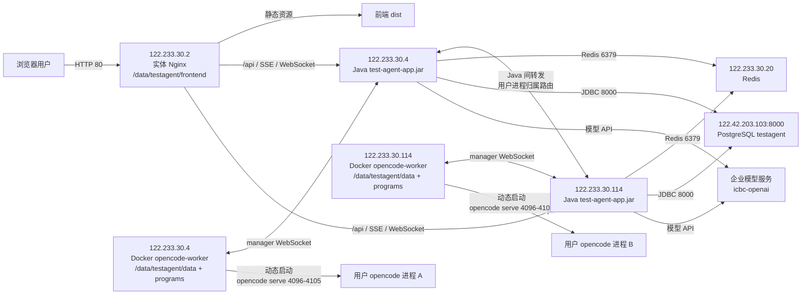

# 企业内 Docker 部署文件

本目录提供企业内部署文件。当前部署采用前端实体 Nginx 单独部署，后端 Java 与 `opencode-worker` 可在多台服务器横向部署；当前规划为 `122.233.30.4` 和 `122.233.30.114` 两台后端/worker 节点，Redis 独立部署，PostgreSQL 使用 `122.42.203.103:8000/testagent`。企业内 `opencode-worker` 统一用纯 Docker 命令管理，不使用 Docker Compose；前端、Nginx、Java、Redis 和 PostgreSQL 也不由 Docker 编排启动。

企业部署根目录统一使用 `/data/testagent`，建议目录规划如下：

```text
/data/testagent/
  data/       Java 的 SYS_DATA_ROOT_DIR，也是 worker 的数据挂载目录
  frontend/   前端 dist 解压目录，供实体 Nginx 托管
  programs/   外挂 opencode-manager 和 opencode CLI
  dist/       打包脚本输出的 jar、前端包、程序包和镜像 tar
```

## 当前部署规划

双后端详细部署、配置差异和排查命令见 `deploy/internal/README-two-backend-122-233-30-114.md`。

当前企业内部署按以下服务器拆分：

| 角色 | 地址 | 部署内容 |
|---|---|---|
| 前端入口 | `122.233.30.2` | 实体 Nginx，托管 `/data/testagent/frontend`，把 `/api` 反向代理到 `122.233.30.4:8080` 和 `122.233.30.114:8080`。 |
| 后端与 worker A | `122.233.30.4` | JDK 21 直接运行 `test-agent-app.jar`，纯 Docker 运行 `opencode-worker`。 |
| 后端与 worker B | `122.233.30.114` | 新增 JDK 21 后端节点和本机 `opencode-worker`，与 `122.233.30.4` 共用 PostgreSQL、Redis 和前端入口。 |
| Redis | `122.233.30.20` | Redis 外部依赖，Java 后端连接该地址。 |
| PostgreSQL | `122.42.203.103:8000` | Java 后端通过 `jdbc:postgresql://122.42.203.103:8000/testagent` 连接。 |

部署链路图：



外置配置文件建议固定放在：

```text
/data/testagent/config/
  backend.env     Java 后端运行环境变量，模板见 deploy/internal/backend.env.example
  docker.env      opencode-worker 纯 Docker 启动和打包环境变量，模板见 deploy/internal/env.example
  nginx.env       前端 Nginx 配置生成变量，可按下文内容手工创建
```

其中 `docker.env` 里的 `VITE_TEST_AGENT_API_BASE_URL` 已按当前前端入口写为 `http://122.233.30.2`；`TEST_AGENT_BACKEND` 只服务单后端 Nginx 模板，双后端时按 `README-two-backend-122-233-30-114.md` 手工写 Nginx upstream。

## 每台服务器部署清单

### `122.233.30.2` 前端 Nginx

从打包输出 `dist/` 中只需要放这些到 `122.233.30.2`：

| 打包机文件 | 放到前端服务器哪里 | 用途 |
|---|---|---|
| `/data/testagent/dist/test-agent-frontend-dist.tar.gz` | `/data/testagent/dist/test-agent-frontend-dist.tar.gz` | 前端静态资源压缩包。 |
| 仓库 `deploy/internal/nginx/gateway.conf.template` | 可选，放到 `/data/testagent/deploy/internal/nginx/gateway.conf.template` | 只在使用模板生成 Nginx 配置时需要；不想用模板时可直接按下方完整配置写 Nginx。 |

不要放到前端服务器：

- `test-agent-app.jar`
- `test-agent-opencode-worker_internal-linux-amd64.tar`
- `test-agent-programs.tar.gz`

安装内容：

| 路径 | 内容 | 来源 |
|---|---|---|
| `/data/testagent/frontend/` | 前端静态文件 | 解压 `test-agent-frontend-dist.tar.gz` 后得到的 `frontend/` 目录内容。 |
| `/data/testagent/deploy/internal/nginx/gateway.conf.template` | Nginx 配置模板 | 从仓库 `deploy/internal/nginx/gateway.conf.template` 复制。 |
| `/data/testagent/config/nginx.env` | Nginx 生成配置变量 | 手工创建，内容见下方示例。 |
| `/etc/nginx/conf.d/test-agent.conf` | Nginx 站点配置 | 用 `deploy/internal/nginx/gateway.conf.template` + `nginx.env` 生成。 |

创建基础目录：

```bash
mkdir -p /data/testagent/frontend /data/testagent/config /data/testagent/deploy /data/testagent/dist
rm -rf /data/testagent/deploy/internal
cp -R deploy/internal /data/testagent/deploy/internal
```

解压前端包：

```bash
tar -C /data/testagent -xzf /data/testagent/dist/test-agent-frontend-dist.tar.gz
```

创建 `/data/testagent/config/nginx.env`：

```dotenv
TEST_AGENT_NGINX_LISTEN_PORT=80
TEST_AGENT_FRONTEND_ROOT=/data/testagent/frontend
TEST_AGENT_BACKEND=122.233.30.4:8080
```

通常只需要改：

| 配置项 | 当前值 | 什么时候改 |
|---|---|---|
| `TEST_AGENT_NGINX_LISTEN_PORT` | `80` | 前端入口端口不是 80 时修改。 |
| `TEST_AGENT_FRONTEND_ROOT` | `/data/testagent/frontend` | 前端静态文件放到其他目录时修改。 |
| `TEST_AGENT_BACKEND` | `122.233.30.4:8080` | 后端 IP 或 Java 端口变化时修改。 |

推荐直接写完整 Nginx 配置，不需要手写模板变量，也不需要执行 `envsubst`：

```bash
cat >/etc/nginx/conf.d/test-agent.conf <<'EOF'
map $http_upgrade $connection_upgrade {
    default upgrade;
    '' close;
}

upstream test_agent_backend {
    server 122.233.30.4:8080;
}

server {
    listen 80;
    server_name _;
    root /data/testagent/frontend;
    index index.html;

    location = /health {
        access_log off;
        add_header Content-Type text/plain;
        return 200 "ok\n";
    }

    location = /api {
        proxy_pass http://test_agent_backend;
        proxy_http_version 1.1;
        proxy_set_header Host $host;
        proxy_set_header X-Real-IP $remote_addr;
        proxy_set_header X-Forwarded-For $proxy_add_x_forwarded_for;
        proxy_set_header X-Forwarded-Proto $scheme;
        proxy_set_header Upgrade $http_upgrade;
        proxy_set_header Connection $connection_upgrade;
        proxy_read_timeout 3600s;
        proxy_send_timeout 3600s;
        proxy_buffering off;
        proxy_cache off;
    }

    location /api/ {
        proxy_pass http://test_agent_backend;
        proxy_http_version 1.1;
        proxy_set_header Host $host;
        proxy_set_header X-Real-IP $remote_addr;
        proxy_set_header X-Forwarded-For $proxy_add_x_forwarded_for;
        proxy_set_header X-Forwarded-Proto $scheme;
        proxy_set_header Upgrade $http_upgrade;
        proxy_set_header Connection $connection_upgrade;
        proxy_read_timeout 3600s;
        proxy_send_timeout 3600s;
        proxy_buffering off;
        proxy_cache off;
    }

    location / {
        try_files $uri $uri/ /index.html;
    }
}
EOF

nginx -t
systemctl reload nginx
```

如果希望用仓库模板生成，也可以这样做：

```bash
set -a
. /data/testagent/config/nginx.env
set +a
envsubst '${TEST_AGENT_NGINX_LISTEN_PORT} ${TEST_AGENT_FRONTEND_ROOT} ${TEST_AGENT_BACKEND}' \
  < /data/testagent/deploy/internal/nginx/gateway.conf.template \
  > /etc/nginx/conf.d/test-agent.conf
nginx -t
systemctl reload nginx
```

验证：

```bash
curl -fsS http://122.233.30.2/health
curl -fsS http://122.233.30.2/
```

### `122.233.30.4` 后端 Java 与 Docker Worker

从打包输出 `dist/` 中只需要放这些到 `122.233.30.4`：

| 打包机文件 | 放到后端服务器哪里 | 用途 |
|---|---|---|
| `/data/testagent/dist/backend/test-agent-app.jar` | `/data/testagent/dist/backend/test-agent-app.jar` | Java 后端启动包。 |
| `/data/testagent/dist/test-agent-programs.tar.gz` | `/data/testagent/dist/test-agent-programs.tar.gz` | 解压成 `/data/testagent/programs/`，供 worker 优先使用外挂 opencode 程序。 |
| `/data/testagent/dist/test-agent-opencode-worker_internal-linux-amd64.tar` | `/data/testagent/dist/test-agent-opencode-worker_internal-linux-amd64.tar` | `docker load` 导入 worker 镜像。 |
| 仓库 `deploy/internal/` | `/data/testagent/deploy/internal/` | 运行纯 Docker worker 管理脚本和保留部署模板。 |

不要放到后端服务器：

- `test-agent-frontend-dist.tar.gz`，除非这台机器也临时承担前端 Nginx。

安装内容：

| 路径 | 内容 | 来源 |
|---|---|---|
| `/data/testagent/dist/backend/test-agent-app.jar` | Java 后端可执行 jar | 打包产物。 |
| `/data/testagent/dist/test-agent-opencode-worker_internal-linux-amd64.tar` | worker 镜像 tar | 打包产物，目标机 `docker load`。 |
| `/data/testagent/deploy/internal/opencode-worker-docker.sh` | worker 纯 Docker 管理脚本 | 从仓库 `deploy/internal/` 目录复制。 |
| `/data/testagent/programs/` | 外挂 `opencode-manager` 和 `opencode` CLI | 解压 `test-agent-programs.tar.gz`。 |
| `/data/testagent/data/` | Java 的 `SYS_DATA_ROOT_DIR`，也是 worker 数据挂载目录 | 运行期目录，必须持久化。 |
| `/data/testagent/config/backend.env` | Java 后端外置配置 | 从 `deploy/internal/backend.env.example` 复制后修改。 |
| `/data/testagent/config/docker.env` | Docker worker 和打包配置 | 从 `deploy/internal/env.example` 复制后修改。 |

创建基础目录：

```bash
mkdir -p /data/testagent/{config,data,dist,programs,deploy}
rm -rf /data/testagent/deploy/internal
cp -R deploy/internal /data/testagent/deploy/internal
```

放置配置文件：

```bash
cp deploy/internal/backend.env.example /data/testagent/config/backend.env
cp deploy/internal/env.example /data/testagent/config/docker.env
```

`/data/testagent/config/backend.env` 当前模板已按本次企业内部署填好以下值，现场只有在地址、账号或密钥变化时再修改：

| 配置项 | 当前模板值 | 修改场景 |
|---|---|---|
| `TEST_AGENT_DB_URL` | `jdbc:postgresql://122.42.203.103:8000/testagent` | PostgreSQL 地址、端口或库名变化时修改，不能省略 `//端口/数据库名`。 |
| `TEST_AGENT_DB_USERNAME` | `testagent` | PostgreSQL 用户名变化时修改。 |
| `TEST_AGENT_DB_PASSWORD` | `testagent#123!` | PostgreSQL 密码变化时修改。 |
| `TEST_AGENT_DB_DRIVER_CLASS_NAME` | `org.postgresql.Driver` | 可选 JDBC 驱动类；该类及其 jar 必须已在后端启动 classpath 中，修改后重启 Java。 |
| `TEST_AGENT_API_TOKEN` | 空 | 需要启用额外平台 API Bearer token 时填写；登录态鉴权不依赖该值。 |
| `TEST_AGENT_OPENCODE_MANAGER_TOKEN` | `test-agent-manager-token-122-233-30-4` | 与 `docker.env` 必须完全一致；正式交付如要替换为随机长 token，两处一起改。 |
| `TEST_AGENT_INTERNAL_PROXY_API_KEY` | `replace-with-random-internal-proxy-api-key` | Java 内部模型代理鉴权 key，正式部署必须替换为随机长 key；只配置在 `backend.env`，不要放到 `docker.env`。 |
| `ICBC_OPENAI_AUTH_TOKEN` | `eyJzdWIiOiJzbWFydHRlc3Q6dGVzdC1jYXNlLWdlbmVyYXRpb24ifQ.1qbws` | 企业模型服务 token 变化时修改。 |

`/data/testagent/config/backend.env` 通常保持不变：

| 配置项 | 当前值 | 说明 |
|---|---|---|
| `SERVER_PORT` | `8080` | Java 监听端口，前端 Nginx 当前反代到该端口。 |
| `TEST_AGENT_SERVER_ADVERTISED_HOST` | `122.233.30.4` | 后端和 worker 所在服务器地址。 |
| `TEST_AGENT_REDIS_HOST` | `122.233.30.20` | 当前 Redis 服务器。 |
| `TEST_AGENT_CORS_ALLOWED_ORIGINS` | `http://122.233.30.2` | 浏览器访问前端的 origin。 |
| `SYS_DATA_ROOT_DIR` | `/data/testagent/data` | 必须与 worker 的 `TEST_AGENT_DATA_ROOT` 对齐。 |

`/data/testagent/config/docker.env` 当前模板已按本次企业内部署填好以下值，现场只有在地址、端口或密钥变化时再修改：

| 配置项 | 当前模板值 | 修改场景 |
|---|---|---|
| `TEST_AGENT_OPENCODE_MANAGER_TOKEN` | `test-agent-manager-token-122-233-30-4` | 与 `backend.env` 必须完全一致；正式交付如要替换为随机长 token，两处一起改。 |
| `ICBC_OPENAI_AUTH_TOKEN` | `eyJzdWIiOiJzbWFydHRlc3Q6dGVzdC1jYXNlLWdlbmVyYXRpb24ifQ.1qbws` | 企业模型服务 token 变化时修改；打包机和目标机使用同一份外置 `docker.env`。 |

`/data/testagent/config/docker.env` 通常保持不变：

| 配置项 | 当前值 | 说明 |
|---|---|---|
| `VITE_TEST_AGENT_API_BASE_URL` | `http://122.233.30.2` | 前端构建时写入浏览器访问入口，不要追加 `/api`。 |
| `TEST_AGENT_BACKEND` | `122.233.30.4:8080` | 仅用于生成前端 Nginx 配置。 |
| `TEST_AGENT_DATA_ROOT` | `/data/testagent/data` | worker 数据挂载目录。 |
| `TEST_AGENT_PROGRAM_ROOT` | `/data/testagent/programs` | worker 外挂程序目录。 |
| `OPENCODE_WORKER_PORT_START` / `OPENCODE_WORKER_PORT_END` | `4096` / `4105` | worker 发布端口池。只有端口冲突或容量不足时修改。 |

安装交付物：

```bash
docker load -i /data/testagent/dist/test-agent-opencode-worker_internal-linux-amd64.tar
tar -C /data/testagent -xzf /data/testagent/dist/test-agent-programs.tar.gz
```

启动 Java：

```bash
set -a
. /data/testagent/config/backend.env
set +a
java -jar /data/testagent/dist/backend/test-agent-app.jar
```

systemd 示例：

```ini
[Unit]
Description=Test Agent Backend
After=network-online.target

[Service]
WorkingDirectory=/data/testagent
EnvironmentFile=/data/testagent/config/backend.env
ExecStart=/usr/bin/java -jar /data/testagent/dist/backend/test-agent-app.jar
Restart=always
RestartSec=5

[Install]
WantedBy=multi-user.target
```

启动 worker：

```bash
cd /data/testagent/deploy/internal
./opencode-worker-docker.sh --env-file /data/testagent/config/docker.env restart
```

纯 Docker worker 使用默认 bridge 网络即可，脚本不会注入 `host.docker.internal` 或 `host-gateway` 映射；manager 连接 Java 时读取 `/data/testagent/data/.serverhost`，因此该文件必须是容器内可访问的后端服务器 IP 或域名。

验证：

```bash
curl -fsS http://122.233.30.4:8080/actuator/health
cd /data/testagent/deploy/internal
./opencode-worker-docker.sh --env-file /data/testagent/config/docker.env status
docker logs --tail 120 test-agent-opencode-worker
```

### `122.233.30.20` Redis

安装内容：

| 路径 | 内容 |
|---|---|
| Redis 数据目录 | 由企业 Redis 运维规范决定。 |
| Redis 配置文件 | 由企业 Redis 运维规范决定。 |

应用侧只要求 Java 后端能访问：

```dotenv
TEST_AGENT_REDIS_HOST=122.233.30.20
TEST_AGENT_REDIS_PORT=6379
TEST_AGENT_REDIS_PASSWORD=
```

如果 Redis 设置密码，必须同步修改 `122.233.30.4` 上的 `/data/testagent/config/backend.env`：

```dotenv
TEST_AGENT_REDIS_PASSWORD=
```

### `122.42.203.103:8000` PostgreSQL

当前企业内部署的 PostgreSQL 已按以下值写入 `122.233.30.4` 上的 `/data/testagent/config/backend.env`：

```dotenv
TEST_AGENT_DB_URL=jdbc:postgresql://122.42.203.103:8000/testagent
TEST_AGENT_DB_USERNAME=testagent
TEST_AGENT_DB_PASSWORD=testagent#123!
TEST_AGENT_DB_DRIVER_CLASS_NAME=org.postgresql.Driver
```

Java 后端启动时会执行 Flyway migration 初始化或校验库表结构。发布包已在 `backend/lib/` 内包含 PostgreSQL 官方 JDBC 驱动；不要关闭 `spring.flyway.enabled`，也不要把测试、演示或个人开发数据写进生产 migration。

如果目标机曾部署过 GaussDB 驱动版本，升级前从现有 `/data/testagent/config/backend.env` 删除 `TEST_AGENT_FLYWAY_GAUSS_ROLE_RESTORE_COMPATIBILITY`。一键部署脚本会整体备份并替换 `dist/backend/lib/`，升级后只应保留 `postgresql-*.jar`，不需要手工复制或删除 JDBC 驱动。

## 打包与分发路径

本地 Mac 直接在项目内打包时，不需要创建 `/data/testagent`，直接执行：

```bash
cd /Users/kaka/Desktop/intelligent-test-agent
deploy/internal/package-release.sh
```

这种默认输出到项目内 `deploy/internal/dist/`。脚本会读取 `deploy/internal/.env`，没有该文件时读取 `deploy/internal/env.example`；但默认 `.env` / `env.example` 中的 `TEST_AGENT_IMAGE_OUTPUT_DIR=/data/testagent/dist` 不会覆盖项目内输出目录，避免 macOS 根目录只读时报 `mkdir: /data: Read-only file system`。

后端 jar 构建需要 JDK 21 或更高版本；脚本会在 macOS 上自动查找本机 JDK 25 到 21。需要固定版本时可显式指定，例如：

```bash
JAVA_VERSION=25 deploy/internal/package-release.sh
```

如果是在企业内 Linux 构建机，并且确实要输出到 `/data/testagent/dist`，显式传 `--env-file` 或 `--output-dir`：

```bash
mkdir -p /data/testagent/config
cp deploy/internal/env.example /data/testagent/config/docker.env
vi /data/testagent/config/docker.env
deploy/internal/package-release.sh --env-file /data/testagent/config/docker.env
# 或
deploy/internal/package-release.sh --output-dir /data/testagent/dist
```

打包产物分发到服务器：

| 产物 | 放到哪台 | 目标路径 |
|---|---|---|
| `test-agent-internal-release.zip` | `122.233.30.2`、`122.233.30.4`、`122.233.30.114` | `/data/0709/internal.zip`，推荐统一只传完整 zip，再由各服务器本地脚本解压部署。 |
| `test-agent-frontend-dist.tar.gz` | `122.233.30.2` | `/data/testagent/dist/test-agent-frontend-dist.tar.gz` |
| `backend/test-agent-app.jar` | `122.233.30.4`、`122.233.30.114` | `/data/testagent/dist/backend/test-agent-app.jar` |
| `test-agent-programs.tar.gz` | `122.233.30.4`、`122.233.30.114` | `/data/testagent/dist/test-agent-programs.tar.gz` |
| `test-agent-opencode-worker_internal-linux-amd64.tar` | `122.233.30.4`、`122.233.30.114` | `/data/testagent/dist/test-agent-opencode-worker_internal-linux-amd64.tar` |
| `deploy/internal/` | `122.233.30.2`、`122.233.30.4`、`122.233.30.114` | `/data/testagent/deploy/internal/`，前端用本地部署脚本和 Nginx 模板，后端用一键部署脚本和纯 Docker worker 管理脚本。 |

## 升级最新代码操作

从最新代码部署到企业内环境时，按“构建机打包 → 前端服务器替换静态资源 → 后端服务器替换 jar/程序/镜像 → 先重启 Java 再重启 worker”的顺序执行。不要清理 `/data/testagent/data`，该目录包含 Java 写给 manager 的 `.serverid/.serverhost`、公共配置、用户 session、应用工作区和 manager state。

推荐把完整 zip 分别放到 `122.233.30.2`、`122.233.30.4` 和 `122.233.30.114` 的 `/data/0709/internal.zip`，然后按“前端机本地手工更新静态资源，两个后端节点各自一键部署 Java + worker”的方式执行。这个方式不依赖 `122.233.30.4` 免密 scp 到 `122.233.30.2`，适合统一登录或堡垒机限制直连的现场。

前端机 `122.233.30.2` 手工本地更新：

```bash
unzip -p /data/0709/internal.zip deploy/internal/deploy-internal-frontend.sh > /tmp/deploy-internal-frontend.sh
bash /tmp/deploy-internal-frontend.sh --archive /data/0709/internal.zip --validate-only
bash /tmp/deploy-internal-frontend.sh --archive /data/0709/internal.zip
```

后端/worker A `122.233.30.4` 一键部署：

```bash
unzip -p /data/0709/internal.zip deploy/internal/deploy-internal-release.sh > /tmp/deploy-internal-release.sh
bash /tmp/deploy-internal-release.sh --archive /data/0709/internal.zip --validate-only
bash /tmp/deploy-internal-release.sh --archive /data/0709/internal.zip --backend-host 122.233.30.4 --skip-frontend
```

后端/worker B `122.233.30.114` 一键部署：

```bash
unzip -p /data/0709/internal.zip deploy/internal/deploy-internal-release.sh > /tmp/deploy-internal-release.sh
bash /tmp/deploy-internal-release.sh --archive /data/0709/internal.zip --validate-only
bash /tmp/deploy-internal-release.sh --archive /data/0709/internal.zip --backend-host 122.233.30.114 --skip-frontend
```

如果现场确认后端服务器可以免密直连 `122.233.30.2`，也可以只在其中一台后端不加 `--skip-frontend`，让后端部署脚本顺带 scp 前端包并 reload Nginx。若出现 `Permission denied (publickey,gssapi-keyex,gssapi-with-mic)`，回到上面的“前端机本地手工更新 + 后端加 `--skip-frontend`”。

后端部署脚本默认完成以下动作：

- 解压 `/data/0709/internal.zip` 到临时目录。
- 自动定位 `test-agent-frontend-dist.tar.gz`、`backend/test-agent-app.jar`、`test-agent-programs.tar.gz`、`test-agent-opencode-worker_internal-linux-amd64.tar` 和 `deploy/internal/`。
- 未加 `--skip-frontend` 时，用 `scp` 把前端包和 `deploy/internal/` 复制到 `122.233.30.2:/data/testagent`，远程备份旧前端目录、解压新前端、执行 `nginx -t` 和 `systemctl reload nginx`。
- 在本机备份旧 jar，替换 `/data/testagent/dist/backend/test-agent-app.jar`，解压外挂程序，`docker load` 新 worker 镜像。
- 首次部署如果 `test-agent-backend.service` 尚未加载，自动按现有 `backend.env` 和当前 Java 绝对路径创建并 enable 标准 systemd unit；已有 unit 原样复用，不覆盖现场配置。
- 按顺序 `systemctl restart` 等价地停启 `test-agent-backend`，等待 `/actuator/health` 和 `/actuator/health/readiness`，校验 `/data/testagent/data/.serverid` 和 `.serverhost`。
- 重启 `opencode-worker`，等待日志出现 `manager config update applied`，最后验收前端和后端 HTTP。

常用参数：

```bash
# zip 文件名不是默认值
bash deploy-internal-release.sh --archive /data/0709/internal-20260709.zip

# 前端服务器需要指定 SSH 用户
bash deploy-internal-release.sh --frontend-user root

# 只校验 zip 里产物是否齐全，不执行 scp、重启或 reload
bash deploy-internal-release.sh --archive /data/0709/internal.zip --validate-only

# 只升级后端与 worker，不碰前端
bash deploy-internal-release.sh --skip-frontend

# 只升级 Java 和前端，不重启 worker
bash deploy-internal-release.sh --skip-worker
```

如果 zip 文件是从 Mac 上项目内 `deploy/internal/dist/` 和 `deploy/internal/` 打出来的，脚本能识别常见目录层级；如果现场改了服务器地址、安装根目录、systemd 服务名或健康检查 URL，执行 `bash deploy-internal-release.sh --help` 查看可覆盖参数。

下面是脚本内部执行的拆解步骤，现场需要人工排查或分步回滚时可参考。

1. 构建机打包：

```bash
cd /data/testagent/source/intelligent-test-agent
deploy/internal/package-release.sh --env-file /data/testagent/config/docker.env
```

2. 分发产物：

```bash
scp /data/testagent/dist/test-agent-frontend-dist.tar.gz 122.233.30.2:/data/testagent/dist/
scp /data/testagent/dist/backend/test-agent-app.jar 122.233.30.4:/data/testagent/dist/backend/test-agent-app.jar.new
scp /data/testagent/dist/test-agent-programs.tar.gz 122.233.30.4:/data/testagent/dist/
scp /data/testagent/dist/test-agent-opencode-worker_internal-linux-amd64.tar 122.233.30.4:/data/testagent/dist/
rsync -a --delete deploy/internal/ 122.233.30.4:/data/testagent/deploy/internal/
```

3. 在 `122.233.30.2` 更新前端：

```bash
rm -rf /data/testagent/frontend.bak
cp -a /data/testagent/frontend /data/testagent/frontend.bak
tar -C /data/testagent -xzf /data/testagent/dist/test-agent-frontend-dist.tar.gz
nginx -t
systemctl reload nginx
curl -fsS http://122.233.30.2/health
curl -fsS http://122.233.30.2/
```

4. 在 `122.233.30.4` 更新 Java 与 worker 程序：

```bash
systemctl stop test-agent-backend
cp -a /data/testagent/dist/backend/test-agent-app.jar /data/testagent/dist/backend/test-agent-app.jar.bak.$(date +%Y%m%d%H%M%S)
mv /data/testagent/dist/backend/test-agent-app.jar.new /data/testagent/dist/backend/test-agent-app.jar
tar -C /data/testagent -xzf /data/testagent/dist/test-agent-programs.tar.gz
docker load -i /data/testagent/dist/test-agent-opencode-worker_internal-linux-amd64.tar
```

5. 先启动 Java，确认它写入当前服务器身份文件：

```bash
systemctl start test-agent-backend
journalctl -u test-agent-backend -n 120 --no-pager
curl -fsS http://122.233.30.4:8080/actuator/health
cat /data/testagent/data/.serverid
cat /data/testagent/data/.serverhost
```

当前期望 `.serverid=test-agent-backend-122-233-30-4`，`.serverhost=122.233.30.4`。如果不一致，先修 `/data/testagent/config/backend.env` 中的 `TEST_AGENT_LINUX_SERVER_ID`、`TEST_AGENT_SERVER_ADVERTISED_HOST` 和 `SYS_DATA_ROOT_DIR`，不要急着重启 worker。

6. 重启 worker，让 manager 使用同一 `SYS_DATA_ROOT_DIR` 连接 Java：

```bash
cd /data/testagent/deploy/internal
./opencode-worker-docker.sh --env-file /data/testagent/config/docker.env restart
./opencode-worker-docker.sh --env-file /data/testagent/config/docker.env status
docker logs --tail 120 test-agent-opencode-worker
```

日志中应看到 manager 成功应用 Java 下发配置，类似 `manager config update applied`。如果看到连接旧 IP、`websocket disconnected` 或等待 `.serverhost` 超时，先检查 `/data/testagent/config/backend.env` 的 `SYS_DATA_ROOT_DIR` 是否等于 `/data/testagent/config/docker.env` 的 `TEST_AGENT_DATA_ROOT`。

7. 验收：

```bash
curl -fsS http://122.233.30.4:8080/actuator/health/readiness
curl -fsS http://122.233.30.2/
docker logs --tail 120 test-agent-opencode-worker
```

超级管理员进入“系统管理 → 运行管理”确认 Java、manager、容器均在线；进入“系统管理 → 配置管理 → opencode公共配置管理”确认 `122.233.30.4` 已初始化公共配置。已有用户进程如需切到新 opencode/manager 版本，可在运行管理中重启对应用户进程；只替换外挂程序不会自动重启已存在的 `opencode serve` 子进程。

## 端口约束

Java 后端创建用户 opencode 进程时，会从 manager 上报的 `portStart..portEnd` 里选择端口；manager 使用 Java 写入并挂载到容器内的 `.serverhost + port` 生成 `baseUrl`，不得使用 `.serverid`/`linuxServerId` 拼地址。当前协议没有独立的 `containerPort` 和 `publishedPort` 字段。

因此 `opencode-worker` 的端口池必须就是宿主机发布端口：

- `OPENCODE_MANAGER_PORT_START/END` 写宿主机可访问端口。
- `docker run` 发布端口必须保持 `hostPort:containerPort` 数值一致，例如 `4096-4105:4096-4105`。
- 不要写 `14096:4096` 这类内外不一致映射，否则 Java 会生成错误的 `baseUrl`。

每个 worker 容器内只有 1 个 `opencode-manager run` 常驻进程；manager 按端口池动态启动 0..N 个 `opencode serve` 子进程。

当前 `test-agent-programs.tar.gz` 和 worker 镜像使用 OpenCode `1.17.8` 的 **Node server bundle**，不再运行 npm 包中嵌入 Bun 的 `opencode.exe`。联网打包阶段仍使用 Bun `1.3.14` 编译上游 TypeScript，但最终镜像只保留 Node 22、server bundle 和 linux/amd64 的 `node-pty`；因此宿主机内核 `4.19`、容器内 Node 可正常启动时，不受 Bun 要求 Linux 内核至少 `5.1` 的限制。Node 22 官方 Linux x64 运行基线是内核 `4.18+`、glibc `2.28+`，现场给出的 `4.19.90` 与 `glibc 2.28` 满足该基线；默认 Docker 路径实际使用容器内 glibc，仍需在同内核目标服务器做最终 smoke。现场已知 `Trace/breakpoint trap`、退出码 `133` 和 `dmesg ... trap int3` 是旧 Bun 可执行文件的启动失败特征，升级后应通过下面命令确认实际入口已经切换：

```bash
docker exec test-agent-opencode-worker /usr/local/bin/opencode --version
docker exec test-agent-opencode-worker sh -lc 'readlink -f /usr/local/bin/opencode; node --version'
```

第一条必须输出 `1.17.8` 且退出码为 `0`，第二条的入口必须位于 `/usr/local/lib/opencode-node/`。`test-agent-programs.tar.gz` 中的 Node bundle 默认挂载回同一个 worker 容器，依赖镜像内的 Node 22；不把它作为无需 Node 的宿主机原生可执行文件使用。若必须脱离 Docker 单独运行，需要另外离线安装 Node 22，并在目标机验证其系统依赖，本项目默认交付和验收路径仍是 worker Docker 镜像。

## Java 直接部署前提

当前部署只启动 1 个 Java 后端，部署在 `122.233.30.4`，监听 `8080`；前端 Nginx 部署在 `122.233.30.2`，监听 `80`：

```bash
server.port=8080
TEST_AGENT_DEPLOYMENT_MODE=internal
TEST_AGENT_SERVER_ADVERTISED_HOST=122.233.30.4
TEST_AGENT_LINUX_SERVER_ID=test-agent-backend-122-233-30-4
TEST_AGENT_OPENCODE_MANAGER_TOKEN=test-agent-manager-token-122-233-30-4
TEST_AGENT_CORS_ALLOWED_ORIGINS=http://122.233.30.2
SYS_DATA_ROOT_DIR=/data/testagent/data
TEST_AGENT_SERVER_BROADCAST_ENABLED=true
TEST_AGENT_MODEL_CATALOG_SOURCE=internal
TEST_AGENT_INTERNAL_PROXY_API_KEY=replace-with-random-internal-proxy-api-key
TEST_AGENT_INTERNAL_DEFAULT_MODEL=Qwen3.6-35B-A3B
TEST_AGENT_ICBC_OPENAI_BASE_URL=http://ai-code.sdc.icbc:9070/icbc/jdt/model/api/openai/v1
TEST_AGENT_ICBC_OPENAI_TOKEN_ENV=ICBC_OPENAI_AUTH_TOKEN
ICBC_OPENAI_AUTH_TOKEN=eyJzdWIiOiJzbWFydHRlc3Q6dGVzdC1jYXNlLWdlbmVyYXRpb24ifQ.1qbws
TEST_AGENT_ICBC_OPENAI_AUTH_MODE=bearer
TEST_AGENT_ICBC_OPENAI_UCID_HEADER_NAME=ucid
```

当前多后端部署时，每台后端服务器都推荐把 Java 配置单独放到 `/data/testagent/config/backend.env`；`122.233.30.4` 可从仓库模板复制后改 PostgreSQL、token 和模型密钥，`122.233.30.114` 还必须把 `TEST_AGENT_SERVER_ADVERTISED_HOST` 和 `TEST_AGENT_LINUX_SERVER_ID` 改成本机值：

```bash
mkdir -p /data/testagent/config /data/testagent/data
cp deploy/internal/backend.env.example /data/testagent/config/backend.env
vi /data/testagent/config/backend.env
```

启动 Java 时加载该外置配置：

```bash
set -a
. /data/testagent/config/backend.env
set +a
java -jar /data/testagent/dist/backend/test-agent-app.jar
```

如果使用 systemd，`EnvironmentFile=/data/testagent/config/backend.env` 即可，不需要把环境变量写进服务文件。

Java 的 `SYS_DATA_ROOT_DIR` 需要与 worker 挂载的 `TEST_AGENT_DATA_ROOT` 对齐，企业内默认是 `/data/testagent/data`，以便 worker 读取 `.serverid` 和 `.serverhost`。如果数据库通用参数仍是 Linux 默认 `/data/.testagent`，部署时需要在系统管理通用参数中把 Linux 平台 `SYS_DATA_ROOT_DIR` 改为 `/data/testagent/data`。如果后续扩成多服务器部署，每台服务器仍按“一台服务器一套 Nginx、前端、Java、worker”的方式独立配置。

## 打包交付物

在本地 Mac 仓库根目录执行：

```bash
deploy/internal/package-release.sh
```

脚本默认读取 `deploy/internal/.env`；如果该文件不存在，则读取 `deploy/internal/env.example`。本地直接执行时产物默认写入 `deploy/internal/dist/`。当前企业 Linux 构建机如需写入 `/data/testagent/dist`，应显式传入外置 `/data/testagent/config/docker.env` 或 `--output-dir /data/testagent/dist`。它会产出：

```text
deploy/internal/dist/backend/test-agent-app.jar
deploy/internal/dist/frontend/
deploy/internal/dist/test-agent-frontend-dist.tar.gz
deploy/internal/dist/programs/
deploy/internal/dist/test-agent-programs.tar.gz
deploy/internal/dist/test-agent-opencode-worker_internal-linux-amd64.tar
deploy/internal/dist/test-agent-internal-release.zip
deploy/internal/dist/test-agent-internal-release.zip.sha256
```

也就是说：后端 jar 和前端 dist 会随打包一起出来；前端不做业务镜像，实体 Nginx 直接托管 `dist/frontend`。
`opencode-worker` 镜像内置 `opencode-manager`、Node 22 和 OpenCode Node server bundle；脚本同时把 manager 与 Node bundle 导出到 `dist/programs/`。纯 Docker worker 管理脚本默认把该目录挂进 worker，运行时优先使用外挂程序，找不到时才回退镜像内置程序。外挂 bundle 不重复携带 Node，可直接复用 worker 镜像内 `/usr/local/bin/node`。
`test-agent-internal-release.zip` 是完整企业升级包，包含上述必要产物、现场操作手册和 `deploy/internal/` 脚本目录；同目录的 `.sha256` 由发布脚本自动生成。传到 `122.233.30.4:/data/0709/test-agent-internal-release.zip` 后即可用 `deploy-internal-release.sh` 解压部署。归档时会排除 `deploy/internal/dist`、历史 `dist-*` 和当前输出目录，避免旧交付物递归进入新包。

发布脚本生成后端交付 jar 时只编译主代码和运行时依赖（使用 `-Dmaven.test.skip=true`），不会编译测试源码；企业包生成前应单独完成目标模块测试和脚本校验，避免无关的存量测试假实现阻断发布包生成。

只打某一类交付物：

```bash
deploy/internal/package-release.sh --backend-only
deploy/internal/package-release.sh --frontend-only
deploy/internal/package-release.sh --opencode-only
```

如果只想保留散文件产物，不生成完整 zip：

```bash
deploy/internal/package-release.sh --no-zip
```

opencode worker 镜像也可以手工执行：

```bash
docker buildx build \
  --platform linux/amd64 \
  -f deploy/internal/opencode-worker.Dockerfile \
  -t test-agent-opencode-worker:internal \
  --load \
  .
```

镜像构建是唯一需要外网或联网镜像仓库的阶段：从 `OPENCODE_SOURCE_REPOSITORY` 拉取固定 tag，并校验 commit `11e47f91496005aab4d7c5a2d0a7da5d2651b4ac`；Bun 构建上游 Node bundle后，只把生成物复制到最终 Node 镜像。Go、Bun、Node 三个基础镜像默认固定到已验证 digest，依赖下载使用 `NPM_REGISTRY`、`GOPROXY`、`DEBIAN_MIRROR` 和 `DEBIAN_SECURITY_MIRROR`；也可以把 `OPENCODE_SOURCE_REPOSITORY`、`GO_IMAGE`、`BUN_IMAGE`、`NODE_IMAGE` 改成构建机可访问的企业镜像。目标服务器只执行 `docker load`、解压和启动，不执行 npm/bun 安装，也不访问 GitHub 或公共 npm registry。

当前兼容补丁与 OpenCode `1.17.8` 的固定源码 commit 成对维护；升级 `OPENCODE_VERSION` 时必须同时更新 `OPENCODE_SOURCE_COMMIT`、`opencode-node-compat.patch`、运行依赖 lockfile并重新完成 HTTP、配置、session 和 PTY 回归，不能只改版本号。

构建完成后在联网打包机执行真实镜像 smoke；该脚本确认版本、Node server health、公共配置接口、实际入口和最终镜像中不存在 Bun：

```bash
tools/verify-opencode-node-worker-image.sh test-agent-opencode-worker:internal
```

离线交付时导出 tar：

```bash
docker save -o test-agent-opencode-worker-internal-amd64.tar test-agent-opencode-worker:internal
```

目标机器导入：

```bash
docker load -i test-agent-opencode-worker-internal-amd64.tar
```

## opencode 程序外挂升级

worker 容器启动时按以下优先级选择程序：

```text
/data/testagent/programs/bin/opencode-manager
/data/testagent/programs/opencode/bin/opencode
```

如果上述路径不存在或不可执行，则回退到镜像内置的：

```text
/usr/local/bin/opencode-manager
/usr/local/bin/opencode
```

只升级 manager 时不需要替换 OpenCode 目录或重新导入 worker 镜像。先把新二进制写到同目录临时文件，再原子替换并重启 worker；容器重启后入口脚本会继续优先执行外挂 manager：

```bash
install -m 0755 /tmp/opencode-manager /data/testagent/programs/bin/opencode-manager.new
mv -f /data/testagent/programs/bin/opencode-manager.new /data/testagent/programs/bin/opencode-manager
docker restart test-agent-opencode-worker
docker logs --tail 120 test-agent-opencode-worker
```

只升级 OpenCode 时必须整体替换 `/data/testagent/programs/opencode/`，不能只复制 `bin/opencode`；Node 兼容入口还依赖同目录的 `server/`、`node_modules/` 和 `VERSION`。替换前先停止 worker，使容器内 manager 及其全部用户 server 子进程退出，替换后再启动：

```bash
docker stop test-agent-opencode-worker
mv /data/testagent/programs/opencode /data/testagent/programs/opencode.bak.$(date +%Y%m%d%H%M%S)
mv /tmp/programs/opencode /data/testagent/programs/opencode
docker start test-agent-opencode-worker
docker exec test-agent-opencode-worker /data/testagent/programs/opencode/bin/opencode --version
docker logs --tail 120 test-agent-opencode-worker
```

目标机器首次部署可把交付包中的 `test-agent-programs.tar.gz` 解压到统一目录，例如：

```bash
mkdir -p /data/testagent
tar -C /data/testagent -xzf /data/testagent/dist/test-agent-programs.tar.gz
```

然后在 `/data/testagent/config/docker.env` 中配置：

```dotenv
TEST_AGENT_PROGRAM_ROOT=/data/testagent/programs
```

后续只升级 opencode 或 manager 时，可以只替换 `/data/testagent/programs` 下对应文件，再重启 worker：

```bash
cd /data/testagent/deploy/internal
./opencode-worker-docker.sh --env-file /data/testagent/config/docker.env restart
```

如果已有用户 `opencode serve` 子进程在运行，建议先通过平台运行管理停止或重启相关用户进程，避免旧子进程继续使用旧版本。

## 实体 Nginx 部署

实体 Nginx 至少需要做两件事：

- 静态资源根目录指向 `/data/testagent/frontend/` 或解压后的 `test-agent-frontend-dist.tar.gz`。
- `/api`、SSE 和 WebSocket 请求反向代理到 `122.233.30.4:8080` 的 Java 后端。

`deploy/internal/nginx/` 下的配置文件只作为实体 Nginx 配置参考，不由 Docker 容器启动。

示例模板 `deploy/internal/nginx/gateway.conf.template` 使用这些变量：

```bash
TEST_AGENT_FRONTEND_ROOT=/data/testagent/frontend
TEST_AGENT_NGINX_LISTEN_PORT=80
TEST_AGENT_BACKEND=122.233.30.4:8080
```

生成实体 Nginx 配置示例：

```bash
envsubst '${TEST_AGENT_NGINX_LISTEN_PORT} ${TEST_AGENT_FRONTEND_ROOT} ${TEST_AGENT_BACKEND}' \
  < /data/testagent/deploy/internal/nginx/gateway.conf.template \
  > /etc/nginx/conf.d/test-agent.conf
```

## 启动 opencode worker（纯 Docker）

复制环境变量模板：

```bash
mkdir -p /data/testagent/config
cp deploy/internal/env.example /data/testagent/config/docker.env
```

编辑 `/data/testagent/config/docker.env`，至少修改：

- `VITE_TEST_AGENT_API_BASE_URL`，当前为 `http://122.233.30.2`；不要追加 `/api`
- `ICBC_OPENAI_AUTH_TOKEN`，填企业内 `icbc-openai` 访问 token；不要提交真实 token
- `TEST_AGENT_OPENCODE_MANAGER_TOKEN`
- `TEST_AGENT_DATA_ROOT`
- `TEST_AGENT_PROGRAM_ROOT`
- worker 的端口池

启动：

```bash
cd /data/testagent/deploy/internal
./opencode-worker-docker.sh --env-file /data/testagent/config/docker.env restart
```

脚本不依赖 Docker 20.10 的 `host-gateway` 特性，也不会要求额外创建自定义 Docker network。只要容器能访问 `.serverhost` 中记录的 Java 后端地址，并且宿主机发布端口池 `4096-4105` 可访问即可。

检查：

```bash
./opencode-worker-docker.sh --env-file /data/testagent/config/docker.env status
docker logs --tail 120 test-agent-opencode-worker
```

## 运行日志与排障

企业内部署日志分四层看，定位问题时不要只看浏览器提示：

| 层级 | 查看命令或路径 | 主要用途 |
|---|---|---|
| 前端 Nginx | `tail -f /var/log/nginx/access.log /var/log/nginx/error.log` | 静态资源、`/api` 反代、SSE/WebSocket upgrade 和 502/504。 |
| Java 后端 | `journalctl -u test-agent-backend -f` | 登录、API、Flyway、Redis、manager WebSocket、用户初始化流程和统一错误 traceId。 |
| worker/manager | `docker logs -f test-agent-opencode-worker` | manager 是否读取到 `.serverid/.serverhost`、是否连接 Java、是否收到 `configUpdate`、端口池和心跳。 |
| 用户 opencode 子进程 | `/data/testagent/data/agent-opencode/manager/worker/logs/{port}.log` | 单个用户 `opencode serve` 的 stdout/stderr，排查模型、插件、skill、OpenCode schema 和健康检查。 |
| manager 本地 state | `/data/testagent/data/agent-opencode/manager/worker/processes/{port}.json` | manager 记录的 PID、端口、session/config path；这是运行状态，不是普通日志。 |

常用排查命令：

```bash
# Java 是否写入当前服务器身份文件
cat /data/testagent/data/.serverid
cat /data/testagent/data/.serverhost

# worker 容器内是否读到同一份身份文件
docker exec test-agent-opencode-worker cat /data/testagent/data/.serverid
docker exec test-agent-opencode-worker cat /data/testagent/data/.serverhost

# manager 是否连上 Java 并应用配置
docker logs --tail 200 test-agent-opencode-worker | egrep 'config update applied|websocket|serverhost|serverid|OPENCODE_UNAVAILABLE'

# 查看某个用户端口的 opencode 日志和 state
ls -lah /data/testagent/data/agent-opencode/manager/worker/processes/
ls -lah /data/testagent/data/agent-opencode/manager/worker/logs/
tail -n 200 /data/testagent/data/agent-opencode/manager/worker/logs/4096.log
```

日志处理要求：

- Java 后端使用 console 日志，systemd 部署时由 journald 接管；如现场改为 `nohup`，把 stdout/stderr 写到 `/data/testagent/logs/backend.log` 并配置 logrotate，不要写进仓库目录。
- worker 使用 Docker stdout；建议在 Docker daemon 层配置 `json-file` 日志轮转，避免 `/var/lib/docker/containers` 被 manager 心跳日志打满。
- `/data/testagent/data/agent-opencode/manager/worker/processes/*.json` 是 manager 运行态 state，不要当日志清理；只有确认对应用户进程已停止且需要清理坏 state 时，才在停 worker 或通过运行管理停止进程后处理。
- `/data/testagent/data/agent-opencode/manager/worker/logs/{port}.log` 可按端口归档；归档前先确认是否仍有同端口进程在运行，避免截断正在写入的文件。
- 对外发送日志前必须脱敏 `Authorization`、token、Cookie、完整 prompt、私钥和用户完整输入；优先提供 traceId、userId、linuxServerId、containerId、port、错误码和最后 200 行上下文。

## 运行时外部依赖

`opencode-worker` 镜像内已包含 `opencode-manager`、Node 22 和 OpenCode Node server bundle；外挂程序目录用于后续小版本更新。构建时使用仓库内空的 `models.dev` 固定快照，不访问 `models.dev`，企业模型与供应商完全以公共 `opencode.jsonc` 为事实源。启动器默认关闭 OpenCode 自动更新、在线模型目录刷新、LSP 自动下载、远程 skill 下载、嵌入式 Web UI 和配置目录 npm 依赖安装，确保 server 启动与平台常用接口不依赖公网。企业公共配置应使用本地 agent/skill 和已打包能力；如果配置显式引用 npm 插件、远程 skill 或需要在线下载的 LSP，必须先将这些依赖做成企业内可访问镜像或纳入后续离线包，不能期待目标服务器访问公网。

目标环境仍必须提供 PostgreSQL、Redis、企业内模型服务、业务需要的企业 Git/SSH 网络和 Java 后端所需密钥。`/data/testagent/data/agent-opencode/.config/opencode/` 必须由超级管理员完成公共配置初始化且非空，否则 manager 会拒绝启动用户 opencode 进程。
