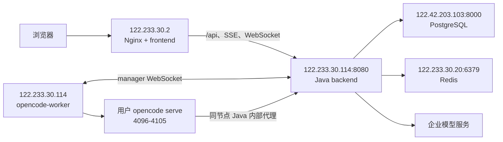

# 企业内单后端部署（122.233.30.114）

当前生产拓扑以 `122.233.30.114` 为唯一 Java 后端和 `opencode-worker` 节点。前端实体 Nginx 仍在 `122.233.30.2`，Redis 在 `122.233.30.20`，PostgreSQL 使用 `122.42.203.103:8000/testagent`。企业内不使用 Docker Compose；Java、Nginx、Redis、PostgreSQL 由宿主机管理，只有 `opencode-worker` 使用纯 Docker 脚本。

每个稳定 `TEST_AGENT_LINUX_SERVER_ID` 只部署一个 worker。`backend.env` 为每台服务器配置全局唯一且长期稳定的 `TEST_AGENT_LINUX_SERVER_ID`、`TEST_AGENT_SERVER_ADVERTISED_HOST`、数据库、Redis 和 manager token；`docker.env` 只配置共享数据目录、程序/镜像、端口池及同一个 manager token，不配置 `containerId/managerId`。Go manager 从 Java 写入的 `.serverid` 自动派生固定哈希 ID，Docker `--name`/hostname 只影响 `containerName` 展示，改名或重建不会改变数据库、Redis 和路由身份。

企业部署根目录统一使用 `/data/testagent`，建议目录规划如下：
历史双后端说明保留在 `deploy/internal/README-two-backend-122-233-30-114.md`，不作为当前部署依据。

## 当前拓扑



内部模型的正式调用链路固定为：`OpenCode 容器 → 122.233.30.114:8080 Java 内部代理 → ai-code.sdc.icbc:9070 行内模型`。8080 继续同时服务前端和 OpenCode；4096-4105 继续作为用户 OpenCode 端口池并保持宿主机/容器端口一致；9070 只要求 Java 宿主机出站可达，不对外发布。正式部署不启用 `--network host`，不新增 19070 relay，也不修改 worker 网络模式。

生产目录统一为：

```text
/data/testagent/
  config/
    backend.env
    docker.env
    nginx.env
  data/
  deploy/internal/
  dist/
  frontend/
  programs/
```

Java 的 `SYS_DATA_ROOT_DIR` 与 worker 的 `TEST_AGENT_DATA_ROOT` 必须都指向 `/data/testagent/data`。新版不配置 `OPENCODE_MANAGER_ID`、`OPENCODE_MANAGER_SERVER_IP_FILE` 或 `OPENCODE_MANAGER_LINUX_SERVER_ID`。

## 1. Mac 联网打包

打包机允许联网，企业服务器完全离线。从 Mac 仓库根目录执行：

```bash
cd /Users/kaka/Desktop/intelligent-test-agent
deploy/internal/package-release.sh --output-dir deploy/internal/dist
```

这种默认输出到项目内 `deploy/internal/dist/`。脚本会读取 `deploy/internal/.env`，没有该文件时读取 `deploy/internal/env.example`；但默认 `.env` / `env.example` 中的 `TEST_AGENT_IMAGE_OUTPUT_DIR=/data/testagent/dist` 不会覆盖项目内输出目录，避免 macOS 根目录只读时报 `mkdir: /data: Read-only file system`。

后端 jar 构建需要 JDK 21 或更高版本；脚本会在 macOS 上自动查找本机 JDK 25 到 21。需要固定版本时可显式指定，例如：

```bash
JAVA_VERSION=25 deploy/internal/package-release.sh
```

如果是在企业内 Linux 构建机，并且确实要输出到 `/data/testagent/dist`，显式传 `--env-file` 或 `--output-dir`：

```bash
mkdir -p /data/testagent/config
cp deploy/internal/env.example /data/testagent/config/docker.env
vi /data/testagent/config/docker.env
deploy/internal/package-release.sh --env-file /data/testagent/config/docker.env
# 或
deploy/internal/package-release.sh --output-dir /data/testagent/dist
```

打包产物分发到服务器：

| 产物 | 放到哪台 | 目标路径 |
|---|---|---|
| `test-agent-internal-release.zip` | `122.233.30.2`、`122.233.30.114` | `/data/0709/internal.zip`，推荐统一只传完整 zip，再由各服务器本地脚本解压部署。 |
| `test-agent-frontend-dist.tar.gz` | `122.233.30.2` | `/data/testagent/dist/test-agent-frontend-dist.tar.gz` |
| `backend/test-agent-app.jar` | `122.233.30.114` | `/data/testagent/dist/backend/test-agent-app.jar` |
| `test-agent-programs.tar.gz` | `122.233.30.114` | `/data/testagent/dist/test-agent-programs.tar.gz` |
| `test-agent-opencode-worker_internal-linux-amd64.tar` | `122.233.30.114` | `/data/testagent/dist/test-agent-opencode-worker_internal-linux-amd64.tar` |
| `deploy/internal/` | `122.233.30.2`、`122.233.30.114` | `/data/testagent/deploy/internal/`，前端用本地部署脚本和 Nginx 模板，114 后端用一键部署脚本和纯 Docker worker 管理脚本。 |

## 升级最新代码操作

从最新代码部署到企业内环境时，按“构建机打包 → 前端服务器替换静态资源 → 后端服务器替换 jar/程序/镜像 → 先重启 Java 再重启 worker”的顺序执行。不要清理 `/data/testagent/data`，该目录包含 Java 写给 manager 的 `.serverid/.serverhost`、公共配置、用户 session、应用工作区和 manager state。

推荐把完整 zip 放到 `122.233.30.2` 和 `122.233.30.114` 的 `/data/0709/internal.zip`，然后按“前端机本地更新静态资源，114 后端一键部署 Java + worker”的方式执行。该方式不依赖后端免密 scp 到前端，适合统一登录或堡垒机限制直连的现场。

前端机 `122.233.30.2` 手工本地更新：

```bash
unzip -p /data/0709/internal.zip deploy/internal/deploy-internal-frontend.sh > /tmp/deploy-internal-frontend.sh
bash /tmp/deploy-internal-frontend.sh --archive /data/0709/internal.zip --validate-only
bash /tmp/deploy-internal-frontend.sh --archive /data/0709/internal.zip
```

后端/worker `122.233.30.114` 一键部署：

```bash
unzip -p /data/0709/internal.zip deploy/internal/deploy-internal-release.sh > /tmp/deploy-internal-release.sh
bash /tmp/deploy-internal-release.sh --archive /data/0709/internal.zip --validate-only
bash /tmp/deploy-internal-release.sh --archive /data/0709/internal.zip --backend-host 122.233.30.114 --skip-frontend
```

如果现场确认后端服务器可以免密直连 `122.233.30.2`，也可以只在其中一台后端不加 `--skip-frontend`，让后端部署脚本顺带 scp 前端包并 reload Nginx。若出现 `Permission denied (publickey,gssapi-keyex,gssapi-with-mic)`，回到上面的“前端机本地手工更新 + 后端加 `--skip-frontend`”。

后端部署脚本默认完成以下动作：

- 解压 `/data/0709/internal.zip` 到临时目录。
- 自动定位 `test-agent-frontend-dist.tar.gz`、`backend/test-agent-app.jar`、`test-agent-programs.tar.gz`、`test-agent-opencode-worker_internal-linux-amd64.tar` 和 `deploy/internal/`。
- 未加 `--skip-frontend` 时，用 `scp` 把前端包和 `deploy/internal/` 复制到 `122.233.30.2:/data/testagent`，远程备份旧前端目录、解压新前端、执行 `nginx -t` 和 `systemctl reload nginx`。
- 在本机备份旧 jar，替换 `/data/testagent/dist/backend/test-agent-app.jar`，解压外挂程序，`docker load` 新 worker 镜像。
- 首次部署如果 `test-agent-backend.service` 尚未加载，自动按现有 `backend.env` 和当前 Java 绝对路径创建并 enable 标准 systemd unit；已有 unit 原样复用，不覆盖现场配置。
- 按顺序 `systemctl restart` 等价地停启 `test-agent-backend`，等待 `/actuator/health` 和 `/actuator/health/readiness`，校验 `/data/testagent/data/.serverid` 和 `.serverhost`。
- 重启 `opencode-worker`，等待日志出现 `manager config update applied`，最后验收前端和后端 HTTP。

常用参数：

```bash
# zip 文件名不是默认值
bash deploy-internal-release.sh --archive /data/0709/internal-20260709.zip

# 前端服务器需要指定 SSH 用户
bash deploy-internal-release.sh --frontend-user root

# 只校验 zip 里产物是否齐全，不执行 scp、重启或 reload
bash deploy-internal-release.sh --archive /data/0709/internal.zip --validate-only

# 只升级后端与 worker，不碰前端
bash deploy-internal-release.sh --skip-frontend

# 只升级 Java 和前端，不重启 worker
bash deploy-internal-release.sh --skip-worker
```

如果 zip 文件是从 Mac 上项目内 `deploy/internal/dist/` 和 `deploy/internal/` 打出来的，脚本能识别常见目录层级；如果现场改了服务器地址、安装根目录、systemd 服务名或健康检查 URL，执行 `bash deploy-internal-release.sh --help` 查看可覆盖参数。

下面是脚本内部执行的拆解步骤，现场需要人工排查或分步回滚时可参考。

1. 构建机打包：

```bash
cd /data/testagent/source/intelligent-test-agent
deploy/internal/package-release.sh --env-file /data/testagent/config/docker.env
```

2. 分发产物：

```bash
scp /data/testagent/dist/test-agent-frontend-dist.tar.gz 122.233.30.2:/data/testagent/dist/
scp /data/testagent/dist/backend/test-agent-app.jar 122.233.30.114:/data/testagent/dist/backend/test-agent-app.jar.new
scp /data/testagent/dist/test-agent-programs.tar.gz 122.233.30.114:/data/testagent/dist/
scp /data/testagent/dist/test-agent-opencode-worker_internal-linux-amd64.tar 122.233.30.114:/data/testagent/dist/
rsync -a --delete deploy/internal/ 122.233.30.114:/data/testagent/deploy/internal/
```

3. 在 `122.233.30.2` 更新前端：

```bash
rm -rf /data/testagent/frontend.bak
cp -a /data/testagent/frontend /data/testagent/frontend.bak
tar -C /data/testagent -xzf /data/testagent/dist/test-agent-frontend-dist.tar.gz
nginx -t
systemctl reload nginx
curl -fsS http://122.233.30.2/health
curl -fsS http://122.233.30.2/
```

4. 在 `122.233.30.114` 更新 Java 与 worker 程序：

```bash
systemctl stop test-agent-backend
cp -a /data/testagent/dist/backend/test-agent-app.jar /data/testagent/dist/backend/test-agent-app.jar.bak.$(date +%Y%m%d%H%M%S)
mv /data/testagent/dist/backend/test-agent-app.jar.new /data/testagent/dist/backend/test-agent-app.jar
tar -C /data/testagent -xzf /data/testagent/dist/test-agent-programs.tar.gz
docker load -i /data/testagent/dist/test-agent-opencode-worker_internal-linux-amd64.tar
```

5. 先启动 Java，确认它写入当前服务器身份文件：

```bash
systemctl start test-agent-backend
journalctl -u test-agent-backend -n 120 --no-pager
curl -fsS http://122.233.30.114:8080/actuator/health
cat /data/testagent/data/.serverid
cat /data/testagent/data/.serverhost
```

当前期望 `.serverid=test-agent-backend-122-233-30-114`，`.serverhost=122.233.30.114`。如果不一致，先修 `/data/testagent/config/backend.env` 中的 `TEST_AGENT_LINUX_SERVER_ID`、`TEST_AGENT_SERVER_ADVERTISED_HOST` 和 `SYS_DATA_ROOT_DIR`，不要急着重启 worker。

6. 重启 worker，让 manager 使用同一 `SYS_DATA_ROOT_DIR` 连接 Java：

```bash
cd /data/testagent/deploy/internal
./opencode-worker-docker.sh --env-file /data/testagent/config/docker.env restart
./opencode-worker-docker.sh --env-file /data/testagent/config/docker.env status
docker logs --tail 120 test-agent-opencode-worker
```

日志中应看到 manager 成功应用 Java 下发配置，类似 `manager config update applied`。如果看到连接旧 IP、`websocket disconnected` 或等待 `.serverhost` 超时，先检查 `/data/testagent/config/backend.env` 的 `SYS_DATA_ROOT_DIR` 是否等于 `/data/testagent/config/docker.env` 的 `TEST_AGENT_DATA_ROOT`。

7. 验收：

```bash
curl -fsS http://122.233.30.114:8080/actuator/health/readiness
curl -fsS http://122.233.30.2/
docker logs --tail 120 test-agent-opencode-worker
```

超级管理员进入“系统管理 → 运行管理”确认 Java、manager、容器均在线，并确认 Java/manager 的非空版本都匹配 `VyyyyMMdd.HHmmss`；再进入“系统管理 → 配置管理 → opencode公共配置管理”确认 `122.233.30.114` 已初始化公共配置。前端包替换后打开设置弹窗，在左侧导航底部核对前端版本；浏览器刷新、Java/worker 普通重启不得改变对应版本，只有替换重新构建的产物才会变化。已有用户进程如需切到新 opencode/manager 版本，可在运行管理中重启对应用户进程；只替换外挂程序不会自动重启已存在的 `opencode serve` 子进程。

## 端口约束

Java 后端创建用户 opencode 进程时，会从 manager 上报的 `portStart..portEnd` 里选择端口；manager 使用 Java 写入并挂载到容器内的 `.serverhost + port` 生成 `baseUrl`，不得使用 `.serverid`/`linuxServerId` 拼地址。当前协议没有独立的 `containerPort` 和 `publishedPort` 字段。

因此 `opencode-worker` 的端口池必须就是宿主机发布端口：

- `OPENCODE_MANAGER_PORT_START/END` 写宿主机可访问端口。
- `docker run` 发布端口必须保持 `hostPort:containerPort` 数值一致，例如 `4096-4105:4096-4105`。
- 不要写 `14096:4096` 这类内外不一致映射，否则 Java 会生成错误的 `baseUrl`。

每台稳定服务器只运行 1 个 worker，worker 容器内只有 1 个 `opencode-manager run` 常驻进程；manager 按端口池动态启动 0..N 个 `opencode serve` 子进程。不要通过不同 `--name` 在同一服务器并行启动多个 worker；容器名称只是展示名称，两个进程仍会从同一 `.serverid` 派生相同 ID。

当前 `test-agent-programs.tar.gz` 和 worker 镜像使用 OpenCode `1.17.8` 的 **Node server bundle**，不再运行 npm 包中嵌入 Bun 的 `opencode.exe`。联网打包阶段仍使用 Bun `1.3.14` 编译上游 TypeScript，但最终镜像只保留 Node 22、server bundle 和 linux/amd64 的 `node-pty`；因此宿主机内核 `4.19`、容器内 Node 可正常启动时，不受 Bun 要求 Linux 内核至少 `5.1` 的限制。Node 运行镜像固定为 Debian 11 bullseye / glibc `2.31`：它既满足 Node 22 的运行要求，又避开 Docker `18.09` 默认 seccomp 与 Debian 12/glibc `2.36` 的 `clone3` 线程创建冲突。按企业现场要求，纯 Docker worker 默认使用 `--privileged` 创建容器；这会放宽容器隔离边界，只应用于受控的专用后端服务器。现场已知 `Trace/breakpoint trap`、退出码 `133` 和 `dmesg ... trap int3` 是旧 Bun 可执行文件的启动失败特征，`uv_thread_create` assertion 则是旧 Docker 运行 glibc 2.36 镜像的失败特征。升级后应通过下面命令确认实际入口和运行基线已经切换：

```bash
docker exec test-agent-opencode-worker /usr/local/bin/opencode --version
docker exec test-agent-opencode-worker sh -lc 'readlink -f /usr/local/bin/opencode; node --version; getconf GNU_LIBC_VERSION'
```

第一条必须输出 `1.17.8` 且退出码为 `0`，第二条的入口必须位于 `/usr/local/lib/opencode-node/`，glibc 必须输出 `2.31`。`test-agent-programs.tar.gz` 中的 Node bundle 默认挂载回同一个 worker 容器，依赖镜像内的 Node 22；不把它作为无需 Node 的宿主机原生可执行文件使用。若必须脱离 Docker 单独运行，需要另外离线安装 Node 22，并在目标机验证其系统依赖，本项目默认交付和验收路径仍是 worker Docker 镜像。

## Java 直接部署前提

当前部署只启动 1 个 Java 后端，部署在 `122.233.30.114`，监听 `8080`；前端 Nginx 部署在 `122.233.30.2`，监听 `80`：

```bash
server.port=8080
TEST_AGENT_DEPLOYMENT_MODE=internal
TEST_AGENT_SERVER_ADVERTISED_HOST=122.233.30.114
TEST_AGENT_LINUX_SERVER_ID=test-agent-backend-122-233-30-114
TEST_AGENT_OPENCODE_MANAGER_TOKEN=test-agent-manager-token-122-233-30-114
TEST_AGENT_CORS_ALLOWED_ORIGINS=http://122.233.30.2
SYS_DATA_ROOT_DIR=/data/testagent/data
TEST_AGENT_SERVER_BROADCAST_ENABLED=true
TEST_AGENT_MODEL_CATALOG_SOURCE=internal
TEST_AGENT_INTERNAL_DEFAULT_MODEL=Qwen3.6-27B
TEST_AGENT_INTERNAL_PROXY_API_KEY=replace-with-random-internal-proxy-api-key
# 企业模型供应商的 base URL、provider ID 和上游 token 在“内部模型供应商”页面维护。
# Java 通过数据库快照访问 ai-code.sdc.icbc:9070，不在 backend.env 写入模型 token。
```

Java 配置单独放到 `/data/testagent/config/backend.env`，从仓库模板复制后填写 PostgreSQL、Redis、manager 和内部代理 key；不要在该文件写企业模型上游 token：

```bash
mkdir -p /data/testagent/config /data/testagent/data
cp deploy/internal/backend.env.example /data/testagent/config/backend.env
vi /data/testagent/config/backend.env
```

启动 Java 时加载该外置配置：

```bash
set -a
. /data/testagent/config/backend.env
set +a
java -jar /data/testagent/dist/backend/test-agent-app.jar
```

如果使用 systemd，`EnvironmentFile=/data/testagent/config/backend.env` 即可，不需要把环境变量写进服务文件。

Java 的 `SYS_DATA_ROOT_DIR` 需要与 worker 挂载的 `TEST_AGENT_DATA_ROOT` 对齐，企业内默认是 `/data/testagent/data`，以便 worker 读取 `.serverid` 和 `.serverhost`。如果数据库通用参数仍是 Linux 默认 `/data/.testagent`，部署时需要在系统管理通用参数中把 Linux 平台 `SYS_DATA_ROOT_DIR` 改为 `/data/testagent/data`。如果后续扩成多服务器部署，每台服务器仍按“一台服务器一套 Nginx、前端、Java、worker”的方式独立配置。

## 打包交付物

在本地 Mac 仓库根目录执行：

```bash
deploy/internal/package-release.sh
```

脚本默认读取 `deploy/internal/.env`；如果该文件不存在，则读取 `deploy/internal/env.example`。本地直接执行时产物默认写入 `deploy/internal/dist/`。当前企业 Linux 构建机如需写入 `/data/testagent/dist`，应显式传入外置 `/data/testagent/config/docker.env` 或 `--output-dir /data/testagent/dist`。它会产出：
必须生成：

打包时前端、Java、manager 分别按自身实际构建时刻生成北京时间 `VyyyyMMdd.HHmmss`。前端由 Vite 固化到 bundle，Java 由 Spring Boot build-info 固化到 jar，manager 由 `MANAGER_BUILD_VERSION` Docker build arg 传入 linker flag；该 build arg 只在脚本内部生成，不加入 `backend.env`、`docker.env` 或 `nginx.env`。

```text
deploy/internal/dist/backend/test-agent-app.jar
deploy/internal/dist/backend/lib/
deploy/internal/dist/test-agent-frontend-dist.tar.gz
deploy/internal/dist/test-agent-programs.tar.gz
deploy/internal/dist/test-agent-opencode-worker_internal-linux-amd64.tar
deploy/internal/dist/test-agent-internal-release.zip
deploy/internal/dist/test-agent-internal-release.zip.sha256
deploy/internal/dist/frontend/
```

完整 zip 同时包含 `deploy/internal/` 下的部署脚本、配置模板、操作手册和 `opencode.jsonc.example`。企业内不要执行 Maven、pnpm、Docker build 或任何联网下载命令。

## 2. 产物分发

| 产物 | 目标服务器 | 目标路径 |
|---|---|---|
| `test-agent-internal-release.zip` 与 `.sha256` | `122.233.30.2` | `/data/0709/` |
| `test-agent-internal-release.zip` 与 `.sha256` | `122.233.30.114` | `/data/0709/` |
| 前端静态文件 | `122.233.30.2` | 部署脚本解压到 `/data/testagent/frontend/` |
| 后端 jar、lib、programs、worker 镜像 | `122.233.30.114` | 部署脚本解压到 `/data/testagent/` |

两台服务器分别校验：

```bash
cd /data/0709
sha256sum -c test-agent-internal-release.zip.sha256
unzip -t test-agent-internal-release.zip
```

## 3. 114 配置文件

首次部署先准备模板：

```bash
mkdir -p /data/testagent/{config,data,deploy,dist,programs}
unzip -p /data/0709/test-agent-internal-release.zip \
  deploy/internal/backend.env.example \
  > /data/testagent/config/backend.env
unzip -p /data/0709/test-agent-internal-release.zip \
  deploy/internal/env.example \
  > /data/testagent/config/docker.env
chmod 600 /data/testagent/config/backend.env /data/testagent/config/docker.env
```

### `/data/testagent/config/backend.env`

至少确认以下内容并替换所有 `replace-with-*`：

```dotenv
SPRING_PROFILES_ACTIVE=prod
SERVER_PORT=8080
TEST_AGENT_DEPLOYMENT_MODE=internal
TEST_AGENT_SERVER_ADVERTISED_HOST=122.233.30.114
TEST_AGENT_LINUX_SERVER_ID=test-agent-backend-122-233-30-114
SYS_DATA_ROOT_DIR=/data/testagent/data

TEST_AGENT_DB_URL=jdbc:postgresql://122.42.203.103:8000/testagent
TEST_AGENT_DB_USERNAME=testagent
TEST_AGENT_DB_PASSWORD=<生产数据库密码>

TEST_AGENT_REDIS_HOST=122.233.30.20
TEST_AGENT_REDIS_PORT=6379
TEST_AGENT_REDIS_PASSWORD=<无密码时留空>

TEST_AGENT_CORS_ALLOWED_ORIGINS=http://122.233.30.2
TEST_AGENT_API_TOKEN=
TEST_AGENT_OPENCODE_MANAGER_TOKEN=<随机 manager token>
TEST_AGENT_INTERNAL_PROXY_API_KEY=<随机内部代理 key>

TEST_AGENT_SERVER_BROADCAST_ENABLED=true
TEST_AGENT_MODEL_CATALOG_SOURCE=internal
```

`TEST_AGENT_INTERNAL_PROXY_API_KEY` 只用于 opencode 子进程访问同节点 Java 内部代理，不是企业模型供应商 token。它只配置在 `backend.env`；Java 通过 manager command 自动注入 `TEST_AGENT_INTERNAL_PROXY_API_KEY`、`TEST_AGENT_INTERNAL_PROXY_BASE_URL` 和当前用户 `ICBC_UCID`。

企业模型供应商 `baseUrl` 与上游 token 由超级管理员页面保存到数据库，不再写 `ICBC_OPENAI_AUTH_TOKEN`、`TEST_AGENT_ICBC_OPENAI_BASE_URL` 等旧环境变量。

### `/data/testagent/config/docker.env`

```dotenv
TEST_AGENT_OPENCODE_MANAGER_TOKEN=<必须与 backend.env 完全一致>
TEST_AGENT_DATA_ROOT=/data/testagent/data
TEST_AGENT_PROGRAM_ROOT=/data/testagent/programs
TEST_AGENT_OPENCODE_WORKER_IMAGE=test-agent-opencode-worker:internal

OPENCODE_WORKER_BACKEND_PORT=8080
OPENCODE_WORKER_PORT_START=4096
OPENCODE_WORKER_PORT_END=4105

VITE_TEST_AGENT_API_BASE_URL=http://122.233.30.2
TEST_AGENT_BACKEND=122.233.30.114:8080
```

不要把 `TEST_AGENT_INTERNAL_PROXY_API_KEY` 或企业模型 token 放进 `docker.env`。端口池必须保持宿主机和容器内端口一一对应，例如 `4096-4105:4096-4105`，不要映射成 `14096:4096`。

### 前端 Nginx

`122.233.30.2:/data/testagent/config/nginx.env`：

```dotenv
TEST_AGENT_NGINX_LISTEN_PORT=80
TEST_AGENT_FRONTEND_ROOT=/data/testagent/frontend
TEST_AGENT_BACKEND=122.233.30.114:8080
```

Nginx upstream 只保留：

```nginx
upstream test_agent_backend {
    server 122.233.30.114:8080;
}
```

`/api`、SSE 和 WebSocket location 必须关闭缓冲并保留 `Upgrade`/`Connection` 头；完整模板见 `deploy/internal/nginx/gateway.conf.template`。

## 4. 企业模型配置

### 数据库已有配置核对

超级管理员进入“系统管理 → 配置管理 → 内部模型供应商”，确认：

| Provider ID | 启用 | Base URL | 用途 |
|---|---:|---|---|
| `qwen-prod` | 是 | 原有 Qwen OpenAI-compatible 地址 | 对应配置头 `X-ICBC-Model-Provider: qwen-prod` |
| `deepseek-prod` | 是 | 原有 DeepSeek OpenAI-compatible 地址 | 对应配置头 `X-ICBC-Model-Provider: deepseek-prod` |

页面必须显示 `Token 已配置`。如果现场原有 Provider ID 不是上述两个值，有两种等价做法：修改数据库页面中的 Provider ID，或把 `opencode.jsonc` 对应的 `X-ICBC-Model-Provider` 改成现场值；两处必须完全一致。保存后点击“刷新 Java 内存”，快照中应出现两个启用供应商且 Token 为已配置。

数据库只读核对 SQL（不得查询 token 明文）：

```sql
select provider_id, name, base_url, enabled, sort_order
from internal_model_providers
order by sort_order, provider_id;

select setting_id,
       icbc_openai_auth_token is not null
         and btrim(icbc_openai_auth_token) <> '' as token_configured
from internal_model_proxy_settings;
```

### opencode 公共配置

使用 `deploy/internal/opencode.jsonc.example` 的内容作为公共配置仓库 `opencode.jsonc`。该文件已固定：

- 默认/小模型均为 `icbc-qwen/Qwen3.6-27B`；
- 只启用 `icbc-qwen`、`icbc-deepseek`；
- Qwen header 指向数据库 `qwen-prod`，DeepSeek 指向 `deepseek-prod`；
- 代理地址、代理 key 和 UCID 全部引用 Java 启动时注入的环境变量；
- 不包含企业模型上游 token。

超级管理员进入“系统管理 → 配置管理 → opencode 公共配置管理”，在 `test-agent-backend-122-233-30-114` 上初始化或更新公共配置。运行用户的 `~/.config/opencode` 不要再维护 provider/model，避免合并全局配置污染公共配置。

公共配置变更只影响新启动的用户 opencode 进程；已有进程需在“运行管理”中逐个重启。

## 5. 部署与启动顺序

前端机执行：

```bash
unzip -p /data/0709/test-agent-internal-release.zip \
  deploy/internal/deploy-internal-frontend.sh \
  > /tmp/deploy-internal-frontend.sh
bash /tmp/deploy-internal-frontend.sh \
  --archive /data/0709/test-agent-internal-release.zip \
  --validate-only
bash /tmp/deploy-internal-frontend.sh \
  --archive /data/0709/test-agent-internal-release.zip
```

脚本不依赖 Docker 20.10 的 `host-gateway` 特性，也不会要求额外创建自定义 Docker network。只要容器能访问 `.serverhost` 中记录的 Java 后端地址，并且宿主机发布端口池 `4096-4105` 可访问即可。启动顺序固定为先 Java、检查 `.serverid/.serverhost`，再加载镜像并启动该服务器唯一的 worker。

检查：
114 后端机执行：

```bash
unzip -p /data/0709/test-agent-internal-release.zip \
  deploy/internal/deploy-internal-release.sh \
  > /tmp/deploy-internal-release.sh
bash /tmp/deploy-internal-release.sh \
  --archive /data/0709/test-agent-internal-release.zip \
  --validate-only
bash /tmp/deploy-internal-release.sh \
  --archive /data/0709/test-agent-internal-release.zip \
  --backend-host 122.233.30.114 \
  --skip-frontend
```

部署脚本按“Java → `.serverid/.serverhost` → worker”执行。手工部署时也必须保持这个顺序：

```bash
systemctl restart test-agent-backend
curl -fsS http://127.0.0.1:8080/actuator/health/readiness
cat /data/testagent/data/.serverid
cat /data/testagent/data/.serverhost

docker load -i /data/testagent/dist/test-agent-opencode-worker_internal-linux-amd64.tar
tar -C /data/testagent -xzf /data/testagent/dist/test-agent-programs.tar.gz
cd /data/testagent/deploy/internal
./opencode-worker-docker.sh \
  --env-file /data/testagent/config/docker.env \
  restart
```

身份文件期望值：

```text
/data/testagent/data/.serverid   = test-agent-backend-122-233-30-114
/data/testagent/data/.serverhost = 122.233.30.114
```

## 6. 验收

114 上执行：

```bash
systemctl status test-agent-backend --no-pager
curl -fsS http://127.0.0.1:8080/actuator/health
curl -fsS http://127.0.0.1:8080/actuator/health/readiness
cat /data/testagent/data/.serverid
cat /data/testagent/data/.serverhost

cd /data/testagent/deploy/internal
./opencode-worker-docker.sh --env-file /data/testagent/config/docker.env status
docker logs --tail 200 test-agent-opencode-worker | \
  egrep 'config update applied|websocket|serverhost|serverid|OPENCODE_UNAVAILABLE'
```

预期日志包含 `manager config update applied`。再从运行管理初始化或重启一个用户 opencode 进程，确认：

```bash
curl -fsS http://127.0.0.1:4096/global/health
curl -fsS http://127.0.0.1:4096/api/provider
curl -fsS http://127.0.0.1:4096/api/model
```

`/api/provider` 应只出现 `icbc-qwen`、`icbc-deepseek`，`/api/model` 应出现 `Qwen3.6-27B` 和 `DeepSeek-V4-Flash-W8A8`。最后从前端发起一次对话，分别选择两个模型验证流式回答、reasoning 和工具调用。

前端机执行：

```bash
nginx -t
curl -fsS http://122.233.30.2/health
curl -fsS http://122.233.30.2/
curl -fsS http://122.233.30.114:8080/actuator/health
```

## 7. manager/模型故障优先排查

manager 端口缺失或连接失败时先检查：

```bash
grep -E 'TEST_AGENT_SERVER_ADVERTISED_HOST|TEST_AGENT_LINUX_SERVER_ID|SYS_DATA_ROOT_DIR|TEST_AGENT_OPENCODE_MANAGER_TOKEN' \
  /data/testagent/config/backend.env
grep -E 'TEST_AGENT_DATA_ROOT|OPENCODE_WORKER_BACKEND_PORT|OPENCODE_WORKER_PORT_START|OPENCODE_WORKER_PORT_END|TEST_AGENT_OPENCODE_MANAGER_TOKEN' \
  /data/testagent/config/docker.env
cat /data/testagent/data/.serverid
cat /data/testagent/data/.serverhost
docker exec test-agent-opencode-worker cat /data/testagent/data/.serverhost
docker logs --tail 200 test-agent-opencode-worker
```

- `SYS_DATA_ROOT_DIR` 与 `TEST_AGENT_DATA_ROOT` 不一致：Java 和 worker 看不到同一身份/公共配置目录。
- `.serverhost` 不是 `122.233.30.114`：修复 `TEST_AGENT_SERVER_ADVERTISED_HOST` 后先重启 Java，再重启 worker。
- manager token 不一致：两端统一后重启 Java 与 worker。
- 公共配置目录为空：在超级管理员公共配置管理页初始化 114，不能在业务入口绕过。
- provider 不出现：确认公共 `opencode.jsonc`、`enabled_providers`，并重启该用户 opencode 进程。
- 代理返回“供应商未启用或不存在”：核对 `X-ICBC-Model-Provider` 与数据库 `provider_id` 完全一致，然后刷新 Java 内存。
- 代理返回“token 未配置”：在内部模型供应商页面写入原有上游 token，再刷新 Java 内存；不要把 token 写回部署文件。
- 114 的 8080 端口可连接但 HTTP 无响应：从 114 本机执行 health，并检查防火墙、反向代理/四层代理协议和 `journalctl -u test-agent-backend`。

如果旧模型 token 曾经提交到仓库或分发包，应视为已泄露并在企业模型平台轮换；仅从当前文件删除不能清除 Git 历史和旧包。
