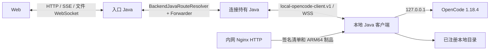

# 本地 OpenCode 客户端架构

## 目标与范围

本地客户端让用户把自己机器上的绝对目录注册为平台 Workspace，同时继续由浏览器只访问后台 Java。
一个客户端实例监管一个 OpenCode 1.18.4 进程，可承载多个已注册工作区；同一用户的服务端 OpenCode
与多个本地客户端可以同时在线。首版支持聊天、OpenCode Agent 自身工具、文件管理和夜间任务，不开放
浏览器终端、Git 发布、Agent 配置管理、附件或协作分享。



## 模块边界

- `test-agent-local-client-protocol` 只定义 `local-opencode-client.v1` 帧、载荷、大小和时间常量，不依赖
  服务端领域或持久化。
- `test-agent-workspace-filesystem` 是服务端和客户端共用的安全文件内核。它承载相对路径约束、真实根
  锚定、符号链接防逃逸、无覆盖原子移动、预览、搜索及分片上传下载。
- `test-agent-local-client` 是 Java 21 可执行 JAR，负责用户级配置、稳定实例 ID、反向连接、进程监管、
  文件 RPC、loopback 模型中继和用户级系统托盘。托盘复用现有连接对象的重连入口、活动请求表及心跳状态，
  不创建旁路连接或额外 OpenCode health 轮询。
- `test-agent-system-management` 管理每用户唯一 client key 和客户端实例；`test-agent-opencode-runtime`
  管理连接路由、生命周期、Workspace/Session/Run 固定目标及隧道传输；`test-agent-api` 只承载入口、
  鉴权、DTO 和跨 Java 公共转发；`test-agent-persistence` 仅通过 MyBatis XML/Flyway 保存关系数据。
- `GeneratedOpencodeSdkGateway` 通过可注入的 `OpencodeWebClientTransport` 选择传输。服务端目标仍使用
  HTTP；本地目标使用隧道提供的 `WebClient ExchangeFunction`。generated SDK 和 OpenCode 源码不修改。

## 下载入口灰度

客户端下载入口默认对所有用户隐藏。`SUPER_ADMIN` 在“系统管理 → 用户管理”中按平台 userId 维护
`local_client_rollout_users`；只允许加入存在且可登录的用户，移出时保留操作人和时间。普通用户的
`download-access/me` 由收到浏览器请求的当前 Java 直接读取共享灰度表，只返回 `allowed` 布尔值；前端仅在
值严格为 true 时展示下载入口。`opencode-endpoints/me` 继续保留 `localClientDownload` additive capability，
但它可能按进程归属转发到滚动升级中的旧 Java，因此不再作为网页权威灰度来源。独立接口缺字段、查询失败
或名单为空都失败关闭为隐藏，实例健康轮询也不会覆盖下载权限。

该名单只控制 UI 可见性，不扩大认证权限：Nginx HTTP 制品仍按内网 ACL 提供，客户端连接仍必须使用有效
`tack_v1_` key 通过 HTTPS/WSS 认证。移出名单不会撤销 key 或断开已安装客户端；需要停用客户端时仍使用
凭据撤销入口。

## 连接协议与 fencing

客户端只主动连接 `/api/internal/platform/local-opencode-client/connections/ws`。首帧 `REGISTER` 带
client key、稳定 `lci_...` 实例 ID、平台、架构和版本；认证成功返回 `REGISTERED` 及递增的
`connectionGeneration`。认证后每帧必须带 `type/requestId/traceId/connectionGeneration`。

协议支持注册、5 秒心跳、生命周期命令、OpenCode HTTP/SSE、文件请求、256 KiB Base64 二进制分片、
模型 grant 更新、取消和稳定错误帧。发送方等待 WebSocket `sendText` 完成后才发送下一分片，形成有界
背压；请求由 requestId 关联并支持中断。Redis 在线记录 TTL 为 15 秒，只信任
`backendProcessId + connectionGeneration`。相同实例的新认证连接会 fencing 旧连接，旧 generation 的
心跳、响应、文件票据和模型授权全部失效。客户端上报地址、端口只用于展示，绝不用于路由。

## 认证与模型密钥

每个用户只有一个 `tack_v1_` client key，可用于该用户的多个客户端实例。数据库保存 RSA 密文、
SHA-256 摘要、掩码和版本；认证只比较摘要，普通查询不返回密文或明文。复制接口的明文响应强制
`no-store`，前端只在方法局部变量中写入剪贴板，不进入 DOM、Query cache 或浏览器存储。创建、复制、
轮换和撤销均写审计；轮换或撤销会断开该用户全部连接并撤销模型 grant。轮换后凭据仍为 `ACTIVE`，离线实例与
工作区继续显示以便逐设备恢复；主动撤销后凭据变为 `REVOKED`，用户侧实例列表及本地工作区列表/详情立即隐藏，
但稳定实例、平台工作区绑定和用户磁盘目录均不删除。重新启用凭据后，历史离线记录恢复展示；同一实例后续
认证时继续复用原记录。

平台模型 key 永不下发。客户端启动 loopback 模型中继，并给 OpenCode 注入随机本地 token；后台只签发
绑定用户、客户端实例、generation 和持有 Java 的短 TTL grant。断连、换代、轮换或撤销都会使 grant
立即失效。公共模型同步入口识别 `LOCAL_CLIENT` 后只向 OpenCode PATCH loopback relay 的环境变量引用和
供应商路由 ID；后台/上游真实密钥、UCID 均不进入隧道，UCID 由模型代理按 grant 所属用户重新解析并覆盖。

## 本地进程与目录安全

客户端从用户私有 `client.properties` 和权限为 `0600` 的 `client.key` 启动，命令行不接受 key。
OpenCode 固定监听 `127.0.0.1`，端口在 4096–4195 的受控范围内选择并持久化。启动成功必须同时满足：
进程仍存活、`ProcessHandle.startInstant` 可取得、loopback `/global/health` 成功。停止前同时核验 PID、
权威启动时间、真实可执行文件和启动参数；PID 复用或身份无法确认时失败关闭。已记录 PID 明确退出后只清理
客户端自身的陈旧身份，不把同端口后来出现的健康进程视为本客户端进程，也不对其执行停止；后续启动跳过该
占用端口并继续选择受控范围内的空闲端口。

注册工作区时，持有连接的客户端执行 `toRealPath`、目录/读写权限和文件系统身份校验，后台再事务性创建
Workspace 与 `local_client_workspaces` 绑定。后续 RPC 只接收 workspaceId、root digest 和相对路径。
安全内核在每次操作重新锚定真实根，拒绝 `..`、绝对路径、符号链接逃逸、校验后的替换竞态和跨根移动。
删除平台工作区只归档平台记录，不调用本地目录删除。

浏览器继续使用现有 `file-ws-route → ticket → /file/ws`。本地 ticket 额外冻结 runtime kind、实例 ID、
generation 和 root digest；持票 Java 通过现有文件 WebSocket handler 调用反向隧道，不新增 Java 间文件
HTTP 代理。

注册本地工作区的默认入口位于客户端托盘。用户点击“选择并注册工作区”后由客户端桌面打开原生目录选择器，
目录名作为默认工作区名称，并通过已认证反向连接发送 `WORKSPACE_REGISTER`。后台从连接状态取得 owner、实例 ID
和 generation，异步调用既有 `LocalWorkspaceApplicationService`；该服务仍通过 `FILE_REQUEST` 完成真实路径、
权限、符号链接和文件系统身份校验与根注册，再事务性持久化。WSS 入站处理必须先释放当前 `concatMap`，避免等待
根校验时阻塞同一连接的 `FILE_RESPONSE`。网页仅保留 `directory.list` 逐层浏览和 HTTP 注册兜底，单击目录表示
选中、双击才进入下一级。同一用户、客户端实例和 root digest 的注册先锁定客户端实例行再查重；命中时复用既有
Workspace ID，并重新下发 `workspace.registerRoot` 恢复客户端状态，不再创建可能触发唯一约束的临时 Workspace。

客户端收到注册成功帧后自动打开 `/workbench?localWorkspaceId=<workspaceId>`，托盘“打开网页”在本次进程已有最近
注册结果时使用同一深链。URI 不携带本机绝对路径；前端通过带对象级归属校验的 Workspace API 解析逻辑 ID，切换为
`LOCAL_CLIENT` 工作区语义后仍使用既有 `file-ws-route → ticket → /file/ws` 加载文件树，并关闭 Git、版本和物理路径
复制入口。文件树调用客户端已实现的 `workspace.list` 普通目录操作，不调用服务端托管工作区专用的组合引用视图
`workspace.view.list`。ticket 签发涉及的 MyBatis/Redis 同步校验在 `boundedElastic` 执行，不占用 WebFlux
event-loop。工作台顶部直接复用平台 Workspace 列表展示已持久化的本地工作区，可按逻辑 ID 重开其它已注册目录，
并可返回最近服务器应用工作区；浏览器不另存本机绝对路径。登录页的受控 `redirect` 会保留该同源深链查询参数。

## Session、Run 与夜间任务

`RuntimeKind` 取 `SERVER_PROCESS` 或 `LOCAL_CLIENT`。本地工作区绑定稳定实例 ID，不创建服务端 process 或
binding。Session 创建时冻结目标，Run manifest/context/execution node 再冻结并传播同一目标；本地实例
离线或换代不回退服务端进程，也不切换到同一用户的其它客户端。路由仓储读取失败同样失败关闭；
workspace/session 在 path、query 或请求体中的入口都先解析本地目标，再决定连接持有 Java。

存量 `agent_session_bindings`、Session 旧映射和 `routing_decisions` 仍以外键引用
`execution_nodes`。为保持这些关系约束，本地目标会保存一条 `OFFLINE` 且 capability 为
`local-client-anchor` 的外键锚点；它的地址无效、容量为零，不会进入全局服务端节点选择。
真实运行目标始终从 Session/Run 冻结字段和 Redis 当前 generation 重建，禁止把该锚点当成
服务端 OpenCode 目标读取。

夜间任务保存 `targetRuntimeKind + targetLocalClientInstanceId`。到点离线时保持当前执行窗口内待处理，窗口
内同一实例重连后执行；窗口结束为 `WINDOW_EXPIRED`。Run 已开始后断连终止为
`LOCAL_CLIENT_DISCONNECTED`，不自动重跑，避免对本地文件产生重复修改。

## 受保护 Agent/Skill 的服务器执行

本地工作区的 Agent 目录会在原生 OpenCode Agent 之后追加当前用户可见的已发布 Hub Agent，选择 ID 使用
`protected:{revisionId}` opaque 句柄。目录响应只有名称、说明、不可变修订 ID 和内容 SHA-256，不返回
`AGENT.md`、`SKILL.md` 或其它制品正文。公共内置 Agent 对应系统级受保护资产；应用 Hub 已发布 Agent 继续
沿用应用成员可见性和管理员发布边界。个人可修改配置仍留在本地 OpenCode，不冒充受保护资产。

```text
平台已发布 Agent/Skill 修订
          │ 服务器解析正文、冻结 revision + SHA-256
          ▼
服务器 OpenCode（隔离空目录）
          │ short-lived MCP grant
          ▼
当前 Java ── WSS FILE_REQUEST ── 本地客户端 ── 用户授权目录
```

受保护 Run 仍先校验网页签发的本地 `contextToken`，但只复用其中的用户、Session、Workspace、客户端实例和
generation 身份，不复用本地执行节点或本地绝对路径。Run 强制路由 `SERVER_PROCESS`，服务器 OpenCode 使用
每用户/Session 的 mode `0700` 隔离目录；其原生 bash/read/write/glob/grep 等文件工具被关闭，只能调用平台
`local_files_*` MCP。MCP 再通过既有本地文件 WSS route/generation/root digest 调用安全内核，不新增 HTTP 文件
代理，也不把 Agent/Skill 正文同步到客户端配置目录。

文件 grant 只驻留签发 Java 的有界内存，Redis/数据库不保存明文 Token；每次调用重新检查 Run 未终态、
Workspace 绑定、连接 generation、root digest 和持有 Java，任一变化立即失败关闭。Skill 附件资源留在 grant
中供服务器模型只读使用。应用 Hub Agent 按发布依赖表冻结 Skill；公共内置 Agent 则只从同一 Git commit 的
数据库快照中选取 `AGENT.md` 按完整技术 ID 明确引用的 Skill，禁止扫描当前工作树或跨提交拼接。资源目录
返回 `{name,path}`，读取时强制校验二者一致，使运行态 Skill 指标只从 `args.name` 取名。
Skill 正文不预载进 system prompt；Agent 指令要求加载时必须真实调用只读 MCP，调用事实与实际加载保持一致。
`run.created.payload.protectedAgent` 只记录 Agent/Skill 的 assetId、revisionId 和
SHA-256，便于审计复现，不记录提示词、文件正文或 grant。

该能力不增加客户端轮询：Agent 目录只随页面请求解析，文件鉴权只在模型真实调用工具时执行。托盘仍复用
原 5 秒心跳快照；受保护文件调用共享现有 WSS 背压和客户端 64 项活动请求上限。

## 兼容性

新增响应字段都追加为可选字段；旧 Session、Run、manifest、execution node 和夜间记录缺少 runtime 字段
时反序列化为 `SERVER_PROCESS`。未携带 workspaceId 的既有 OpenCode API 保持服务端目标语义。本地专属
能力通过 capability 字段显式关闭终端、Git 发布、Agent 配置、附件和分享；
`protectedAgentExecution=true` 只表示可选择服务器受保护 Agent，不改变 `agentConfig=false`，前端不能仅凭
在线状态推断。

本地隧道构造的 `WebClient` 显式使用 generated SDK 对应的 Jackson 2 JSON codec，避免 Spring 7 默认
Jackson 3 codec 无法反序列化 SDK `JsonNode`。SSE 的 `STREAM_OPEN` 与后续 body 由独立有界流转发；取得
HTTP 响应对象不会取消后续事件，页面取消订阅时仍会沿既有隧道发送取消帧。

## 桌面托盘与资源约束

macOS 和提供 Java SystemTray 的麒麟 ARM 桌面显示客户端托盘；不支持托盘或无图形会话时降级为后台服务，
协议和本地文件能力不受影响。托盘复用 Web 端 `radar-bunny.png`，显示连接状态，并提供打开网页、重连、
查看/下载客户端日志、会话进度和退出动作。`webUrl` 与控制面的 `serverUrl` 分离，便于开发环境分别使用
前端和后台端口；两者生产都必须为 HTTPS。

会话进度来自当前连接最多 64 个有界活动请求，只展示操作类型、数量和耗时，不展示 prompt、路径或请求体。
托盘定时刷新只复制内存快照，状态不变时不重绘；OpenCode 状态复用原有 5 秒心跳结果，不新增健康探测。
客户端日志由 JVM 自行滚动到 state 目录，导出限制为最多 20 个客户端日志、每文件末尾 10 MiB，明确排除
密钥、配置、OpenCode 日志与工作区文件。

Observability 使用独立 loopback relay token，不复用模型 grant。插件 hook 仅把必要引用放入有界队列，后台微任务脱敏和
序列化；Java 以最低优先级单线程写未确认 spool。WSS 发送顺序固定为控制/模型/文件优先，Trace 只有在它们全部空闲至少
3 秒后才允许单分片在途。ACK 丢失按相同摘要幂等重传，旧 connection generation 的上传与 ACK 失败关闭。服务器一旦归档，
Trace 正文读取不依赖客户端在线。
