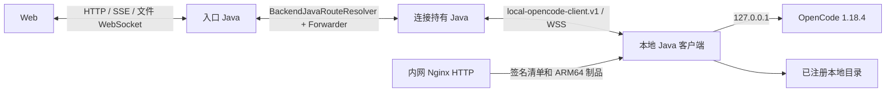

# 本地 OpenCode 客户端架构

## 目标与范围

本地客户端让用户把自己机器上的绝对目录注册为平台 Workspace，同时继续由浏览器只访问后台 Java。
一个客户端实例监管一个 OpenCode 1.18.4 进程，可承载多个已注册工作区；同一用户的服务端 OpenCode
与多个本地客户端可以同时在线。首版支持聊天、OpenCode Agent 自身工具、文件管理和夜间任务，不开放
浏览器终端、Git 发布、Agent 配置管理、附件或协作分享。

## 模块边界

- `test-agent-local-client-protocol` 只定义 `local-opencode-client.v1` 帧、载荷、大小和时间常量，不依赖
  服务端领域或持久化。
- `test-agent-workspace-filesystem` 是服务端和客户端共用的安全文件内核。它承载相对路径约束、真实根
  锚定、符号链接防逃逸、无覆盖原子移动、预览、搜索及分片上传下载。
- `test-agent-local-client` 是 Java 21 可执行 JAR，负责用户级配置、稳定实例 ID、反向连接、进程监管、
  文件 RPC 和 loopback 模型中继。
- `test-agent-system-management` 管理每用户唯一 client key 和客户端实例；`test-agent-opencode-runtime`
  管理连接路由、生命周期、Workspace/Session/Run 固定目标及隧道传输；`test-agent-api` 只承载入口、
  鉴权、DTO 和跨 Java 公共转发；`test-agent-persistence` 仅通过 MyBatis XML/Flyway 保存关系数据。
- `GeneratedOpencodeSdkGateway` 通过可注入的 `OpencodeWebClientTransport` 选择传输。服务端目标仍使用
  HTTP；本地目标使用隧道提供的 `WebClient ExchangeFunction`。generated SDK 和 OpenCode 源码不修改。

## 连接协议与 fencing

客户端只主动连接 `/api/internal/platform/local-opencode-client/connections/ws`。首帧 `REGISTER` 带
client key、稳定 `lci_...` 实例 ID、平台、架构和版本；认证成功返回 `REGISTERED` 及递增的
`connectionGeneration`。认证后每帧必须带 `type/requestId/traceId/connectionGeneration`。

协议支持注册、5 秒心跳、生命周期命令、OpenCode HTTP/SSE、文件请求、256 KiB Base64 二进制分片、
模型 grant 更新、取消和稳定错误帧。发送方等待 WebSocket `sendText` 完成后才发送下一分片，形成有界
背压；请求由 requestId 关联并支持中断。Redis 在线记录 TTL 为 15 秒，只信任
`backendProcessId + connectionGeneration`。相同实例的新认证连接会 fencing 旧连接，旧 generation 的
心跳、响应、文件票据和模型授权全部失效。客户端上报地址、端口只用于展示，绝不用于路由。

## 认证与模型密钥

每个用户只有一个 `tack_v1_` client key，可用于该用户的多个客户端实例。数据库保存 RSA 密文、
SHA-256 摘要、掩码和版本；认证只比较摘要，普通查询不返回密文或明文。复制接口的明文响应强制
`no-store`，前端只在方法局部变量中写入剪贴板，不进入 DOM、Query cache 或浏览器存储。创建、复制、
轮换和撤销均写审计；轮换或撤销会断开该用户全部连接并撤销模型 grant。

平台模型 key 永不下发。客户端启动 loopback 模型中继，并给 OpenCode 注入随机本地 token；后台只签发
绑定用户、客户端实例、generation 和持有 Java 的短 TTL grant。断连、换代、轮换或撤销都会使 grant
立即失效。公共模型同步入口识别 `LOCAL_CLIENT` 后只向 OpenCode PATCH loopback relay 的环境变量引用和
供应商路由 ID；后台/上游真实密钥、UCID 均不进入隧道，UCID 由模型代理按 grant 所属用户重新解析并覆盖。

## 本地进程与目录安全

客户端从用户私有 `client.properties` 和权限为 `0600` 的 `client.key` 启动，命令行不接受 key。
OpenCode 固定监听 `127.0.0.1`，端口在 4096–4195 的受控范围内选择并持久化。启动成功必须同时满足：
进程仍存活、`ProcessHandle.startInstant` 可取得、loopback `/global/health` 成功。停止前同时核验 PID、
权威启动时间、真实可执行文件和启动参数；PID 复用或身份无法确认时失败关闭。

注册工作区时，持有连接的客户端执行 `toRealPath`、目录/读写权限和文件系统身份校验，后台再事务性创建
Workspace 与 `local_client_workspaces` 绑定。后续 RPC 只接收 workspaceId、root digest 和相对路径。
安全内核在每次操作重新锚定真实根，拒绝 `..`、绝对路径、符号链接逃逸、校验后的替换竞态和跨根移动。
删除平台工作区只归档平台记录，不调用本地目录删除。

浏览器继续使用现有 `file-ws-route → ticket → /file/ws`。本地 ticket 额外冻结 runtime kind、实例 ID、
generation 和 root digest；持票 Java 通过现有文件 WebSocket handler 调用反向隧道，不新增 Java 间文件
HTTP 代理。

## Session、Run 与夜间任务

`RuntimeKind` 取 `SERVER_PROCESS` 或 `LOCAL_CLIENT`。本地工作区绑定稳定实例 ID，不创建服务端 process 或
binding。Session 创建时冻结目标，Run manifest/context/execution node 再冻结并传播同一目标；本地实例
离线或换代不回退服务端进程，也不切换到同一用户的其它客户端。路由仓储读取失败同样失败关闭；
workspace/session 在 path、query 或请求体中的入口都先解析本地目标，再决定连接持有 Java。

存量 `agent_session_bindings`、Session 旧映射和 `routing_decisions` 仍以外键引用
`execution_nodes`。为保持这些关系约束，本地目标会保存一条 `OFFLINE` 且 capability 为
`local-client-anchor` 的外键锚点；它的地址无效、容量为零，不会进入全局服务端节点选择。
真实运行目标始终从 Session/Run 冻结字段和 Redis 当前 generation 重建，禁止把该锚点当成
服务端 OpenCode 目标读取。

夜间任务保存 `targetRuntimeKind + targetLocalClientInstanceId`。到点离线时保持当前执行窗口内待处理，窗口
内同一实例重连后执行；窗口结束为 `WINDOW_EXPIRED`。Run 已开始后断连终止为
`LOCAL_CLIENT_DISCONNECTED`，不自动重跑，避免对本地文件产生重复修改。

## 兼容性

新增响应字段都追加为可选字段；旧 Session、Run、manifest、execution node 和夜间记录缺少 runtime 字段
时反序列化为 `SERVER_PROCESS`。未携带 workspaceId 的既有 OpenCode API 保持服务端目标语义。本地专属
能力通过 capability 字段显式关闭终端、Git 发布、Agent 配置、附件和分享，前端不能仅凭在线状态推断。
