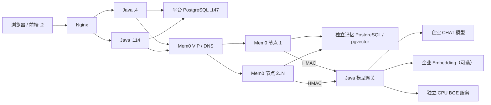

# 通用长期记忆、多节点 Mem0 与 CPU Embedding 部署

本文档是通用长期记忆的稳定部署、扩容、离线交付、验收和回滚入口。旧名称中的 `qa` 只作为已执行数据库表和 Java 类名的兼容痕迹保留，不再表示产品能力或 API 语义。

## 部署拓扑与事实源

PostgreSQL、Java、Mem0 和 CPU Embedding 都是独立进程/容器，不能互相打进同一镜像或共享本地数据目录。



| 数据 | 唯一事实源 | 禁止事项 |
|---|---|---|
| Session、原始 USER/ASSISTANT、Run | 平台 PostgreSQL 与既有 Session 恢复链 | 不复制到 Mem0、记忆库、outbox、日志或容器文件系统 |
| 范围、状态、证据引用/摘要、审核、学习队列、使用记录、白名单、设置 | 平台 PostgreSQL `.147` | Java 不把向量或 Mem0 history 放入平台库 |
| 派生记忆正文、逻辑 ID、版本、幂等、投影状态/outbox、Mem0 history、向量集合 | 独立记忆 PostgreSQL/pgvector | 不与平台库共库；Java 不直连 |
| BGE 权重和推理 | 独立 CPU Embedding 镜像/容器 | 不打进 Mem0 镜像；运行时不访问 Hugging Face |

证据只保存 `sessionId`、`sessionTitle`、`runId`、最多 200 字摘要和时间。所有授权查看者可见标题和 ID；只有 Session owner 能通过既有 `/s/{sessionId}` 在新标签页打开只读原始对话，`/s/{shareId}` 仍由 `shr_` 前缀进入分享工作台。团队成员不能凭团队记忆读取别人的原文。

## 通用学习与检索

- Python 锁定 `mem0ai==2.0.17`，Java 只经 REST 调用 `/memories`、`/search`、`PUT/DELETE /memories/{id}` 和 `/memories/{id}/history`。
- 自动学习把能解析到当前 Application 的成功人工根 Run 的 USER/ASSISTANT 作为一次请求传给 `Mem0.add(messages, infer=true)`；无法解析 Application 时不学习，禁止自动扩大成个人全局。请求不配置自定义抽取 prompt/custom instructions，不做 QA 任务分类、显式/隐式/临时判定、置信度阈值或内容语义过滤。
- 输入消息只存在请求内存中；Mem0 原生结果作为个人记忆立即生效。默认是当前用户 + 当前 Application，可由 owner 手工提升为个人全局。
- 团队记忆只能手工提交并由 `APP_ADMIN` 审核。个人记忆“提交为团队记忆”会复制安全的 Session/Run 引用和摘要，不复制聊天正文，也不触发第二次原生抽取。
- Run 前一次检索个人全局、当前 Application 个人和当前 Application 团队三个 scope。Java 总预算为 2 秒，最多注入 6 条、约 800 tokens；失败或超时返回空上下文继续 Run。
- 只有实际注入的条目写 Run usage，页面才显示“参考了 N 条记忆”。本功能不新增 RunEvent 类型。

## 双 Embedding profile 与一致性

CPU profile 固定为：

- model：`BAAI/bge-small-zh-v1.5`
- revision：`7999e1d3359715c523056ef9478215996d62a620`
- dimension：512
- L2 normalization：开启
- query prefix：`为这个句子生成表示以用于检索相关文章：`
- identity：`cpu:bge-small-zh-v1.5:512:7999e1d3359715c523056ef9478215996d62a620`

CPU 服务提供 `POST /v1/embeddings`、`GET /health`、`GET /ready`。请求必须带模型供应商 API key 和 `X-Embedding-Input-Type: query|document`；仅 `query` 增加前缀。服务限制批量、字符数、队列等待和有界并发。

企业没有 embedding 时，只创建 CPU 集合。配置企业 embedding 时创建两个不可混写的集合：

```text
enterprise:{modelId}:{dimension}:{fingerprint}
cpu:bge-small-zh-v1.5:512:{revision}
```

管理页保存的是 Java 模型网关的运行许可，Mem0 副本从外置 `memory.env` 读取实际 profile 身份；两处的 `modelId`、维度和 fingerprint 必须一致。启用企业 profile 时，先在管理页保存并验证模型，再滚动写入 `memory.env`、逐副本重启并核对 `/ready`；停用时顺序相反，先把 Mem0 副本滚动为 CPU-only 并核对可用性，再清空管理页配置。变更 modelId、维度或 fingerprint 会创建新 collection，禁止原地复用旧 collection。这个双阶段顺序允许切换窗口继续使用 CPU profile，并避免网关先拒绝仍在运行的企业 profile。

一次写入只执行一次原生抽取：先探测企业 profile，企业不可用才在 CPU profile 抽取；进入 `infer=true` 前把 at-most-once 状态持久化。节点若在向量写入后退出，重试按 operationId 从共享 collection 恢复结果；若 LLM 已开始但没有可恢复向量，本次按空结果完成，禁止再次抽取。幂等绑定还包含 owner 分区、操作类型、目标和请求摘要，同一 key 不能改写另一正文或跨租户复用。原始结果以 `infer=false` 投影到另一集合。每条记录使用稳定 `logicalMemoryId`，共享控制表记录每个 profile 的 Mem0 ID、版本和状态。投影失败写共享 PostgreSQL outbox，恢复后按版本补齐；更新、删除和范围提升同样投影。每个 Mem0 副本还会周期扫描“共享逻辑版本 × 当前 profile”差异并幂等补发 outbox，覆盖逻辑提交后进程退出的缝隙，也会把存量逻辑记忆自动回填到后来启用的新企业 collection。单个投影任务连续 12 次失败进入 `DEAD`，保留可观测状态并冷却 5 分钟；若共享版本差异仍存在，巡检会自动重开同一幂等任务，provider 恢复后无需人工补数。

检索并行请求所有可用 profile，按 `logicalMemoryId` 去重并用 Reciprocal Rank Fusion 合并名次，不比较跨模型原始相似度。单 profile embedding 默认超时 1.5 秒、可配硬上限 1.8 秒，为 RRF 和 HTTP 返回预留预算；任一 profile 成功即可返回，全部失败才由 Java 的 2 秒总预算 fail-open。

同一用户/Application 或团队分区持有 PostgreSQL advisory lock，保证写入和版本顺序；不同分区可并行。Mem0 副本无本地 history、幂等或 outbox，扩缩容不迁移数据。Alembic 迁移必须先于任一副本启动，且只能有一个 migration job；副本不能自行建表。

由于 Mem0 2.0.17 原生抽取的既有事实查询只识别 `user_id/agent_id/run_id`，Application 个人记忆会额外携带由 Application ID 单向摘要生成的内部 `run_id` 作用域键。它不是平台 Run ID，也不包含对话内容；写入、恢复、投影和检索使用同一稳定键，从而保证不同 Application 之间不会互相去重或召回。

## 安全门禁与限值

Java 调用 memory-service 必须携带 `X-Memory-Service-Key`。该 key 只用于服务到服务认证，不代表最终用户；Java 在调用前后仍校验登录用户、白名单、owner、Application 成员和角色。Mem0 回调 Java 模型网关使用 HMAC-SHA256，签名覆盖方法、固定路径、正文 SHA-256、client/user/run/session/operation、时间、nonce、能力和 embedding input type。允许时钟偏差 30 秒，nonce TTL 2 分钟，Redis 原子防重放。

浏览器只对已登录用户调用 `GET /api/internal/platform/memory/v1/availability`，并以“总开关已启用且当前用户在名单中”的 `enabled` 同时控制活动栏入口和 `/memories` 路由。未授权、超时或校验异常都必须失败关闭并回到工作台；名单中的用户进入路由时必须重新校验，已打开页面在窗口重新聚焦时复核。前端隐藏不是安全边界，其余记忆 API、学习 worker 和 Run 前检索仍必须在 Java 侧分别校验同一总开关与平台白名单。超级管理员通过系统管理“记忆能力 → 灰度用户”选人，不能依赖前端角色或本地存储自行开通。

| 边界 | 当前值 |
|---|---:|
| Java WebFlux 单请求内存上限 | 256 KiB |
| 自动学习消息数 | 1–100 条 USER/ASSISTANT |
| 单条消息 schema 上限 | 100,000 字符 |
| 一次学习总字符 | 默认 120,000，最大可配 200,000 |
| 手工/投影正文 | 默认 8,000 字符，服务硬上限 20,000 |
| metadata JSON | 16 KiB |
| search query | 8,000 字符 |
| search scopes | 1–3 个，不得重复 |
| topK | API 1–100，服务默认最多 50；Java 默认请求 20 |
| Java REST 普通请求超时 | 2 秒 |
| Java 学习请求超时 | 130 秒 |
| Run 前检索总预算 | 2 秒 |
| 单 embedding profile 检索超时 | 默认 1.5 秒，硬上限 1.8 秒 |
| CPU batch | 默认最大 64 条、单条 8,000 字符、总计 120,000 字符 |
| CPU 有界并发 | 默认 4；排队默认最多 2 秒 |

metadata 任意层级禁止键 `messages/transcript/rawConversation/prompt/answer/assistantMessage/userMessage`；readiness 固定返回 `rawMessageCount=0`。日志不能记录记忆正文、原始聊天、service key、HMAC secret/signature、模型 API key 或上游原始错误。

## 本地真实数据面

开发 Compose 固定包含独立 pgvector、独立 CPU BGE、一次性 Alembic、三个无状态 Mem0 副本和 Nginx VIP：

```bash
tools/memory-dev-services.sh prepare
tools/memory-dev-services.sh build
tools/memory-dev-services.sh start
tools/memory-dev-services.sh status
```

开发环境默认使用显式版本化 volume `test-agent-memory-dev-pgvector-v1`，与升级前原型留下的
Compose volume 隔离；脚本不会删除或改写旧库。PostgreSQL readiness 会使用容器内配置的角色、密码和
数据库执行真实 `select 1`，不能再由“端口已监听但角色不存在”的 `pg_isready` 假阳性放行。

`prepare` 只写 `.tmp/dev-services/memory/*.env`，权限 `0600`，不会修改 `.env.local/.env.test`。Java 使用生成的 `memory-backend.env`，其中没有记忆数据库密码。默认端口：VIP `18888`、CPU `18989`、记忆 PostgreSQL `15433`。停止使用：

```bash
tools/memory-dev-services.sh stop
```

脚本只 `stop` 自己的 Compose 服务并保留记忆库 volume，不执行 `down -v`。

## 企业离线构建

Mac 外网构建机必须能访问固定镜像和 Hugging Face，仅构建阶段允许联网：

```bash
cp deploy/internal/memory/build.env.example /secure/path/memory-build.env
chmod 0600 /secure/path/memory-build.env
TEST_AGENT_MEMORY_BUILD_ENV_FILE=/secure/path/memory-build.env \
  deploy/internal/package-memory-offline.sh --output-dir /absolute/release-dir
```

或并入完整包：

```bash
deploy/internal/package-release.sh --with-memory
# 仅构建记忆数据面
deploy/internal/package-release.sh --memory-only
```

记忆包必须包含并由 `SHA256SUMS` 覆盖：

- `test-agent-memory-service_internal-linux-amd64.tar`
- `test-agent-embedding-bge-small-zh-v1.5_internal-linux-amd64.tar`
- 固定 `test-agent-pgvector_0.8.1-pg16_internal-linux-amd64.tar`
- 固定 `test-agent-memory-nginx_1.27.2_internal-linux-amd64.tar`
- 每个镜像 SPDX SBOM、许可证清单、源码依赖锁、模型 `MODEL-IDENTITY.json`；源码副本排除
  `__pycache__`、`.pytest_cache` 和 `*.pyc/*.pyo`，不得把本机已删除模块的陈旧字节码带入企业包
- `alembic.ini` 与全部 Alembic migration
- `memory.env.example`、`embedding.env.example`、`memory-docker.sh`

所有 Docker base/infrastructure image 使用 linux/amd64 digest；禁止 `latest`。BGE 权重必须已经位于 embedding 镜像，现场 readiness 的 model/revision/dimension/normalized 不完全匹配即停止发布。

## 企业分发与启动

记忆 PostgreSQL 必须绑定可被 Mem0 节点访问的具体内网 IP；若使用模板中的 `0.0.0.0`，主机防火墙必须把 5432 来源限制为 Mem0 节点。不能保留 `127.0.0.1` 后却让独立 Mem0 节点连远程库。

企业目标机不预装宿主机 `psql`、`jq`、`rg`，本流程不依赖它们。`verify-db` 固定使用 pgvector 容器内的 `psql` 做带账号密码的 `select 1`；镜像与配置检查使用 `SHA256SUMS`、随包脚本和系统自带 `grep/sed/awk`。不得为了部署临时联网安装这些工具。

当前首次试部署按现场指定拆为两个记忆节点：`.134` 只承载独立记忆 PostgreSQL/pgvector，`.160` 承载一个无状态 Mem0 副本、VIP 和 CPU BGE。BGE 放在 `.160`，避免它的 CPU/内存负载与 `.134` 数据库争抢资源，并减少 Mem0 数据面到推理服务的节点数量；如果 `.160` 预检没有至少 4 个可用 CPU 线程、6 GiB 可用内存和 5 GiB 可用磁盘，则停止部署并重新评估 BGE 专机，不把它回迁到 `.134` 挤占数据库。四个角色仍是隔离容器，不与平台 PostgreSQL、Java 或 worker 合并。

为保留两台克隆服务器上的原 PG 进程、`5432` 和全部残留数据，`.134` 的新记忆库固定使用全新目录 `/data/testagent/memory/postgres-v1` 与宿主端口 `15433`；`.160` 的 Mem0 副本使用 `18889`，VIP 使用 `18888`，BGE 使用 `18989`。首次试部署只有一个 Mem0 副本，尚不具备副本高可用；扩大灰度或正式容量前必须增加第二个 Mem0 节点，并把 VIP 改为多 upstream。

当前节点分工如下：

| 节点 | 角色 | 端口 | 持久数据 |
|---|---|---:|---|
| `122.233.30.134` | 独立记忆 PostgreSQL/pgvector | `15433` | `/data/testagent/memory/postgres-v1` |
| `122.233.30.160` | Mem0 副本 | `18889` | 无本地业务数据 |
| `122.233.30.160` | Mem0 VIP | `18888` | 无 |
| `122.233.30.160` | CPU BGE | `18989` | 模型已内置镜像，无运行时下载 |

在 `.134` 解压前只读预检；发现 `15433` 已有真实服务或新目录非空时停止确认，不删除旧 PG 数据：

```bash
uname -m
docker version --format 'docker={{.Server.Version}}'
docker ps -a --format 'table {{.Names}}\t{{.Image}}\t{{.Status}}\t{{.Ports}}'
ss -lnt 2>/dev/null | grep -E ':(5432|15433)[[:space:]]' || true
find /data /var/lib -maxdepth 4 -type f -name PG_VERSION -print 2>/dev/null
if [ -d /data/testagent/memory/postgres-v1 ] && [ -n "$(find /data/testagent/memory/postgres-v1 -mindepth 1 -print -quit 2>/dev/null)" ]; then
  echo 'STOP: /data/testagent/memory/postgres-v1 已有内容，先确认归属'
  exit 1
fi
df -h /data
```

在 `.160` 解压前只读预检；保留克隆 PG 的 `5432` 和残留数据，`18888/18889/18989` 任一已占用或资源不满足就停止：

```bash
uname -m
docker version --format 'docker={{.Server.Version}}'
docker ps -a --format 'table {{.Names}}\t{{.Image}}\t{{.Status}}\t{{.Ports}}'
ss -lnt 2>/dev/null | grep -E ':(5432|18888|18889|18989)[[:space:]]' || true
find /data /var/lib -maxdepth 4 -type f -name PG_VERSION -print 2>/dev/null
nproc
free -h
df -h /data
```

当前收敛拓扑的 `memory.env` 至少覆盖下列非密钥值；三项 memory 运行密钥仍使用各自不少于 32 字符的随机值，并让 service API key、模型网关 HMAC 与两台 Java `backend.env` 完全一致。BGE 的 API key 另在 `embedding.env` 生成，不交给 Java：

```dotenv
TEST_AGENT_MEMORY_DB_BIND_ADDRESS=122.233.30.134
TEST_AGENT_MEMORY_DB_HOST_PORT=15433
TEST_AGENT_MEMORY_SERVICE_DATABASE_URL=postgresql://testagent_memory:<与DB_PASSWORD相同>@122.233.30.134:15433/testagent_memory
TEST_AGENT_MEMORY_SERVICE_MODEL_GATEWAY_URL=http://122.233.30.2:9996/api/internal/platform/model-gateway/v1
TEST_AGENT_MEMORY_NODE_ID=node-160-1
TEST_AGENT_MEMORY_BIND_ADDRESS=122.233.30.160
TEST_AGENT_MEMORY_HOST_PORT=18889
TEST_AGENT_MEMORY_VIP_BIND_ADDRESS=122.233.30.160
TEST_AGENT_MEMORY_VIP_HOST_PORT=18888
TEST_AGENT_MEMORY_UPSTREAMS=122.233.30.160:18889
```

`.134` 与 `.160` 使用同一份 `memory.env`，这样数据库账号密码、Mem0 service key 和模型网关 HMAC 不会漂移。`.160` 的 `embedding.env` 至少覆盖：

```dotenv
TEST_AGENT_EMBEDDING_BIND_ADDRESS=122.233.30.160
TEST_AGENT_EMBEDDING_HOST_PORT=18989
TEST_AGENT_EMBEDDING_TORCH_THREADS=4
```

`.134` 启动记忆库时显式使用新目录，防止后续脚本默认值变化或误指向克隆 PG 数据：

```bash
TEST_AGENT_MEMORY_POSTGRES_DATA_DIR=/data/testagent/memory/postgres-v1 \
  deploy/internal/memory-docker.sh start-db
deploy/internal/memory-docker.sh verify-db
```

U 盘完整包先进入企业中转机 `~/Desktop/mimoagent/0709`，执行 SHA-256 校验后再分发：

| 目标 | 产物目录 |
|---|---|
| `.134:/data/0709/memory` | pgvector 镜像、Alembic、配置模板、部署脚本 |
| `.160:/data/0709/memory` | Mem0、CPU BGE、VIP 镜像、身份清单、配置模板、部署脚本 |
| `.4/.114:/data/0709` | Java JAR/worker 和 backend 配置 |
| `.2:/data/0709` | 前端/Nginx 包 |

当前机器：企业内部中转机。记忆离线目录必须完整复制，两台目标机都用包内 `SHA256SUMS` 校验，不从企业网拉镜像：

```bash
cd ~/Desktop/mimoagent/0709/memory
sha256sum -c SHA256SUMS
cd ~/Desktop/mimoagent/0709
ssh root@122.233.30.134 'install -d -m 0755 /data/0709'
scp -r memory root@122.233.30.134:/data/0709/
ssh root@122.233.30.160 'install -d -m 0755 /data/0709'
scp -r memory root@122.233.30.160:/data/0709/
```

成功条件：中转机全部文件显示 `OK`，两次 `scp` 都成功。目标机已有 `/data/0709/memory` 时先停止，不能把新旧目录混合覆盖。

外置配置固定为：

```text
/data/testagent/config/backend.env
/data/testagent/config/memory.env
/data/testagent/config/embedding.env
```

三者必须是非符号链接普通文件、mode `0600`，不得含占位符、重复 key、命令替换或 CRLF。先在 `.160` 生成并人工核对一份 `memory.env`，再通过 `scp` 原样复制到 `.134`；不要把真实数据库密码、service key、HMAC 或 BGE API key 发回聊天或写入命令行。两台机器分别执行以下角色命令。

当前机器：`122.233.30.134` 记忆数据库节点：

```bash
cd /data/0709/memory
TEST_AGENT_MEMORY_ARTIFACT_DIR=/data/0709/memory ./memory-docker.sh verify-artifacts
./memory-docker.sh validate-memory-config
./memory-docker.sh load-db
TEST_AGENT_MEMORY_POSTGRES_DATA_DIR=/data/testagent/memory/postgres-v1 \
  ./memory-docker.sh start-db
./memory-docker.sh verify-db
./memory-docker.sh status
```

成功条件：`verify-db` 输出 `Memory PostgreSQL authenticated role and database are ready.`，只新增 `test-agent-memory-postgres` 容器，原克隆 PG 容器/进程及 `5432` 保持不变。随后从 `.160` 执行 `nc -vz 122.233.30.134 15433`，跨机不通就停止。

当前机器：`122.233.30.160` Mem0/VIP/BGE 节点：

```bash
cd /data/0709/memory
TEST_AGENT_MEMORY_ARTIFACT_DIR=/data/0709/memory ./memory-docker.sh verify-artifacts
./memory-docker.sh validate-memory-config
./memory-docker.sh validate-embedding-config
nc -vz 122.233.30.134 15433

./memory-docker.sh load-embedding
./memory-docker.sh start-embedding
./memory-docker.sh verify-embedding

./memory-docker.sh load-memory
./memory-docker.sh migrate
./memory-docker.sh start-memory
./memory-docker.sh verify-memory

./memory-docker.sh load-vip
./memory-docker.sh start-vip
./memory-docker.sh verify-vip
./memory-docker.sh status
```

成功条件：BGE readiness 显示固定 512 维模型；Alembic 到 `20260809_01`；Mem0 与 VIP 均显示 `rawMessageCount=0`。`.160` 只新增 `test-agent-memory-embedding`、`test-agent-memory-node-160-1`、`test-agent-memory-vip`，不启动记忆 PostgreSQL 容器。

上述命令只验证数据面。随后还必须在系统管理中新增 CPU 模型供应商：base URL 为 `http://122.233.30.160:18989/v1`，Token 使用 `embedding.env` 中的 API key；模型 ID 为 `memory-bge-small-zh-v1.5`，上游模型 ID 为 `BAAI/bge-small-zh-v1.5`，能力为 `EMBEDDING`，`embeddingDimension=512`。两台 Java 的 `backend.env` 继续指向 `http://122.233.30.160:18888`，service key 与 HMAC 必须和同一份 `memory.env` 一致。

固定发布顺序：

1. 备份并核对平台 Flyway 与记忆 Alembic 当前历史。
2. 记忆 PostgreSQL/pgvector。
3. CPU BGE。
4. Alembic upgrade，再启动 Mem0 首节点和 VIP。
5. `.4` Java 及 worker。
6. `.114` Java 及 worker。
7. `.2` 前端/Nginx。
8. 在系统管理配置固定 CHAT、可选企业 embedding，并确认两个 profile 身份。
9. 浏览器完整端到端验收。
10. 开启首批用户白名单。
11. 增加其余 Mem0 副本并执行故障/容量验收。

首批名单验收必须至少覆盖一名已授权用户和一名未授权用户：已授权用户能看到活动栏入口并打开 `/memories`；未授权用户看不到入口，直接访问该路径会返回 `/workbench`，且直接请求治理 API 仍返回 `403`。availability 请求失败时也必须保持入口隐藏。

任一 checksum、Alembic head、模型身份、向量维度、首台 Java readiness 或浏览器 E2E 失败，必须停止后续节点发布。Java 和 Mem0 的滚动扩容不能用本地降级掩盖 VIP/路由错误。

## 数据库迁移与备份

已执行的 QA 初始 migration 必须保持文件名和字节：

```text
V20260809120000__create_qa_memory_governance.sql
SHA-256 b2ae5639284208be8bc09952d9143c3dd0d8a2bf649b6601aed4225e586af18a
```

通用化使用前向 migration：

```text
V20260809230000__generalize_memory_and_embedding_profiles.sql
SHA-256 2740ff6d4a97c5b8a4c438586f55d58078c3cfce93b06e4efeb6b77b039c66c3
```

治理身份唯一性继续使用更高版本前向 migration：

```text
V20260810090000__enforce_qa_memory_identity.sql
SHA-256 619f886b093c80c1e1f71569c5c44309fa4f8184dd2791c0cf1955beb77c9af3
```

执行前必须查询 `qa_memories` 中非空 `mem0_memory_id` 的重复分组；发现重复就停止发布并显式归并关联证据、审核、usage 和 Skill 提案，禁止 migration 自动删行。约束生效后，原生学习通过 MyBatis PostgreSQL `ON CONFLICT DO NOTHING` 原子选出唯一治理记录，并把并行 Run 的证据追加到胜者。

遗留 `qa_*` 物理表继续作为隐藏兼容存储，Java 新增 SQL 只走 MyBatis XML。独立记忆库不扫描 Java Flyway，只由 `memory-service/alembic` 管理；禁止创建第二套 Java migration runner、Flyway `repair/outOfOrder` 或现场手改历史表。

同一变更窗口必须分别备份平台 PostgreSQL和独立记忆 PostgreSQL，并记录一致恢复点。Mem0 节点没有需要备份的本地卷。恢复后先保持白名单关闭，执行 Alembic/Flyway、readiness、双集合版本核对和浏览器回归，再开放用户。

## 发布准入测试

单元测试只作补充。真实浏览器套件不直接调用 Python API或数据库来替代业务验收：

```bash
cd frontend
TEST_AGENT_RUN_MEMORY_E2E=1 \
TEST_AGENT_MEMORY_E2E_SCENARIO=full \
corepack pnpm exec playwright test \
  --config playwright.real.config.ts \
  apps/agent-web/tests/memory.real-spec.ts --project chromium --workers 1
```

集群、热备、并发和审计由统一入口编排：

```bash
# 本地三副本数据面：至少两轮，兼顾并行学习和后续纯召回
tools/memory-cluster-e2e.sh --full --faults --concurrency 8 --rounds 2 --partition same --audit

# 企业 .2 -> .4/.114 -> Mem0 VIP -> 记忆库 -> 模型网关 -> 企业模型/CPU；
# 32 并发 × 4 轮提供 128 个浏览器侧 Run 启动时延样本
tools/memory-cluster-e2e.sh --enterprise --all --concurrency 32 --rounds 4 --partition both
```

修改编排脚本后先运行不接触真实环境的顺序回归；它用假 Playwright/hook 只验证场景次序、状态文件和故障恢复命令，不能作为发布证据：

```bash
tools/memory-cluster-e2e-test.sh
```

环境变量和远程停启 hook 的完整清单运行 `tools/memory-cluster-e2e.sh --help` 查看。审计场景必须提供
`TEST_AGENT_MEMORY_E2E_AUDIT_CMD`，由发布人员注入只读命令核对平台 PostgreSQL、Session 事实表和
Java 日志；企业停启 hook 同样由发布人员注入 SSH/编排命令，不写入仓库或发布包。脚本会把
`TEST_AGENT_MEMORY_E2E_ENTERPRISE_FAULT_SESSION_ID/RUN_ID/MEMORY_ID`、治理记忆 ID/平台版本/逻辑版本和状态文件路径
传给审计 hook；企业审计必须据此确认故障 Session 只产生一次 `native_started` 操作、两个 collection
投影到同一逻辑版本且治理记忆的 update/promote/delete 均已同步。准入条件：

- `full` 通过页面创建主 Application 和隔离 Application；也可同时配置
  `TEST_AGENT_MEMORY_E2E_ISOLATION_APPLICATION_NAME/WORKSPACE_ALIAS` 复用预置隔离环境。Application 个人记忆和团队记忆在隔离 Application 的卡片与 run-usage 中都不得出现；提升为个人全局后同一 ID 必须可跨 Application 召回，暂停、归档后必须再次停止注入。
- 团队候选覆盖批准和填写原因后拒绝两条状态路径；普通成员除了看不到审核按钮，还要在其真实浏览器登录态直接请求他人个人记忆 GET/PATCH、团队 review 和超级管理 health，分别得到 `403/404`、`403/404`、`403`、`403`，防止只靠隐藏按钮形成伪权限。
- 超级管理员从真实页面读取 Mem0、CHAT、全部 Embedding profile、队列、投影和白名单，所有配置 profile 在完整业务验收开始时必须可用，学习/投影无死信；页面用当前选择执行一次无语义变更的版本化“保存策略”，确认管理写链可用。

- 三个 Mem0 副本逐个摘除、只剩一个时仍从浏览器完成新偏好学习和跨会话召回；副本恢复后召回同一平台记忆 ID，无本地 history 丢失。
- 两个 Java 节点逐台摘除；第一台停止窗口继续学习，第二台停止窗口召回同一记忆，浏览器始终经过 Nginx。
- 企业 embedding 断开时在 CPU profile 上只执行一次原生抽取，再通过浏览器编辑制造确定的新版本；页面必须先看到投影 outbox 非零，CPU 集合召回同一记忆，恢复后 outbox 归零且审计确认没有第二次抽取。
- CPU 断开时企业集合可召回；两个 profile 全断时 Run 在 2 秒检索预算内无记忆继续。
- 手工记忆必须从页面走完新增、编辑、Application→全局、暂停、归档；平台版本逐次递增，归档后 usage 不得包含该 ID，独立记忆库最终为删除版本且所有 profile 为 `DELETED`。
- 同分区版本单调且无重复逻辑 ID；多用户/Application 分区可并行。不同分区目标并发为 N 时，`TEST_AGENT_MEMORY_E2E_USERS_JSON` 必须提供至少 N 个唯一 `username/Application` actor，禁止循环复用少量账号伪装不同分区；未指定 `applicationName` 的 actor 会在 `full` 场景通过 UI 加入新建 Application（搜索值可用 `directoryQuery` 指定），指向其他 Application 时必须为该 actor 提供 `expectedMemoryId`。每个 actor 都必须真实召回基线记忆，不能用无记忆请求冒充检索性能。并发用例先把全部上下文准备到可发送状态，再在同一 2 秒窗口发起请求；`--rounds N` 会复用同一批真实浏览器，首轮并行学习、后续轮纯召回，并要求每轮全部 actor 命中基线。最多抽样 4 个（可配 1–8）首轮 Session 核对真实学习证据，全部 Run/Session 和数据库版本由审计覆盖。
- 浏览器 Run 启动 p99 不超过 2 秒且零 Run 失败。状态文件同时记录全部样本的 p50/p95/p99/max 和最大单轮请求发散；该值包含 Nginx/Java 路由和记忆检索，是对“检索 p99≤2秒”的更严格浏览器侧门禁。容量批准时应让 `并发数 × 轮数 >= 100`，不能把登录/工作区初始化混入计时或只用一个小批次给出失真的 p99。
- 企业 `--faults` 必须提供 `TEST_AGENT_MEM0_SCALE_OUT_CMD/TEST_AGENT_MEM0_SCALE_IN_CMD`，实际增加一个未携带本地数据的新 Mem0 副本，在扩容状态从浏览器召回同一 ID 后再缩容；仅停止并重启既有容器不算扩容验收。本地固定 Compose 仍只验证第三副本可无数据迁移重建。
- 浏览器把明确标注为“一次性、非偏好”的随机原始对话 marker 写入 Session；记忆控制/history、每个向量
  collection、Mem0/CPU/VIP 运行时文件系统和日志中均不得出现该 marker。投影还必须无缺行、越版本、积压或死信；
  collection 内同一 `logicalMemoryId` 只能有一个向量且实际维度匹配名称。Mem0 与 CPU Embedding 容器必须以非 root、
  只读根文件系统、无本地数据 mount、`no-new-privileges` 和 `cap_drop=ALL` 运行；VIP 固定 `101:101`，只挂载只读 Nginx 配置。
- 数据面日志不得出现 memory service key、HMAC secret、Embedding API key 或记忆 PostgreSQL 密码；Alembic 必须保持单一预期 head。
- 平台审计确认原始聊天只存在既有 Session 事实表，没有第二份消息镜像。
- 易用性门禁在真实后端页面以 640 CSS px 验证等效 1280px 屏幕 200% 缩放，无记忆中心横向溢出；三个页签必须可按 Tab/Enter 操作，详情可用 Escape 关闭，并启用 Reduced Motion。组件回归另行覆盖加载失败后的显式重试、拒绝原因、2000 字输入边界和 HTML-like 内容只按文本渲染。

以上用例覆盖当前方案声明的功能主链、权限边界、多节点/双 profile 可用性、容量指标和基础易用性，但不等于所有非功能风险已经自动化。中途故障精确发生在某一个已选中的在途 Mem0 请求、记忆 PostgreSQL 主备切换、Mem0 VIP 自身切换、Java 模型网关/CHAT 超时、24 小时耐久与资源泄漏趋势、Firefox/WebKit/读屏器仍需要专项环境或测试工具；未取得相应运行证据时不得标记为“完全覆盖”。

`full` 场景会把浏览器记忆卡片观察到的平台记忆 ID、来源 Session/Run、随机审计 marker、随机创建的
主/隔离 Application 与 workspace、已批准/已拒绝团队记忆 ID 和治理记忆 ID 写入默认
`.tmp/memory-e2e-state.json`（可用 `TEST_AGENT_MEMORY_E2E_STATE_FILE` 改路径，文件权限为 `0600`，
不含凭据或对话正文）。同一次 `--full --faults --concurrency` 自动复用该随机 Application，不再要求操作者
预先猜测随机名称。后续每一次 Mem0/Java/企业 Embedding/CPU 故障召回都从浏览器实际收到的 run-usage
响应核对指定状态键中的同一 ID，而不以“召回数量非零”代替逻辑记忆一致性。单独运行故障门禁时可复用
已有状态文件，或显式提供 `TEST_AGENT_MEMORY_E2E_EXPECTED_MEMORY_ID` 和既有 Application/workspace。

## 灰度与回滚

migration 后白名单默认空。先配置模型并完成 E2E，再加入一名用户；观察学习队列、投影 outbox、2 秒 fail-open 和 usage 记录后扩大。团队候选即使由管理员提交也必须再审核。

回滚顺序：

1. 清空/关闭记忆白名单，确认新 Run 不再学习或注入。
2. 两个 Java 节点设置 `TEST_AGENT_MEMORY_ENABLED=false` 后滚动重启。
3. 停止 Mem0 VIP/副本和 CPU 服务，保留两套数据库与备份。
4. 不回退、不改写 Flyway/Alembic 历史；恢复服务时按正常启动顺序前向迁移。

回滚记忆能力不会删除平台 Session，也不影响无记忆的 Run 主链。
