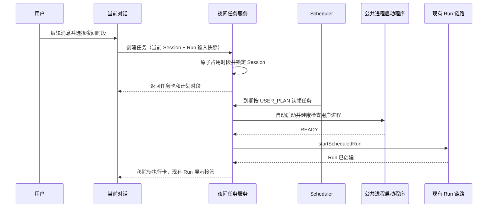

# 夜间定时执行任务设计

## 背景与目标

公司白天算力不足，需要让用户在现有对话界面提交一次性夜间任务，由系统在北京时间 21:00 至次日 07:00 的 15 分钟启动时段内自动执行。

首版目标：

- 用户继续使用当前消息输入框编辑正文、附件和上下文，只在发送时选择立即发送或夜间执行。
- 夜间任务始终绑定当前对话，不再提供“执行位置”选择。已有会话继续当前上下文；需要全新会话时，用户先使用现有“新建对话”入口，再提交夜间任务。
- 待执行任务同时显示在当前对话和消息区的集中任务页签中；真正启动后复用现有 Run、后台运行、SSE 恢复和会话展示能力。
- 复用现有 scheduler 框架的 `USER_PLAN` 触发类型、运行记录、分布式锁和 handler 注册机制，不新增平行调度器。

首版只支持一次性任务和下一次可用夜间窗口，不支持未来日期预约、周期任务、修改任务正文或执行位置。

## 已确认的产品决策

1. 发送按钮左侧新增定时执行图标；输入为空或当前会话不可提交时禁用。
2. 点击图标后只展示 15 分钟时段选择，不展示执行位置。
3. 系统默认推荐“未满且待执行任务最少”的时段；数量相同时选择更早时段。用户可以改选其他未满时段。
4. 每个时段使用部署可配置的全局硬容量；已满时段不可选择。下一夜间窗口没有可用时段时拒绝提交并说明原因。
5. 夜间任务采用“双重展示”：当前对话末尾显示锁定任务卡；消息列表区域增加“待执行任务”页签，汇总当前用户全部待执行任务。
6. 同一会话最多有一个待执行夜间任务。等待期间不能在该会话继续发送或再提交夜间任务，但可以新建、进入和使用其他会话。
7. 待执行任务取消或最终失败后解除会话锁；任务启动后由现有 Run 的运行状态继续控制该会话。
8. 到达时段时若用户 TestAgent 进程未运行，必须复用公共启动程序自动拉起并完成健康检查，再进入现有对话 Run 链路。
9. 任务未能在所选时段内启动时，在同一夜间窗口内自动顺延到下一个未满时段；到 07:00 仍未启动则失败并解除锁定。

## 用户交互

### 提交入口

输入卡片右侧操作顺序调整为“新建对话 → 定时执行 → 发送/停止”。定时执行使用时钟图标，紧邻并位于发送按钮左侧。

图标与普通发送共享正文、附件、工作区上下文、Agent、模型、模式和命令校验。以下任一条件成立时禁用：

- 输入为空或上下文超限；
- 当前 Run 正在执行、历史切换尚未稳定或会话只读；
- TestAgent 进程不可用或公共 Agent/Skill 配置正在排空；
- 当前会话已有待执行夜间任务。

点击可用图标后，在输入卡片内展开时段面板：

- 显示“下一次夜间窗口”和北京时间；
- 展示从下一个完整 15 分钟边界开始的可选时段；
- 推荐时段带“推荐”标记，已满时段显示“已满”且不可选；
- 用户确认后才提交，关闭面板不改变输入内容。

如果当前是尚未落库的空白新对话，提交接口在同一业务事务中先创建空 Session，再创建夜间任务。Session 标题沿用普通首条消息的标题规则；任务正文不提前写入消息表。

提交成功后清空输入内容和本轮附件，保留当前会话，显示成功提示并在对话末尾插入独立任务卡。网络超时重试使用客户端请求 ID 保证幂等，不得生成重复 Session 或重复任务。

### 当前对话任务卡与会话锁

任务卡不是聊天消息，不能进入消息时间线或交给模型。卡片显示：

- 状态：`等待执行` 或 `已顺延`；
- 用户提交内容的安全预览；
- 计划启动时段和北京时间；
- “调整时段”和“取消任务”操作。

任务卡存在时，输入框、普通发送和定时执行图标禁用，并显示“当前会话已有待执行夜间任务，取消后可继续对话”。现有“新建对话”和消息列表入口保持可用，因为锁只作用于当前 Session。

调整时段时重新打开同一时段面板，只允许选择当前下一夜间窗口内尚未开始且未满的时段。任务正文、附件、Agent 和模型均不可修改。取消需要二次确认；成功后移除任务卡并解除锁定。

由夜间任务专门创建的空 Session 如果在产生任何真实消息前被取消，应自动归档，避免普通会话历史残留空记录。最终失败时先保留一张“夜间任务启动失败”卡片并解除输入锁，卡片显示安全错误和“关闭”操作；用户关闭后标记任务已确认，如果该 Session 仍没有真实消息再自动归档。已有会话永不因任务取消或失败而归档，失败卡关闭后只从界面移除。

### “对话 / 待执行任务”页签

消息内容区顶部增加两个页签：

- `对话`：保留现有消息时间线、工作状态和当前会话任务卡；
- `待执行任务（N）`：显示当前用户所有会话中的待执行夜间任务，默认按计划时段升序排列，当前会话任务置顶。

任务列表卡片显示会话标题、内容预览、计划时段、创建时间和顺延标记，并提供：

- `打开对话`：切换到任务绑定的 Session；
- `调整时段`：执行与当前对话任务卡相同的调整；
- `取消任务`：执行同一取消确认流程。

首版页签只查询待执行任务，不增加搜索、历史任务或状态二级筛选。空列表显示“暂无待执行夜间任务”。

### 自动启动后的展示

启动任务时才创建真实用户消息和 Run。用户消息显示“夜间定时”来源标识和实际启动时间；助手输出、运行中状态、工具调用、提问、停止、后台运行、刷新恢复和终态展示全部复用现有会话能力。

任务成功投递为 Run 后，从“待执行任务”页签和独立任务卡中移除。用户停留在该 Session 时，通过现有用户会话运行态发现后台 Run 并接入现有 SSE；用户位于其他 Session 时，消息列表继续使用现有后台运行数量和运行标识，打开目标 Session 后恢复详情。

## 时间、容量与顺延规则

- 所有产品时间语义固定为 `Asia/Shanghai`；数据库和 API 使用 UTC `Instant`，前端统一转换为北京时间展示。
- 夜间窗口包含 40 个时段：`21:00–21:15` 至 `06:45–07:00`。
- 当前时间恰好位于 15 分钟边界时可选择该边界开始的时段；否则从下一个边界开始。当前夜间窗口已无完整时段时，使用当天 21:00 开始的下一窗口。
- 时段容量为全系统启动任务数上限，不估算任务执行时长。部署参数 `TEST_AGENT_NIGHT_EXECUTION_SLOT_CAPACITY` 必须为正整数；缺失或非法时应用继续运行，但夜间任务 API 返回功能不可用，避免使用任意默认容量误伤生产算力。
- 推荐算法先过滤已开始和已满时段，再按 `reservedCount` 升序、`slotStart` 升序选择第一项。
- 创建和改期必须原子占用目标时段容量；并发请求只有成功占位者可以提交。取消、改期和启动前失败释放原时段；已开始投递的任务保留该时段占用事实，不允许在时段中途补入超过上限的新任务。
- 可重试故障在原时段结束后原子释放旧占位，并占用同一夜间窗口中下一个未满时段；卡片更新为“已顺延”。没有剩余时段或到达 07:00 时转为最终失败。

## 领域状态与数据

### 夜间任务状态

夜间任务只维护调度到 Run 投递为止的状态，不复制 Run 的完整生命周期：

- `SCHEDULED`：已占用时段，等待执行；
- `DISPATCHING`：调度器已认领，正在检查进程并启动 Run；
- `DISPATCHED`：Run 已创建并接管后续执行，记录 `runId`；
- `CANCELLED`：用户在调度认领前取消；
- `FAILED`：在夜间窗口结束前无法投递，或遇到不可重试错误；使用可空 `dismissedAt` 记录用户是否已关闭失败卡。

“待执行任务”包含 `SCHEDULED` 和 `DISPATCHING`；后者显示“启动中”并禁用调整、取消，直到切换为现有 Run 或回到 `SCHEDULED`。

### 持久化边界

新增独立的夜间任务、会话锁和时段占位数据模型：

- 夜间任务保存 owner、Session、Workspace、序列化后的普通 Run 输入快照、时段、调度运行关联、状态、顺延次数、`runId` 和安全错误；
- 会话锁以 `sessionId` 为唯一键，跨 Java 原子保证同一 Session 只有一个待执行任务；
- 时段占位以 `slotStart` 为唯一键，通过条件更新保证 `reservedCount < configuredCapacity`；
- 每次投递尝试关联一个 `scheduled_task_runs` 的 `USER_PLAN` 运行记录，重试顺延创建新的运行记录，保留每次尝试的审计结果。

所有新增关系型 SQL 必须通过 MyBatis XML mapper 实现，并使用 Flyway migration 创建表、约束和索引。至少建立 owner + status + slot、session + status、scheduler run ID 的查询索引。

定时任务正文和 parts 只保存在夜间任务业务表中，禁止写入 scheduler 的 payload、result、日志或错误详情。列表 API 只返回有限长度预览。成功投递、取消或最终失败后清除完整正文和 parts，仅保留预览、时段、状态、Run 关联和审计元数据；终态任务元数据保留 30 天后由 scheduler 注册的清理 handler 删除。

### 来源标识

- 在空白对话提交时创建的 Session：`sourceType=SCHEDULED_TASK`、`sourceRefId=nightTaskId`；
- 已有 Session 保持原来源不变；
- 夜间启动产生的 Run 和用户消息：`sourceType=SCHEDULED_TASK`、`sourceRefId=nightTaskId`、触发/发送用户为任务 owner；
- 普通用户 HTTP 请求不能传入或伪造来源字段，来源只由服务端内部调度入口设置。

Session、Run 和 SessionMessage 响应增加可选的 `sourceType/sourceRefId`，前端据此展示“夜间定时”标识；字段为纯增量，旧客户端可忽略。

## 调度与执行架构

### scheduler 框架扩展

夜间任务不使用预留的 Cron `scheduled_task_plans` 承载正文，也不新增独立轮询线程。通用 scheduler 增加正式的用户计划执行能力：

- handler 声明支持的触发模式；现有 handler 默认 `CRON/MANUAL`，夜间 handler 只支持 `USER_PLAN`，不会产生自身 Cron 运行；
- runner 扫描到期的 `USER_PLAN/PENDING` 运行记录；
- `scheduled_task_runs` 增加可空的执行亲和键，夜间任务写入目标 `linuxServerId`，只有同服务器 Java 可以认领；
- CRON/MANUAL 继续按 `taskKey` 互斥，USER_PLAN 改为按 `taskRunId` 使用现有 Redis 锁，允许同一夜间 handler 的多个用户任务并行投递；
- USER_PLAN 使用有界 worker 池，默认 4 个投递 worker，可通过 scheduler 配置调整；scheduler 关闭时提交和改期返回冲突，不制造永远不执行的任务。

夜间 handler 的稳定 task key 为 `opencode-runtime.night-execution`。handler 根据 `taskRunId` 加载业务任务并用条件更新从 `SCHEDULED` 认领为 `DISPATCHING`，因此 Java 重启、锁过期或重复扫描不会重复创建 Run。

另注册 `opencode-runtime.night-execution-reconcile` 周期 handler，负责把持续超过 5 分钟且尚未产生 Run 的 `DISPATCHING` 视为失去认领并恢复、顺延已错过时段的任务、处理凌晨 07:00 最终失败和清理 30 天终态元数据；它仍由现有 scheduler 统一加锁和记录运行结果。

### 后端归属与进程启动

创建夜间任务的写请求纳入现有用户 opencode 后端路由，由 `BackendJavaRouteResolver` 选择用户 binding 所属 Java，并由 `BackendHttpForwarder` 转发到目标 Java。目标 Java 把本机 `linuxServerId` 写入 USER_PLAN 执行亲和键，禁止业务代码扫描 Redis 快照、自写转发器或降级到入口 Java。

到期时仅亲和服务器的 runner 可以认领：

1. 重新校验任务 owner、Session、Workspace 和当前权限；
2. 如果用户 binding 已迁移到其他服务器，更新下一次 USER_PLAN 的执行亲和键，由目标服务器重新认领，不在本机执行；
3. 调用 `UserOpencodeProcessAssignmentService.initialize`，由其复用 `OpencodeProcessStartupService` 和公共状态查询完成 manager 启动、PID/state、HTTP health 与节点投影；
4. 调用新增的服务端内部 `startScheduledRun` 入口，复用 `RunApplicationService` 的消息保存、路由、远端 Session、RunEvent、SSE、取消和终态投影链路；
5. Run 创建成功后记录 `runId`、删除会话待执行锁并清除任务完整 payload。

手工 `startRun` 和 Session 归档入口必须在服务端检查会话待执行锁并返回统一 `CONFLICT`；调度内部入口携带受控来源上下文，可以通过该锁启动绑定任务，但不能绕过用户、Session 或 Workspace 权限校验。

## HTTP API 与前端类型

新增普通用户 API，全部从认证主体读取 owner：

| 方法 | 路径 | 用途 |
| --- | --- | --- |
| `GET` | `/api/internal/platform/opencode-runtime/night-execution/slots` | 返回下一夜间窗口、容量、占用数和推荐时段 |
| `POST` | `/api/internal/platform/opencode-runtime/night-execution/tasks` | 幂等创建任务；`sessionId` 可空，空时同时创建 Session |
| `GET` | `/api/internal/platform/opencode-runtime/night-execution/tasks` | 分页查询当前用户待执行任务，可按 `sessionId` 过滤 |
| `PATCH` | `/api/internal/platform/opencode-runtime/night-execution/tasks/{taskId}` | 调整尚未认领任务的时段 |
| `POST` | `/api/internal/platform/opencode-runtime/night-execution/tasks/{taskId}/cancel` | 取消尚未认领任务 |
| `POST` | `/api/internal/platform/opencode-runtime/night-execution/tasks/{taskId}/dismiss` | 关闭已失败任务卡，必要时归档空 Session |

创建请求包含 `clientRequestId`、可空 `sessionId`、`workspaceId`、标题、普通 Run 的 prompt/parts/Agent/模型/模式/命令快照，以及用户选中的 `slotStart`。服务端根据 `slotStart` 推导固定 15 分钟 `slotEnd`，不信任客户端容量、owner、状态、来源或结束时间。

时段响应包含 `timeZone`、window 起止、容量和 `slots[]`；每个 slot 返回起止、`reservedCount`、`capacity`、`available`、`recommended`。任务响应包含任务 ID、Session/Workspace、会话标题、内容预览、时段、状态、顺延次数、可选 `runId`、安全错误和时间戳，不返回完整 parts。按 `sessionId` 查询时除待执行任务外，还返回该 Session 最近一条未关闭的失败任务，供刷新后恢复失败卡。

前端 shared-types 和 backend-api 增加对应请求/响应类型与客户端方法；Session、Run、SessionMessage 的来源字段保持可选，保证滚动升级兼容。

不新增 RunEvent 事件类型。待执行页签使用普通查询和窗口聚焦刷新；任务投递后由现有用户会话运行态与 RunEvent SSE 接管。页面打开期间对当前 Session 和待执行数量做低频轮询，切到任务页签时立即刷新。

## 错误处理与边界

- 容量被并发占满：返回 `CONFLICT` 和最新时段列表，前端保留输入并要求重新选择。
- 重复 `clientRequestId`：返回首次创建结果，不重复占位、建 Session 或建任务。
- 调整/取消与调度认领竞争：只有一个条件更新成功；已进入 `DISPATCHING` 时返回冲突并刷新状态。
- 失败卡只允许 owner 对 `FAILED` 且未关闭的任务执行一次 dismiss；重复请求幂等，空 Session 归档与 dismiss 在同一事务完成。
- 进程启动、目标后端或公共配置门禁临时不可用：在当前夜间窗口内顺延；不得本机降级。
- Session 已归档、Workspace/应用成员权限已撤销、保存的 Run 输入不可解析：立即失败、释放会话锁和未使用的时段占位，不启动 Run。
- scheduler 被关闭或容量参数未配置：禁止新建和改期；已有任务保留并在恢复后继续扫描，reconcile 仍按真实时间决定顺延或最终失败。
- 用户在其他入口尝试向锁定 Session 发送或归档：后端返回统一 `CONFLICT`，不能只依赖前端禁用。
- 已投递任务的停止、提问、恢复和失败均走现有 Run 语义；夜间任务取消 API 不再处理它。

## 测试与验收

### 后端

- 时段计算覆盖白天、夜间、15 分钟边界、06:45/07:00、北京时间与 UTC 转换、推荐排序、全部满载。
- PostgreSQL/MyBatis 集成测试覆盖并发占位不超容量、同 Session 单任务锁、创建/改期/取消原子性、幂等请求和终态 payload 清理；Flyway 全链兼容 H2 与 PostgreSQL。
- scheduler 测试覆盖 USER_PLAN 扫描、执行亲和、按 taskRunId 分布式锁、同 handler 多任务并行、重复扫描幂等、scheduler 关闭、顺延和 07:00 失败。
- runtime 测试覆盖已有/空白 Session 创建、手工发送与归档锁、公共进程自动启动、两种 Run 存储模式的来源字段、消息/Run 只创建一次、权限撤销和 binding 迁移。
- API 测试覆盖跨用户越权、非法时段、完整请求大小限制、安全错误、路由到 binding 所属 Java，以及 DTO 向后兼容。

### 前端

- 定时图标位于发送按钮左侧，并与普通发送共享校验；弹层不出现执行位置。
- 空白对话提交后创建稳定 Session；提交成功前保留输入，成功后清理输入与附件。
- 当前对话卡、锁定提示、调整、取消以及新建/进入其他会话仍可用。
- 最终失败解除锁定并显示可恢复的失败卡；关闭后已有会话只隐藏卡片，夜间任务创建的空 Session 自动归档。
- “待执行任务”页签展示当前用户全部任务、当前会话置顶、数量和空状态；跨会话打开、调整、取消正确。
- 自动启动后移除任务卡，带“夜间定时”标识的真实用户消息和现有运行状态可在刷新、后台切换后恢复。
- Playwright 覆盖“新建空白会话提交 → 刷新 → 查看任务卡 → 自动启动模拟 → 现有 Run 展示”和“已有会话锁定 → 新建其他会话仍可发送”。

### 验收标准

- 任一 Session 在等待期最多一个夜间任务，所有写入口都无法绕过锁。
- 任一 15 分钟时段的成功占位数不超过配置容量，并发提交也不例外。
- 用户关闭浏览器后任务仍能在计划时段启动；目标进程停止时能自动启动并通过公共健康检查。
- 任务在 07:00 前无法投递时有明确失败状态，锁和未使用容量被释放。
- 夜间产生的 Session、Run 和用户消息可通过来源字段与手工对话区分，后续执行体验与普通 Run 一致。

## 兼容性、性能与安全

- API 和来源字段均为增量；现有普通发送、历史会话、后台 Run 和 scheduler CRON/MANUAL 行为保持不变。
- `scheduled_task_plans` 继续作为 Cron 计划预留模型，不用它存储一次性正文；generated SDK 不手工修改。
- 列表查询必须分页并使用 owner/status/slot 索引；runner 每次批量认领受配置上限控制，不全表扫描。
- prompt、parts、文件内容、认证 token 和密钥不得写日志、scheduler result 或错误详情；错误只返回安全文案和 traceId。
- 所有查询、调整和取消按认证用户校验 owner；调度内部入口不接受浏览器调用，也不允许客户端伪造 `SCHEDULED_TASK` 来源。
- 不修改 `.env.local`；新增部署参数只更新示例和部署文档，由环境负责人配置真实容量。
