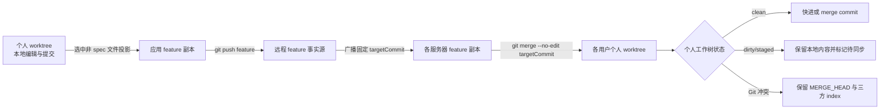

# 应用工作区分支模型与测试

本文是公共 Agent、应用工作空间和应用 Agent 三个区域的分支、权限、发布影响与测试数据事实源。OpenCode 保持原生配置加载，平台只编排 Git worktree、固定提交同步和原生 `/global/dispose`，不修改 OpenCode 源码。

## 1. 分支模型

### 1.1 公共 Agent/Skill

| 对象 | 分支/目录 | 用途 | 是否直接编辑 |
| --- | --- | --- | --- |
| 公共远程分支 | 初始化公共仓库时明确选择的分支 | 公共配置发布事实源 | 否 |
| 管理员公共个人 worktree | 稳定分支 `public-{userId}` | `SUPER_ADMIN` 编辑、暂存、提交和处理远端合并冲突 | 是，仅本人 |
| 每服务器公共运行副本 | `OPENCODE_PUBLIC_CONFIG_DIR` 对应共享仓库 | 公共远程提交在本服务器的运行事实副本 | 否，发布程序同步 |
| 每用户有效公共配置指针 | `{sessionPath}/.testagent-runtime/current-public-config` | `OPENCODE_CONFIG_DIR` 固定指向此软链接；默认链接共享副本，个人保存时临时链接本人的公共 worktree | 否，平台原子切换 |

公共配置不按应用或版本拆分。保存和本地提交只改变当前管理员的公共个人 worktree；其中 Agent 定义、Skill 定义或 JSONC 保存会把当前管理员本人的固定指针切到该 worktree 并只 dispose 本人进程，供推送前调试，不改共享副本。推送成功后，持久化 rollout 才把固定公共提交同步到每台服务器的共享运行副本；各用户旧任务空闲后先把其指针恢复到共享副本，再调用原生 `/global/dispose`。

公共分支以平台初始化时选中的分支和已记录 Git 指针为准，不按远端分支名称自动抢占。比如本地 test 环境当前选择 `master` 时，远端同时存在的 `enterprise` 只是一条候选分支；除非管理员显式切换初始化分支，或先把其提交评审合并进 `master`，否则它不会覆盖当前公共事实源。

### 1.2 应用工作空间与应用 Agent

应用普通文件和 `.opencode` 使用同一个人分支，不存在“应用 Agent 独立 worktree”或运行时覆盖合并层。

| 对象 | 分支/目录 | 用途 | 是否直接编辑 |
| --- | --- | --- | --- |
| 应用远程 feature | 标准库为 `feature_testagent_{version}`；非标准库为创建版本时所选分支 | 该应用版本的共享事实源 | 否 |
| 每服务器 feature 副本 | 同一 feature 的本地副本 | 发布投影目标、多服务器固定提交同步源；对所有角色只读 | 否 |
| 用户个人 worktree | `{featureBranch}_{userId}_{workspaceName}` | 本人的普通文件、`docs/**`、`spec/**` 和 `.opencode/**` 编辑/调试分支 | 是，仅 owner |
| 应用 Agent Diff 作用域 | 个人 worktree 中 `.opencode/opencode.jsonc`、`.opencode/agents/**`、`.opencode/skills/**` | 只隔离展示、权限、暂存和发布路径 | 不是独立分支 |

“应用普通文件”指个人 worktree 中进入 `workspace` Diff 的项目文件，例如根 `README.md`、`docs/**`、`archive/**`、源码、测试、部署脚本和普通业务配置。边界如下：

- `.opencode/**` 不属于普通文件 Diff；其中只有 `.opencode/opencode.jsonc`、`.opencode/agents/**`、`.opencode/skills/**` 进入“应用 Agent”Diff，其余 `.opencode` 文件不进入应用 Agent 提交/发布白名单。
- `spec/**` 会进入普通文件 Diff，允许所有应用成员保存、暂存并提交到本人个人分支，但属于本地资产，任何角色都不能发布到 feature；`./spec/**`、重复分隔符等别名在后端规范化后同样拒绝。
- `.git/**` 元数据、绝对路径和 `../` 越界路径不允许操作；被 Git 忽略的 `node_modules`、构建产物等通常不会进入 Diff。
- 发布只投影用户明确选择、已经进入个人 `HEAD` 且不属于 `spec/**` 的路径；存在未完成 merge、所选文件仍有未提交内容或确认后 feature HEAD 已变化时拒绝发布。个人分支本身始终不 push。



反向同步固定使用版本记录的 `targetCommitHash`，不在执行时重新解析可移动分支名。个人 worktree clean 时立即合并；任意 dirty、staged 或 untracked 内容存在时不 stash、不 reset、不覆盖，Diff 返回待同步状态；真实冲突保留 Git 原生 merge 状态，在三方编辑器解决全部冲突后点击“完成合并”提交完整 merge index。

### 1.3 OpenCode 如何读取并整合配置

平台不解析或复制多层 OpenCode 配置，也不创建“应用 runtime”。每个用户只有一个受管 OpenCode 进程，配置仍由 OpenCode 原生加载：

| 来源 | 实际路径/选择方式 | 生效范围 |
| --- | --- | --- |
| 用户全局 OpenCode 配置 | 运行用户的 `~/.config/opencode` | OpenCode 原生全局层；企业环境不得在这里维护模型或供应商，避免污染公共事实源 |
| 公共配置 | `OPENCODE_CONFIG_DIR={sessionPath}/.testagent-runtime/current-public-config` | 当前用户进程的公共层；软链接默认指向 `OPENCODE_PUBLIC_CONFIG_DIR`，公共个人保存时只对本人切到 `public-{userId}` worktree 的 `opencode/` |
| 应用个人配置 | 本次请求 directory 对应的个人 worktree `.opencode/opencode.jsonc`、`.opencode/agents/**`、`.opencode/skills/**` | OpenCode 按项目目录原生发现并与公共层组合；不存在平台自定义覆盖/复制规则，也不存在独立应用 Agent worktree |
| 应用资产引用 | 应用个人 `.opencode/opencode.jsonc` 的 `references`，路径通过 `OPENCODE_REFERENCES_DIR` 展开 | 只记录和加载引用关系；资产库文件、分支不会复制或合并进应用 Git |

`sessionPath` 是当前统一认证用户的 OpenCode 数据目录，同时作为进程的 `XDG_DATA_HOME`；它不是应用 worktree。平台在其下固定维护 `current-public-config` 软链接，让 manager 的 `configPath` 和 `OPENCODE_CONFIG_DIR` 永远使用同一个入口，只改变软链接目标。当前本地 test 环境的实际关系是：

```text
sessionPath
/Users/kaka/Desktop/intelligent-test-agent/.testagent/agent-opencode/.session/users/DEV_888888888

OPENCODE_CONFIG_DIR / manager configPath
/Users/kaka/Desktop/intelligent-test-agent/.testagent/agent-opencode/.session/users/DEV_888888888/.testagent-runtime/current-public-config

当前软链接目标（公共共享副本）
/Users/kaka/Desktop/intelligent-test-agent/.testagent/agent-opencode/.config/opencode

公共个人保存后的预览目标示例
/Users/kaka/Desktop/intelligent-test-agent/.testagent/agent-opencode/.configdev/public-usr_test_dev/opencode
```

前两项在同一用户进程整个生命周期内保持不变。启动和公共发布完成后，链接指向共享副本；当前超管保存可热加载的公共个人配置后，只把本人链接原子切到公共个人 worktree。应用个人配置始终由请求 directory 下的 `.opencode` 读取，不修改这条公共链接。

公共个人 worktree 与应用个人 worktree 不是互相覆盖的 Git 分支：前者通过进程固定软链接提供公共配置，后者由请求所在项目目录的 `.opencode` 原生加载。`/global/dispose` 释放的是该用户 OpenCode 进程内已缓存的 workspace Instance；下一次访问某个工作区时，OpenCode 才按上述路径重新 bootstrap。

企业离线包中的自定义 Tool 依赖也不复制进 worktree。既有离线兼容层会在当前有效公共配置目录和应用 `.opencode` 目录的 `node_modules` 下建立包级软链接，统一指向 programs 随包交付的只读 `node_modules`；因此应用个人确实复用同一套依赖，但不是链接公共 Git worktree，也没有额外配置 runtime。本地开发直接使用本机 OpenCode 与已有依赖目录，不要求出现企业包内的这些包级软链接。本轮配置指针与 dispose 实现没有修改 OpenCode 源码或该离线兼容层。

## 2. 角色权限

托管应用工作区始终要求用户是启用应用的有效成员，`SUPER_ADMIN` 不绕过应用成员校验。

| 能力 | 普通成员 `USER` | 应用负责人 `APP_ADMIN` | 超级管理员 `SUPER_ADMIN` |
| --- | --- | --- | --- |
| 读取应用 feature 副本 | 允许，只读 | 允许，只读 | 允许，只读，且需为应用成员 |
| 本人个人 worktree 普通文件读写、暂存、回退、提交 | 允许 | 允许 | 允许，且需为应用成员 |
| 发布个人 HEAD 中非 `spec/**` 普通文件到 feature | 允许 | 允许 | 允许，且需为应用成员 |
| 本地提交 `spec/**` | 允许 | 允许 | 允许 |
| 发布 `spec/**` | 禁止 | 禁止 | 禁止 |
| 读取应用 `.opencode/**` | 允许 | 允许 | 允许，且需为应用成员 |
| 写入、暂存、提交、发布应用 Agent/Skill/JSONC | 禁止 | 允许 | 允许，且需为应用成员 |
| 读取公共 Agent/Skill | 允许，读取共享运行副本 | 允许，读取共享运行副本 | 允许 |
| 创建/写入/提交/推送公共个人 worktree | 禁止 | 禁止 | 允许，仅本人的 `public-{userId}` |

## 3. 保存、提交和推送后的影响

### 3.1 什么算“保存”

主编辑器中点击“保存”、macOS 按 `Command+S`、Windows/Linux 按 `Ctrl+S` 都调用同一个 `saveMutation`。只有活动文件存在未保存修改、不是只读或实时预览、并且当前没有另一笔保存进行中时才发送写文件请求；快捷键条件不满足时只阻止浏览器“保存网页”，不会写盘或 dispose。专用资产引用弹窗和 Git 冲突编辑器使用各自的“保存”按钮，不依赖主编辑器快捷键。

运行态热加载以“后端确认文件成功写盘”为起点，而不是以按下快捷键为起点：

- 可热加载目录定义精确为 `opencode.jsonc`、`agents/**/*.md`、`skills/**/SKILL.md`。公共和应用个人作用域规则相同。
- `skills/**/rules/**`、`skills/**/templates/**` 等资源文件只保存并刷新 Diff，不 dispose；它们提交并推送后仍会随对应 Git 发布同步。
- 应用资产引用弹窗保存的是个人 `.opencode/opencode.jsonc`，成功后按 JSONC 规则只热加载当前用户。
- 当前用户有运行中任务时，dispose 延迟到任务空闲；进程尚未初始化或不可用时不为了保存额外启动进程。应用个人 `.opencode` 会在后续首次启动或 workspace bootstrap 时直接读取磁盘最新配置；公共个人预览则不会跨进程启动保留，因为启动固定先把链接恢复到共享副本，超管需在进程 READY 后再次保存可热加载文件，或正式推送公共配置。
- 文件已落盘但 dispose 失败时，界面明确提示“文件已保存，运行态刷新失败”，不会把磁盘写入误报为失败。

### 3.2 影响矩阵

| 区域与动作 | Git/磁盘影响 | 别人的效果 | OpenCode 运行态影响 |
| --- | --- | --- | --- |
| 个人 worktree 普通文件保存 | 只写本人工作树，进入 Diff | 无 | 无 dispose |
| 个人 worktree 普通文件本地提交 | 只更新本人个人分支；若此前有待同步 feature，提交后立即重试固定提交 merge | 无远程变化 | 无 dispose |
| 个人 worktree 非 `spec/**` 普通文件提交并推送 | 先提交本人 HEAD，再把选中的非 spec 路径投影到 feature，提交并 push；随后各服务器把固定 feature commit 合并到相关个人 worktree。适用于 `docs/**`、`archive/**`、README、源码、测试和部署文件等 | clean worktree 自动更新；dirty worktree 显示待同步；冲突保留在 Diff。已经打开的浏览器树/标签没有新增 SSE，按现有刷新或重新进入工作区重读磁盘 | 无 dispose |
| 个人 worktree `spec/**` 提交 | 只进入本人个人分支 | 无 | 无 dispose，任何角色都不能推送 |
| 应用 Agent/Skill/JSONC 保存 | 写入本人个人 worktree，并出现在“应用 Agent”Diff；`agents/**/*.md`、`skills/**/SKILL.md`、`opencode.jsonc` 保存后在当前任务空闲时直接调用本人进程 `/global/dispose`，供发布前调试；rules/templates 只保存 | 无 | 只热加载当前用户，不是全局发布；不切换公共配置指针 |
| 应用 Agent/Skill/JSONC 本地提交 | 只更新本人个人分支 | 无 | 不新增全局影响；保存时的本人调试热加载仍有效 |
| 应用 Agent/Skill/JSONC 提交并推送 | 复用普通发布投影进入 feature；各服务器以同一个固定 commit 反向合并完整 feature 更新 | 所有相关个人 worktree 必须先包含目标 commit；dirty/冲突保持待处理，持久化 rollout 每 5 秒补偿，不覆盖个人内容 | 个人 worktree 收敛后进入应用级全局 rollout，等待旧任务空闲并对目标用户进程调用原生 `/global/dispose` |
| 公共 Agent/Skill/JSONC 保存 | 只写当前超管公共个人 worktree并进入公共 Diff；目录定义保存后把本人的有效公共配置软链接切到该 worktree | 无 | 当前任务空闲时只 dispose 当前超管本人，下一次 bootstrap 读取个人 worktree；共享副本和别人不变 |
| 公共 Agent/Skill/JSONC 本地提交 | 只更新 `public-{userId}` | 无 | 不新增 dispose；本人保存后的预览链接继续有效 |
| 公共 Agent/Skill/JSONC 提交并推送 | 先合并远端公共分支并推送，再把固定提交同步到所有服务器公共运行副本 | 所有用户最终读取同一共享固定提交 | 全局 rollout 逐用户等待旧任务空闲，先把有效指针恢复到共享副本，再调用原生 `/global/dispose` |

应用资产引用本身仍由资产库 generation/副本程序维护；`opencode.jsonc` 只记录引用关系。保存引用 JSONC 只热加载本人；只有管理员明确把该 JSONC 提交并推送后，引用配置才随 feature 固定提交合并到其他个人 worktree，资产文件不会复制进应用仓库，也不会把资产库分支合并进 feature。

表中的“全局 rollout”仍是逐用户进程执行，不存在所有用户共用的 OpenCode 进程。只对已有运行进程登记 dispose 目标；没有运行进程的用户在下次初始化时直接加载最新公共配置和个人 worktree 配置。

## 4. 代码与 Git 操作

| 阶段 | 代码入口 | 关键操作 |
| --- | --- | --- |
| 个人本地提交 | `ManagedWorkspaceApplicationService.commitPersonalWorkspace` | 隔离 index，`git add -- <files>`，提交个人分支；不 push |
| 个人发布 | `ManagedWorkspaceApplicationService.publishPersonalWorkspace` | feature 副本 `fetch` + `pull --ff-only`；从个人 `HEAD` 定点 checkout/删除选中路径；feature `commit` + `git push origin {featureBranch}` |
| 版本广播 | `publishVersionSync` / `handleVersionSyncEvent` | payload 只携带 `targetCommitHash` 等标识；远端服务器先把 feature 副本 reset 到固定提交 |
| feature 反向同步 | `synchronizeFeatureCommitToPersonalWorktrees` → `mergeFeatureCommitIntoPersonalWorkspace` | 先用 `git merge-base --is-ancestor <target> HEAD` 判定；clean 时调用 `GitWorkspaceService.mergeCommit` 执行 `git merge --no-edit <targetCommit>` |
| dirty 补偿 | `retryLatestFeatureMerge` | 本地提交、回退、显式进入 default 个人工作区后重试；副本补偿和版本广播也会重试 |
| 冲突展示 | `getWorkspaceGitDiff` / `GitChangesPanel.vue` | Diff 返回 `mergeInProgress`、`applicationUpdatePending`、`applicationTargetCommit`；Git unmerged stage 用既有三方编辑器读取 |
| 冲突完成 | `completeWorkspaceGitMerge` | 冲突全部解决后提交完整 merge index；若包含 `.opencode/**`，入口要求 `APP_ADMIN` |
| 应用配置发布热加载 | `PublicAgentConfigRolloutCoordinator` 的 APPLICATION scope | 每服务器个人 worktree 全部包含固定提交后登记目标用户，等待空闲并调用现有 OpenCode client 的 `/global/dispose` |
| 公共保存时本人热加载 | `AgentWorkbench.refreshRuntimeCatalogAfterAgentConfigSave` → `POST /agent-config/public/runtime-reload` → `PersonalAgentConfigRuntimeReloadService` | 校验 worktree owner/服务器，原子切换 `{sessionPath}/.testagent-runtime/current-public-config` 到本人公共 worktree，再只调用本人进程 `/global/dispose` |
| 应用保存时本人热加载 | `AgentWorkbench.refreshRuntimeCatalogAfterAgentConfigSave` | `scope=WORKSPACE` 直接调用当前用户 `disposeGlobal()`；OpenCode 下一次按请求 directory 重读该个人 worktree `.opencode` |
| 公共发布热加载 | `PublicAgentConfigRolloutService` 的 PUBLIC scope | 各服务器共享 Git 副本固定提交同步后，逐进程等待全部 Session 空闲，恢复共享配置链接并调用 `/global/dispose`；升级前直接读取共享路径的旧进程兼容只 dispose |

兼容接口 `POST /personal-workspaces/{id}/sync-from-application` 不再逐文件复制，也不接受 `force` 覆盖个人内容；它校验请求后同样尝试合并整个固定 feature commit。

## 5. 可重复测试数据

执行：

```bash
tools/create-workspace-branch-model-test-data.sh
```

脚本在被 Git 忽略的 `.tmp/workspace-branch-model.*` 下创建独立真实仓库，并输出目录。每次运行包含：

- `application-repository`：已提交 docs 与应用 Agent 的 feature 事实源。
- `personal-clean`：有个人提交且已成功生成真实 merge commit。
- `personal-dirty`：保留未提交文件，模拟 `applicationUpdatePending=true`。
- `personal-conflict`：保留 `MERGE_HEAD`、三方 index 和 `docs/shared.md` 冲突。
- `public-personal-admin`：保留未推送公共 Agent 修改。
- `README.md`：记录本次随机目录、目标 commit 和可复制的核对命令。

脚本末尾会自动断言 clean worktree 已包含目标提交、dirty worktree 仍有修改、conflict worktree 存在 `MERGE_HEAD` 和 unmerged 路径、公共个人 worktree 存在未推送修改。

## 6. 核心测试案例

| 案例 | 操作 | 预期 |
| --- | --- | --- |
| A 推送 docs，B clean | A 从个人 HEAD 推送 `docs/publish.md` | feature push 成功；B 所在服务器合并固定 commit；B 分支包含 target；无 dispose |
| A 推送 docs，B dirty | B 先保存未提交文件，A 再推送 | 不 stash/reset B；Diff 显示 feature 待同步；B 提交或回退后自动重试 |
| A 推送 docs，B 同文件已有提交 | A、B 修改同一文件，A 先推送 | B 保留 Git merge 冲突和 `MERGE_HEAD`；三方解决后“完成合并”生成 merge commit |
| A 推送应用 Agent，B clean | APP_ADMIN 推送 `.opencode/agents/review.md` | 与 docs 相同的完整 feature merge；全部相关 worktree 收敛后才进入全局 dispose |
| A 推送应用 Agent，B dirty/冲突 | B 有任意 dirty 或真实冲突 | 不覆盖 B；应用 rollout 保持 retry，B 处理后补偿推进 dispose |
| 应用 Agent 保存调试 | APP_ADMIN 保存 `agents/**/*.md` 或 `skills/**/SKILL.md` | 只 dispose 当前用户；不广播、不影响别人 |
| 公共 Agent 保存 | SUPER_ADMIN 保存公共 Agent | 只切换并 dispose 当前超管本人，立即调试个人 worktree；共享副本和别人不变 |
| 公共 Agent 推送 | SUPER_ADMIN 提交并推送 | 各服务器公共运行副本同步，旧任务空闲后全局 dispose |
| 普通成员绕过权限写 `.opencode` | USER 直接调用 stage/commit/publish | 后端返回 `FORBIDDEN`，不执行 Git 写操作 |
| 任意角色发布 `spec/**` | 直接调用 publish 并传规范路径或别名 | 后端返回 `FORBIDDEN`；个人本地提交仍保留 |
| 主编辑器保存应用 Agent | APP_ADMIN 修改 `.opencode/agents/review.md` 后按 Ctrl/Cmd+S | 文件先写入个人 worktree；空闲时只 dispose 本人，普通成员仍无写权限 |
| 保存 rules/templates | APP_ADMIN 保存 `.opencode/skills/test/rules/check.md` | 文件写盘并进入应用 Agent Diff，不 dispose；提交推送后随 feature 同步 |
| 用户进程未初始化时保存应用配置 | APP_ADMIN 保存个人 `.opencode`，但本人没有运行进程 | 不额外拉起进程；下次初始化后访问该 workspace 时直接读取最新应用配置 |
| 用户进程未初始化时保存公共个人配置 | SUPER_ADMIN 保存公共个人 worktree，但本人没有运行进程 | 不额外拉起进程，也不建立可持续的个人预览；进程 READY 后需再次保存可热加载文件，或正式推送 |

自动化覆盖入口：

```bash
cd backend
mvn -pl test-agent-common,test-agent-workspace-management,test-agent-api -am \
  -Dtest=GitWorkspaceServiceRealGitTest,ManagedWorkspaceApplicationServiceTest,ManagedWorkspaceControllerTest \
  -Dsurefire.failIfNoSpecifiedTests=false test

cd ../frontend
corepack pnpm vitest run \
  apps/agent-web/tests/agent-file-load.test.ts \
  apps/agent-web/tests/git-changes-panel.test.ts
corepack pnpm --filter @test-agent/agent-web typecheck
```
