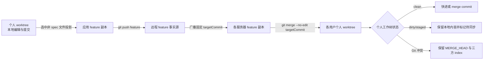

# 应用工作区分支模型与测试

本文是公共 Agent、应用工作空间和应用 Agent 三个区域的分支、权限、发布影响与测试数据事实源。OpenCode 保持原生配置加载，平台只编排 Git worktree、固定提交同步和原生 `/global/dispose`，不修改 OpenCode 源码。

## 1. 分支模型

### 1.1 公共 Agent/Skill

| 对象 | 分支/目录 | 用途 | 是否直接编辑 |
| --- | --- | --- | --- |
| 公共远程分支 | 配置的公共分支，通常为 `main` | 公共配置发布事实源 | 否 |
| 管理员公共个人 worktree | 稳定分支 `public-{userId}` | `SUPER_ADMIN` 编辑、暂存、提交和处理远端合并冲突 | 是，仅本人 |
| 每服务器公共运行副本 | `OPENCODE_PUBLIC_CONFIG_DIR` 对应共享仓库 | 由 OpenCode 通过 `OPENCODE_CONFIG_DIR` 原生加载 | 否，发布程序同步 |

公共配置不按应用或版本拆分。保存和本地提交只改变当前管理员的公共个人 worktree；推送成功后，持久化 rollout 才把固定公共提交同步到每台服务器的共享运行副本，并在旧任务空闲后对受影响进程调用原生 `/global/dispose`。

### 1.2 应用工作空间与应用 Agent

应用普通文件和 `.opencode` 使用同一个人分支，不存在“应用 Agent 独立 worktree”或运行时覆盖合并层。

| 对象 | 分支/目录 | 用途 | 是否直接编辑 |
| --- | --- | --- | --- |
| 应用远程 feature | 标准库为 `feature_testagent_{version}`；非标准库为创建版本时所选分支 | 该应用版本的共享事实源 | 否 |
| 每服务器 feature 副本 | 同一 feature 的本地副本 | 发布投影目标、多服务器固定提交同步源；对所有角色只读 | 否 |
| 用户个人 worktree | `{featureBranch}_{userId}_{workspaceName}` | 本人的普通文件、`docs/**`、`spec/**` 和 `.opencode/**` 编辑/调试分支 | 是，仅 owner |
| 应用 Agent Diff 作用域 | 个人 worktree 中 `.opencode/opencode.jsonc`、`.opencode/agents/**`、`.opencode/skills/**` | 只隔离展示、权限、暂存和发布路径 | 不是独立分支 |



反向同步固定使用版本记录的 `targetCommitHash`，不在执行时重新解析可移动分支名。个人 worktree clean 时立即合并；任意 dirty、staged 或 untracked 内容存在时不 stash、不 reset、不覆盖，Diff 返回待同步状态；真实冲突保留 Git 原生 merge 状态，在三方编辑器解决全部冲突后点击“完成合并”提交完整 merge index。

## 2. 角色权限

托管应用工作区始终要求用户是启用应用的有效成员，`SUPER_ADMIN` 不绕过应用成员校验。

| 能力 | 普通成员 `USER` | 应用负责人 `APP_ADMIN` | 超级管理员 `SUPER_ADMIN` |
| --- | --- | --- | --- |
| 读取应用 feature 副本 | 允许，只读 | 允许，只读 | 允许，只读，且需为应用成员 |
| 本人个人 worktree 普通文件读写、暂存、回退、提交 | 允许 | 允许 | 允许，且需为应用成员 |
| 发布个人 HEAD 中非 `spec/**` 普通文件到 feature | 允许 | 允许 | 允许，且需为应用成员 |
| 本地提交 `spec/**` | 允许 | 允许 | 允许 |
| 发布 `spec/**` | 禁止 | 禁止 | 禁止 |
| 读取应用 `.opencode/**` | 允许 | 允许 | 允许，且需为应用成员 |
| 写入、暂存、提交、发布应用 Agent/Skill/JSONC | 禁止 | 允许 | 允许，且需为应用成员 |
| 读取公共 Agent/Skill | 允许，读取共享运行副本 | 允许，读取共享运行副本 | 允许 |
| 创建/写入/提交/推送公共个人 worktree | 禁止 | 禁止 | 允许，仅本人的 `public-{userId}` |

## 3. 保存、提交和推送后的影响

| 区域与动作 | Git/磁盘影响 | 别人的效果 | OpenCode 运行态影响 |
| --- | --- | --- | --- |
| 个人 worktree 普通文件保存 | 只写本人工作树，进入 Diff | 无 | 无 dispose |
| 个人 worktree 普通文件本地提交 | 只更新本人个人分支；若此前有待同步 feature，提交后立即重试固定提交 merge | 无远程变化 | 无 dispose |
| 个人 worktree `docs/**` 提交并推送 | 先提交本人 HEAD，再把选中非 spec 路径投影到 feature，提交并 push；随后各服务器把固定 feature commit 合并到相关个人 worktree | clean worktree 自动更新；dirty worktree 显示待同步；冲突保留在 Diff。已经打开的浏览器树/标签没有新增 SSE，按现有刷新或重新进入工作区重读磁盘 | 无 dispose |
| 个人 worktree `spec/**` 提交 | 只进入本人个人分支 | 无 | 无 dispose，任何角色都不能推送 |
| 应用 Agent/Skill/JSONC 保存 | 写入本人个人 worktree，并出现在“应用 Agent”Diff；`agents/**/*.md`、`skills/**/SKILL.md`、`opencode.jsonc` 保存后在当前任务空闲时只 dispose 本人实例，供发布前调试；rules/templates 只保存 | 无 | 只热加载当前用户，不是全局发布 |
| 应用 Agent/Skill/JSONC 本地提交 | 只更新本人个人分支 | 无 | 不新增全局影响；保存时的本人调试热加载仍有效 |
| 应用 Agent/Skill/JSONC 提交并推送 | 复用普通发布投影进入 feature；各服务器以同一个固定 commit 反向合并完整 feature 更新 | 所有相关个人 worktree 必须先包含目标 commit；dirty/冲突保持待处理，持久化 rollout 每 5 秒补偿，不覆盖个人内容 | 个人 worktree 收敛后进入应用级全局 rollout，等待旧任务空闲并对目标用户进程调用原生 `/global/dispose` |
| 公共 Agent/Skill 保存 | 只写当前超管公共个人 worktree，并进入公共 Diff | 无 | 不 dispose；公共配置以推送为发布边界 |
| 公共 Agent/Skill 本地提交 | 只更新 `public-{userId}` | 无 | 无 dispose |
| 公共 Agent/Skill 提交并推送 | 先合并远端公共分支并推送，再把固定提交同步到所有服务器公共运行副本 | 所有用户下一次实例 bootstrap 读取新公共配置 | 全局 rollout 等待旧任务空闲并调用原生 `/global/dispose` |

应用资产引用本身仍由资产库 generation/副本程序维护；`opencode.jsonc` 只记录引用关系。保存引用 JSONC 只热加载本人；只有管理员明确把该 JSONC 提交并推送后，引用配置才随 feature 固定提交合并到其他个人 worktree，资产文件不会复制进应用仓库，也不会把资产库分支合并进 feature。

## 4. 代码与 Git 操作

| 阶段 | 代码入口 | 关键操作 |
| --- | --- | --- |
| 个人本地提交 | `ManagedWorkspaceApplicationService.commitPersonalWorkspace` | 隔离 index，`git add -- <files>`，提交个人分支；不 push |
| 个人发布 | `ManagedWorkspaceApplicationService.publishPersonalWorkspace` | feature 副本 `fetch` + `pull --ff-only`；从个人 `HEAD` 定点 checkout/删除选中路径；feature `commit` + `git push origin {featureBranch}` |
| 版本广播 | `publishVersionSync` / `handleVersionSyncEvent` | payload 只携带 `targetCommitHash` 等标识；远端服务器先把 feature 副本 reset 到固定提交 |
| feature 反向同步 | `synchronizeFeatureCommitToPersonalWorktrees` → `mergeFeatureCommitIntoPersonalWorkspace` | 先用 `git merge-base --is-ancestor <target> HEAD` 判定；clean 时调用 `GitWorkspaceService.mergeCommit` 执行 `git merge --no-edit <targetCommit>` |
| dirty 补偿 | `retryLatestFeatureMerge` | 本地提交、回退、显式进入 default 个人工作区后重试；副本补偿和版本广播也会重试 |
| 冲突展示 | `getWorkspaceGitDiff` / `GitChangesPanel.vue` | Diff 返回 `mergeInProgress`、`applicationUpdatePending`、`applicationTargetCommit`；Git unmerged stage 用既有三方编辑器读取 |
| 冲突完成 | `completeWorkspaceGitMerge` | 冲突全部解决后提交完整 merge index；若包含 `.opencode/**`，入口要求 `APP_ADMIN` |
| 应用配置发布热加载 | `PublicAgentConfigRolloutCoordinator` 的 APPLICATION scope | 每服务器个人 worktree 全部包含固定提交后登记目标用户，等待空闲并调用现有 OpenCode client 的 `/global/dispose` |
| 保存时本人热加载 | `AgentWorkbench.refreshRuntimeCatalogAfterAgentConfigSave` | 仅 `scope=WORKSPACE` 的目录定义调用当前用户 `disposeGlobal()`；`scope=PUBLIC` 直接返回 |

兼容接口 `POST /personal-workspaces/{id}/sync-from-application` 不再逐文件复制，也不接受 `force` 覆盖个人内容；它校验请求后同样尝试合并整个固定 feature commit。

## 5. 可重复测试数据

执行：

```bash
tools/create-workspace-branch-model-test-data.sh
```

脚本在被 Git 忽略的 `.tmp/workspace-branch-model.*` 下创建独立真实仓库，并输出目录。每次运行包含：

- `application-repository`：已提交 docs 与应用 Agent 的 feature 事实源。
- `personal-clean`：有个人提交且已成功生成真实 merge commit。
- `personal-dirty`：保留未提交文件，模拟 `applicationUpdatePending=true`。
- `personal-conflict`：保留 `MERGE_HEAD`、三方 index 和 `docs/shared.md` 冲突。
- `public-personal-admin`：保留未推送公共 Agent 修改。
- `README.md`：记录本次随机目录、目标 commit 和可复制的核对命令。

脚本末尾会自动断言 clean worktree 已包含目标提交、dirty worktree 仍有修改、conflict worktree 存在 `MERGE_HEAD` 和 unmerged 路径、公共个人 worktree 存在未推送修改。

## 6. 核心测试案例

| 案例 | 操作 | 预期 |
| --- | --- | --- |
| A 推送 docs，B clean | A 从个人 HEAD 推送 `docs/publish.md` | feature push 成功；B 所在服务器合并固定 commit；B 分支包含 target；无 dispose |
| A 推送 docs，B dirty | B 先保存未提交文件，A 再推送 | 不 stash/reset B；Diff 显示 feature 待同步；B 提交或回退后自动重试 |
| A 推送 docs，B 同文件已有提交 | A、B 修改同一文件，A 先推送 | B 保留 Git merge 冲突和 `MERGE_HEAD`；三方解决后“完成合并”生成 merge commit |
| A 推送应用 Agent，B clean | APP_ADMIN 推送 `.opencode/agents/review.md` | 与 docs 相同的完整 feature merge；全部相关 worktree 收敛后才进入全局 dispose |
| A 推送应用 Agent，B dirty/冲突 | B 有任意 dirty 或真实冲突 | 不覆盖 B；应用 rollout 保持 retry，B 处理后补偿推进 dispose |
| 应用 Agent 保存调试 | APP_ADMIN 保存 `agents/**/*.md` 或 `skills/**/SKILL.md` | 只 dispose 当前用户；不广播、不影响别人 |
| 公共 Agent 保存 | SUPER_ADMIN 保存公共 Agent | 只产生公共个人 Diff，不 dispose |
| 公共 Agent 推送 | SUPER_ADMIN 提交并推送 | 各服务器公共运行副本同步，旧任务空闲后全局 dispose |
| 普通成员绕过权限写 `.opencode` | USER 直接调用 stage/commit/publish | 后端返回 `FORBIDDEN`，不执行 Git 写操作 |
| 任意角色发布 `spec/**` | 直接调用 publish 并传规范路径或别名 | 后端返回 `FORBIDDEN`；个人本地提交仍保留 |

自动化覆盖入口：

```bash
cd backend
mvn -pl test-agent-common,test-agent-workspace-management,test-agent-api -am \
  -Dtest=GitWorkspaceServiceRealGitTest,ManagedWorkspaceApplicationServiceTest,ManagedWorkspaceControllerTest \
  -Dsurefire.failIfNoSpecifiedTests=false test

cd ../frontend
corepack pnpm vitest run \
  apps/agent-web/tests/agent-file-load.test.ts \
  apps/agent-web/tests/git-changes-panel.test.ts
corepack pnpm --filter @test-agent/agent-web typecheck
```
