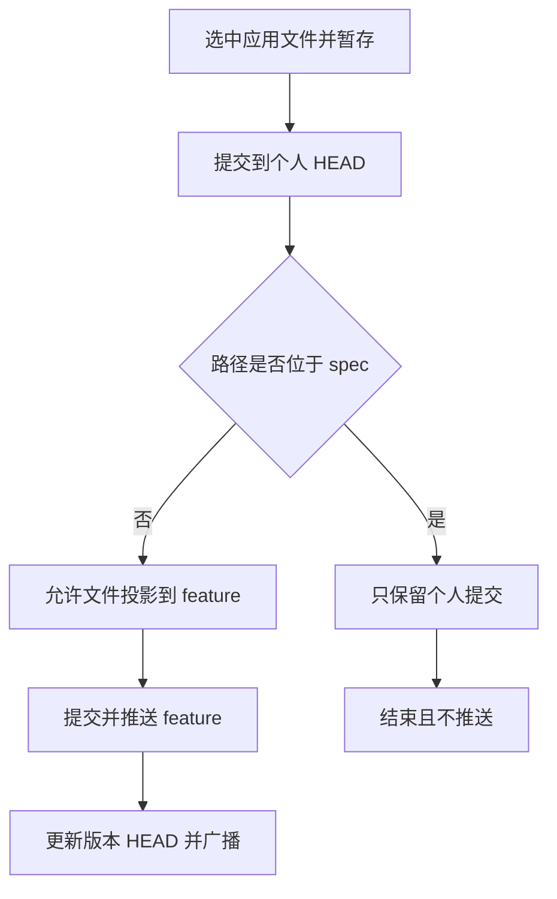

# 1. 测试设计文档

| 条件/动作 | 普通成员 | 应用负责人（APP_ADMIN） | 超级管理员（SUPER_ADMIN） |
| --- | --- | --- | --- |
| 个人 worktree 普通文件读写、暂存、本地提交 | 允许本人操作 | 允许本人操作 | 允许 |
| 应用 feature 工作区普通文件写操作 | 只读，前端不展示写入口 | 只读，前端不展示写入口 | 只读；超管同样只通过个人 HEAD 投影允许发布的非 spec 路径，避免形成第二套直提协议 |
| `docs/**` 从个人 HEAD 投影并推送 feature | 允许 | 允许 | 允许 |
| `spec/**` 从个人 HEAD 投影并推送 feature | 禁止，仅本地提交 | 禁止，仅本地提交 | 禁止，仅本地提交 |
| 应用 `.opencode/agents/**`、`.opencode/skills/**`（含 rules/templates） | 只读 | 允许在应用 feature 工作区操作 | 允许 |
| 公共 Git | 禁止写入 | 禁止写入 | 允许 |
| 应用 Agent/Skill 推送后更新版本 HEAD 并广播 | 不适用 | 必须执行 | 必须执行 |

| 状态 | 触发事件 | 合法迁移 | 非法迁移及预期 |
| --- | --- | --- | --- |
| feature 只读 | 普通成员点击文件、搜索或加入对话 | 保持只读，可继续读取 | 新增、删除、重命名、stage、回退、解决冲突入口不可见且不发请求 |
| 个人 worktree 有未暂存文件 | 暂存选中文件 | 进入已暂存 | 未选择文件时提交按钮禁用 |
| 个人 worktree 已暂存 | 本地提交 | 进入个人 HEAD 已提交 | 无个人 worktree 时普通文件提交不得执行 |
| 个人 HEAD 已提交 | 提交并推送 | 允许路径投影到 feature 并广播 | 任意角色选择 `spec/**` 时只保留本地提交，直接 API 发布被拒绝 |
| 应用配置已暂存 | 应用负责人提交或推送 | feature 配置提交；推送后更新版本 HEAD 并广播 | 普通成员无暂存、提交、推送入口 |

# 2. 测试案例

| 案例名称 | 测试步骤 | 测试数据 | 预期结果 |
| --- | --- | --- | --- |
| 普通成员浏览 feature 只读文件树 | 1. 以普通成员进入应用 feature 文件树；2. 展开 `docs`；3. 单击并双击 `README.md`；4. 检查行操作和网络请求 | `roles=[USER]`；`workspaceId=wrk_feature_readonly_20260715`；`canWrite=false`；固定数据：`frontend/tests/fixtures/application-workspace-restrictions.ts` | 文件和目录可展开、读取；新增、删除、重命名入口不可见；双击不进入重命名；无写请求 |
| 普通成员在个人 worktree 修改普通文件 | 1. 切换默认个人 worktree；2. 修改并保存文件；3. 暂存；4. 输入说明并本地提交 | `personalWorkspaceId=psw_member_default_20260715`；`path=src/payment/PaymentService.ts`；`message=fix: 修复支付校验` | 保存、暂存和本地提交成功；个人 HEAD 更新；未触发 feature push 或广播 |
| 普通成员发布 docs 文件 | 1. 在个人 worktree 提交 `docs` 文件；2. 点击提交并推送 | `path=docs/payment/publish-guide.md`；`branch=feature_testagent_20260715` | 后端从个人 HEAD 投影该文件到 feature，提交并推送；返回 `remotePushed=true`；版本 HEAD 更新并广播 |
| 普通成员混选 docs 与 spec | 1. 同时暂存并提交两个文件；2. 点击提交并推送；3. 检查请求文件集合和提示 | `files=[docs/payment/publish-guide.md,spec/payment/design.md]`；`roles=[USER]` | 两文件都进入个人 HEAD；仅 `docs/payment/publish-guide.md` 进入发布请求；页面提示 1 个 spec 仅本地提交 |
| 普通成员只选择 spec | 1. 暂存 `spec`；2. 检查按钮和目录标记；3. 点击本地“提交”；4. 检查请求 | `path=spec/payment/design.md`；`roles=[USER]` | diff 保留该文件并标记“仅本地”；“提交并推送”禁用；只执行个人 worktree 本地提交；不调用 feature 发布 |
| 普通角色使用 spec 路径别名绕过 | 1. 直接调用发布入口并传别名；2. 检查 Git 是否执行 | `files=[docs/payment/publish-guide.md,.//spec/payment/design.md]`；`roles=[APP_ADMIN]` | 返回 `FORBIDDEN`，details 指出 spec 文件；feature worktree 未 materialize、未 commit、未 push |
| 普通成员查看应用 Agent 配置 | 1. 以普通成员打开应用级 Agent 树和变更页；2. 检查 Agent 行操作；3. 输入提交说明 | `roles=[USER]`；`path=agents/payment-test.md`；`canManageAgentConfig=false` | 可以读取和查看 diff；初始化、创建 worktree、暂存、取消暂存、提交和推送入口不可用；无写请求 |
| 应用负责人无个人 worktree 时提交应用 Skill | 1. 以应用负责人进入应用；2. 在应用 feature 配置中暂存 Skill；3. 输入说明并提交 | `roles=[APP_ADMIN]`；`agentConfigWorkspaceId=wrk_feature_readonly_20260715`；`path=skills/payment-case-design/SKILL.md`；`canWrite=false`；`canManageAgentConfig=true` | 应用配置提交按钮可用并调用 feature 工作区配置提交；不要求个人 worktree；不调用普通文件个人提交 |
| 应用配置始终绑定 feature 工作区 | 1. 当前文件工作区保持个人 worktree；2. 加载应用 Agent diff；3. 提交应用配置；4. 记录两个 workspaceId | `workspaceId=个人运行态 ID`；`agentConfigWorkspaceId=wrk_feature_readonly_20260715` | 普通文件 diff 使用个人 workspaceId；应用 Agent diff、stage、commit、publish 全部使用 feature workspaceId，不误写个人分支 |
| 应用配置推送后广播 | 1. 应用负责人推送 Agent/Skill；2. 检查 feature HEAD；3. 检查广播事件 | `workspaceId=wrk_feature_readonly_20260715`；`commitHash=commit_agent_config` | 版本和本机副本 HEAD 更新为 `commit_agent_config`；发布 `workspace.version.sync-requested`，reason 为 `AGENT_CONFIG_PUBLISHED` |
| 应用负责人不能写公共 Git | 1. 以应用负责人打开公共级 Agent；2. 检查操作入口；3. 尝试调用公共写接口 | `roles=[APP_ADMIN]`；`path=agents/public-review.md` | 前端无公共写入口；后端返回 `FORBIDDEN`；公共仓库无变化 |
| 超管拥有应用与公共配置写权限 | 1. 以超级管理员进入同一应用；2. 检查 feature 文件、个人 worktree、应用配置和公共配置操作入口 | `roles=[SUPER_ADMIN]`；`workspaceId=wrk_feature_readonly_20260715`；`personalWorkspaceId=psw_member_default_20260715` | feature 发布副本仍无普通文件直写入口；个人 worktree 可写；非 spec 普通路径可发布；应用配置初始化/创建 worktree 可用；公共 Git 操作可用 |
| 超管的 spec 仍仅本地 | 1. 在个人 worktree 暂存 spec；2. 检查按钮和目录标记；3. 点击本地“提交”；4. 直接调用发布 API 验证后端兜底 | `roles=[SUPER_ADMIN]`；`path=spec/payment/design.md`；`message=spec: 超管本地提交设计` | diff 保留该文件并标记“仅本地”；“提交并推送”禁用；本地提交成功且不调用 feature 发布；直接 API 返回 `FORBIDDEN`，feature 未 materialize、未 commit、未 push |
| 只读 feature 冲突不暴露解决入口 | 1. 返回一个 `rawStatus=UU` 的冲突文件；2. 以普通成员打开变更页；3. 点击冲突行 | `roles=[USER]`；`canWrite=false`；`path=src/payment/PaymentService.ts` | 可看到冲突状态；保留本地、保留远程、取消和合并编辑器入口不可用；不调用冲突解决 API |
| 不同权限下提交按钮只统计可写变更 | 1. 同时返回普通文件 staged 和应用 Agent staged；2. 分别用普通成员、应用负责人进入；3. 输入提交说明 | 普通成员：`canWrite=true,canManageAgentConfig=false`；应用负责人：`canWrite=false,canManageAgentConfig=true` | 普通成员仅能提交个人普通文件；应用负责人仅能提交应用 Agent 配置；无权限 staged 项不触发对应 API |
| UI 自动化固定数据回归 | 1. 执行组件测试；2. 执行 Playwright 权限用例；3. 检查失败截图和 trace | `corepack pnpm vitest run apps/agent-web/tests/git-changes-panel.test.ts apps/agent-web/tests/help-center.test.ts packages/file-explorer/tests/DirectoryRows.test.ts`；`corepack pnpm exec playwright test apps/agent-web/tests/workbench.spec.ts --grep "application workspace mutation entries"` | 组件测试验证 diff 中的“仅本地”标记、仅 spec 时禁用远程发布、后端调用及帮助文档口径；浏览器用例验证普通成员隐藏应用配置写入口、超管显示入口；全部通过且无控制台错误 |

# 3. 案例审核结果

| 审核项 | 审核结果 | 说明 |
| --- | --- | --- |
| 需求/设计覆盖 | 补充后通过 | 已覆盖个人 worktree、feature、docs、spec 目录硬规则、应用配置、公共 Git、广播和超管角色权限 |
| 方法分析与案例一致性 | 通过 | 判定表、发布路径和状态迁移均有对应案例 |
| 正常、异常、边界与关键分支 | 补充后通过 | 补充了路径别名绕过、无个人 worktree、只读冲突和混合 staged 分支 |
| 测试数据具体性 | 通过 | 角色、workspaceId、路径、分支、commitHash 与命令均为固定值 |
| 步骤可执行性 | 通过 | 每条案例给出可操作 UI/API 步骤，自动化入口已固定 |
| 预期结果可观察性 | 通过 | 通过 DOM、API 调用、Git push 结果、版本 HEAD 和广播事件观察 |
| 接口七区块完整性 | 通过 | 本文按用户要求对整体工作区规则采用四列表达，接口仅作为流程验证步骤 |

总评：补充后通过。
