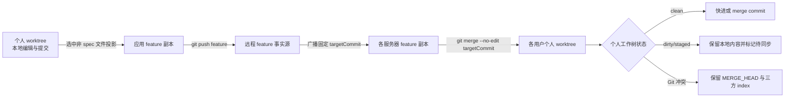

# 应用工作区分支模型与测试

本文是公共 Agent、应用工作空间和应用 Agent 三个区域的分支、权限、发布影响与测试数据事实源。OpenCode 保持原生配置加载，平台只编排 Git worktree、固定提交同步和原生 `/global/dispose`，不修改 OpenCode 源码。

## 1. 分支模型

### 1.1 公共 Agent/Skill

| 对象 | 分支/目录 | 用途 | 是否直接编辑 |
| --- | --- | --- | --- |
| 公共远程分支 | 初始化公共仓库时明确选择的分支 | 公共配置发布事实源 | 否 |
| 管理员公共个人 worktree | 稳定分支 `public-{userId}` | `SUPER_ADMIN` 编辑、暂存、提交和处理远端合并冲突 | 是，仅本人 |
| 每服务器公共运行副本 | `OPENCODE_PUBLIC_CONFIG_DIR` 对应共享仓库 | 公共远程提交在本服务器的运行事实副本 | 否，发布程序同步 |
| 每用户有效公共配置指针 | `{sessionPath}/.testagent-runtime/current-public-config` | `OPENCODE_CONFIG_DIR` 固定指向此软链接；默认链接共享副本，个人保存时临时链接本人的公共 worktree | 否，平台原子切换 |

公共配置不按应用或版本拆分。保存和本地提交只改变当前管理员的公共个人 worktree；其中 Agent 定义、Skill 定义或 JSONC 保存会把当前管理员本人的固定指针切到该 worktree 并只 dispose 本人进程，供推送前调试，不改共享副本。推送成功后，持久化 rollout 才把固定公共提交同步到每台服务器的共享运行副本；各用户旧任务空闲后先把其指针恢复到共享副本，再调用原生 `/global/dispose`。

公共分支以平台初始化时选中的分支和已记录 Git 指针为准，不按远端分支名称自动抢占。比如本地 test 环境当前选择 `master` 时，远端同时存在的 `enterprise` 只是一条候选分支；除非管理员显式切换初始化分支，或先把其提交评审合并进 `master`，否则它不会覆盖当前公共事实源。

### 1.2 应用工作空间与应用 Agent

应用普通文件和 `.opencode` 使用同一个人分支，不存在“应用 Agent 独立 worktree”或运行时覆盖合并层。

| 对象 | 分支/目录 | 用途 | 是否直接编辑 |
| --- | --- | --- | --- |
| 应用远程 feature | 标准库为 `feature_testagent_{version}`；非标准库为创建版本时所选分支 | 该应用版本的共享事实源 | 否 |
| 每服务器 feature 副本 | 同一 feature 的本地副本 | 发布投影目标、多服务器固定提交同步源；对所有角色只读 | 否 |
| 用户个人 worktree | `{featureBranch}_{userId}_{workspaceName}` | 本人的普通文件、`docs/**`、`spec/**` 和 `.opencode/**` 编辑/调试分支 | 是，仅 owner |
| 应用 Agent Diff 作用域 | 个人 worktree 中 `.opencode/opencode.jsonc`、`.opencode/agents/**`、`.opencode/skills/**` | 只隔离展示、权限、暂存和发布路径 | 不是独立分支 |

“应用普通文件”指个人 worktree 中进入 `workspace` Diff 的项目文件，例如根 `README.md`、`docs/**`、`archive/**`、源码、测试、部署脚本和普通业务配置。边界如下：

- `.opencode/**` 不属于普通文件 Diff；其中只有 `.opencode/opencode.jsonc`、`.opencode/agents/**`、`.opencode/skills/**` 进入“应用 Agent”Diff，其余 `.opencode` 文件不进入应用 Agent 提交/发布白名单。
- `spec/**` 会进入普通文件 Diff，允许所有应用成员保存、暂存并提交到本人个人分支，但属于本地资产，任何角色都不能发布到 feature；`./spec/**`、重复分隔符等别名在后端规范化后同样拒绝。
- `.git/**` 元数据、绝对路径和 `../` 越界路径不允许操作；被 Git 忽略的 `node_modules`、构建产物等通常不会进入 Diff。
- 发布只投影用户明确选择、已经进入个人 `HEAD` 且不属于 `spec/**` 的路径；存在未完成 merge、所选文件仍有未提交内容或确认后 feature HEAD 已变化时拒绝发布。个人分支本身始终不 push。



反向同步固定使用版本记录的 `targetCommitHash`，不在执行时重新解析可移动分支名。个人 worktree clean 时立即合并；任意 dirty、staged 或 untracked 内容存在时不 stash、不 reset、不覆盖，Diff 返回待同步状态；真实冲突保留 Git 原生 merge 状态，在三方编辑器解决全部冲突后点击“完成合并”提交完整 merge index。

### 1.3 OpenCode 如何读取并整合配置

平台不解析或复制多层 OpenCode 配置，也不创建“应用 runtime”。每个用户只有一个受管 OpenCode 进程，配置仍由 OpenCode 原生加载：

| 来源 | 实际路径/选择方式 | 生效范围 |
| --- | --- | --- |
| 用户全局 OpenCode 配置 | 运行用户的 `~/.config/opencode` | OpenCode 原生全局层；企业环境不得在这里维护模型或供应商，避免污染公共事实源 |
| 公共配置 | `OPENCODE_CONFIG_DIR={sessionPath}/.testagent-runtime/current-public-config` | 当前用户进程的公共层；软链接默认指向 `OPENCODE_PUBLIC_CONFIG_DIR`，公共个人保存时只对本人切到 `public-{userId}` worktree 的 `opencode/` |
| 应用个人配置 | 本次请求 directory 对应的个人 worktree `.opencode/opencode.jsonc`、`.opencode/agents/**`、`.opencode/skills/**` | OpenCode 按项目目录原生发现并与公共层组合；不存在平台自定义覆盖/复制规则，也不存在独立应用 Agent worktree |
| 应用资产引用 | 应用个人 `.opencode/opencode.jsonc` 的 `references`，路径通过 `OPENCODE_REFERENCES_DIR` 展开 | 只记录和加载引用关系；资产库文件、分支不会复制或合并进应用 Git |

`sessionPath` 是当前统一认证用户的 OpenCode 数据目录，同时作为进程的 `XDG_DATA_HOME`；它不是应用 worktree。平台在其下固定维护 `current-public-config` 软链接，让 manager 的 `configPath` 和 `OPENCODE_CONFIG_DIR` 永远使用同一个入口，只改变软链接目标。当前本地 test 环境的实际关系是：

```text
sessionPath
/Users/kaka/Desktop/intelligent-test-agent/.testagent/agent-opencode/.session/users/DEV_888888888

OPENCODE_CONFIG_DIR / manager configPath
/Users/kaka/Desktop/intelligent-test-agent/.testagent/agent-opencode/.session/users/DEV_888888888/.testagent-runtime/current-public-config

当前软链接目标（公共共享副本）
/Users/kaka/Desktop/intelligent-test-agent/.testagent/agent-opencode/.config/opencode

公共个人保存后的预览目标示例
/Users/kaka/Desktop/intelligent-test-agent/.testagent/agent-opencode/.configdev/public-usr_test_dev/opencode
```

前两项在同一用户进程整个生命周期内保持不变。启动和公共发布完成后，链接指向共享副本；当前超管保存可热加载的公共个人配置后，只把本人链接原子切到公共个人 worktree。应用个人配置始终由请求 directory 下的 `.opencode` 读取，不修改这条公共链接。

公共个人 worktree 与应用个人 worktree 不是互相覆盖的 Git 分支：前者通过进程固定软链接提供公共配置，后者由请求所在项目目录的 `.opencode` 原生加载。`/global/dispose` 释放的是该用户 OpenCode 进程内已缓存的 workspace Instance；下一次访问某个工作区时，OpenCode 才按上述路径重新 bootstrap。

企业离线包中的自定义 Tool 依赖也不复制进 worktree。既有离线兼容层会在当前有效公共配置目录和应用 `.opencode` 目录的 `node_modules` 下建立包级软链接，统一指向 programs 随包交付的只读 `node_modules`；因此应用个人确实复用同一套依赖，但不是链接公共 Git worktree，也没有额外配置 runtime。本地开发直接使用本机 OpenCode 与已有依赖目录，不要求出现企业包内的这些包级软链接。本轮配置指针与 dispose 实现没有修改 OpenCode 源码或该离线兼容层。

## 2. 角色权限

托管应用工作区始终要求用户是启用应用的有效成员，`SUPER_ADMIN` 不绕过应用成员校验。

| 能力 | 普通成员 `USER` | 应用负责人 `APP_ADMIN` | 超级管理员 `SUPER_ADMIN` |
| --- | --- | --- | --- |
| 读取应用 feature 副本 | 允许，只读 | 允许，只读 | 允许，只读，且需为应用成员 |
| 本人个人 worktree 普通文件读写、暂存、回退、提交 | 允许 | 允许 | 允许，且需为应用成员 |
| 发布个人 HEAD 中非 `spec/**` 普通文件到 feature | 允许 | 允许 | 允许，且需为应用成员 |
| 本地提交 `spec/**` | 允许 | 允许 | 允许 |
| 发布 `spec/**` | 禁止 | 禁止 | 禁止 |
| 读取应用 `.opencode/**` | 允许 | 允许 | 允许，且需为应用成员 |
| 写入、暂存、提交、发布应用 Agent/Skill/JSONC | 禁止 | 允许 | 允许，且需为应用成员 |
| 读取公共 Agent/Skill | 允许，读取共享运行副本 | 允许，读取共享运行副本 | 允许 |
| 创建/写入/提交/推送公共个人 worktree | 禁止 | 禁止 | 允许，仅本人的 `public-{userId}` |

## 3. 保存、提交和推送后的影响

### 3.1 什么算“保存”

主编辑器中点击“保存”、macOS 按 `Command+S`、Windows/Linux 按 `Ctrl+S` 都调用同一个 `saveMutation`。只有活动文件存在未保存修改、不是只读或实时预览、并且当前没有另一笔保存进行中时才发送写文件请求；快捷键条件不满足时只阻止浏览器“保存网页”，不会写盘或 dispose。专用资产引用弹窗和 Git 冲突编辑器使用各自的“保存”按钮，不依赖主编辑器快捷键。

运行态热加载以“后端确认文件成功写盘”为起点，而不是以按下快捷键为起点：

- 可热加载目录定义精确为 `opencode.jsonc`、`agents/**/*.md`、`skills/**/SKILL.md`。公共和应用个人作用域规则相同。
- `skills/**/rules/**`、`skills/**/templates/**` 等资源文件只保存并刷新 Diff，不 dispose；它们提交并推送后仍会随对应 Git 发布同步。
- 应用资产引用弹窗保存的是个人 `.opencode/opencode.jsonc`，成功后按 JSONC 规则只热加载当前用户。
- 当前用户有运行中任务时，dispose 延迟到任务空闲；进程尚未初始化或不可用时不为了保存额外启动进程。应用个人 `.opencode` 会在后续首次启动或 workspace bootstrap 时直接读取磁盘最新配置；公共个人预览则不会跨进程启动保留，因为启动固定先把链接恢复到共享副本，超管需在进程 READY 后再次保存可热加载文件，或正式推送公共配置。
- 文件已落盘但 dispose 失败时，界面明确提示“文件已保存，运行态刷新失败”，不会把磁盘写入误报为失败。

### 3.2 影响矩阵

| 区域与动作 | Git/磁盘影响 | 别人的效果 | OpenCode 运行态影响 |
| --- | --- | --- | --- |
| 个人 worktree 普通文件保存 | 只写本人工作树，进入 Diff | 无 | 无 dispose |
| 个人 worktree 普通文件本地提交 | 只更新本人个人分支；若此前有待同步 feature，提交后立即重试固定提交 merge | 无远程变化 | 无 dispose |
| 个人 worktree 非 `spec/**` 普通文件提交并推送 | 先提交本人 HEAD，再把选中的非 spec 路径投影到 feature，提交并 push；随后各服务器把固定 feature commit 合并到相关个人 worktree。适用于 `docs/**`、`archive/**`、README、源码、测试和部署文件等 | clean worktree 自动更新；dirty worktree 显示待同步；冲突保留在 Diff。已经打开的浏览器树/标签没有新增 SSE，按现有刷新或重新进入工作区重读磁盘 | 无 dispose |
| 个人 worktree `spec/**` 提交 | 只进入本人个人分支 | 无 | 无 dispose，任何角色都不能推送 |
| 应用 Agent/Skill/JSONC 保存 | 写入本人个人 worktree，并出现在“应用 Agent”Diff；`agents/**/*.md`、`skills/**/SKILL.md`、`opencode.jsonc` 保存后在当前任务空闲时直接调用本人进程 `/global/dispose`，供发布前调试；rules/templates 只保存 | 无 | 只热加载当前用户，不是全局发布；不切换公共配置指针 |
| 应用 Agent/Skill/JSONC 本地提交 | 只更新本人个人分支 | 无 | 不新增全局影响；保存时的本人调试热加载仍有效 |
| 应用 Agent/Skill/JSONC 提交并推送 | 复用普通发布投影进入 feature；各服务器以同一个固定 commit 反向合并完整 feature 更新 | 所有相关个人 worktree 必须先包含目标 commit；dirty/冲突保持待处理，持久化 rollout 每 5 秒补偿，不覆盖个人内容 | 个人 worktree 收敛后进入应用级全局 rollout，等待旧任务空闲并对目标用户进程调用原生 `/global/dispose` |
| 公共 Agent/Skill/JSONC 保存 | 只写当前超管公共个人 worktree并进入公共 Diff；目录定义保存后把本人的有效公共配置软链接切到该 worktree | 无 | 当前任务空闲时只 dispose 当前超管本人，下一次 bootstrap 读取个人 worktree；共享副本和别人不变 |
| 公共 Agent/Skill/JSONC 本地提交 | 只更新 `public-{userId}` | 无 | 不新增 dispose；本人保存后的预览链接继续有效 |
| 公共 Agent/Skill/JSONC 提交并推送 | 先合并远端公共分支并推送，再把固定提交同步到所有服务器公共运行副本 | 所有用户最终读取同一共享固定提交 | 全局 rollout 逐用户等待旧任务空闲，先把有效指针恢复到共享副本，再调用原生 `/global/dispose` |

应用资产引用本身仍由资产库 generation/副本程序维护；`opencode.jsonc` 只记录引用关系。保存引用 JSONC 只热加载本人；只有管理员明确把该 JSONC 提交并推送后，引用配置才随 feature 固定提交合并到其他个人 worktree，资产文件不会复制进应用仓库，也不会把资产库分支合并进 feature。

表中的“全局 rollout”仍是逐用户进程执行，不存在所有用户共用的 OpenCode 进程。只对已有运行进程登记 dispose 目标；没有运行进程的用户在下次初始化时直接加载最新公共配置和个人 worktree 配置。

## 4. 代码与 Git 操作

| 阶段 | 代码入口 | 关键操作 |
| --- | --- | --- |
| 个人本地提交 | `ManagedWorkspaceApplicationService.commitPersonalWorkspace` | 隔离 index，`git add -- <files>`，提交个人分支；不 push |
| 个人发布 | `ManagedWorkspaceApplicationService.publishPersonalWorkspace` | feature 副本 `fetch` + `pull --ff-only`；从个人 `HEAD` 定点 checkout/删除选中路径；feature `commit` + `git push origin {featureBranch}` |
| 版本广播 | `publishVersionSync` / `handleVersionSyncEvent` | payload 只携带 `targetCommitHash` 等标识；远端服务器先把 feature 副本 reset 到固定提交 |
| feature 反向同步 | `synchronizeFeatureCommitToPersonalWorktrees` → `mergeFeatureCommitIntoPersonalWorkspace` | 先用 `git merge-base --is-ancestor <target> HEAD` 判定；clean 时调用 `GitWorkspaceService.mergeCommit` 执行 `git merge --no-edit <targetCommit>` |
| dirty 补偿 | `retryLatestFeatureMerge` | 本地提交、回退、显式进入 default 个人工作区后重试；副本补偿和版本广播也会重试 |
| 冲突展示 | `getWorkspaceGitDiff` / `GitChangesPanel.vue` | Diff 返回 `mergeInProgress`、`applicationUpdatePending`、`applicationTargetCommit`；Git unmerged stage 用既有三方编辑器读取 |
| 冲突完成 | `completeWorkspaceGitMerge` | 冲突全部解决后提交完整 merge index；若包含 `.opencode/**`，入口要求 `APP_ADMIN` |
| 应用配置发布热加载 | `PublicAgentConfigRolloutCoordinator` 的 APPLICATION scope | 每服务器个人 worktree 全部包含固定提交后登记目标用户，等待空闲并调用现有 OpenCode client 的 `/global/dispose` |
| 公共保存时本人热加载 | `AgentWorkbench.refreshRuntimeCatalogAfterAgentConfigSave` → `POST /agent-config/public/runtime-reload` → `PersonalAgentConfigRuntimeReloadService` | Controller 把同步等待 dispose 的本地调用或跨服务器转发调度到 `boundedElastic`，避免在 WebFlux 事件线程调用 `block()`；随后校验 worktree owner/服务器，原子切换 `{sessionPath}/.testagent-runtime/current-public-config` 到本人公共 worktree，再只调用本人进程 `/global/dispose` |
| 应用保存时本人热加载 | `AgentWorkbench.refreshRuntimeCatalogAfterAgentConfigSave` | `scope=WORKSPACE` 直接调用当前用户 `disposeGlobal()`；OpenCode 下一次按请求 directory 重读该个人 worktree `.opencode` |
| 公共发布热加载 | `PublicAgentConfigRolloutService` 的 PUBLIC scope | 各服务器共享 Git 副本固定提交同步后，逐进程等待全部 Session 空闲，恢复共享配置链接并调用 `/global/dispose`；升级前直接读取共享路径的旧进程兼容只 dispose |

兼容接口 `POST /personal-workspaces/{id}/sync-from-application` 不再逐文件复制，也不接受 `force` 覆盖个人内容；它校验请求后同样尝试合并整个固定 feature commit。

## 5. 可重复测试数据

### 5.1 隔离 Git 仓库

直接执行：

```bash
tools/create-workspace-branch-model-test-data.sh
```

脚本在被 Git 忽略的 `.tmp/workspace-branch-model.*` 下创建独立真实仓库，并在最后输出 fixture 绝对路径。两个 `origin` 都是 fixture 内的本地 bare remote，不会连接或推送 Gitee：

| 数据 | 状态与用途 |
| --- | --- |
| `application-remote.git` | 应用本地远程，feature 已存在一次真实 push，供核验远程提交 |
| `application-repository` | 应用 feature 副本，模拟平台的发布投影目标 |
| `personal-publish-ready` | 未提交 docs、archive、spec、Agent、Skill 和 rules；用于重复执行个人提交与选择性发布 |
| `personal-clean` | 有个人提交，已真实 merge 已推送的 feature target commit |
| `personal-dirty` | 保留 untracked 文件，模拟 `applicationUpdatePending=true` |
| `personal-conflict` | 保留 `MERGE_HEAD`、三方 index 和 `docs/shared.md` 冲突 |
| `public-config-remote.git` | 公共配置本地远程，main 已存在一次真实 push |
| `public-personal-admin` | 未提交公共 Agent、Skill 和 rules，用于公共个人提交/推送 |
| `README.md` | 记录随机路径、commit id、初始断言和可直接复制的安全 commit/push 命令 |

脚本退出前会自动断言两个本地远程 ref、clean、dirty、conflict、发布就绪和公共个人数据状态；任何断言失败都不会把该目录报告为可用 fixture。

### 5.2 当前平台个人本地热加载数据

需要在已经存在的应用个人 worktree 与公共个人 worktree 中造数时，同时传入两个绝对路径：

```bash
TEST_APP_PERSONAL_WORKSPACE=/absolute/application/worktree/F-COSS/workspace \
TEST_PUBLIC_PERSONAL_WORKTREE=/absolute/public-personal-worktree \
tools/create-workspace-branch-model-test-data.sh
```

该模式在创建隔离 fixture 的同时，只向指定的两个真实个人 worktree 新增以下未提交文件；同名文件已经存在时打印 `SKIP` 并保持原内容，脚本不提交、不切分支，也绝不 push 真实远程：

| 区域 | 测试文件 | 验证目标 |
| --- | --- | --- |
| 应用普通文件 | `docs/test-data/publish-normal-{tag}.md`、`archive/test-data/publish-archive-{tag}.md` | 允许个人提交和发布 |
| 应用本地资产 | `spec/test-data/local-only-{tag}.md` | 允许个人提交，发布必须拒绝 |
| 应用 Agent | `.opencode/agents/personal-hot-reload-{tag}.md` | 保存后只 dispose 当前用户 |
| 应用 Skill | `.opencode/skills/personal-hot-reload-{tag}/SKILL.md` | 保存后只 dispose 当前用户 |
| 应用 Skill 资源 | `.opencode/skills/personal-hot-reload-{tag}/rules/no-dispose.md` | 保存进入 Diff，但不 dispose |
| 公共个人 Agent | `opencode/agents/public-personal-hot-reload-{tag}.md` | 保存后切本人公共指针并只 dispose 本人 |
| 公共个人 Skill | `opencode/skills/public-personal-hot-reload-{tag}/SKILL.md` | 保存后切本人公共指针并只 dispose 本人 |
| 公共 Skill 资源 | `opencode/skills/public-personal-hot-reload-{tag}/rules/no-dispose.md` | 保存进入 Diff，但不 dispose |

`tag` 默认是 `20260719`，需要并行造数时可用 `WORKSPACE_TEST_DATA_TAG` 指定唯一值。真实个人 worktree 可能已经有用户改动，测试时必须只选择上述唯一测试路径进行暂存、提交或回退，不能批量处理其他 Diff。

## 6. 测试设计文档

### 6.1 测试目标

验证三个关键闭环：个人修改不会提前影响别人；普通文件与 OpenCode 配置使用同一应用个人分支完成提交/发布；只有可热加载的 Agent、Skill 定义或 JSONC 保存才 dispose 本人，正式推送后才进入全局 rollout。

### 6.2 场景覆盖

| 维度 | 覆盖内容 | 关键观测点 |
| --- | --- | --- |
| Git 提交/推送 | docs、archive、spec、应用 Agent/Skill、公共 Agent/Skill | 个人 HEAD、远程 feature/main ref、远程树中路径是否存在 |
| 反向同步 | clean、dirty、同文件冲突 | target commit 祖先关系、待同步状态、`MERGE_HEAD` 与 unmerged index |
| 个人热加载 | 应用 Agent、应用 Skill、公共 Agent、公共 Skill | 保存前先加载 R1；保存 R2 后同一进程读到 R2；其他用户/共享副本不变 |
| 不应热加载 | 普通文件、`skills/**/rules/**`、`skills/**/templates/**` | 文件写盘并进入 Diff，但无 dispose 请求 |
| Diff 分类 | `.opencode/opencode.jsonc`、agents、skills | 三者都出现在“应用 Agent”或公共 Agent Diff，不混入普通工作区 Diff |
| 权限与边界 | USER 写应用配置、非成员访问、任意角色发布 spec | 后端拒绝且 Git ref、工作树不发生越权变化 |
| rollout | 应用配置推送、公共配置推送 | 固定 commit 同步完成后，逐用户等待任务空闲并 dispose；无运行进程不被额外启动 |

### 6.3 通过判定原则

1. Git 类案例必须同时核对工作树、个人 HEAD 和远程 ref，不能只凭界面 toast 判定。
2. 热加载案例必须先让同一 OpenCode 进程加载 R1，再保存为 R2；仅在保存后第一次打开文件不能证明发生过 dispose。
3. “只影响本人”至少用远程 feature 未出现测试路径来证明；具备第二账号时，还应在 B 的个人 worktree 查询一次目录级 Agent/Skill 清单。
4. 真实平台发布只允许使用专用测试远程/分支。没有专用远程时，只执行 7.1 至 7.10 的本地保存和隔离 fixture 案例，不得把测试数据推到生产或团队真实分支。
5. 对运行中任务的案例，保存后允许先进入“等待空闲”；必须等任务结束并看到 R2 才算通过，立即未变化不直接判失败。

## 7. 测试案例

### 7.1 Git 提交、推送与反向同步

| 案例 | 测试步骤 | 测试数据 | 预期结果 |
| --- | --- | --- | --- |
| GIT-01 生成隔离数据 | 1. 在仓库根目录执行 `tools/create-workspace-branch-model-test-data.sh`。<br>2. 记录最后输出的 `FIXTURE_DIR`。<br>3. 打开 `${FIXTURE_DIR}/README.md` 并执行“初始状态核对”命令。 | 默认 tag `20260719`；fixture 内两个 bare remote。 | 脚本退出码为 0；所有核对命令成功；应用远程 feature 指向 README 中的 target commit；公共远程 main 指向公共基线提交。 |
| GIT-02 核对已发生的真实 push | 1. 执行 `git --git-dir=${FIXTURE_DIR}/application-remote.git log --oneline --all`。<br>2. 执行 `git --git-dir=${FIXTURE_DIR}/application-remote.git show feature_testagent_20260719:docs/published-by-a.md`。<br>3. 对公共远程 main 执行同类 `log`。 | `docs/published-by-a.md` 内容为 `published by user A`；应用 Agent description 为“已发布 R2”。 | bare remote 中可直接读取已推送提交和文件，证明不是只在本地工作树 commit；命令全程不访问真实网络。 |
| GIT-03 个人提交并选择性发布 | 1. 复制 fixture README 的“安全执行个人提交与应用 feature 推送”命令。<br>2. 先在 `personal-publish-ready` 提交全部测试数据。<br>3. 只把 docs、archive、`.opencode` 投影到 feature 并 push。<br>4. 从 bare remote 读取 docs；用 `cat-file -e` 反查 spec。<br>5. 执行 `git --git-dir=application-remote.git show-ref --verify refs/heads/feature_testagent_20260719_usr_publish_default`。 | `publish-normal-20260719.md`、`publish-archive-20260719.md`、`local-only-20260719.md`、Agent、Skill、rules。 | 个人 HEAD 包含全部路径；远程 feature 包含 docs、archive、Agent、Skill 和 rules；远程 feature 不含 spec；最后一步返回非 0，证明个人分支本身没有被 push。 |
| GIT-04 clean 个人 worktree 反向同步 | 1. 取 README 中 target commit。<br>2. 执行 `git -C personal-clean merge-base --is-ancestor <target> HEAD`。<br>3. 执行 `git -C personal-clean log --merges --oneline -1`。<br>4. 读取 `docs/published-by-a.md`。 | `personal-clean` 在基线后已有一笔个人提交。 | 第 2 步退出码 0；存在 merge commit；个人原提交仍在历史中；已发布 docs 可读。 |
| GIT-05 dirty 时不覆盖 | 1. 执行 `git -C personal-dirty status --short`。<br>2. 记录 `docs/local-draft.md` 内容和 HEAD。<br>3. 尝试平台同步时应只登记待同步；fixture 可用记录值与 target 比较。<br>4. 再核对文件内容和 HEAD。 | `personal-dirty/docs/local-draft.md` 为 untracked。 | dirty 文件和 HEAD 均不变化，没有 stash/reset/覆盖；平台集成场景中 Diff 显示目标 commit 待同步。 |
| GIT-06 同文件真实冲突 | 1. 执行 `git -C personal-conflict rev-parse MERGE_HEAD`。<br>2. 执行 `git -C personal-conflict diff --name-only --diff-filter=U`。<br>3. 执行 `git -C personal-conflict ls-files -u docs/shared.md`。<br>4. 在三方编辑器解决并点击“完成合并”。 | feature 与个人分支都修改 `docs/shared.md`。 | 合并完成前存在 `MERGE_HEAD`、冲突路径和 stage 1/2/3；完成后 unmerged index 清空并生成完整 merge commit，双方其他提交不丢失。 |
| GIT-07 公共个人提交并安全推送 | 1. 复制 fixture README 的“安全执行公共提交与推送”命令。<br>2. 在 `public-personal-admin` 提交 Agent、Skill、rules。<br>3. push `HEAD:main` 到 fixture bare remote。<br>4. 从 bare remote 读取公共 Agent。 | `public-personal-hot-reload-20260719` 三类文件。 | 公共远程 main 前进到个人提交；Agent、Skill、rules 均存在；push 目标仅为 fixture 本地路径。 |

### 7.2 当前用户个人本地热加载

| 案例 | 测试步骤 | 测试数据 | 预期结果 |
| --- | --- | --- | --- |
| HOT-01 应用个人 Agent 保存 | 1. 用当前应用个人 worktree 的 `directory` 请求 OpenCode `/agent`，确认 description 为 R1，使当前 Instance 已缓存。<br>2. 在主编辑器打开 `.opencode/agents/personal-hot-reload-20260719.md`，把 description 的 R1 改成 R2。<br>3. 按 macOS `Command+S` 或 Windows/Linux `Ctrl+S`。<br>4. 等当前任务空闲后，再对同一 `directory` 请求 `/agent`。<br>5. 打开“应用 Agent”Diff。 | Agent name `personal-hot-reload-20260719`。 | 文件写盘且只出现在应用 Agent Diff；同一进程第二次返回 R2，证明保存触发本人 dispose 后重新 bootstrap；公共有效配置软链接不变化；远程 feature 不出现该路径。 |
| HOT-02 应用个人 Skill 保存 | 1. 先对同一 `directory` 请求 OpenCode `/skill` 或在可用 Skill 清单确认 R1。<br>2. 打开对应 `SKILL.md`，把 description 和 metadata marker 的 R1 改成 R2。<br>3. 按 Command/Ctrl+S 并等待任务空闲。<br>4. 再查 `/skill` 或 Skill 清单。 | Skill name `personal-hot-reload-20260719`。 | 同一用户读取到 R2；文件进入应用 Agent Diff；只 dispose 当前用户，无 feature push、无其他用户同步。 |
| HOT-03 应用 `opencode.jsonc` 保存与 Diff 分类 | 1. 在现有个人 `.opencode/opencode.jsonc` 中对一个测试引用的 description 做可逆修改。<br>2. 保存前在浏览器网络面板记录请求。<br>3. 按 Command/Ctrl+S。<br>4. 打开应用 Agent Diff，并在验证后回退该测试改动。 | 只修改测试引用，不改 provider、model 或凭据。 | JSONC 出现在“应用 Agent”Diff，而不是普通工作区 Diff；保存成功后出现本人运行态刷新请求；不提交、不推送时别人不受影响。 |
| HOT-04 rules 保存不 dispose | 1. 打开 `.opencode/skills/personal-hot-reload-20260719/rules/no-dispose.md`。<br>2. 把 marker 的 R1 改为 R2。<br>3. 清空浏览器网络面板后按 Command/Ctrl+S。<br>4. 打开应用 Agent Diff。 | `rules/no-dispose.md`。 | 文件写盘并进入应用 Agent Diff；没有 `/global/dispose` 或 workspace runtime reload 请求；后续选择 Agent/Skill 一起发布时该资源仍随 feature 同步。 |
| HOT-05 公共个人 Agent 保存 | 1. 以 `SUPER_ADMIN` 进入自己的公共 worktree。<br>2. 先在当前用户 OpenCode `/agent` 清单确认共享态不含该测试 Agent，或确认 R1。<br>3. 把公共个人 Agent description 的 R1 改成 R2 并 Command/Ctrl+S。<br>4. 在网络面板确认 `POST /agent-config/public/runtime-reload` 返回 HTTP 200 且 `data.reloaded=true`。<br>5. 等任务空闲后再次查 `/agent`，并执行 `readlink {sessionPath}/.testagent-runtime/current-public-config`。<br>6. 在后端日志按本次 traceId 反查。 | `public-personal-hot-reload-20260719.md`。 | 当前超管读到 R2；软链接指向本人的 `public-{userId}/opencode`；共享公共副本和远程分支不变；其他用户不出现该测试 Agent；日志中没有 `block()/blockFirst()/blockLast() are blocking`。 |
| HOT-06 公共个人 Skill 保存 | 1. 先在当前用户 Skill 清单确认 R1。<br>2. 修改公共个人 `SKILL.md` 的 R1 为 R2 并保存。<br>3. 等任务空闲后复查 Skill 清单和公共 Diff。 | Skill name `public-personal-hot-reload-20260719`。 | 本人读取到 R2并进入公共 Diff；只有本人指针/进程变化，没有全局 rollout。 |
| HOT-07 公共 rules 保存不 dispose | 1. 修改公共个人 `rules/no-dispose.md` marker。<br>2. 清空网络面板后保存。<br>3. 复查公共 Diff 和当前公共指针。 | 公共 Skill rules 文件。 | 文件写盘并进入 Diff；不切换指针、不 dispose；如果此前指针已因 Agent/Skill 保存切到个人 worktree，则保持原指向但不发生新的 reload。 |
| HOT-08 运行中任务延迟热加载 | 1. 启动一个持续运行的当前用户 OpenCode 任务。<br>2. 在任务未结束时把应用 Agent R2 改为 R3 并保存。<br>3. 立即查状态，再结束任务。<br>4. 等待补偿执行后重新查询 Agent。 | 应用个人 Agent marker R2→R3。 | 保存先成功，运行态显示等待空闲；任务结束前不强杀、不重启；结束后自动 dispose 并读到 R3。 |

### 7.3 平台权限、正式发布与全局效果

| 案例 | 测试步骤 | 测试数据 | 预期结果 |
| --- | --- | --- | --- |
| INT-01 应用普通文件正式发布 | 1. 在专用测试应用/feature 中，由 A 只选择测试 docs、archive 文件进行个人提交。<br>2. 点击提交并推送。<br>3. 记录响应 target commit 和远程 feature HEAD。<br>4. 用 clean 的 B、dirty 的 C 重新打开 Diff。 | 5.2 的 docs、archive；C 预先留一个 untracked 文件。 | 远程 HEAD 等于 target；B 自动 merge 并读到文件；C 内容不被覆盖且显示待同步；普通文件发布不产生 OpenCode dispose。 |
| INT-02 应用 Agent/Skill 正式发布 | 1. APP_ADMIN 在专用测试 feature 提交并推送 Agent、Skill 和 rules。<br>2. 观察各服务器固定 commit 同步。<br>3. 等相关个人 worktree 收敛与旧任务空闲。<br>4. 分别用 A、B 查询 Agent/Skill 清单。 | 应用 `personal-hot-reload-{tag}` 测试配置。 | feature 和相关个人分支都包含同一 target；随后逐用户 dispose；A、B 都读到发布版本；dirty/冲突用户处理完成前 rollout 保持 retry，不覆盖其文件。 |
| INT-03 公共 Agent/Skill 正式发布 | 1. SUPER_ADMIN 在专用测试公共远程提交并推送。<br>2. 记录公共 target commit。<br>3. 等各服务器共享副本同步和用户任务空闲。<br>4. 查询 A、B 配置并检查 A 的个人预览指针。 | 公共 `public-personal-hot-reload-{tag}` 测试配置。 | 所有共享副本固定到 target；各用户指针恢复共享副本后逐一 dispose；A、B 都读到发布版本；没有运行进程的用户不被额外启动。 |
| INT-04 spec 发布拒绝 | 1. 任意角色先把 `spec/test-data/local-only-{tag}.md` 提交到个人分支。<br>2. 单独选择该路径点击提交并推送。<br>3. 再用 `./spec/...` 或重复分隔符别名调用一次。<br>4. 检查个人 HEAD 和远程 feature。 | `spec/**` 正常路径及规范化别名。 | 本地提交保留；两次发布都返回 `FORBIDDEN`；远程 feature 不含路径且 HEAD 不前进。 |
| INT-05 普通成员写应用配置拒绝 | 1. 用 `USER` 读取应用 Agent。<br>2. 分别调用写入、stage、commit、publish。<br>3. 检查文件、index、HEAD 和远程 ref。 | 应用 `.opencode/agents/**` 测试路径。 | 读取允许；所有写操作返回 `FORBIDDEN`；工作树、index、个人 HEAD 和远程 ref 均不变化。 |

### 7.4 自动化回归入口

```bash
cd backend
mvn -pl test-agent-common,test-agent-workspace-management,test-agent-opencode-runtime,test-agent-api -am \
  -Dtest=GitWorkspaceServiceRealGitTest,ManagedWorkspaceApplicationServiceTest,ManagedWorkspaceControllerTest,PersonalAgentConfigRuntimeReloadServiceTest,AgentConfigControllerTest \
  -Dsurefire.failIfNoSpecifiedTests=false test

cd ../frontend
corepack pnpm vitest run \
  apps/agent-web/tests/agent-file-load.test.ts \
  apps/agent-web/tests/git-changes-panel.test.ts
corepack pnpm --filter @test-agent/agent-web typecheck
```

## 8. 案例审核结果

| 审核维度 | 审核结果 | 修订建议 |
| --- | --- | --- |
| 范围覆盖 | 通过：覆盖应用普通文件、应用配置、公共配置，包含保存、个人提交、正式推送和反向同步。 | 集成环境增加多服务器节点时，复用 INT-02、INT-03 并分别记录每台服务器 target commit。 |
| 角色覆盖 | 通过：覆盖 USER、APP_ADMIN、SUPER_ADMIN 及应用成员边界。 | 如新增角色或资源级权限，补充对应写入、暂存、发布拒绝案例。 |
| 正向/异常/边界 | 通过：包含 clean、dirty、真实冲突、spec 禁止、运行中任务延迟、进程未启动语义。 | 后续若支持自动 stash 或可配置 spec 发布，必须重审 GIT-05、INT-04。 |
| 可观测性 | 通过：每个 Git 案例核对 ref/HEAD/index，每个热加载案例用 R1→R2 同进程复查。 | 平台若增加 rollout 状态 API，应把 target、pending user 和最后一次 dispose 结果作为首选证据。 |
| 数据隔离 | 通过：可执行 push 只指向 `.tmp` 本地 bare remote；真实 worktree 造数默认未提交且不 push。 | 使用真实平台正式发布案例前，执行人必须再次确认远程 URL 和测试 feature。 |
| 回归与清理 | 通过：fixture 可直接删除；真实个人数据按唯一 tag 选择性回退，不处理其他用户 Diff。 | 执行结束在测试记录中保存 fixture README、关键 ref 和热加载前后清单作为证据。 |
