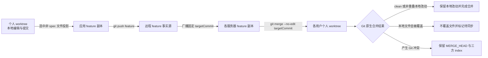

# 应用工作区分支模型与测试

本文是公共 Agent、应用工作空间和应用 Agent 三个区域的分支、权限、发布影响与测试数据事实源。OpenCode 保持原生配置加载，平台只编排 Git worktree、固定提交同步和原生 `/global/dispose`，不修改 OpenCode 源码。

## 1. 分支模型

### 1.1 公共 Agent/Skill

| 对象 | 分支/目录 | 用途 | 是否直接编辑 |
| --- | --- | --- | --- |
| 公共远程分支 | 初始化公共仓库时明确选择的分支 | 公共配置发布事实源 | 否 |
| 管理员公共个人 worktree | 稳定分支 `public-{userId}` | `SUPER_ADMIN` 编辑、暂存、提交和处理远端合并冲突 | 是，仅本人 |
| 每服务器公共运行副本 | `OPENCODE_PUBLIC_CONFIG_DIR` 对应共享仓库 | 公共远程提交在本服务器的运行事实副本 | 否，发布程序同步 |
| 每用户有效公共配置指针 | `{sessionPath}/.testagent-runtime/current-public-config` | `OPENCODE_CONFIG_DIR` 固定指向此软链接；受管启动/重启优先加载同服有效公共个人 worktree，无有效记录时回退共享副本，个人保存时也只切换本人 | 否，平台原子切换 |

公共配置不按应用或版本拆分。保存和本地提交只改变当前管理员的公共个人 worktree；其中 Agent 定义、Skill 定义或 JSONC 保存会把当前管理员本人的固定指针切到该 worktree 并只 dispose 本人进程，供推送前调试，不改共享副本。推送成功后，持久化 rollout 才把固定公共提交同步到每台服务器的共享运行副本；各用户旧任务空闲后先把其指针恢复到共享副本，再调用原生 `/global/dispose`。

公共分支以平台初始化时选中的分支和已记录 Git 指针为准，不按远端分支名称自动抢占。比如本地 test 环境当前选择 `master` 时，远端同时存在的 `enterprise` 只是一条候选分支；除非管理员显式切换初始化分支，或先把其提交评审合并进 `master`，否则它不会覆盖当前公共事实源。

### 1.2 应用工作空间与应用 Agent

应用普通文件和 `.opencode` 使用同一个人分支，不存在“应用 Agent 独立 worktree”或运行时覆盖合并层。

| 对象 | 分支/目录 | 用途 | 是否直接编辑 |
| --- | --- | --- | --- |
| 应用远程 feature | 标准库直接选择已有 `feature_testagent_yyyyMMdd` 分支并从分支名识别版本；非标准库为创建版本时所选分支 | 该应用版本的共享事实源 | 否 |
| 每服务器 feature 副本 | 同一 feature 的本地副本 | 发布投影目标、多服务器固定提交同步源；对所有角色只读 | 否 |
| 用户个人 worktree | `{featureBranch}_{userId}_{workspaceName}` | 本人的普通文件、`docs/**`、`spec/**` 和 `.opencode/**` 编辑/调试分支 | 是，仅 owner |
| 应用 Agent Diff 作用域 | 个人 worktree 中全部 Git 可见 `.opencode/**` 用户配置 | 只隔离展示、权限、暂存和发布路径；不枚举 OpenCode 子目录 | 不是独立分支 |

“应用普通文件”指个人 worktree 中进入 `workspace` Diff 的项目文件，例如根 `README.md`、`docs/**`、`archive/**`、源码、测试、部署脚本和普通业务配置。边界如下：

- `.opencode/**` 不属于普通文件 Diff；其中全部 Git 可见文件进入“应用 Agent”Diff，包括 JSON/JSONC、agent、skill、command、plugin、tool、旧 mode 别名及辅助源码。运行依赖生成的 `node_modules`、package/lockfile 等应由 `.gitignore` 排除；若已被 Git 跟踪或实际出现在 status 中，必须仍可见、可提交或回退。
- `spec/**` 会进入普通文件 Diff，允许所有应用成员保存、暂存并提交到本人个人分支，但属于本地资产，任何角色都不能发布到 feature；`./spec/**`、重复分隔符等别名在后端规范化后同样拒绝。
- `.git/**` 元数据、绝对路径和 `../` 越界路径不允许操作；被 Git 忽略的 `node_modules`、构建产物等通常不会进入 Diff。
- 发布只投影用户明确选择、已经进入个人 `HEAD` 且不属于 `spec/**` 的路径；存在未完成 merge、所选文件仍有未提交内容或确认后 feature HEAD 已变化时拒绝发布。个人分支本身始终不 push。


```mermaid
flowchart LR
  P["个人 worktree\n本地编辑与提交"] -->|"选中非 spec 文件投影"| F["应用 feature 副本"]
  F -->|"git push feature"| R["远程 feature 事实源"]
  R -->|"广播固定 targetCommit"| S["各服务器 feature 副本"]
  S -->|"git merge --no-edit targetCommit"| O["各用户个人 worktree"]
  O --> C{"Git 原生合并结果"}
  C -->|clean 或非重叠本地改动| M["保留本地改动并完成合并"]
  C -->|本地文件会被覆盖| D["不覆盖文件并标记待同步"]
  C -->|产生 Git 冲突| X["保留 MERGE_HEAD 与三方 index"]
```

反向同步固定使用版本记录的 `targetCommitHash`，不在执行时重新解析可移动分支名。个人 worktree 无论是否存在 dirty、staged 或 untracked 内容都会先执行 Git 原生合并：非重叠本地改动原样保留并完成合并；只有 Git 判定文件会被覆盖时才不 stash、不 reset、不覆盖并在 Diff 返回待同步状态。真实冲突保留 Git 原生 merge 状态，在三方编辑器解决全部冲突后点击“完成合并”提交完整 merge index。

#### 对话创建技能的工作区落点

Git worktree 根与运行态工作区根可能不同：`ManagedWorkspaceApplicationService` 以个人仓库根加模板 `directoryPath` 创建工作区，左侧应用 Agent 树由 `AgentConfigApplicationService` 读取该工作区内的 `.opencode`。对话创建应用 Skill 必须以 OpenCode 环境的 `Working directory`（当前会话目录）为根，不能用 `Workspace root folder` 或 `git rev-parse --show-toplevel` 代替；祖先根已有 `.opencode` 也不能改变落点。

公共配置 Git 中 `opencode/skills/skill-creator` 1.2.1 通过 `validate_skill.py <技能目录> --workspace-root <当前会话绝对目录>` 核对应用落点，公共个人配置使用 `--public-config-root <已包含 opencode 的编辑根>`。两参数互斥且向后兼容：旧无参数调用只做结构校验。校验器不证明用户归属或页面可见性，也不自动移动历史错放技能；公共配置需按既有导入、Diff、发布流程更新，平台 JAR 更新不会自动发布这份独立 Git 内容。

| 场景 | 操作与预期 |
| --- | --- |
| 嵌套工作区 | 同一个人仓库 `/repo` 下存在 `F-APP/workspace` 和 `F-APP/workspace-house`。在 house 会话创建技能，必须仅新增 `F-APP/workspace-house/.opencode/skills/<技能名>`；当前工作区尚无 `.opencode` 时仍在此创建。刷新“应用级 → skills”并打开 `SKILL.md` 核对内容。 |
| Git 根或相邻工作区误写 | 用当前 house 工作区作为 `--workspace-root` 校验仓库根或 workspace 下的技能，应返回非零退出码且不移动、不覆盖文件；仅有 Git 根但无法确定当前会话目录时，写入前应询问具体工作区。 |
| 公共个人配置 | 平台明确打开当前用户公共个人配置 `opencode/` 编辑根时，技能写其 `skills/<技能名>`，不重复添加 `.opencode`；只提出“公共技能”而仍在应用会话时，先保存到当前应用工作区供审阅。 |

脚本回归在公共配置仓库执行 `python3 -B opencode/skills/skill-creator/evals/test_creation_target.py`；模型行为场景保存在同目录 `evals.json`。脚本和结构校验通过不代表企业模型已执行新规则，企业仍需更新该 Skill 后通过真实对话完成目录与文件读取验收。

### 1.3 OpenCode 如何读取并整合配置

平台不解析或复制多层 OpenCode 配置，也不创建“应用 runtime”。每个用户只有一个受管 OpenCode 进程，配置仍由 OpenCode 原生加载：

| 来源 | 实际路径/选择方式 | 生效范围 |
| --- | --- | --- |
| 用户全局 OpenCode 配置 | 运行用户的 `~/.config/opencode` | OpenCode 原生全局层；企业环境不得在这里维护模型或供应商，避免污染公共事实源 |
| 公共配置 | `OPENCODE_CONFIG_DIR={sessionPath}/.testagent-runtime/current-public-config` | 当前用户进程的公共层；受管启动/重启优先指向同服 ACTIVE `public-{userId}` worktree 的 `opencode/`，无有效个人目录时回退 `OPENCODE_PUBLIC_CONFIG_DIR`；公共个人保存只切换本人 |
| 应用个人配置 | 本次请求 directory 对应的个人 worktree `.opencode/**` | OpenCode 按项目目录原生发现并与公共层组合；不存在平台自定义覆盖/复制规则，也不存在独立应用 Agent worktree |
| 应用资产引用 | 应用个人 `.opencode/opencode.jsonc` 的 `references` 与所选目录精确 `permission.external_directory` allow，路径通过 `OPENCODE_REFERENCES_DIR` 展开 | 只记录和加载引用关系并授权当前所选精确 SDD 相对路径；资产库文件、父目录和分支不会复制或合并进应用 Git |

`sessionPath` 是当前统一认证用户的 OpenCode 数据目录，同时作为进程的 `XDG_DATA_HOME`；它不是应用 worktree。平台在其下固定维护 `current-public-config` 软链接，让 manager 的 `configPath` 和 `OPENCODE_CONFIG_DIR` 永远使用同一个入口，只改变软链接目标。当前本地 test 环境的实际关系是：

```text
sessionPath
/Users/kaka/Desktop/intelligent-test-agent/.testagent/agent-opencode/.session/users/DEV_888888888

OPENCODE_CONFIG_DIR / manager configPath
/Users/kaka/Desktop/intelligent-test-agent/.testagent/agent-opencode/.session/users/DEV_888888888/.testagent-runtime/current-public-config

当前软链接目标（公共共享副本）
/Users/kaka/Desktop/intelligent-test-agent/.testagent/agent-opencode/.config/opencode

公共个人保存后的预览目标示例
/Users/kaka/Desktop/intelligent-test-agent/.testagent/agent-opencode/.configdev/public-usr_test_dev/opencode
```

前两项在同一用户进程整个生命周期内保持不变。受管启动/重启前，平台只查询一次当前用户在本服务器的 ACTIVE 稳定公共 worktree 并校验物理目录：有效时直接把链接指向个人目录，失败时回退共享副本；不轮询、不 fetch、不检查 Git 状态，也不需要启动后再次 dispose。公共发布完成后会把受影响进程链接恢复到共享副本；当前超管保存可热加载的公共个人配置后，只把本人链接原子切到公共个人 worktree。应用个人配置始终由请求 directory 下的 `.opencode` 读取，不修改这条公共链接。

`SUPER_ADMIN` 点击进程初始化后，目标 Java 先通过公共启动程序完成 manager state/PID 与 OpenCode HTTP 健康检查，再幂等准备同一 `linuxServerId` 上本人的 `public-{userId}` worktree并自动加载；若启动前已经加载同一路径，则跳过重复 dispose。公共仓库未初始化或 Git 条件不足时只返回 `publicWorktreePreparation.ready=false`，进程继续保持 `READY` 并使用共享公共配置；自动加载失败不回滚健康进程，提示用户点击公共“Agent 配置更新”重试。其它服务器上的存量 worktree 不自动清理。

公共个人 worktree 与应用个人 worktree 不是互相覆盖的 Git 分支：前者通过进程固定软链接提供公共配置，后者由请求所在项目目录的 `.opencode` 原生加载。`/global/dispose` 释放的是该用户 OpenCode 进程内已缓存的 workspace Instance；下一次访问某个工作区时，OpenCode 才按上述路径重新 bootstrap。

企业离线包中的自定义 Tool 依赖也不复制进 worktree。既有离线兼容层会在当前有效公共配置目录和应用 `.opencode` 目录的 `node_modules` 下建立包级软链接，统一指向 programs 随包交付的只读 `node_modules`；因此应用个人确实复用同一套依赖，但不是链接公共 Git worktree，也没有额外配置 runtime。本地开发直接使用本机 OpenCode 与已有依赖目录，不要求出现企业包内的这些包级软链接。本轮配置指针与 dispose 实现没有修改 OpenCode 源码或该离线兼容层。

## 2. 角色权限

托管应用工作区始终要求用户是启用应用的有效成员，`SUPER_ADMIN` 不绕过应用成员校验。

| 能力 | 普通成员 `USER` | 应用负责人 `APP_ADMIN` | 超级管理员 `SUPER_ADMIN` |
| --- | --- | --- | --- |
| 读取应用 feature 副本 | 允许，只读 | 允许，只读 | 允许，只读，且需为应用成员 |
| 本人个人 worktree 普通文件读写、暂存、回退、提交 | 允许 | 允许 | 允许，且需为应用成员 |
| 发布个人 HEAD 中非 `spec/**` 普通文件到 feature | 允许 | 允许 | 允许，且需为应用成员 |
| 本地提交 `spec/**` | 允许 | 允许 | 允许 |
| 发布 `spec/**` | 禁止 | 禁止 | 禁止 |
| 读取应用 `.opencode/**` | 允许 | 允许 | 允许，且需为应用成员 |
| 写入、暂存、提交、发布应用 Agent/Skill/JSONC | 禁止 | 允许 | 允许，且需为应用成员 |
| 读取公共 Agent/Skill | 允许，读取共享运行副本 | 允许，读取共享运行副本 | 允许 |
| 创建/写入/提交/推送公共个人 worktree | 禁止 | 禁止 | 允许，仅本人的 `public-{userId}` |
| 系统管理按应用刷新全部 feature 与相关 worktree | 禁止 | 禁止 | 允许；不要求成为应用成员，但使用本人的 SSH Key |

超级管理员应用刷新按 `repositoryId + version + branch` 去重物理 feature 组，逐组只允许快进；一组失败不阻断其它组，页面必须展示部分失败。成功组继续走固定 target、多服务器广播、个人 worktree 原生 merge 和应用 Agent rollout，不 stash/reset 个人内容。

## 3. 保存、提交和推送后的影响

### 3.1 什么算“保存”

主编辑器中点击“保存”、macOS 按 `Command+S`、Windows/Linux 按 `Ctrl+S` 都调用同一个 `saveMutation`。只有活动文件存在未保存修改、不是只读或实时预览、并且当前没有另一笔保存进行中时才发送写文件请求；快捷键条件不满足时只阻止浏览器“保存网页”，不会写盘或 dispose。专用资产引用弹窗和 Git 冲突编辑器使用各自的“保存”按钮，不依赖主编辑器快捷键。

运行态热加载以“后端确认文件成功写盘”为起点，而不是以按下快捷键为起点：

- 可热加载目录定义精确为 `opencode.jsonc`、`agents/**/*.md`、`skills/**/SKILL.md`。公共和应用个人作用域规则相同。
- `skills/**/rules/**`、`skills/**/templates/**` 等资源文件只保存并刷新 Diff，不 dispose；它们提交并推送后仍会随对应 Git 发布同步。
- 应用资产引用弹窗保存的是个人 `.opencode/opencode.jsonc`；保存前重读最新正文，以一次补丁和一次写盘同时更新当前 alias 与 `"{path}/*": "allow"`，成功后按 JSONC 规则只热加载当前用户。
- 当前用户有运行中任务时，dispose 延迟到任务空闲；进程尚未初始化或不可用时不为了保存额外启动进程。应用个人 `.opencode` 会在后续首次启动或 workspace bootstrap 时直接读取磁盘最新配置；有效公共个人 worktree 也会在后续受管启动/重启时自动恢复，staged、unstaged、untracked 内容均保留，不执行 stash/reset/clean。进程运行期间的新修改仍通过保存热加载或公共“Agent 配置更新”立即生效。
- 文件已落盘但 dispose 失败时，界面明确提示“文件已保存，运行态刷新失败”，不会把磁盘写入误报为失败。

### 3.2 影响矩阵

| 区域与动作 | Git/磁盘影响 | 别人的效果 | OpenCode 运行态影响 |
| --- | --- | --- | --- |
| 个人 worktree 普通文件保存 | 只写本人工作树，进入 Diff | 无 | 无 dispose |
| 个人 worktree 普通文件本地提交 | 只更新本人个人分支；若此前有待同步 feature，提交后立即重试固定提交 merge | 无远程变化 | 无 dispose |
| 个人 worktree 非 `spec/**` 普通文件提交并推送 | 先提交本人 HEAD，再把选中的非 spec 路径投影到 feature，提交并 push；随后各服务器把固定 feature commit 合并到相关个人 worktree。适用于 `docs/**`、`archive/**`、README、源码、测试和部署文件等 | 直接尝试 Git 原生合并；非重叠本地改动保留并自动更新，Git 判定会覆盖的文件显示待同步，真实冲突保留在 Diff。已经打开的浏览器树/标签没有新增 SSE，按现有刷新或重新进入工作区重读磁盘 | 无 dispose |
| 个人 worktree `spec/**` 提交 | 只进入本人个人分支 | 无 | 无 dispose，任何角色都不能推送 |
| 应用 Agent/Skill/JSONC 保存 | 写入本人个人 worktree，并出现在“应用 Agent”Diff；`agents/**/*.md`、`skills/**/SKILL.md`、`opencode.jsonc` 保存后在当前任务空闲时直接调用本人进程 `/global/dispose`，供发布前调试；rules/templates 只保存 | 无 | 只热加载当前用户，不是全局发布；不切换公共配置指针 |
| 应用 Agent/Skill/JSONC 本地提交 | 只更新本人个人分支 | 无 | 不新增全局影响；保存时的本人调试热加载仍有效 |
| 应用 Agent/Skill/JSONC 提交并推送 | 复用普通发布投影进入 feature；各服务器以同一个固定 commit 反向合并完整 feature 更新 | 直接尝试 Git 原生合并；非重叠的 spec、应用 Agent 或其它本地改动不阻塞。只有 Git 判定会覆盖本地文件或产生真实冲突时，才按 worktree 持久化为 `AWAITING_USER`，主 rollout 完成且后台每 5 秒补偿 | 已合入目标提交的用户进入应用级 dispose；待处理用户解决阻塞或冲突并收敛后再单独 dispose，不占用公共或其它应用发布锁 |
| 个人 workspace 拉取远程 | 从当前 workspace 标题栏“…”菜单确认应用 Agent 范围和直接 Git merge 后，在点击者的整棵应用个人 worktree fetch/merge 远端；确认可按用户在当前浏览器设为不再提示，但每次仍展示执行步骤和结果文件；同一分支的其它 workspace 目录与应用 Agent 一起更新；不提交、不推送、不修改共享 target | 其他用户、共享副本和公共 Agent 均不变化；应用 workspace 与应用 Agent 统一交给原生 Git，不重叠改动原样保留，只有实际会被覆盖的文件阻止拉取 | 结果弹框明确显示：普通文件无 dispose；成功合入应用 Agent/Skill/JSONC 且本人进程运行时，后端以 `PERSONAL_APPLICATION` 只登记当前用户并持久化等待空闲；刷新或关闭页面不丢任务，前端不保存待 dispose 标记。进程未运行时下次启动直接加载；不启动共享 APPLICATION 或 PUBLIC rollout |
| 公共 Agent/Skill/JSONC 保存 | 只写当前超管公共个人 worktree并进入公共 Diff；目录定义保存后把本人的有效公共配置软链接切到该 worktree | 无 | 当前任务空闲时只 dispose 当前超管本人，下一次 bootstrap 读取个人 worktree；共享副本和别人不变 |
| 公共 Agent/Skill/JSONC 本地提交 | 只更新 `public-{userId}` | 无 | 不新增 dispose；本人保存后的预览链接继续有效 |
| 超管刷新公共 Agent Git | 从远端分支解析固定 commit；全服务器共享运行副本 checkout/reset 到该 commit，所有有效公共个人 worktree 原生 merge。共享副本 dirty 必须先聚合确认且锁内恢复；个人 worktree 不 stash/reset/clean | 非重叠 staged/unstaged/untracked 内容原样保留；覆盖风险或冲突只把对应 worktree 记为 `AWAITING_USER`，其它用户和服务器继续 | 主 rollout 按服务器同步；各服务器默认最多并行排空 8 个不同进程，页面活动期禁用重复刷新并展示每服务器 `lastError`。个人补偿不延长主 rollout，收敛后再处理该用户运行态 |
| 公共 Agent/Skill/JSONC 提交并推送 | 先合并远端公共分支并推送，再把固定提交同步到所有服务器公共运行副本 | 所有用户最终读取同一共享固定提交 | 全局 rollout 对不同用户进程有界并行等待旧任务空闲，先把有效指针恢复到共享副本，再调用原生 `/global/dispose`；同一进程的多个配置目标仍串行 |

普通 workspace 文件推送成功后，平台会主动把固定 feature 提交 merge 到相关用户的个人 worktree，其他用户不需要手工点击“拉取远程”。干净 worktree 和只有非重叠本地改动的 worktree 都会自动更新；只有 Git 判断会覆盖本地文件或产生真实冲突时才等待该用户处理。“拉取远程”是本人主动补拉或重试入口，不是跨用户更新的必经步骤；普通文件不进入 OpenCode 配置缓存，因此无论自动更新还是个人拉取都不 dispose。

应用资产引用本身仍由资产库 generation/副本程序维护；`opencode.jsonc` 只记录引用关系及当前所选精确 SDD 相对路径的外部目录 allow，不写父目录、仓库级或全局 `* allow`。保存引用 JSONC 只热加载本人；只有管理员明确把该 JSONC 提交并推送后，引用配置才随 feature 固定提交合并到其他个人 worktree，资产文件不会复制进应用仓库，也不会把资产库分支合并进 feature。

表中的“全局 rollout”仍是每用户独立进程执行，不存在所有用户共用的 OpenCode 进程；不同用户进程可以有界并行，同一进程的多个配置目标保持串行。只对已有运行进程登记 dispose 目标；没有运行进程的用户在下次初始化时直接加载最新公共配置和个人 worktree 配置。

前端验证需覆盖：进程归属查询失败时保持路由未解析，不能等同于成功返回的无 binding；查询未解析或无 binding 时既不自动创建公共个人 worktree，也不加载或展示首台服务器的公共直接目录；超级管理员 worktree 准备失败时同样不能降级读取共享直接目录；初始化成功后即使服务器 ID 不变，也必须按响应中的精确 `worktreeId/linuxServerId` 替换旧挂载并刷新目录；服务器或工作空间切换期间旧请求迟到不能覆盖最新挂载。

## 4. 代码与 Git 操作

| 阶段 | 代码入口 | 关键操作 |
| --- | --- | --- |
| 个人本地提交 | `ManagedWorkspaceApplicationService.commitPersonalWorkspace` | 隔离 index，`git add -- <files>`，提交个人分支；不 push |
| 个人发布 | `ManagedWorkspaceApplicationService.publishPersonalWorkspace` | feature 副本 `fetch` + `pull --ff-only`；从个人 `HEAD` 定点 checkout/删除选中路径；feature `commit` + `git push origin {featureBranch}` |
| 版本广播 | `publishVersionSync` / `handleVersionSyncEvent` | payload 只携带 `targetCommitHash` 等标识；远端服务器先把 feature 副本 reset 到固定提交 |
| feature 反向同步 | `synchronizeFeatureCommitToPersonalWorktrees` → `mergeFeatureCommitIntoPersonalWorkspace` | 先用 `git merge-base --is-ancestor <target> HEAD` 判定；未处于 merge 中就调用 `GitWorkspaceService.mergeCommit` 执行 `git merge --no-edit <targetCommit>`，不以整仓 clean 作为前置条件；同仓库多目录按物理 repoRoot 去重后全部同步 |
| 待同步补偿 | `retryLatestFeatureMerge` | 仅 Git 判定会覆盖本地文件或已有真实冲突时进入待同步；用户提交、回退、完成/取消冲突后重试，副本补偿和版本广播也会重试 |
| 手动应用 Agent 更新 | `AgentWorkbench.handlePersonalRuntimeReload` → `sync-from-application` | 先合并整个固定 feature commit 并刷新文件树/Diff；进程 READY 时再 dispose，本地无变更但 HEAD 落后时也可完成同步 |
| 个人拉取 Agent 后台重载 | `ManagedWorkspaceApplicationService.gitPullPersonalWorkspace` → `PublicAgentConfigRolloutCoordinator.schedulePersonalApplicationReload` → `PublicAgentConfigRolloutService` PERSONAL_APPLICATION scope | Git merge 成功后只登记发起用户当前服务器；后台按 manager 身份快照、Session 空闲和租约重试执行本人 `/global/dispose`，页面生命周期不参与状态机 |
| 冲突展示 | `getWorkspaceGitDiff` / `GitChangesPanel.vue` | Diff 返回 `mergeInProgress`、`applicationUpdatePending`、`applicationTargetCommit`；待同步且未进入 merge 时，`applicationUpdateBlockingFiles` 返回整个个人仓库的阻塞路径和兄弟目录视图归属；Git unmerged stage 用既有三方编辑器读取 |
| 冲突完成 | `completeWorkspaceGitMerge` | 冲突全部解决后提交完整 merge index；若包含 `.opencode/**`，入口要求 `APP_ADMIN` |
| 应用配置发布热加载 | `PublicAgentConfigRolloutCoordinator` 的 APPLICATION scope | 同仓库兄弟目录会同步固定提交，但只在发布源目录的个人 worktree 包含目标后登记其用户，等待空闲并调用现有 OpenCode client 的 `/global/dispose` |
| 公共保存时本人热加载 | `AgentWorkbench.refreshRuntimeCatalogAfterAgentConfigSave` → `POST /agent-config/public/runtime-reload` → `PersonalAgentConfigRuntimeReloadService` | Controller 把同步等待 dispose 的本地调用或跨服务器转发调度到 `boundedElastic`，避免在 WebFlux 事件线程调用 `block()`；随后校验 worktree owner/服务器，原子切换 `{sessionPath}/.testagent-runtime/current-public-config` 到本人公共 worktree，再只调用本人进程 `/global/dispose` |
| 应用保存时本人热加载 | `AgentWorkbench.refreshRuntimeCatalogAfterAgentConfigSave` | 当前用户在个人 worktree 保存后直接调用 `disposeGlobal()`；OpenCode 下一次按请求 directory 重读该个人 worktree `.opencode` |
| 公共发布热加载 | `PublicAgentConfigRolloutService` 的 PUBLIC scope | 各服务器共享 Git 副本固定提交同步后，默认按最多 8 个不同进程有界并行等待全部 Session 空闲，恢复共享配置链接并调用 `/global/dispose`；同一进程多目标仍串行，升级前直接读取共享路径的旧进程兼容只 dispose |
| 发布失败恢复 | `GitChangesPanel` + `ManagedWorkspaceApplicationService` | 本地提交成功后网络失败保留待推送白名单；刷新可幂等重试且不重复 commit。后端按远端包含/未包含/未知三态处理 feature 临时提交，未知状态保留 PREPARING 闸门；用户可只清除浏览器提醒，管理员仍可按 traceId 排查 |

兼容接口 `POST /personal-workspaces/{id}/sync-from-application` 不再逐文件复制，也不接受 `force` 覆盖个人内容；`files: []` 是“合并整个固定 feature commit”的合法请求，旧客户端传非空路径时只校验格式，不以路径缩小合并范围。

同一 `appId + repositoryId + version + branch` 的多个应用工作空间版本共用物理 feature 仓库和目标提交；测试需覆盖历史 target 不一致自动收敛、新增目录 `.gitkeep` 提交并 push、历史个人记录指向仓库根时修复到模板子目录，以及子目录仍缺失时拒绝回退到仓库根。设置页初始版本失败补偿必须覆盖三种边界：本次新模板且无版本时删除、既有模板失败时保留、版本已经持久化后再失败时保留；还需覆盖快速切换两个版本库后先发请求迟到，分支下拉只保留最后所选版本库的响应。

真实 UI 回归必须至少覆盖：测试工作区个人 worktree 本地提交、测试工作区应用 worktree 提交并推送、自动化版本库只读浏览且不出现个人 worktree/Git 入口、公共 Agent 推送与 rollout target `DISPOSED`；另一提交者推进同一远端后的非冲突 merge、add/add 冲突、中止合并、采用远程并完成 merge；确定性断网和偶发 SSH 断连后的重复重试；无应用成员用户看不到目标应用，且非 `SUPER_ADMIN` 不出现公共提交/推送入口。失败弹框必须展示稳定错误码、脱敏 `gitFailureHint` 和 traceId，不能只停在转圈或“执行未完成”。

## 5. 可重复测试数据

### 5.1 隔离 Git 仓库

直接执行：

```bash
tools/create-workspace-branch-model-test-data.sh
```

脚本在被 Git 忽略的 `.tmp/workspace-branch-model.*` 下创建独立真实仓库，并在最后输出 fixture 绝对路径。三个 `origin` 都是 fixture 内的本地 bare remote，不会连接或推送 Gitee：

| 数据 | 状态与用途 |
| --- | --- |
| `application-remote.git` | 应用本地远程，feature 已存在一次真实 push，供核验远程提交 |
| `application-repository` | 应用 feature 副本，模拟平台的发布投影目标 |
| `personal-publish-ready` | 未提交 docs、archive、spec、Agent、Skill 和 rules；用于重复执行个人提交与选择性发布 |
| `personal-clean` | 有个人提交，已真实 merge 已推送的 feature target commit |
| `personal-dirty` | ai-test 下保留未暂存 docs、已暂存 spec，兄弟目录另有未跟踪 docs；已在这些非重叠改动存在时真实 merge target，用于验证本地改动保留且不会误报待同步 |
| `personal-conflict` | 保留 `MERGE_HEAD`、三方 index 和 `docs/shared.md` 冲突 |
| `F-GCMS-PSN/ai-test` + `workspace-house` | 同一应用 feature 仓库的两个目录视图；target 新增已发布 docs、兄弟目录 `.gitkeep` 并更新 ai-test Agent |
| `single-workspace-remote.git` + `single-workspace-personal` | 一应用一 Git 仓库一工作空间；个人 worktree 已真实 merge Agent R2 target |
| `public-config-remote.git` | 公共配置本地远程，main 已存在一次真实 push |
| `public-personal-admin` | 未提交公共 Agent、Skill 和 rules，用于公共个人提交/推送 |
| `README.md` | 记录随机路径、commit id、初始断言和可直接复制的安全 commit/push 命令 |

脚本退出前会自动断言三个本地远程 ref、共享仓库新目录、兄弟目录 dirty 文件、单工作空间 Agent target、clean、conflict、发布就绪和公共个人数据状态；任何断言失败都不会把该目录报告为可用 fixture。

### 5.2 当前平台个人本地热加载数据

需要在已经存在的应用个人 worktree 与公共个人 worktree 中造数时，同时传入两个绝对路径：

```bash
TEST_APP_PERSONAL_WORKSPACE=/absolute/application/worktree/F-COSS/workspace \
TEST_PUBLIC_PERSONAL_WORKTREE=/absolute/public-personal-worktree \
tools/create-workspace-branch-model-test-data.sh
```

该模式在创建隔离 fixture 的同时，只向指定的两个真实个人 worktree 新增以下未提交文件；同名文件已经存在时打印 `SKIP` 并保持原内容，脚本不提交、不切分支，也绝不 push 真实远程：

| 区域 | 测试文件 | 验证目标 |
| --- | --- | --- |
| 应用普通文件 | `docs/test-data/publish-normal-{tag}.md`、`archive/test-data/publish-archive-{tag}.md` | 允许个人提交和发布 |
| 应用本地资产 | `spec/test-data/local-only-{tag}.md` | 允许个人提交，发布必须拒绝 |
| 应用 Agent | `.opencode/agents/personal-hot-reload-{tag}.md` | 保存后只 dispose 当前用户 |
| 应用 Skill | `.opencode/skills/personal-hot-reload-{tag}/SKILL.md` | 保存后只 dispose 当前用户 |
| 应用 Skill 资源 | `.opencode/skills/personal-hot-reload-{tag}/rules/no-dispose.md` | 保存进入 Diff，但不 dispose |
| 公共个人 Agent | `opencode/agents/public-personal-hot-reload-{tag}.md` | 保存后切本人公共指针并只 dispose 本人 |
| 公共个人 Skill | `opencode/skills/public-personal-hot-reload-{tag}/SKILL.md` | 保存后切本人公共指针并只 dispose 本人 |
| 公共 Skill 资源 | `opencode/skills/public-personal-hot-reload-{tag}/rules/no-dispose.md` | 保存进入 Diff，但不 dispose |

`tag` 默认是 `20260719`，需要并行造数时可用 `WORKSPACE_TEST_DATA_TAG` 指定唯一值。真实个人 worktree 可能已经有用户改动，测试时必须只选择上述唯一测试路径进行暂存、提交或回退，不能批量处理其他 Diff。

## 6. 测试设计文档

### 6.1 测试目标

验证三个关键闭环：个人修改不会提前影响别人；普通文件与 OpenCode 配置使用同一应用个人分支完成提交/发布；只有可热加载的 Agent、Skill 定义或 JSONC 保存才 dispose 本人，正式推送后才进入全局 rollout。

### 6.2 场景覆盖

| 维度 | 覆盖内容 | 关键观测点 |
| --- | --- | --- |
| Git 提交/推送 | docs、archive、spec、应用 Agent/Skill、公共 Agent/Skill | 个人 HEAD、远程 feature/main ref、远程树中路径是否存在 |
| 反向同步 | clean、非重叠 dirty、会被覆盖的本地文件、同文件冲突 | target commit 祖先关系、本地状态保留、精确待同步文件、`MERGE_HEAD` 与 unmerged index |
| 个人热加载 | 应用 Agent、应用 Skill、公共 Agent、公共 Skill | 保存前先加载 R1；保存 R2 后同一进程读到 R2；其他用户/共享副本不变 |
| 不应热加载 | 普通文件、`skills/**/rules/**`、`skills/**/templates/**` | 文件写盘并进入 Diff，但无 dispose 请求 |
| Diff 分类 | 任意 Git 可见 `.opencode/**` 与一个普通工作区文件 | 前者全部出现在“应用 Agent”Diff，后者只出现在普通工作区 Diff；没有两边都不可见的脏文件 |
| 权限与边界 | USER 写应用配置、非成员访问、任意角色发布 spec | 后端拒绝且 Git ref、工作树不发生越权变化 |
| rollout | 应用配置推送、公共配置推送 | 固定 commit 同步完成后，不同用户进程有界并行等待任务空闲并 dispose，同一进程多目标串行；无运行进程不被额外启动 |

### 6.3 通过判定原则

1. Git 类案例必须同时核对工作树、个人 HEAD 和远程 ref，不能只凭界面 toast 判定。
2. 热加载案例必须先让同一 OpenCode 进程加载 R1，再保存为 R2；仅在保存后第一次打开文件不能证明发生过 dispose。
3. “只影响本人”至少用远程 feature 未出现测试路径来证明；具备第二账号时，还应在 B 的个人 worktree 查询一次目录级 Agent/Skill 清单。
4. 真实平台发布只允许使用专用测试远程/分支。没有专用远程时，只执行 7.1 至 7.10 的本地保存和隔离 fixture 案例，不得把测试数据推到生产或团队真实分支。
5. 对运行中任务的案例，保存后允许先进入“等待空闲”；必须等任务结束并看到 R2 才算通过，立即未变化不直接判失败。

## 7. 测试案例

### 7.1 Git 提交、推送与反向同步

| 案例 | 测试步骤 | 测试数据 | 预期结果 |
| --- | --- | --- | --- |
| GIT-01 生成隔离数据 | 1. 在仓库根目录执行 `tools/create-workspace-branch-model-test-data.sh`。<br>2. 记录最后输出的 `FIXTURE_DIR`。<br>3. 打开 `${FIXTURE_DIR}/README.md` 并执行“初始状态核对”命令。 | 默认 tag `20260719`；fixture 内两个 bare remote。 | 脚本退出码为 0；所有核对命令成功；应用远程 feature 指向 README 中的 target commit；公共远程 main 指向公共基线提交。 |
| GIT-02 核对已发生的真实 push | 1. 执行 `git --git-dir=${FIXTURE_DIR}/application-remote.git log --oneline --all`。<br>2. 执行 `git --git-dir=${FIXTURE_DIR}/application-remote.git show feature_testagent_20260719:docs/published-by-a.md`。<br>3. 对公共远程 main 执行同类 `log`。 | `docs/published-by-a.md` 内容为 `published by user A`；应用 Agent description 为“已发布 R2”。 | bare remote 中可直接读取已推送提交和文件，证明不是只在本地工作树 commit；命令全程不访问真实网络。 |
| GIT-03 个人提交并选择性发布 | 1. 复制 fixture README 的“安全执行个人提交与应用 feature 推送”命令。<br>2. 先在 `personal-publish-ready` 提交全部测试数据。<br>3. 只把 docs、archive、`.opencode` 投影到 feature 并 push。<br>4. 从 bare remote 读取 docs；用 `cat-file -e` 反查 spec。<br>5. 执行 `git --git-dir=application-remote.git show-ref --verify refs/heads/feature_testagent_20260719_usr_publish_default`。 | `publish-normal-20260719.md`、`publish-archive-20260719.md`、`local-only-20260719.md`、Agent、Skill、rules。 | 个人 HEAD 包含全部路径；远程 feature 包含 docs、archive、Agent、Skill 和 rules；远程 feature 不含 spec；最后一步返回非 0，证明个人分支本身没有被 push。 |
| GIT-04 clean 个人 worktree 反向同步 | 1. 取 README 中 target commit。<br>2. 执行 `git -C personal-clean merge-base --is-ancestor <target> HEAD`。<br>3. 执行 `git -C personal-clean log --merges --oneline -1`。<br>4. 读取 `docs/published-by-a.md`。 | `personal-clean` 在基线后已有一笔个人提交。 | 第 2 步退出码 0；存在 merge commit；个人原提交仍在历史中；已发布 docs 可读。 |
| GIT-05 非重叠 dirty 原生合并 | 1. 执行 `git -C personal-dirty status --short`。<br>2. 记录未暂存 docs、已暂存 spec 和兄弟目录未跟踪文件的内容。<br>3. 执行 `git -C personal-dirty merge-base --is-ancestor <target> HEAD`。<br>4. 再核对三个本地文件的状态和内容。 | `personal-dirty` 中同时存在 unstaged、staged 和 untracked 文件，且都与 target 不重叠。 | 祖先检查成功，说明存在本地改动时仍完成原生 merge；三个文件的状态和内容保持不变，没有 stash/reset/覆盖，Diff 不显示应用待同步。 |
| GIT-06 同文件真实冲突 | 1. 执行 `git -C personal-conflict rev-parse MERGE_HEAD`。<br>2. 执行 `git -C personal-conflict diff --name-only --diff-filter=U`。<br>3. 执行 `git -C personal-conflict ls-files -u docs/shared.md`。<br>4. 在三方编辑器解决并点击“完成合并”。 | feature 与个人分支都修改 `docs/shared.md`。 | 合并完成前存在 `MERGE_HEAD`、冲突路径和 stage 1/2/3；完成后 unmerged index 清空并生成完整 merge commit，双方其他提交不丢失。 |
| GIT-07 公共个人提交并安全推送 | 1. 复制 fixture README 的“安全执行公共提交与推送”命令。<br>2. 在 `public-personal-admin` 提交 Agent、Skill、rules。<br>3. push `HEAD:main` 到 fixture bare remote。<br>4. 从 bare remote 读取公共 Agent。 | `public-personal-hot-reload-20260719` 三类文件。 | 公共远程 main 前进到个人提交；Agent、Skill、rules 均存在；push 目标仅为 fixture 本地路径。 |
| GIT-08 同仓库多目录 | 1. 核对远程 target 存在 `F-GCMS-PSN/workspace-house/.gitkeep` 和 ai-test 已发布 docs。<br>2. 核对 ai-test Agent 已是 R2。<br>3. 检查 `personal-dirty` 中 ai-test 的未暂存 docs、已暂存 spec，以及 workspace-house 的未跟踪 docs。<br>4. 从 ai-test 目录查 Diff，并核对 `applicationUpdatePending=false`、仓库级阻塞清单为空。<br>5. 在变更面板分别切换 `workspace`、`应用Agent`、`公共Agent`。 | 共享应用远程和已完成原生 merge 的 `personal-dirty`。 | 两个目录共享同一 target；ai-test pathspec 不会把兄弟文件伪装成自身 Diff，三个非重叠本地改动仍按原状态展示。因为 target 已合入，不显示“应用有新版本待更新”或橙色待处理 Tag；spec 仍显示蓝紫色“默认只提交”Tag，文件名完整可见，公共 Agent 不受影响。 |
| GIT-09 单仓库单工作空间兼容 | 1. 从 README 取 single target。<br>2. 执行 `merge-base --is-ancestor <target> HEAD`。<br>3. 从 single bare remote 读取 `single-reviewer.md`。 | `single-workspace-personal`、`single-workspace-remote.git`。 | 祖先检查成功；远程与个人均为 Agent R2；仓库组仅一个成员时没有多余目录或运行态副作用。 |

### 7.2 当前用户个人本地热加载

| 案例 | 测试步骤 | 测试数据 | 预期结果 |
| --- | --- | --- | --- |
| HOT-01 应用个人 Agent 保存 | 1. 用当前应用个人 worktree 的 `directory` 请求 OpenCode `/agent`，确认 description 为 R1，使当前 Instance 已缓存。<br>2. 在主编辑器打开 `.opencode/agents/personal-hot-reload-20260719.md`，把 description 的 R1 改成 R2。<br>3. 按 macOS `Command+S` 或 Windows/Linux `Ctrl+S`。<br>4. 等当前任务空闲后，再对同一 `directory` 请求 `/agent`。<br>5. 打开“应用 Agent”Diff。 | Agent name `personal-hot-reload-20260719`。 | 文件写盘且只出现在应用 Agent Diff；同一进程第二次返回 R2，证明保存触发本人 dispose 后重新 bootstrap；公共有效配置软链接不变化；远程 feature 不出现该路径。 |
| HOT-02 应用个人 Skill 保存 | 1. 先对同一 `directory` 请求 OpenCode `/skill` 或在可用 Skill 清单确认 R1。<br>2. 打开对应 `SKILL.md`，把 description 和 metadata marker 的 R1 改成 R2。<br>3. 按 Command/Ctrl+S 并等待任务空闲。<br>4. 再查 `/skill` 或 Skill 清单。 | Skill name `personal-hot-reload-20260719`。 | 同一用户读取到 R2；文件进入应用 Agent Diff；只 dispose 当前用户，无 feature push、无其他用户同步。 |
| HOT-03 应用 `opencode.jsonc` 保存与 Diff 分类 | 1. 在现有个人 `.opencode/opencode.jsonc` 中对一个测试引用的 description 做可逆修改。<br>2. 保存前在浏览器网络面板记录请求。<br>3. 按 Command/Ctrl+S。<br>4. 打开应用 Agent Diff，并在验证后回退该测试改动。 | 只修改测试引用，不改 provider、model 或凭据。 | JSONC 出现在“应用 Agent”Diff，而不是普通工作区 Diff；保存成功后出现本人运行态刷新请求；不提交、不推送时别人不受影响。 |
| HOT-REF-01 引用弹窗补齐目录权限 | 1. 在测试个人 worktree 预置同 path 引用并删除其精确外部目录权限，或把同路径动作改为 `ask`/`deny`。<br>2. 打开引用配置并选择该精确 SDD 相对路径，不修改描述。<br>3. 确认“更新”可用并点击，记录文件 WebSocket 写请求。<br>4. 再次选择同一目录。 | `references` 中使用 `{env:OPENCODE_REFERENCES_DIR}/{仓库英文名}/{完整相对路径}`；权限目标为同路径 `/*`。 | 只发生一次写盘，正文同时含原引用与精确 `"{path}/*": "allow"`；选择 `ai-agent/spec` 时不产生 `ai-agent/*`、仓库级或全局 allow，注释与未知字段保留；再次选择时无字段变化则“更新”禁用，并只热加载当前用户。 |
| HOT-04 rules 保存不 dispose | 1. 打开 `.opencode/skills/personal-hot-reload-20260719/rules/no-dispose.md`。<br>2. 把 marker 的 R1 改为 R2。<br>3. 清空浏览器网络面板后按 Command/Ctrl+S。<br>4. 打开应用 Agent Diff。 | `rules/no-dispose.md`。 | 文件写盘并进入应用 Agent Diff；没有 `/global/dispose` 或 workspace runtime reload 请求；后续选择 Agent/Skill 一起发布时该资源仍随 feature 同步。 |
| HOT-05 公共个人 Agent 保存与重启恢复 | 1. 以 `SUPER_ADMIN` 进入自己的公共 worktree。<br>2. 先在当前用户 OpenCode `/agent` 清单确认共享态不含该测试 Agent，或确认 R1。<br>3. 把公共个人 Agent description 的 R1 改成 R2 并 Command/Ctrl+S，另保留一个 staged、unstaged 或 untracked 测试标记。<br>4. 在网络面板确认 `POST /agent-config/public/runtime-reload` 返回 HTTP 200 且 `data.reloaded=true`；若先遇到运行中 Session，只出现一次等待提示，后续自动复核不重复弹框。<br>5. 保存待办仍存在时手动点击一次公共更新，确认成功后不再发出第二次同目标 dispose；即使模拟随后 Agent/Command refetch 失败，也只提示目录刷新结果。<br>6. 等任务空闲后再次查 `/agent`，执行 `readlink {sessionPath}/.testagent-runtime/current-public-config`，再通过平台受管方式重启当前进程并重复两项检查。<br>7. 检查 Git 状态和后端日志。 | `public-personal-hot-reload-20260719.md`。 | 重启前后当前超管都读到 R2；软链接均指向本人的 `public-{userId}/opencode`；staged、unstaged、untracked 标记仍在；重启路径不 fetch、不跑 Git 状态检查、不额外 dispose；共享公共副本和远程分支不变；其他用户不出现该测试 Agent；日志中没有阻塞调用警告。 |
| HOT-06 公共个人 Skill 保存 | 1. 先在当前用户 Skill 清单确认 R1。<br>2. 修改公共个人 `SKILL.md` 的 R1 为 R2 并保存。<br>3. 等任务空闲后复查 Skill 清单和公共 Diff。 | Skill name `public-personal-hot-reload-20260719`。 | 本人读取到 R2并进入公共 Diff；只有本人指针/进程变化，没有全局 rollout。 |
| HOT-07 公共 rules 保存不 dispose | 1. 修改公共个人 `rules/no-dispose.md` marker。<br>2. 清空网络面板后保存。<br>3. 复查公共 Diff 和当前公共指针。 | 公共 Skill rules 文件。 | 文件写盘并进入 Diff；不切换指针、不 dispose；如果此前指针已因 Agent/Skill 保存切到个人 worktree，则保持原指向但不发生新的 reload。 |
| HOT-08 运行中任务延迟热加载 | 1. 启动一个持续运行的当前用户 OpenCode 任务。<br>2. 在任务未结束时把应用 Agent R2 改为 R3 并保存。<br>3. 立即查状态，再结束任务。<br>4. 等待补偿执行后重新查询 Agent。 | 应用个人 Agent marker R2→R3。 | 保存先成功，运行态显示等待空闲；任务结束前不强杀、不重启；结束后自动 dispose 并读到 R3。 |

### 7.3 平台权限、正式发布与全局效果

| 案例 | 测试步骤 | 测试数据 | 预期结果 |
| --- | --- | --- | --- |
| INT-01 应用普通文件正式发布 | 1. 在专用测试应用/feature 中，由 A 只选择测试 docs、archive 文件进行个人提交。<br>2. 点击提交并推送。<br>3. 记录响应 target commit 和远程 feature HEAD。<br>4. 用 clean 的 B、保留非重叠 untracked 文件的 C 重新打开 Diff；再让 D 在远端将更新的同一路径保留本地改动。 | 5.2 的 docs、archive；C 的本地文件与发布路径不重叠，D 的本地文件会被覆盖。 | 远程 HEAD 等于 target；B、C 自动 merge 并读到文件，C 的本地内容原样保留且不显示待同步；D 不被覆盖并只显示实际阻塞文件。普通文件发布不产生 OpenCode dispose，B/C/D 也都可在本人 workspace 菜单再次“拉取远程”。 |
| INT-02 应用 Agent/Skill 正式发布 | 1. APP_ADMIN 在专用测试 feature 提交并推送 Agent、Skill 和 rules。<br>2. 观察各服务器固定 commit 同步。<br>3. 预留 B clean、C 有非重叠 spec 改动、D 的本地文件会被远端覆盖或产生冲突，检查 rollout/worktree 状态。<br>4. 先验证公共拉取和其它应用发布，再处理 D 并分别查询 Agent/Skill 清单。 | 应用 `personal-hot-reload-{tag}` 测试配置。 | feature、B、C 包含同一 target；C 的本地 spec 保留，B/C dispose 后读取新版本。主 rollout 完成，D 为 `AWAITING_USER + LOCAL_CHANGES/MERGE_CONFLICT` 且文件不被覆盖；公共和其它应用不受阻；D 处理后自动转 `SYNCED` 并只 dispose D。 |
| INT-03 公共 Agent/Skill 正式发布 | 1. SUPER_ADMIN 在专用测试公共远程提交并推送。<br>2. 记录公共 target commit。<br>3. 等各服务器共享副本同步和用户任务空闲。<br>4. 查询 A、B 配置并检查 A 的个人预览指针。 | 公共 `public-personal-hot-reload-{tag}` 测试配置。 | 所有共享副本固定到 target；各用户指针恢复共享副本后逐一 dispose；A、B 都读到发布版本；没有运行进程的用户不被额外启动。 |
| INT-04 spec 发布拒绝 | 1. 任意角色先把 `spec/test-data/local-only-{tag}.md` 提交到个人分支。<br>2. 单独选择该路径点击提交并推送。<br>3. 再用 `./spec/...` 或重复分隔符别名调用一次。<br>4. 检查个人 HEAD 和远程 feature。 | `spec/**` 正常路径及规范化别名。 | 本地提交保留；两次发布都返回 `FORBIDDEN`；远程 feature 不含路径且 HEAD 不前进。 |
| INT-05 普通成员写应用配置拒绝 | 1. 用 `USER` 读取应用 Agent。<br>2. 分别调用写入、stage、commit、publish。<br>3. 检查文件、index、HEAD 和远程 ref。 | 应用 `.opencode/agents/**` 测试路径。 | 读取允许；所有写操作返回 `FORBIDDEN`；工作树、index、个人 HEAD 和远程 ref 均不变化。 |
| INT-06 个人 workspace 独立拉取 | 1. 在远端 feature 准备普通文件和应用 `.opencode/agents/**` 提交。<br>2. A 保持 clean；C 先保留一个与远端不重叠的 dirty 文件，再另造一个会被远端覆盖的 dirty/untracked 文件。<br>3. A 从当前 workspace 标题栏“…”菜单点击“拉取远程”，核对确认文案后选择“不再提示”；再次操作应直接进入过程弹框。<br>4. C 分别在两种本地状态下点击“拉取远程”。<br>5. 检查弹框中的 fetch/merge 顺序、更新文件、`runtimeReloadStatus/runtimeReloadId`，并刷新或关闭页面后确认 dispose 仍会完成；再核对共享 target、A/B/C HEAD、远程 ref 和运行态。 | 专用 feature；同时覆盖 workspace 与应用 Agent 路径。 | A 拉取后应用 workspace 和应用 Agent 都更新，且只有 A HEAD 变化；结果列出实际远程更新文件。A 进程运行时返回 `SCHEDULED` 并只生成 A 的 PERSONAL_APPLICATION server/target，空闲后 dispose；未运行时返回 `NOT_RUNNING` 且不建任务。C 的不重叠改动原样保留且拉取成功，会被覆盖时返回 `LOCAL_CHANGES` 并只列实际阻塞文件。B、共享 target、远程 ref 和公共 Agent 不变；无 commit/push 或服务器广播。应用 Agent 差异只处理拉取成功者本人，APPLICATION/PUBLIC rollout 均不启动。 |
| INT-07 管理员刷新应用 Git | 1. 用 `SUPER_ADMIN` 打开“系统管理 → 配置管理 → 应用 Git 刷新”，准备一个停用应用、一个尚未创建版本分支的空应用，以及一个含不同工作空间、不同版本/分支、同物理仓库多个目录和另一独立仓库组的专用测试应用。<br>2. 确认页面不展示空应用，再核对已展示应用的工作空间名称、版本和 feature 分支；先点击一个“刷新该分支”，确认其它分支未 fetch、target/replica/worktree 未变化。<br>3. 再点击“刷新全部分支”，展开逐组结果；制造一组 feature 脏工作树或远端分叉后重试。<br>4. 用 `APP_ADMIN` 打开控制台，确认只显示应用 Git；验证只列出自己仍为有效成员的启用应用，并分别伪造非成员、停用和不存在的 appId。<br>5. 用 `USER` 直接请求范围查询、单分支和全量刷新接口。 | 专用测试应用；两类管理员各自保存可访问授权仓库的唯一 SSH Key。 | 范围接口和页面只列出至少具有一个实际 feature 分支组的应用；`SUPER_ADMIN` 保留启用/停用应用全量，`APP_ADMIN` 只看到并刷新启用成员应用，伪造、停用或非成员 appId 统一 `FORBIDDEN`，普通用户三个接口均返回 `FORBIDDEN`。页面预览与两类执行使用同一 `repositoryId + version + branch` 分组，每个工作空间版本显示实际分支。单分支请求只处理精确组选中的 feature 和相关 worktree，响应 `totalGroups=1`；全量请求中同组只执行一次，远端可快进组显示 `UPDATED` 或 `UP_TO_DATE`，非重叠本地状态保留；`.opencode/**` 变化只在提交已合入对应 worktree 后触发其应用 rollout。失败组显示 `FAILED/errorCode` 且其它组继续；无 stash/reset。请求不要求发起人拥有 READY OpenCode 或用户进程服务器路由头。 |

### 7.4 自动化回归入口

```bash
cd backend
mvn -pl test-agent-common,test-agent-workspace-management,test-agent-opencode-runtime,test-agent-api -am \
  -Dtest=GitWorkspaceServiceRealGitTest,ManagedWorkspaceApplicationServiceTest,ManagedWorkspaceControllerTest,PersonalAgentConfigRuntimeReloadServiceTest,PublicAgentConfigRolloutServiceTest,AgentConfigControllerTest \
  -Dsurefire.failIfNoSpecifiedTests=false test

cd ../frontend
corepack pnpm vitest run \
  apps/agent-web/tests/agent-file-load.test.ts \
  apps/agent-web/tests/figma-file-explorer.test.ts \
  apps/agent-web/tests/git-changes-panel.test.ts \
  apps/agent-web/tests/reference-config-jsonc.test.ts \
  apps/agent-web/tests/reference-configuration-dialog.test.ts \
  apps/agent-web/tests/settings-app-workspace-panel.test.ts
corepack pnpm --filter @test-agent/agent-web typecheck
```

### 7.5 部署后双用户验收

本轮界面调整需要重新构建并替换前端静态资源；如果同时验收 feature 自动合并和历史 PSN 修复，后端也必须部署到包含对应修复的同一版本。浏览器先强制刷新，确认不再出现整屏“以下个人仓库变更正在阻塞合并”长列表。

建议在专用测试 feature 上由 `001177621` 作为发布者、`001350912` 作为待同步用户执行；若发布权限相反，只交换角色，不改变步骤：

1. 健康检查：`curl -fsS http://127.0.0.1:8080/actuator/health/readiness` 应返回 `UP`。两人选择 F-GCMS-PSN 的同一版本；记录 `001350912` 默认个人仓库根路径为 `PSN_REPO_ROOT`。
2. 造 dirty/staged 数据：`001350912` 在当前 workspace 新建两个带唯一时间戳的测试文件，只暂存其中一个。不要提交，也不要批量回退原有个人数据。此时文件分别位于 UNSTAGED、STAGED。
3. 发布目标：`001177621` 在同一测试 feature 提交并推送另一个唯一 marker 文件，记录响应或 Diff 中的 `applicationTargetCommit` 为 `PSN_TARGET_COMMIT`。
4. 验证原生合并：正式发布后的自动同步和个人主动“拉取远程”都先交给 Git 原生 merge。第 2 步的非重叠 dirty/staged 文件应保留并成功更新，不显示“应用有新版本待更新”。只有另造一个与远端同路径、会被覆盖的本地文件时，才显示“无法更新到远程最新提交 / 请先提交或回退下列文件”，列表只包含 Git 报告的阻塞文件。spec 行仍显示蓝紫色“默认只提交”Tag；若阻塞文件位于仓库其它目录，只显示默认折叠的“当前应用的其它 workspace / Agent 配置还有 N 个待处理文件”。切到“公共Agent”后该提示消失。
5. 验证不覆盖：服务器执行 `git -C "$PSN_REPO_ROOT" status --short`，两个测试文件状态和内容保持不变；自动同步完成后，`git -C "$PSN_REPO_ROOT" merge-base --is-ancestor "$PSN_TARGET_COMMIT" HEAD` 对非重叠改动应直接返回 0。若因实际覆盖风险停下，个人拉取同样返回阻塞而不改变 HEAD 和文件内容。
6. 处理文件：若个人拉取已成功，`applicationUpdatePending` 应立即为 `false`；若 Git 返回阻塞文件，只对本轮唯一测试文件逐个提交或撤销后重试拉取。最终更新提示与橙色 Tag 消失；服务器执行 `git -C "$PSN_REPO_ROOT" merge-base --is-ancestor "$PSN_TARGET_COMMIT" HEAD` 应返回 0，发布者的 docs marker 文件可读。
7. 多目录核对：切换同 Git 库的 ai-test 与 workspace-house；各自已发布 marker 都应存在。两人的完整文件树允许因未发布的个人文件不同，但两边个人 HEAD 都必须包含同一个 `PSN_TARGET_COMMIT`，不能仅凭“树看起来一样”判定通过。
8. 单仓库单工作空间回归：在专用测试应用把应用 Agent description 从 R1 发布为 R2；另一 clean 用户的个人 HEAD 包含 target、重新加载后读到 R2。公共 Agent 目录、其它应用和个人未发布文件均不变化。

浏览器 Network 中 `GET .../git-diff` 是最直接的接口证据：阻塞时应同时返回 `applicationUpdatePending=true`、目标 commit 和两个 blocker；解除后返回 `applicationUpdatePending=false`。后端日志仅用于定位异常，可按以下关键字过滤；正常完成以 API 和 Git 祖先关系为准：

```bash
docker logs <backend-container> 2>&1 | grep -E \
  'application_feature_personal_merge_(pending|failed|retry_failed)|Skip invalid historical (personal )?repository path'
```

若第 6 步仍不通过，保存该次 `git-diff` 响应、`git status --short`、`rev-parse HEAD`、目标 commit、个人 workspace/version 数据和上述日志，再判断是仍有其它仓库级 blocker、目标 commit 未到本机 object database，还是历史 repoRoot/workspaceRoot 记录仍未收敛。

## 8. 案例审核结果

| 审核维度 | 审核结果 | 修订建议 |
| --- | --- | --- |
| 范围覆盖 | 通过：覆盖应用普通文件、应用配置、公共配置，包含保存、个人提交、正式推送和反向同步。 | 集成环境增加多服务器节点时，复用 INT-02、INT-03 并分别记录每台服务器 target commit。 |
| 角色覆盖 | 通过：覆盖 USER、APP_ADMIN、SUPER_ADMIN 及应用成员边界。 | 如新增角色或资源级权限，补充对应写入、暂存、发布拒绝案例。 |
| 正向/异常/边界 | 通过：包含 clean、dirty、真实冲突、spec 禁止、运行中任务延迟、进程未启动语义。 | 后续若支持自动 stash 或可配置 spec 发布，必须重审 GIT-05、INT-04。 |
| 可观测性 | 通过：每个 Git 案例核对 ref/HEAD/index，每个热加载案例用 R1→R2 同进程复查。 | 平台若增加 rollout 状态 API，应把 target、pending user 和最后一次 dispose 结果作为首选证据。 |
| 数据隔离 | 通过：可执行 push 只指向 `.tmp` 本地 bare remote；真实 worktree 造数默认未提交且不 push。 | 使用真实平台正式发布案例前，执行人必须再次确认远程 URL 和测试 feature。 |
| 回归与清理 | 通过：fixture 可直接删除；真实个人数据按唯一 tag 选择性回退，不处理其他用户 Diff。 | 执行结束在测试记录中保存 fixture README、关键 ref 和热加载前后清单作为证据。 |

## 9. 本地平台真实端到端记录（2026-08-14）

本轮在 `release` 的本地 test profile 和内网 GitLab 专用私有仓库上，通过平台 HTTP API 执行了四条链路；仓库仅用于验收，没有使用团队公共业务分支。浏览器同时登录 `http://127.0.0.1:3000`，确认工作台能加载对应测试应用和自动化工作区。

| 链路 | 平台结果 | Git/运行态事实 |
| --- | --- | --- |
| 测试工作区个人 worktree 本地提交 | `LOCAL_COMMITTED`、`remotePushed=false` | 个人提交先生成 `24565915e8847736e66d15195841021d26aa6d34`；远端 feature 当时仍为 `bb3694cd455c6d3bd83f56954c96881666dfcd7d`，证明没有误推个人分支。后续应用发布反向同步后个人 HEAD 合入发布提交属于预期。 |
| 测试工作区应用 worktree 提交推送 | `PUBLISHED`、`remotePushed=true`、`remoteBranch=feature_testagent_20260813` | 响应、应用副本 HEAD 和远端 feature 均为 `f3f6760477aa7dcf59c0c1780bd46b1deb0c773a`。 |
| 历史自动化个人 worktree 本地提交（已退出正常入口） | `LOCAL_COMMITTED`、`remotePushed=false` | 这是 2026-08-14 旧模型的追溯记录，不再作为当前验收链路。现行自动化引用只使用应用级共享只读副本，禁止新建、选择或提交个人 worktree；历史文件和会话仅保留兼容读取。 |
| 公共 Agent 提交并推送 | `SUCCEEDED`、远端分支 `master` | 修复并重启后从 `3000` 页面直接点击一次“提交并推送”，五步实时进度均为 `SUCCEEDED`，结果明确展示本地提交/远端推送各 1 个文件和远端 commit `d2c941e50854cba7be43bddf516dfc5af2246321`。最终远端 `master`、共享副本和稳定个人 worktree三者一致；rollout `acr_da1a7ff67b7a4be0b73dbd81ba7d13a5` 为 `COMPLETED`，`targetDisposed=1`、`targetPending=0`、`worktreePending=0`、`lastError=null`。dispose 后页面消息门禁重新开放。 |

公共链路还保留一个日期型历史 worktree 用于兼容验证。重启后的旧补偿任务被安全终止；再次发布时该历史记录没有进入新 rollout，稳定 worktree 正常同步，证明不会再出现界面成功但后台长期保留 `PENDING` 的状态。UI 首轮复测发现本地 test profile 的 CORS 单值 `*` 未被 Agent 配置进度 WebSocket 识别，通道先返回无 `operationId` 的 `FORBIDDEN/origin denied`，而发布 HTTP 仍继续并最终成功；现已与文件、应用源码进度 WebSocket 对齐通配配置语义，并让前端将无 operationId 的握手拒绝只标记为“实时进度不可用”。使用新产物重启后三次页面发布（包含失败恢复和一步式提交推送）均未再出现来源拒绝、先失败后转圈或成功但无远端证据。
