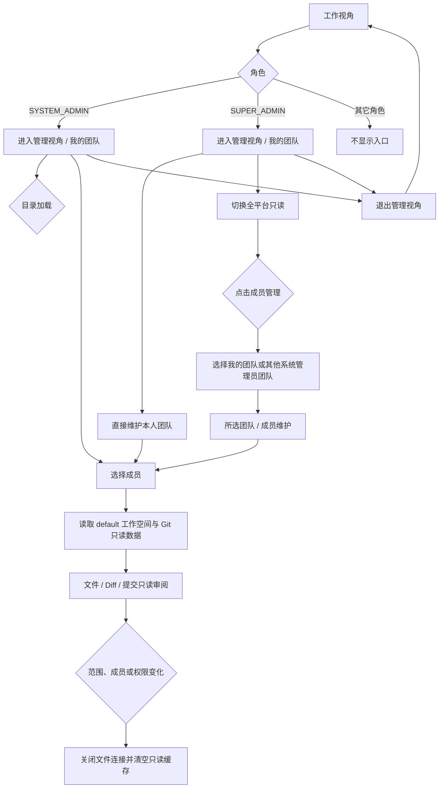

# 1. 测试设计文档

## 1.1 管理视角主流程路径



| 路径编号 | 覆盖路径 | 触发条件 |
| -------- | -------- | -------- |
| P01 | A-B-C-F-M-N-O-R-A | 系统管理员进入、读取成员、查看 Diff、退出 |
| P02 | A-B-D-G-M-N-O-R-A | 超级管理员直接维护本人团队并审阅 |
| P03 | A-B-D-H-I-J-L-M-N-O-R-A | 超级管理员在全平台只读后选择本人或其他团队 |
| P04 | A-B-D-H-I-J | 其他系统管理员团队为空时仍可选本人团队 |
| P05 | A-B-E | 普通用户不显示管理入口 |
| P06 | A-B-C/D-M-P-Q | 成员、范围、版本或权限变化使旧连接失效 |

## 1.2 角色与范围判定表

| 条件 | 规则 R1 | 规则 R2 | 规则 R3 | 规则 R4 |
| ---- | ------ | ------ | ------ | ------ |
| 角色为 `SYSTEM_ADMIN` | 是 | 否 | 否 | 否 |
| 角色为 `SUPER_ADMIN` | 否 | 是 | 否 | 否 |
| 角色为普通用户 | 否 | 否 | 是 | 否 |
| 管理视角范围 | `MY_TEAM` | 默认 `MY_TEAM`，可切 `GLOBAL` / `SYSTEM_ADMIN_TEAM` | 无 | 待确认：缺少该角色的管理能力配置 |
| 成员维护 | 允许本人团队 | 默认直接维护本人团队；全平台只读时先选择本人或其他团队 | 禁止 | 待确认 |
| 文件能力 | `TEAM_READ_ONLY` | `TEAM_READ_ONLY` | 无 | 待确认 |
| 写文件、Git、终端、加入对话 | 禁止 | 禁止 | 不适用 | 待确认 |

## 1.3 异步状态迁移与边界

| 状态对象 | 合法状态/事件 | 预期迁移 | 非法或风险迁移 |
| -------- | -------------- | -------- | -------------- |
| 团队目录 | `未加载 → 加载中 → 已加载` | 展示加载态，成功后可选团队 | 加载中重复点击不得出现重复请求 |
| 团队目录 | `加载中 → 失败 → 重试 → 已加载` | 保留对话框，展示错误，重试恢复 | 失败被误报为空态 |
| 成员维护 | `GLOBAL → MY_TEAM / SYSTEM_ADMIN_TEAM` | 关闭团队选择，打开所选团队的成员对话框 | `GLOBAL` 直接读取/修改成员 |
| 文件连接 | `已连接 → 成员/范围变化` | 关闭旧连接、清空旧缓存、建立新范围 | 迟到帧写回新成员 |
| 只读文件 | `整读 → 分段预览` | 413 后读取 chunk，可继续加载或重试 | 越权、路径越界、写入或下载 |
| 对话框 | `打开 → Escape/遮罩/关闭按钮` | 关闭当前对话框，不改变成员数据 | Escape 关闭错误层级或修改范围 |

## 1.4 输入等价类与边界值

| 输入条件 | 等价类 | 类别 | 代表数据 |
| -------- | ------ | ---- | -------- |
| `scopeMode` | `MY_TEAM`、`SYSTEM_ADMIN_TEAM`、`GLOBAL` | 有效 | `MY_TEAM`; `SYSTEM_ADMIN_TEAM&ownerUserId=owner-1`; `GLOBAL` |
| `scopeMode` | 未知枚举、缺失 owner | 无效 | `scopeMode=OTHER`; `SYSTEM_ADMIN_TEAM` 且无 `ownerUserId` |
| `targetUserId` | 空值/省略 | 有效 | 不传 `targetUserId`，返回团队范围目录 |
| `targetUserId` | 当前有效成员 | 有效 | `member-1` |
| `targetUserId` | 已移除成员、未知用户 | 无效 | `member-removed`; `unknown-user` |
| 成员关键字 | 空、单字符、中文、统一认证号 | 有效 | `""`; `"甲"`; `"owner-auth"` |
| 分页 | 首页、最后一页、越界页 | 边界 | `page=1,size=20`; `page=ceil(total/20)`; `page=ceil(total/20)+1` |
| 文件内容 | 小于阈值、等于阈值、超过阈值 | 边界 | `8B-1`; `8B`; `8B+1`（阈值以接口响应为准） |

# 2. 测试案例

## 2.1 页面、流程和状态案例

| 案例名称 | 测试步骤 | 测试数据 | 预期结果 |
| -------- | -------- | -------- | -------- |
| TC-01 普通用户隐藏管理入口 | 以 `roles=[USER]` 登录；打开头像菜单 | `USER` | 不显示“切换到管理视角”，无法通过菜单进入团队视角 |
| TC-02 系统管理员进入本人团队 | 以 `roles=[SYSTEM_ADMIN]` 登录；先收起工作视角对话栏，再点击切换；等待目录完成 | `owner=当前用户` | 范围为“我的团队”；右侧对话自动展开；顶栏显示“添加团队成员”并直接打开本人团队维护弹窗；无全平台只读提示；退出后恢复原先收起状态 |
| TC-03 超级管理员默认本人团队 | 以 `roles=[SUPER_ADMIN]` 登录；点击切换；点击顶栏“添加团队成员” | `scopeMode=MY_TEAM` | 显示“我的团队”；右侧对话自动展开；直接打开本人团队成员弹窗，允许添加首位成员；文件树和编辑区仍只读 |
| TC-04 团队目录加载态 | 超级管理员切到全平台只读后打开成员管理 | `listSystemAdmins` 延迟 500ms | 团队选择中始终可选“我的团队”，其他团队显示加载态，不误报为空 |
| TC-05 团队目录空态 | 返回空 `items`；切到全平台只读并打开成员管理；选择“我的团队” | `items=[]` | 说明暂无其他系统管理员团队；仍可打开本人团队成员弹窗并添加成员，不要求先提升另一个账号角色 |
| TC-06 团队目录失败重试 | 首次返回 `500/INTERNAL_ERROR`；点击“重试”；第二次返回 owner | `owner-1=系统管理员甲` | 错误信息可见且有重试；重试后显示 owner；错误消失 |
| TC-07 选择系统管理员团队 | 在团队选择中点击 `系统管理员甲` | `ownerUserId=owner-1` | 范围切为 `SYSTEM_ADMIN_TEAM`；成员维护弹窗打开；请求带 `ownerUserId=owner-1` |
| TC-08 单框搜索与分页 | 在成员弹窗唯一搜索框输入中文关键字；翻到最后一页 | `keyword=成员甲`; `page=2,size=20` | 同一关键字同时过滤现有成员、查询可添加用户；只保留一个输入框和候选列表，不再出现第二搜索框或原生选择框；页码和总数可观察 |
| TC-09 添加成员 | 在唯一搜索框的候选列表中选择用户；点击“添加团队成员” | `candidateUserId=candidate-1` | 添加按钮显示所选用户，POST 成功后清空候选选择，成员列表和审阅 roster 刷新，旧文件连接关闭 |
| TC-10 移除当前成员 | 在当前选中成员行点击移除 | `memberUserId=member-1` | DELETE 成功；当前成员取消选中；只读缓存清空；重新加载目录不再包含该成员 |
| TC-11 成员维护权限失败 | 成员弹窗已打开；后端 DELETE 返回 403 | `code=FORBIDDEN` | 展示统一错误；不伪造移除成功；文件连接关闭或进入失效态 |
| TC-12 浮条直接切换成员 | 进入管理视角；点击浮条用户名；搜索并选择另一成员 | `rightPanelOpen=false` | 浮条不显示“对话”；仅显示精简成员列表，不展示范围、统计、提交或导出；选中后列表关闭，左侧只读工作区切换到目标成员 |
| TC-13 三处浮层 Escape | 分别打开成员选择、团队选择、成员维护；按 Escape | `Escape` | 只关闭当前浮层；不切换范围、不增删成员、不退出管理视角 |
| TC-14 遮罩关闭 | 点击三个对话框遮罩空白区域 | 鼠标点击 backdrop | 当前对话框关闭；点击内容区域不误关闭 |
| TC-15 沿用上下文 | 工作视角先选 `app-1/workspace-1/version-1`；进入管理视角 | 版本 `version-1` | 顶部上下文舱沿用三项；管理视角内切换不回写工作视角 |
| TC-16 停用工作空间过滤 | 返回停用模板和可用模板 | `enabled=false/true` | 默认只选可用模板；停用模板不成为当前上下文 |
| TC-17 无 default 工作空间 | 成员有 `feature-space`，无 `default` | `workspaceName=feature-space` | 显示“没有名为 default 的个人工作空间”；不读取目录、不假设物理路径 |
| TC-18 只读文件与 Diff | 在左侧“变更”页选择未提交修改，再选择小文件 | `path=.opencode/opencode.jsonc` | 左侧展示成员真实未提交文件和数量，点击打开只读 Diff；文件以只读编辑器打开；DiffViewer `writable=false`；审阅弹窗不重复列未提交修改；不显示保存、Git 写操作、终端、下载、加入对话操作 |
| TC-19 大文件分段预览 | 首次整读返回 413；读取分段；继续加载一段；触发失败后重试 | `size=20`, `maxPreviewBytes=8` | 展示首段和进度；继续加载追加内容；失败保留已读内容并可重试 |
| TC-20 迟到响应隔离 | 打开成员 A 文件后切换成员 B；让 A 的文件响应最后到达 | `A=pw-1`, `B=pw-2` | A 内容不出现在 B 的标签页；关闭 `pw-1` 连接；当前工作区为 `pw-2` |
| TC-21 401/403 实时撤权 | 文件读取中返回 401 或 403 | `traceId=trace-revoked` | 关闭所有团队文件连接、清空只读缓存、展示统一错误；不得继续读迟到帧 |
| TC-22 管理视角只读对话 | 默认全部成员或选中成员后发送“概括当前工作区” | `team.review`、至少 30 个文件 | 每轮独立 scope；原生 Tool 实际按需 list/search/read，含第 25 个之后文件；引用来源和版本；明确失败/过滤/未完成；Run 仍属于管理员；通道写操作拒绝 |
| TC-22 精简成员浮层 | 返回个人、已发布和 `SYNC_MERGE` 提交 | `commitType=PERSONAL_COMMIT/PUBLISHED_COMMIT/SYNC_MERGE` | 浮层仅展示成员选择，提交分组与整组导出不再呈现；左侧“变更”仍能查看未提交修改 |
| TC-23 整组导出取消 | 选择版本发起导出；轮询到 RUNNING；点击取消 | `exportId=export-1` | 状态变为 CANCELLED；停止轮询；不产生下载跳转 |
| TC-24 离开管理视角清理 | 管理视角打开文件和成员弹窗；点击活动栏工具箱/控制台 | `perspective=TEAM_MANAGEMENT` | 退出管理视角，关闭文件连接和弹窗，清空管理缓存，目标页面正常打开 |

## 2.2 接口案例

### 测试案例 25：查询超级管理员可管理团队

案例名称：`GET /api/internal/platform/system-management/system-admins`

测试步骤：以 `SUPER_ADMIN` 请求 `keyword=系统管理员&page=1&size=200`；重复请求空结果；模拟服务异常后重试。

内部数据依赖：

| 数据对象 | 表名 | 依赖数据逻辑 | 依赖数据示例 |
| -------- | ---- | ------------ | ------------ |
| 系统管理员 | `users` | `status=ACTIVE` 且具有 `ROLE_SYSTEM_ADMIN` | `owner-1 / system-admin` |

CMC 参数依赖：

| 参数名称 | 参数逻辑 | 参数键 | 示例值 |
| -------- | -------- | ------ | -------- |
| 查询页 | 分页和关键字 | `keyword,page,size` | `系统管理员,1,200` |

下游应用依赖：

| 下游应用 | 依赖数据逻辑 |
| -------- | ------------ |
| 管理视角成员管理 | 用结果填充团队选择对话框 |

测试数据：

| 数据名称 | 接口字段 | 数据逻辑 | 示例值 |
| -------- | -------- | ------ | ------ |
| 合法管理员 | `roles/status` | 活跃系统管理员 | `owner-1/ROLE_SYSTEM_ADMIN/ACTIVE` |
| 无效身份 | `roles/status` | 普通用户或已停用 | `member-1/USER/INACTIVE` |

接口返回验证：

| 字段中文名 | 字段英文名 | 预期值 | 预期结果 |
| ---------- | ---------- | ------ | -------- |
| 成功标记 | `success` | `true` | 统一成功响应 |
| 团队负责人列表 | `data.items` | 仅活跃系统管理员 | 普通用户、停用用户不出现 |
| 总数 | `data.total` | 与过滤后数量一致 | 分页可复核 |
| 异常错误 | `code` | `INTERNAL_ERROR` | 不泄露 SQL、物理路径或凭据 |

数据库验证：

| 表中文名 | 表英文名 | 字段英文名 | 预期值 | 预期结果 |
| -------- | -------- | ---------- | ------ | -------- |
| 用户 | `users` | `status` | `ACTIVE` | 仅活跃用户参与 |
| 用户角色 | `user_roles` | `role_code` | `ROLE_SYSTEM_ADMIN` | 仅系统管理员成为候选负责人 |

### 测试案例 26：按范围和目标成员查询团队应用

案例名称：`GET /api/internal/platform/workspace-management/team/applications`

测试步骤：分别请求 `MY_TEAM`、`SYSTEM_ADMIN_TEAM`、`GLOBAL`；为有效成员传 `targetUserId`；为已移除成员传 `targetUserId`；检查审计。

内部数据依赖：

| 数据对象 | 表名 | 依赖数据逻辑 | 依赖数据示例 |
| -------- | ---- | ------------ | ------------ |
| 团队成员 | `system_admin_team_members` | `deleted_at IS NULL` 才是当前成员 | `owner-1/member-1` |
| 应用工作空间 | `application_workspaces` | 与目标版本存在有效关联 | `app-1/ws-1` |

CMC 参数依赖：

| 参数名称 | 参数逻辑 | 参数键 | 示例值 |
| -------- | -------- | ------ | ------ |
| 范围 | 读取和授权边界 | `scopeMode` | `MY_TEAM` |
| 团队负责人 | 系统管理员团队必填 | `ownerUserId` | `owner-1` |
| 目标成员 | 可选成员收窄 | `targetUserId` | `member-1` |

下游应用依赖：

| 下游应用 | 依赖数据逻辑 |
| -------- | ------------ |
| 管理视角上下文舱 | 使用应用列表选择应用和版本 |
| 团队审阅面板 | 使用 `membershipState` 区分 CURRENT/HISTORICAL |

测试数据：

| 数据名称 | 接口字段 | 数据逻辑 | 示例值 |
| -------- | -------- | ------ | ------ |
| 当前成员 | `targetUserId` | 活跃团队成员 | `member-1` |
| 历史成员 | `targetUserId` | 曾有关联但当前已移除 | `member-old` |
| 越权成员 | `targetUserId` | 不属于负责人团队 | `member-other` |

接口返回验证：

| 字段中文名 | 字段英文名 | 预期值 | 预期结果 |
| ---------- | ---------- | ------ | -------- |
| 应用 ID | `data[].appId` | 可见应用 | 仅返回授权范围 |
| 归属状态 | `data[].membershipState` | `CURRENT` 或 `HISTORICAL` | 与成员关系一致 |
| 越权错误 | `code` | `FORBIDDEN` | 不调用工作空间查询服务 |

数据库验证：

| 表中文名 | 表英文名 | 字段英文名 | 预期值 | 预期结果 |
| -------- | -------- | ---------- | ------ | -------- |
| 团队成员 | `system_admin_team_members` | `deleted_at` | 空/非空 | 当前与历史结果可区分 |
| 团队审计 | `support_access_audit_events` | `access_kind,action,target_user_id,outcome` | `TEAM_OVERSIGHT,APPLICATION_LIST,member-1,SUCCESS` | 每次名单/范围查询有审计 |

### 测试案例 27：成员移除后的实时撤权

案例名称：`DELETE /api/internal/platform/system-management/team-members/{memberUserId}`

测试步骤：负责人以 `SYSTEM_ADMIN_TEAM` 删除当前成员；重复删除同一成员；删除后立即使用原 `targetUserId` 查询应用、目录和文件。

内部数据依赖：

| 数据对象 | 表名 | 依赖数据逻辑 | 依赖数据示例 |
| -------- | ---- | ------------ | ------------ |
| 团队关系 | `system_admin_team_members` | 当前关系存在，删除写 `deleted_at` | `owner-1/member-1` |
| 审计事件 | `support_access_audit_events` | `access_kind=TEAM_OVERSIGHT`，记录删除结果和目标 | `MEMBER_REMOVE/member-1` |

CMC 参数依赖：

| 参数名称 | 参数逻辑 | 参数键 | 示例值 |
| -------- | -------- | ------ | -------- |
| 范围 | 必须是可维护团队 | `scopeMode` | `SYSTEM_ADMIN_TEAM` |
| 负责人 | 当前操作者可管理的团队 | `ownerUserId` | `owner-1` |
| 成员 | 路径目标 | `memberUserId` | `member-1` |

下游应用依赖：

| 下游应用 | 依赖数据逻辑 |
| -------- | ------------ |
| 文件 WebSocket | 旧连接必须关闭，后续帧拒绝 |
| 管理视角 | 清理当前成员缓存并刷新 roster |

测试数据：

| 数据名称 | 接口字段 | 数据逻辑 | 示例值 |
| -------- | -------- | ------ | ------ |
| 首次删除 | 路径 + 查询参数 | 当前活动成员 | `member-1` |
| 重复删除 | 路径 + 查询参数 | 已经 `deleted_at` 非空 | `member-1` |

接口返回验证：

| 字段中文名 | 字段英文名 | 预期值 | 预期结果 |
| ---------- | ---------- | ------ | -------- |
| 成员负责人 | `data.ownerUserId` | `owner-1` | 返回实际范围 |
| 成员状态 | `data.active` | 首次 `false` | 前端刷新 roster |
| 重复删除 | `code` | `CONFLICT` 或统一幂等成功 | 不恢复成员，不返回 500 |
| 越权删除 | `code` | `FORBIDDEN` | 不写团队关系 |

数据库验证：

| 表中文名 | 表英文名 | 字段英文名 | 预期值 | 预期结果 |
| -------- | -------- | ---------- | ------ | -------- |
| 团队成员 | `system_admin_team_members` | `deleted_at` | 非空 | 软删除且可追溯 |
| 团队审计 | `support_access_audit_events` | `access_kind,outcome` | `TEAM_OVERSIGHT,SUCCESS/REJECTED` | 成功与拒绝均有审计 |

## 2.3 部署与真实验收案例

| 案例名称 | 测试步骤 | 测试数据 | 预期结果 |
| -------- | -------- | -------- | -------- |
| TC-28 Jenkins 发布合同 | 将已提交 `release` 推送内部 GitLab；触发 `ACTION=DEPLOY`；核对不可变标签和 revision | `release-<build>-<sha>` | Checkout revision 与发布 tag 一致；所有 pipeline stage 成功 |
| TC-29 三服务 readiness | 请求 backend 18082、XXL 18083、前端代理 XXL 3000 readiness；请求首页 HEAD | `192.168.8.100` | 三个 readiness `UP`，首页 HTTP 200，不能只凭构建成功判定上线 |
| TC-30 真实管理视角截图 | 用授权超级管理员登录 3000；进入管理视角；点击用户名选择另一成员，再打开成员管理 | `888888888`、真实版本上下文 | 截图能确认浮条没有“对话”、精简成员列表切换工作区、成员管理只有一个搜索输入；右侧原对话栏仍可用 |
| TC-31 无其他团队现场 | 测试库没有其他系统管理员团队时打开成员管理 | `items=[]` | 顶栏可直接打开本人团队成员弹窗；切换全平台只读后仍可从选择弹窗返回本人团队，不执行未指定的真实成员写操作 |

## 2.4 全部成员最新文件与按需 Tool 验收

设计依据：`docs/architecture/team-review-latest-files.md`。以下通过条件不是“仅构建成功”或 mock 对话。

| 案例名称 | 测试步骤/数据 | 预期结果与证据 |
| -------- | -------- | -------- |
| TC-32 默认聚合及成员切换 | 进入管理视角，保持当前应用/模板/版本；打开用户名列表，选择成员，再返回全部成员 | 默认“全部成员”、对话展开、原三栏保留；选择后弹窗关闭，文件树和编辑器切换；只有顶栏成员维护入口 |
| TC-33 完整目录及实际作者 | 同一版本的两名成员分别提交 `spec/a.md`、`spec/b.md`；文件树展开 spec | 显示所有文件而非仅改动列表；每个文件显示 Git 实际作者/提交时间，不以工作区所有者或克隆 mtime 冒充 |
| TC-34 同内容去重与最新来源 | 相同路径相同 SHA；相同路径不同 SHA、两条可靠且不同 Git 时间 | 相同内容只有一行；不同内容选较晚 Git 提交，UI 与 Tool source/file/contentVersion 一致 |
| TC-35 待核验来源 | 同路径脏文件、相同 Git 时间但内容不同、文件/目录同名 | 标注“最新待核验”；不自动读第一人的正文；要求选择具体成员后再读 |
| TC-36 版本和删除 | 第一次目录读取后改文件，含同大小且恢复 mtime；本来源 Git 删除 | 旧 SHA 读取 CONFLICT；删除候选无正文，别的成员缺失文件不视为全局删除 |
| TC-37 失败与预算 | 一名来源离线、旧节点不支持元数据 RPC；目录 1001 项 | 明确 incomplete/unavailable 或超限，不把部分/截断结果标成完整；无法确认来源时拒绝正文 |
| TC-38 大于 24 文件真实问答 | 真实 Git fixture 至少 30 文件；用户询问第 30 文件正文；继续搜索 40 子目录 | Tool list/search/read 取到第 30 文件；搜索续扫 remainingDirectories；不是预载快照，保留实际 Tool 调用及 Run 终态证据 |
| TC-39 Scope 与 Run 撤权 | 换操作者、登录 marker 失效、成员移除、服务器/版本映射变化、终态 Run、复用到其它 Run | 每条协调/来源 RPC 失败关闭；来源节点顶层 FORBIDDEN/UNAUTHENTICATED 错误码不误解析为空目录 |
| TC-40 只读与凭据隔离 | 请求 workspace.write/delete/git/terminal；用 Git audience 调审阅及反向调用；枚举 .opencode/node_modules、读取 opencode.jsonc/.envrc/.npmrc/.netrc/SSH 私钥/符号链接 | 目录树排除受管配置和依赖；直读/直列受保护路径返回 FORBIDDEN；拒绝写操作和敏感文件；Token 不进入模型输入或返回值；控制面 HTTP 不返回目录/正文；旧配置管理 RPC 授权不变 |
| TC-41 迟到响应和连接 | 并发展开、切应用/成员后旧 ticket/目录/分片迟到；刷新/退出视角 | 同 scope 单飞连接；旧连接关闭、迟到结果不能覆盖新视图，聚合 ID 不当物理 Workspace |
| TC-42 配套发布与真实模型 | 后端经 Jenkins 发布100，公共 Tool 经个人 worktree 审阅发布，受管重启验收进程 | UI、所有来源节点、公共 Tool 和专用凭据版本配套；账号 binding 不迁 Mac；真实模型读取来源并引用文件路径与作者 |

自动校验入口：

```bash
# 仓库根目录；需显式选择支持 release 21 的 JDK
mvn -q -f backend/pom.xml -pl test-agent-api,test-agent-persistence -am -Dtest=TeamReviewApplicationServiceTest,TeamWorkspaceApplicationServiceTest,TeamReviewProtocolServiceTest,RedisTeamReviewScopeStoreTest,WorkspaceGitToolTokenServiceTest,OpencodeProcessStartupServiceTest,ApiTokenWebFilterTest,WorkspaceFileWebSocketHandlerTest -Dsurefire.failIfNoSpecifiedTests=false test
node tools/test-team-review-tool.mjs

# frontend 目录
corepack pnpm typecheck
corepack pnpm exec vitest run apps/agent-web/tests/team-management-controller.test.ts apps/agent-web/tests/team-review-panes.test.ts apps/agent-web/tests/team-perspective-shell.test.ts apps/agent-web/tests/figma-file-explorer.test.ts packages/backend-api/tests/team-file-connections.test.ts packages/file-explorer/tests
corepack pnpm build
```

隔离 Tool 网络契约测试执行真实 `execute` 代码，但 fetch/WebSocket 为受控替身，不能代替 TC-38/TC-42 的原生模型调用。真实 Git 文件测试覆盖 30 文件、实际作者和 SHA 检测；浏览器截图中的空团队不能作为多成员文件数据验收证据。

### 2026-09-27 本地实现校验记录

- 后端 8 个定向测试类 103 项通过；公共 Git/文件内核回归 78 项通过。前端 11 文件 109 项、全 workspace 类型检查及生产构建通过；隔离 Tool execute 3 项通过，Bun 原生 WebSocket Origin 本地握手/回包通过。生产构建仍有既有大 chunk/动态导入提示。
- 按固定 `.env.test`/`test` profile 启动实际后端、manager、前端；readiness UP，3000 HTTP 200。真实账号页面确认默认全部成员、唯一成员维护入口、成员选择后关闭和范围切换；无可用 default 时明确空态，来源离线时明确“不完整”。截图保存在 `output/playwright/team-review-20260927/`。
- 实际平台 scope/ticket 均 HTTP 200，真实浏览器文件 WebSocket 的 workspace.write 返回 FORBIDDEN；无效专用 Tool 凭据返回 401 UNAUTHENTICATED。未创建该测试写入文件，未修改账号模型、团队成员、数据库业务数据或工作区服务器归属；短 scope 在 Redis 按 TTL 自动过期。
- **尚未通过 TC-38/TC-42 的真实模型验收**：本轮未发布100后端和公共 Tool，未受管重启远端验收进程。共享账号仍绑定100；当前本人团队在 wrtest/20260709 没有 default，本地-测试/20260618 的 default 来源服务器离线。不能把单元/隔离测试、空态截图或上轮有限快照对话当作新 Tool 的真实验收。

### 2026-09-27 共享环境配套发布与安全补验

- Jenkins #65 于 15:12:20 完成 `8b027dd74669c85ca838b365f36b01c681572ecd` 的发布，标签 `release-65-8b027dd7`；后端 readiness、Web、XXL readiness 均 HTTP 200，执行器 9999 TCP 可达。公共 Tool 已通过个人 worktree 发布到 public master `f5b52bda86867dc48157e01595e21ae56526a8a1`，100 rollout 完成；验收管理员通过公共启动/重启链路重新启动，binding 保持100。Mac 的一个个人 worktree 冲突未修改，不影响100同步。
- 实际读取确认：`wrtest/20260709` 的本人 default 工作区在100存在，新增来源文件 RPC 返回目录及 Git 元数据。旧“本地-测试/20260618”的本人工作区只有登记，物理根目录不可用，未擅自初始化或更改服务器归属。免费 `opencode/ling-3.0-flash-free` 已在真实模型目录出现。
- 递归元数据验收发现扫描进入 `.opencode` 配置和依赖目录；在发送模型问题前补上目录枚举与正文读取的统一保护规则，并用原有真实 Git 30 文件测试覆盖嵌套配置、依赖、`.npmrc/.netrc` 的排除和拒绝。这次修复需要另一次 Jenkins 发布后再完成真实模型验收；此处不将 #65 视为最终验收通过。

# 3. 案例审核结果

| 审核项 | 审核结果 | 说明 |
| ------ | -------- | ---- |
| 需求/设计覆盖 | 补充后通过 | 覆盖角色、范围、成员维护、只读文件、撤权、导出、部署和截图；真实环境无团队数据时由 TC-31 明确记录 |
| 方法分析与案例一致性 | 通过 | 路径、判定表、状态迁移、等价类和边界值均有对应案例 |
| 正常、异常、边界与关键分支 | 通过 | 包含加载失败重试、空态、401/403、迟到响应、分页、413 分段预览和重复删除 |
| 测试数据具体性 | 通过 | 使用具体角色、scope、owner、member、workspace、分页和响应字段 |
| 步骤可执行性 | 通过 | 步骤可直接映射到浏览器、接口或测试 fixture |
| 预期结果可观察性 | 通过 | 页面文案、API 字段、HTTP 错误、审计和连接清理均可观察 |
| 接口七区块完整性 | 通过 | TC-25～TC-27 均保留七个区块，未知材料标注待确认而未编造 |

总评：补充后通过。
