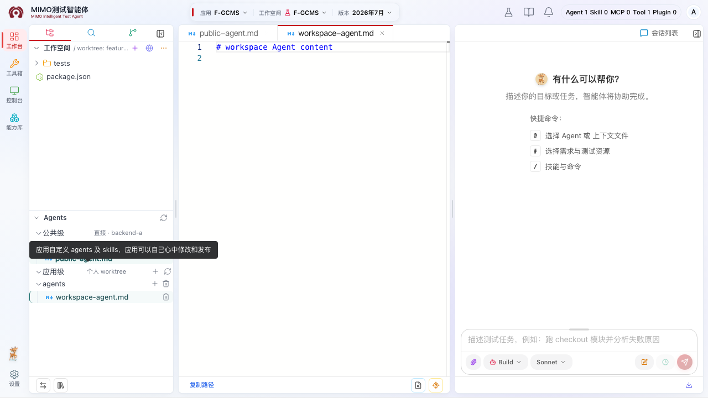

# Agent 与 Skill 配置

左侧 Agent 配置树分为公共配置和应用配置。公共配置来自独立的公共 Git，应用配置来自应用 Git。公共配置使用公共个人 worktree；应用配置与 workspace 文件共用当前版本、当前用户的个人 worktree，只按目录和权限分开展示、提交。

## 公共配置

公共配置由超级管理员按服务器维护，包含平台统一的 Agent、Skill、模型和供应商配置。只有超级管理员可以创建公共 worktree、修改文件、暂存、提交和推送；应用管理员与普通用户直接从已初始化服务器的共享公共副本只读查看允许展示的 `agents/` 和 `skills/` 内容，不需要公共 Git 仓库权限，也不要求先初始化个人 TestAgent 进程。公共级“更多操作”内提供“创建公共 worktree”和“切换公共 worktree”：创建会在所选服务器确保当前用户固定的 `public-{用户ID}` 分支和个人 worktree，已存在时直接挂载，不创建任意命名分支，也不能切换他人的 worktree。

公共仓库有本地修改时仍可浏览，但更新前必须由管理员明确确认是否放弃已跟踪修改。不要复制公共配置到业务工作区形成第二套来源。

超级管理员可在公共级根目录点击“新建或上传公共配置”，一次选择普通文件、文件夹、上传、Agent 或 Skill；目录行的 `+` 提供普通文件、文件夹和上传。面板样式与应用工作区一致。普通文件是空白内容，普通文件夹只整理素材，不会自动成为 OpenCode Agent/Skill；Agent 会生成 `agents/<英文技术标识>.md`，Skill 会生成标准 `skills/<英文技术标识>/` 配置包。新文件创建后会直接在编辑器打开，新文件夹包含 `.gitkeep`；文件/目录行尾删除按钮仍进入递归删除确认面板。

## 应用工作区配置

应用配置位于当前版本个人 worktree 的 `.opencode/`，用于某个应用版本自己的 Agent、Skill、rules 和 templates。它不再创建独立的“应用配置 worktree”。只有应用管理员与超级管理员可以修改、暂存、提交和发布；普通用户保持只读。左侧 Agents 配置树按角色隐藏初始化和写入入口，内置编辑器以只读方式打开无权限文件；后端文件通道、Agent Git API 和个人 worktree 提交 API 都会再次校验 `.opencode/**` 权限。

在应用级根目录点击“新建或上传应用配置”后，可选择普通文件、文件夹、上传、Agent 或 Skill。普通条目用于手工维护配置或素材，不生成模板；选择 Agent/Skill 时平台按 OpenCode 对应模板生成文件：

- 选择 Agent：中文名称必填，英文名称选填；只生成英文技术标识命名的 `agents/<技术标识>.md`，当前默认 `mode: primary`。
- 选择 Skill：中文名称必填，英文名称选填；生成英文技术标识命名的 `skills/<技术标识>/SKILL.md`、`skills/<技术标识>/rules/README.md` 和 `skills/<技术标识>/templates/README.md`。

英文名称是本轮新增的选填项：填写后由它生成技术标识；不填写时，平台把完整中文名称转换成无声调拼音。技术标识统一规范为小写字母、数字和短横线，目录名和文件名始终保持英文。例如中文名称“接口自动化测试”、英文留空时，技术标识为 `jie-kou-zi-dong-hua-ce-shi`，实际 Skill 目录为 `skills/jie-kou-zi-dong-hua-ce-shi/`。配置树展示中文主名称和英文辅助名称，打开、改名、Git、OpenCode 加载以及 `@`/`/` 最终提交仍使用英文技术标识。

新建 `SKILL.md` 默认带有 `compatibility: opencode`，并在 `metadata` 中写入 `display-name`、`display-name-zh`、`scope` 和 `source: test-agent`。其中 `display-name`/`display-name-zh` 用于平台双语展示；`source: test-agent` 只是“由 TestAgent 平台模板创建”的来源标记，不参与 OpenCode 的 Skill 识别，也不同于运行态 `/command` 列表中的 `source=skill`。OpenCode 仍按英文目录和顶层 `name` 加载 Skill。Agent 当前原生配置没有 Skill 同款 metadata 扩展面，因此平台使用双语 `description` 展示中文名称，不向 OpenCode 源码或 Agent 请求体增加自定义 metadata。

这些文件与 docs、spec 和普通 workspace 文件位于同一个人 worktree，但 Git 变更面板把 `.opencode/**` 单独归入“应用Agent”Tab，避免和 workspace 文件混在一棵差异树中。

应用管理员也可在 `agents/`、`skills/` 的任意可写目录行点击“新建或上传文件”，并通过文件/目录行尾删除按钮移除条目。上传支持一次选择多个本机文件且不覆盖同名内容。应用级只允许创建、上传或删除 `opencode.jsonc`、`agents/**` 和 `skills/**` 范围内的条目；空文件夹用 `.gitkeep` 保持可提交，删除文件夹会递归删除全部内容。操作成功后文件树和 Git 变更会自动刷新，不需要手工点击“变更”或刷新按钮。

超级管理员可以通过右键菜单修改公共级文件名，应用管理员或超级管理员可以通过右键菜单修改应用级 Agent/Skill 文件名；双击不再进入改名。按住 Ctrl（macOS 可用 Cmd）单击可多选文件，右键可统一删除、复制、剪切和粘贴，也可拖动任一已选文件整体移动。改名或移动后文件树、已打开标签和 Git 变更会同步更新；无对应写权限的公共级与应用级配置保持只读。

“应用Agent”和“公共Agent”Tab 都可以逐个或批量回退已跟踪、新增和未跟踪文件。回退后，已打开的 Agent 文件会按磁盘结果刷新；新增文件被删除时对应 tab 会关闭。冲突文件不能直接回退，必须使用合并编辑器选择当前版本、远端版本、手工内容，或取消整次合并。

在内置编辑器保存，或通过配置树新建、上传、改名、移动、复制、删除 `agents/*.md` 或 `skills/<英文技术标识>/SKILL.md` 后，平台都会复用同一套当前用户热加载程序；若当前有任务运行，则排队到任务结束。热加载完成后会重新获取 Agent 与 Skill Command 目录，不需要刷新浏览器：清空或继续输入 `@`、`/` 即可看到最新候选。默认新建的 `mode: primary` Agent 按 OpenCode 原生规则只出现在底部主 Agent 选择器，不会出现在 `@` 子智能体候选；要通过 `@` 召唤需把其模式明确配置为 `subagent` 或 `all`。若文件已经落盘但运行态重新加载失败，页面会明确提示运行态目录刷新失败；文件修改不会因此丢失。

公共、应用及个人应用配置更新后，通知中心会告诉当前用户处理进度：任务尚未结束时显示“更新中”，加载完成后显示“已更新”，加载失败时显示“更新失败”，本次更新被更新版本替代时显示“不用处理”。后台重复检查不会制造相同通知，也不会把已经读过的通知重新标成未读；只有状态真的发生变化时才会再次提醒。更新失败时可以点击“重启智能体”，该操作只会重启当前登录用户自己的智能体。

如果自动热加载没有立即体现，可在首次点击小宠物打开的对话页中使用“Agent 配置更新”。公共按钮会加载本人公共 worktree，并只刷新当前用户缓存；不会提交、stash、reset、clean 或删除未提交内容。以后通过平台启动或重启 OpenCode 时，只要同服的 `public-{用户ID}` worktree 记录和物理目录仍有效，平台会自动继续加载，不需要再次点击；自动检查只发生在启动/重启时，不做后台轮询，也不 fetch Git。应用按钮不是单纯清缓存：它先把当前应用已有的 feature 固定提交安全合入本人个人 worktree，保留不冲突的 staged、unstaged 和 untracked 内容，再刷新当前用户缓存；发生覆盖风险或真实冲突时会停止并提示到 Diff 处理。两个按钮都不会影响其他用户，当前任务运行期间会暂时禁用。进入小宠物选择页后只调整伙伴和大小，不显示这两个按钮；左侧 Agents 区域仍保留对应入口。

## 向 SkillMarket 上传 Skill

**适用场景：** 已经完成可复用 Skill 的打包和审查材料，准备提交到外部 SkillMarket，供能力库发现和后续引用。

**使用前确认：** 只有超级管理员能看到并使用“上传 Skill”。上传的是外部能力材料，不会写入当前应用或个人 worktree，也不会替代应用内 Agent/Skill 的 Git 提交和发布流程。上传前请移除 ZIP、审查报告和截图中的 Token、Client Key、账号、客户数据和内部绝对路径。

**怎么用：**

1. 从左侧活动栏进入“Agent / Skill / MCP / Tool Hub”，打开“Skill”页签，点击右上角“上传 Skill”。
2. 填写“技能提供方”，并选择所属阶段：`00·通用`、`01·需求分析`、`02·设计`、`03·开发`、`04·测试`、`05·交付` 或 `06·运维`。
3. 一次选择四项必需材料：根目录包含 `SKILL.md` 的 **Skill ZIP**、安全审查报告图片、目录结构截图和运行效果截图。三张图片只接受 PNG 或 JPG。
4. 点击“开始上传”。页面会显示任务 ID 与处理进度；处理中不要重复提交同一份材料。
5. 成功后平台立即同步能力库，并切换到 SkillMarket 目录。若 100 秒仍未得到最终结果，点击“继续查询”，不要重新上传；若提示“上传已完成，但能力库目录同步失败”，等待后台定时对账后再刷新目录。

当前没有可复用的、已脱敏真实上传页面截图。需要由管理员补拍“能力库 → Skill → 上传 Skill”弹窗（四个材料项与进度状态）后再补入本节；不要用示意图代替真实操作截图。

## 发布前检查

1. 确认当前选择的是公共配置还是应用配置，并确认自己具备对应角色。
2. 解决所有 Git 冲突。
3. 暂存本次确实要发布的配置文件；需要提交当前作用域全部未暂存文件时，可使用未暂存分组右侧的“全部暂存”。
4. 提交并等待页面明确显示推送成功。

公共配置推送成功后，平台会广播公共配置同步。应用配置先提交到当前用户的个人 `HEAD`，再按 `.opencode/**` 白名单投影到对应版本 feature worktree；推送成功后更新应用版本 HEAD 并广播版本同步通知。平台不会用发布结果覆盖其他用户个人 worktree 中尚未提交的修改。

## 常见问题

### 提示没有已初始化服务器

这通常是公共配置管理问题。联系超级管理员在“系统管理 → 配置管理 → TestAgent 公共配置管理”初始化目标服务器。

### 配置文件只读

确认当前查看的是公共配置还是应用配置，并检查当前用户角色和个人 worktree 状态。公共配置对非超级管理员只读，应用配置对非应用管理员只读；应用配置不存在单独的 worktree 切换入口。
