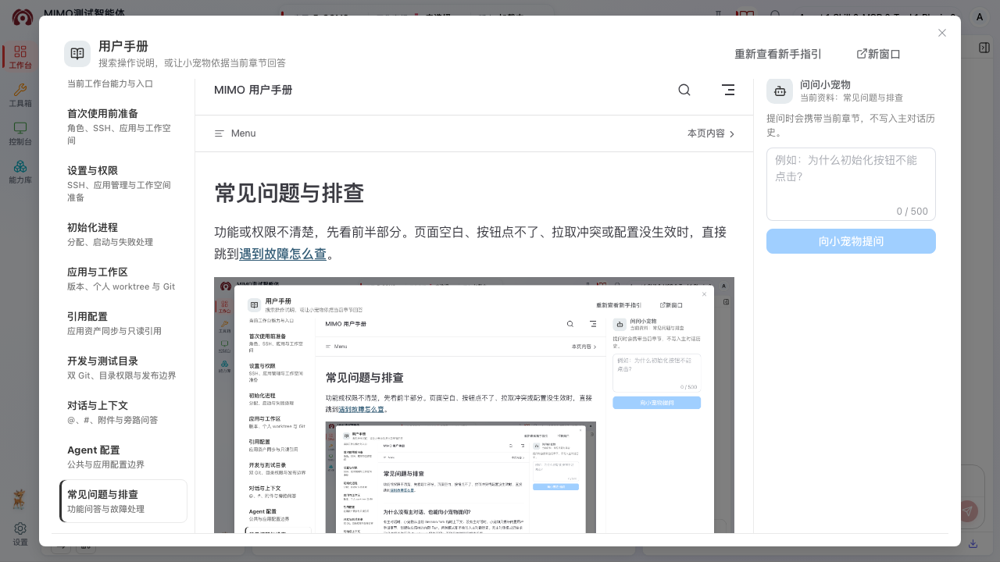

# 常见问题与排查

功能或权限不清楚，先看前半部分。页面空白、按钮点不了、拉取冲突或配置没生效时，直接跳到[遇到故障怎么查](#遇到故障怎么查)。



## 为什么没有主对话，也能向小宠物提问？

有主对话时，小宠物从当前 Session fork 临时上下文；没有主对话时，小宠物只携带内置用户手册章节，创建独立归档的内部 Run。两种模式都不会写入主对话历史。无主对话模式仍要求已经选择工作区且 TestAgent 服务可用；否则只能浏览和搜索手册。

## 为什么应用管理员看不到“新建应用”？

新建应用属于平台级主数据操作，只允许超级管理员。应用管理员可以在“设置 → 应用管理”维护已有应用的成员、版本库关联和工作空间。

## 设置里为什么只有“个人设置”？

设置菜单按当前账号权限显示。普通用户通常只看到“个人设置”，在这里添加或删除自己的 SSH Key；“应用管理”和“版本库管理”需要应用管理员权限，“用户管理”不属于普通用户操作。设置里的完整操作说明见[设置与权限内操作](./settings.md)。

## 应用管理员在设置里要做什么？

在“应用管理”先选择应用，再按页签完成用户配置（应用人员管理）、版本库与应用关联、应用工作区配置（工作空间管理）；“版本库管理”用于新增或编辑可关联的 Git 版本库。准备完成后，普通用户仍要在工作台顶部（或保留的左下角入口）选中 workspace 和版本。具体步骤见[设置与权限内操作](./settings.md)。

## 顶部已经选了应用，为什么工作区还是空的？

顶部应用和 workspace 是两步。在顶部选择 workspace 模板后，单版本直接默认该项，多版本默认最新项；也可使用左下角双向箭头“切换工作空间”完成同样选择。选中后左侧文件树才会加载。若没有版本或个人 `default` 工作区，请联系应用管理员准备。

## 小地球是做什么的？

选中 workspace 后，点击“工作空间”标题右侧的小地球，会打开带当前应用和 workspace 上下文的外部需求页面，用于引入需求子条目。保存返回后再在对话输入框用 `#` 选择子条目；小地球不是新建应用或切换 workspace。

## 对话需要先点击“新建对话”吗？

不需要。工作区和 TestAgent 服务可用后，直接发送第一条任务就会自动创建主对话；“新建对话”只是清空当前草稿并开始另一条对话。

## 分享链接发给同事后，为什么对方打不开？

链接本身不会授予权限。会话所属人还要在右上角“分享”中把对方加入名单并保存；对方必须使用名单中的平台账号登录。分享已过期、被取消、对方被移除或原会话已归档时，记录会保留，但不能再进入。

## 为什么我能打开分享会话，却不能发送消息？

先在“会话列表 → 分享给我”查看权限。显示“只读”时只能看消息、文件和变更，需要会话所属人把权限改为“可对话”。如果已经是“可对话”，但另一位参与者正在执行任务，也要等当前任务结束后才能发送；分享会话不支持排队追加消息。

取消分享不会取消已经安排的夜间任务。任务仍会按原计划执行；需要停止时，由任务所属人在“会话列表 → 待执行任务”中另行取消。

## 为什么读取分支或创建工作空间提示 SSH 失败？

确认当前实际操作用户已在“设置 → 个人设置”添加自己的 SSH Key，并已把对应公钥登记到公司 Git 服务。管理员代替用户创建工作空间时，使用的是管理员自己的 Key，不会借用普通用户的 Key。

## 为什么目录树有内容，但工作空间目录不能选择？

测试工作库只允许选择当前应用同名根目录下的一级子目录，路径必须严格是 `应用名称/一级子目录`，并且应用名称的大小写、连字符和点号必须完全一致。例如当前应用为 `F-APIP` 时，`F-APIP/f-apip-support` 可以选择；`F-APIP.SUPPORT/workspace` 的根目录不匹配，`F-APIP/f-apip-support/workspace` 层级超过一级。自动化代码库可选择任意已有目录；每个版本库只保存一个当前分支和目录，结果是只读 Reference，不是可切换 workspace，也不能新建目录或个人 worktree。

## 初始化进程会修改我的业务文件吗？

不会。进程初始化只准备当前用户的 TestAgent 执行环境。业务文件由应用版本和个人工作区管理。

## 初始化应用配置包会启动进程吗？

不会。它只在当前应用工作区创建 `.opencode` Agent/Skill 配置结构。需要执行任务时，仍要保证 TestAgent 专属进程可用。

## 为什么切换应用后文件和历史对话都变了？

工作区和 Session 都带有应用/版本上下文。切换应用等于切换业务范围，页面会加载新应用对应的版本、个人工作区和历史记录。

## 为什么看不到“长期记忆”入口，或直接访问后回到工作台？

长期记忆按账号逐步开放，只有平台全局记忆配置可用、且超级管理员指定为“记忆灰度”用户时，入口才能显示并打开页面。未开放时，原有对话、文件和任务仍可正常使用，不需要重新初始化进程；如确实需要该能力，请联系平台超级管理员确认开放范围。客户端灰度不会同时开通记忆。

## 为什么看不到“下载本地客户端”、本地工作区或个人客户端设置？

本地 OpenCode 客户端同样按账号灰度开放。只有超级管理员在“系统管理 → 用户管理”为当前账号打开“客户端灰度”后，网页才会显示客户端下载、头像中的本地实例状态、本地工作区和“个人设置 → 本地 OpenCode 客户端”。开启灰度不会自动安装或启动客户端；关闭灰度也不会停止客户端、重启本地 OpenCode 或撤销 Client Key。客户端灰度与记忆灰度相互独立，需要哪项就分别联系超级管理员开通。

## 为什么下载的是压缩包，而不是 DEB 安装包？

当前本地客户端只提供麒麟 ARM64 普通用户包。下载后完整解压 `tar.gz`，双击其中的 `TestAgent-Local-Client` 即可；首次安装只写入当前账号的 `~/.local` 和 `~/.config`，不需要 sudo。不要在压缩包预览窗口中直接运行。旧客户端提示“不支持自更新”时，重新下载用户包；macOS、Windows 和非 glibc 系统暂不在当前客户端支持范围。

## 客户端注册了本地目录后，怎样在工作台打开？

客户端注册成功通常会自动打开对应工作台；没有自动打开时，点击系统托盘 TestAgent 图标中的“打开网页”。随后在顶部“工作空间”菜单的“本地工作区”分组选择刚注册的目录名称。目录不能点击或显示离线，说明对应客户端当前不在线，先在本机启动或点击托盘“重连”。不要在浏览器地址、聊天或设置输入框中粘贴本机绝对路径；默认应由客户端托盘的“选择并注册工作区…”选择目录。没有系统托盘时，才使用“个人设置 → 本地 OpenCode 客户端 → 网页兜底注册本地工作区”。

## 为什么“新增版本”不可用或创建失败？

先选择应用和可用的测试工作空间，再从顶部“版本”菜单或左下角工作空间菜单点击“新增版本”。源码快照、本地工作区或 Git 权限失效的工作空间不能创建版本。标准工作空间所选日期对应 `feature_testagent_yyyyMMdd` 分支；分支尚不存在时先在开发者门户创建。非标准工作空间还必须选择已有分支。创建成功后页面会准备当前账号的 `default` 个人工作区并自动切换；它不会带入旧个人工作区未提交的修改。

## 为什么任务完成后没有显示“参考了 N 条记忆”？

这行文字只在系统确实把长期记忆用于本轮任务时显示。没有显示通常表示本轮没有匹配并使用记忆，不代表任务失败。可以进入左侧“长期记忆”核对相关记录是否为“已生效”、适用范围是否包含当前应用；已暂停或已归档的记忆不会再使用。

## 为什么记忆能看摘要，却不能编辑或提交团队候选？

这表示完整正文暂时不可用，页面只展示用于识别记录的治理摘要。此时编辑和“提交为团队记忆”会被禁用，避免摘要覆盖原内容。先点击“刷新”，等完整正文恢复后再操作。完整使用说明见[长期记忆](./memory.md)。

## 为什么保存文件后没有看到远端变化？

保存只更新当前个人工作区。还需要在 Git 变更中查看差异、暂存、提交，并确认页面明确显示远端推送成功。

## 为什么点击“提交并推送”后，spec 文件仍没有出现在远端？

这是预期行为：`spec/**` 对所有角色都只能保存在个人 worktree 的本地提交中，超级管理员也不能绕过目录限制。混合选择时只发布非 `spec/**` 文件；仅选择 `spec/**` 时，“提交并推送”不可用，但仍可使用“提交”完成个人提交。生成结果仍会按平台现有流程另行同步到系统。

## 发布时为什么还能读取到同名文件？

OpenCode、编辑器和终端始终读取同一个个人 worktree。发布只在后端按仓库相对路径，从个人 `HEAD` 把已提交且允许发布的文件投影到应用 feature worktree；它不会把当前会话切换到另一个目录，因此文件名和对话中的路径保持不变。

## 为什么 Agent 或 Skill 文件是只读的？

公共 Git 只有超级管理员可写；应用 Git 中的 Agent、Skill、rules 和 templates 只有应用管理员与超级管理员可写。没有权限时，左侧 Agents 配置树不提供创建或发布入口，配置文件使用只读编辑器；后端会拒绝任何越权写入、暂存或发布请求。普通用户仍可修改个人 worktree 中的普通文件和 `docs/**`，并可本地提交 `spec/**`。

## 为什么看不到“上传 Skill”，或上传后目录还没有出现？

“上传 Skill”只对超级管理员显示，入口在左侧“Agent / Skill / MCP / Tool Hub → Skill”右上角；它不是应用管理员的应用内发布入口。提交前必须同时选择技能提供方、所属阶段、根目录含 `SKILL.md` 的 ZIP、安全审查报告图片、目录结构截图和运行效果截图，缺一项不能开始。

开始后页面会显示任务 ID 和进度。100 秒没有最终结果时使用“继续查询”，不要重复提交；成功后系统会同步并刷新 SkillMarket 目录。若提示“上传已完成，但能力库目录同步失败”，上游上传仍已成功，等待后台定时对账后再刷新目录。上传材料会进入外部能力目录，提交前应移除 Token、Client Key、账号、客户数据和内部绝对路径；它不会写入当前个人 worktree，也不会代替应用内的 Git 提交和推送。

## 如何让 Agent 读取需求、设计和代码？

在输入框使用 `#` 选择 `spec/<需求项>/<阶段>/<子条目>` 下的需求子条目，平台会聚合相同子条目在需求、设计、编码和测试阶段的文件；工作区根目录下的旧需求结构不会进入候选。也可以使用 `@` 精确添加单个工作区文件。

## 搜索不到按钮名称怎么办？

尝试搜索按钮上的完整文字、页面错误提示中的关键词，或使用功能名称，例如“初始化进程”“个人工作区”“Agent 配置包”“旁路问答”。仍未覆盖时，可以把按钮名称和所在页面反馈给维护人员补充手册。

## 遇到故障怎么查

页面能打开，但某个按钮点不了，或者操作一直失败，可以从这里查起。自己处理不了时，把这一页末尾列出的定位信息发给管理员。

### 先把这些信息记下来

先别急着刷新或重试，记下这些信息：

1. 当前账号和角色、应用、workspace、版本以及个人工作区名称。
2. 页面上的完整错误文案、错误码、`traceId`、`operationId` 或 `runId`。
3. 操作发生时间和操作步骤；如果只在某个文件发生，记录仓库相对路径。
4. 设置左侧导航底部显示的前端构建版本。
5. Git 问题同时记录“变更”中的 staged、unstaged、untracked 和冲突文件，但不要粘贴敏感文件正文。

不要在对话、截图或工单中发送 SSH 私钥、登录 Token、Cookie、完整敏感配置或包含凭据的原始报文。

### 文件树为空或文件打不开

先查这几项：

1. 顶部是否已经选中正确应用。
2. 顶部是否已选择工作空间并显示默认版本；也可检查左下角按钮是否已显示“工作空间 / 版本”。只选应用不会自动选中 workspace。
3. 是否还在创建或切换个人 `default` worktree；等待进度结束后再刷新文件树。
4. 当前版本是否已有管理员准备的运行态工作区；版本菜单为空时联系应用管理员。
5. 如果只有蓝色引用文件打不开，查看文件区上方的引用告警，并在“引用配置”中确认当前服务器副本已就绪。

大文件打开后显示“只读预览”不是故障。先使用“继续加载一段”；确需全文时再选择“加载全部”，并注意浏览器内存和编辑器卡顿风险。

### 对话输入框发不出去

通常是下面几种情况：

1. TestAgent 专属进程是否为可用状态；未分配或已停止时，从小宠物或进程提示启动。
2. 是否已经选择应用、workspace 和版本；进程可用不代表已经有文件上下文。
3. 当前会话是否存在“待执行”或“正在启动”的定时任务；该任务取消、失败或成功启动前，原会话不能发送普通消息，可先新建对话处理其它工作。
4. 页面是否提示 Agent/Skill 发布或配置更新正在排空旧运行态；等待当前任务结束和本人运行态重载，不要反复启动进程。
5. 当前历史会话是否只读，或仍在切换/恢复中；等待恢复结束后再发送。

RunEvent 短暂断开时，客户端会自己续传。页面已经出现失败卡或自己发送的最后一条用户消息出现“撤销重发”时，点击后先在输入框确认或修改上一条消息，再发送；分享成员需要仍有对话权限且只能撤回自己发送的消息，不要另发一遍相同消息。
夜间定时执行的模型错误会显示自动重发次数与倒计时；等待期间不能继续写入该会话，可以先新建对话。若自动重发 3 次后仍失败，
从“原始输出”里找出最新轮次对应的 `runId` 或 `traceId`，连同报错一起上报。

### Git 拉取、提交或推送失败

#### SSH 或远端权限错误

回到“设置 → 个人设置”确认当前操作者自己的 SSH Key 仍存在，并确认公钥已登记到 Git 服务、账号仍有目标仓库和分支权限。平台不会借用管理员或其他用户的 Key。

#### 拉取提示本地文件会被覆盖

打开“变更”查看页面列出的文件。先选择提交、暂存后提交，或明确回退本地改动，再重新执行“拉取远程”。不要在服务器目录手工执行强制 reset，也不要删除 `.git`。

#### 出现合并冲突

逐个打开冲突文件，在合并编辑器中选择当前版本、远端版本或手工结果；也可以按页面入口全部保留本地、全部保留远程，或取消整次合并。冲突解决并暂存前不能提交或发布。

#### 保存或提交后远端仍没有变化

保存只写当前个人 worktree，本地“提交”也不会发布。确认执行的是“提交并推送”，并且页面明确显示推送成功。`spec/**` 对所有角色都禁止发布，只保留个人本地提交，这是预期行为。

### Agent 或 Skill 没有出现在候选中

1. 确认配置文件已经保存，Git 变更中能看到对应路径。
2. 等待当前运行中任务结束；热加载会在空闲后执行。
3. 重新清空并输入 `@` 或 `/`，不要依赖修改前已经展开的候选列表。
4. `@` 只显示 `subagent` 或 `all` 模式的 Agent；默认 `primary` Agent 只出现在底部主 Agent 选择器。
5. 仍未刷新时，应用管理员或超级管理员可使用小宠物对话页或左侧 Agents 根节点的“Agent 配置更新”，确认后只重载本人运行态。

如果页面提示“运行态目录刷新失败”，磁盘文件通常仍已保存。保留错误和 `traceId`，不要重复新建同名 Agent/Skill。

### Hub 引用、取消引用或更新后没有生效

Hub 操作先改当前个人 worktree，不会自动发布：

1. 在 Hub 中确认状态是“引用待推送”“取消待推送”或“待确认更新”。
2. 回到 Git Changes 检查实际新增、删除或更新的 Agent/Skill 文件。
3. 解决冲突，完成暂存和“提交并推送”。
4. 推送成功后重新打开 Hub 或点击“刷新目录”，确认当前应用引用状态。

“引用到当前应用”按钮没出现时，先确认个人工作区已经选好，账号有应用配置管理权限，而且这项能力已经发布、不是平台内置项。

### 引用配置一直同步或目录不可用

1. 在“引用配置”中确认仓库总体状态和当前服务器副本状态，不要只看目标 branch/HEAD。
2. 点击“刷新 Git 指针”只做只读核验，不会拉取或切换分支；需要同步时重新点击对应资产库卡片。
3. `DEFERRED` 或“离线 · 非实时”表示该服务器等待恢复后补同步，不影响其它在线服务器。
4. 本地目录有修改、origin 不一致、分支分叉或 SSH 失败时，不要手工覆盖服务器目录；把仓库、服务器指针、错误码和 `traceId` 交给管理员。
5. 保存引用后文件树可立即浏览，但正在运行的任务会让运行态 dispose 延后；下一个任务才会使用重新加载后的配置。

### 定时任务没有按预期启动

在“会话列表 → 待执行任务”查看真实状态：

- “待执行”：仍在排队，可改期或取消；夜间时段已满时选择其它可用时段。
- “正在启动”：已经进入分发，不能改期或取消，等待平台返回结果。
- 发生顺延：任务仍会按页面显示的最新启动时段继续尝试。
- 最终失败：当前会话会显示失败卡；关闭卡片不会重新执行，需要重新安排任务。

同时确认 TestAgent 进程、个人工作区和应用成员权限仍有效。任务已经成功启动后，应回到对应会话查看普通 Run 过程和结果。

### 长期记忆没有按预期生效

1. 确认左侧活动栏已经显示“记忆”入口；没有入口说明当前账号尚未开放。
2. 核对顶部选中的应用；当前应用个人记忆和团队记忆不会跨应用使用。
3. 打开记忆卡片，确认状态为“已生效”，不是待审核、已暂停或已归档。
4. 团队候选必须经过当前应用管理员批准；Skill 草稿也不会自动作为长期记忆使用。
5. 只有实际使用时结果旁才显示“参考了 N 条记忆”。仍有疑问时，记录应用、Session、Run ID 和记忆卡片状态后交给管理员排查。

### 用户手册能打开，但小宠物不能问答

手册浏览和本地搜索始终可用；小宠物问答还要求已经选择工作区且 TestAgent 服务可用。有主对话时它追问当前 Session，没有主对话时它只依据当前手册章节创建内部 Run。先恢复工作区和进程，再重新提问。

### 发给管理员的信息

照着这个模板发，管理员不用再来回追问环境信息：

```text
发生时间：
账号角色：
应用 / workspace / 版本：
操作入口与步骤：
实际现象：
期望结果：
前端构建版本：
traceId / operationId / runId：
相关文件的仓库相对路径：
是否可稳定复现：
```

只提供定位所需的最小信息。SSH 私钥、Token、Cookie、个人敏感信息和完整生产数据必须删除或脱敏。
