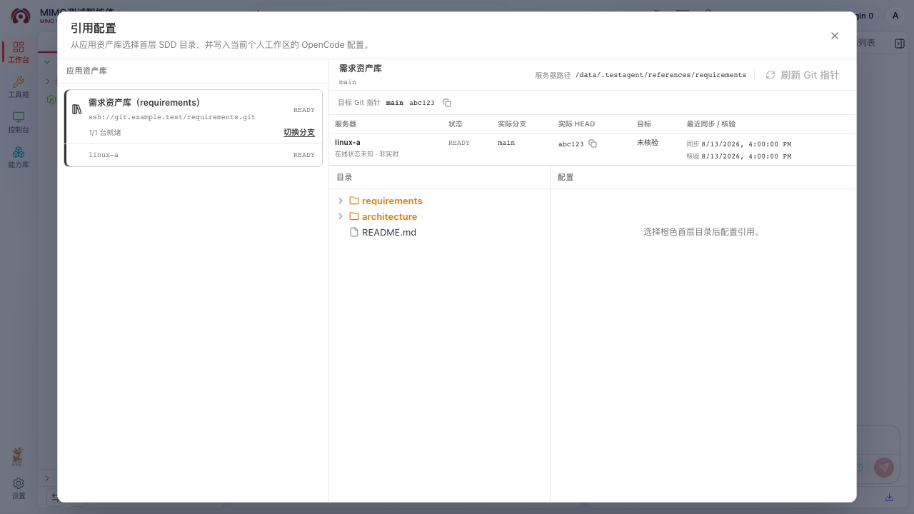
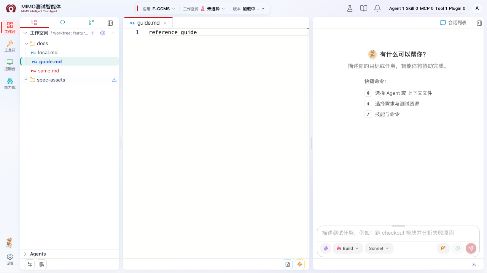

# 引用配置

“引用配置”统一管理两类只读内容：应用资产库把规格、文档目录写入当前个人工作区的 OpenCode 配置；自动化代码库按“应用 + 版本库”维护一套当前别名、分支、目录和描述。两类内容都不会复制进个人 Git，自动化代码库也不会创建个人 worktree。



## 使用前确认

- 普通应用成员可以打开入口并只读查看自动化代码库当前配置；应用管理员或超级管理员可以修改自动化引用，并使用应用资产库页签。
- 顶部已经选择目标应用，左侧已经进入该应用版本下自己的个人工作区，并且工作台已加载对应运行态工作区。
- 目标代码库已经在“设置 → 应用管理 → 应用与版本库关联”中关联到当前应用，并正确选择“应用资产库”或“自动化代码库”类型。
- 首次初始化或同步需要读取远端 Git；操作者应先在“设置 → 个人设置”配置自己的 SSH Key，并确保该账号有目标仓库和分支读取权限。

缺少应用、个人工作区或运行态工作区时，工作台不会显示“引用配置”按钮。先完成[应用版本与个人工作区](./workspace.md)中的选择步骤，不要在空工作区手工编辑物理路径。

## 配置自动化代码库目录引用

每个应用可以关联多个自动化代码库，但每个自动化代码库只有一套当前配置。管理员只需完成三步：

1. 打开“引用配置 → 自动化代码库”，在左侧点选一个代码库。点选只切换查看对象，并从已经就绪的本机共享副本读取当前目录，不会 fetch、切换分支或创建同步任务。
2. 首次配置点击卡片上的“初始化”，已有配置点击“切换分支”；在弹出的分支列表选择目标分支并点击“继续”。这一步只更新页面草稿和目录预览，还没有改变应用当前配置。
3. 在中间目录树选择仓库根目录或任意已有子目录，按需修改右侧“参考别名”和“描述”，再点击“保存”或“更新”。保存后平台解析该分支远端 HEAD、创建新配置代次并同步各服务器；当前在线服务器全部就绪后，别名、分支、目录和描述一次性整体生效。

页面没有“上一次引用”“历史版本”或日期版本。左侧一张卡片就是一个自动化版本库；右侧标题始终显示当前草稿的“分支 · 目录”。管理员可修改参考别名和描述，逻辑 path、目录名称和 `merge=否` 由平台生成并只读；别名默认是 `automation-{版本库英文名}`，要求 1–128 个字符且不能包含空格、斜杠、反引号或逗号。描述首次默认填充“版本库名称 / 分支 / 目录，只读自动化引用”。普通成员能查看当前配置和服务器状态，但表单只读，也看不到保存、同步、核验或终止操作。

只有以下操作会访问 Git 或创建后台任务：

- “保存/更新”：固定所选分支当前远端 HEAD，准备新的不可变代次，并在所有在线服务器同步共享只读副本；离线服务器显示 `DEFERRED`，恢复后自动补齐。
- “更新副本”：分支和目录不变，重新读取同分支远端 HEAD 并建立新代次。只有远端确有新提交且希望应用整体更新时才点击。
- “刷新 Git 指针”：只核验各服务器当前副本的实际分支、HEAD、origin、干净状态和目录，不 fetch、不 checkout。

同步或核验会打开与应用资产库相同的三阶段进度窗口，逐台显示等待、处理中、已就绪、等待重试、失败或离线延后。活动任务不能直接关闭；可按当前 generation 终止，迟到结果不会覆盖新的操作。

配置激活后，页面会通过既有工作区文件通道对账当前个人工作树 `.opencode/opencode.jsonc`：

- 每个应用自动化版本库只保留一条平台托管的 `references`，身份为应用 ID、版本库 ID 和 generation。
- 路径使用 `{env:OPENCODE_REFERENCES_DIR}/automation/...` 逻辑代次路径，`merge` 固定为 `false`。
- `permission.external_directory["{逻辑路径}/*"]="allow"` 与引用在同一次最小补丁中写入；同库旧分支/旧代次引用和已经无用的精确权限会移除，同时保留 JSONC 其它配置、注释和未知字段。

OpenCode 只读取这份 JSONC。Java 不会在普通对话、命令、重发、批量或定时 Run 中拼接引用说明、物理路径或隐藏 prompt。当前没有运行中任务时，保存后通过既有 dispose/reload 让新对话读取新配置；有任务运行时不会 dispose，下一项任务等待旧任务结束并完成 reload。已打开的只读标签和已启动 Run 继续使用原 generation，关闭或刷新后读取当前配置。

保存后刷新工作区文件树，可在“自动化代码库 → 自动化版本库名称”下浏览所选目录。文件可读取、分片读取、下载和加入对话，但不能编辑、上传、删除、重命名、复制、移动，也不进入搜索、Git Diff 或 requirements。新对话访问已配置目录不应再申请外部目录权限；未配置的其它外部目录仍遵循 OpenCode 默认权限。

顶部和左下角主工作空间菜单仍只列用户自己的工作版本库；自动化代码库按服务器共享，不创建个人目录、个人 worktree 或运行态 Workspace。历史自动化 worktree 和会话只保留追溯，不能再从正常入口选择、同步或执行 Git 操作。

## 初始化或同步资产库

1. 在工作台底部找到工作空间切换按钮，点击它后面的“引用配置”图标。
2. 在弹窗左栏选择一个应用资产库。
3. 如果资产库尚未初始化，打开分支选择，选择初始分支后点击“初始化”。初始化会固定该分支当时的远端提交，并开始为在线服务器准备副本。
4. 如果资产库已经初始化，点击左侧卡片只查看当前状态和目录，不会同步。需要拉取当前分支最新提交时显式点击“更新副本”；真实任务会打开“创建同步任务 → 各服务器同步 → 汇总同步结果”弹层。逐服务器会显示等待同步、同步中、已同步、同步失败、等待重试或离线延后；活动操作可在弹层内二次确认“终止”。某台服务器进入“等待重试”时，弹层还会显示“重试”，点击后先终止旧 generation，再自动创建新同步代次；终止或自然失败后的终态也可重试。执行期间不能直接关闭进度弹层或外层引用配置页，终态会保留到手动关闭。应用管理员也可点击“切换分支”，确认后才更新所有服务器。
5. 已选仓库标题右侧会在“刷新 Git 指针”按钮左边显示当前服务器上的绝对仓库路径；长路径可悬停查看完整内容。旧版本服务、引用根参数缺失或历史英文名不合法时显示“服务器路径暂不可用”，不影响继续查看仓库状态。
6. “服务器 Git 指针”区域对照目标 branch/HEAD 与各服务器实际 branch/HEAD，并分别显示“最近同步”和“最近核验”：前者是最近一次成功把副本同步到目标的时间，后者是最近一次完整读取本机实际指针的时间。点击“刷新 Git 指针”只读取本地 Git，不拉取或切换；按钮点击后会立即打开“创建核验任务 → 各服务器核验 → 汇总核验结果”进度弹层，每台服务器分别显示等待认领、核验中、完成、等待重试、失败或离线延后。核验也支持终止；进入等待重试时点击“重试”会先终止旧代次，再创建新的只读核验代次。核验进行中不能直接关闭弹层或外层引用配置页；成功、失败或人工终止后结果会保留，检查完毕再手动关闭。卡片同步不会在结束后追加核验请求，刷新核验也不会触发同步；两种弹层都只展示本次真实操作。状态轮询临时失败会显示提示并自动继续，排查失败时请保留 `traceId`。绿色“一致”表示可信目录、origin、干净状态和指针均符合目标，红色“不一致”需要查看该服务器错误；“未核验”或“在线状态未知”表示兼容响应没有足够事实，页面不会自行推断。
7. 页面每 2 秒刷新一次活动状态，不要连续重复点击。等待状态变为“已就绪”；如果某台服务器显示 `DEFERRED` 或“离线 · 非实时”，其 branch/HEAD 是最近快照，服务器恢复后会自动补同步，不影响其它在线服务器先完成。当前工作区所在服务器的副本未就绪时，右侧目录树暂不可用。

::: warning 初始化后的磁盘身份
首次初始化成功后仍不能修改版本库英文名或把类型改成其它版本库类型；英文名同时是每台服务器的引用目录名。分支只能通过引用配置中的受控“切换分支”操作修改，不要直接在服务器目录执行 Git 命令。
:::

## 选择蓝色目录

资产库就绪后，右栏显示当前服务器副本的目录树。可以展开目录查看内容，但只有仓库根层显示为蓝色的目录可以选作引用；蓝色名称由平台的 SDD 目录清单决定，默认包括 `docs` 和 `spec`。文件、嵌套目录、`.git` 和符号链接都不能选。

选择 `spec` 时会整体引用这个根目录，内部层级原样保留，不会提升需求项目录、扁平化版本目录或重新归类文件。页面只展示当前应用关联的资产库；不同应用的 `spec` 各自进入对应工作区，不会合并到一起。

类型一（图 1）在 `spec` 根层直接放置需求项目录：

```text
工作区/spec/
├── 工作区原有内容                         # 可写
├── I20260623-0170/                       # 资产库，只读
│   └── 概要设计.md
├── I20260623-0172/
└── I20260723-0066、67、68、72/
    ├── 概要设计文件
    └── 分析报告
```

类型二（图 2）先按版本分目录；需求用例可以直接位于 `2610/`，而概要设计等资料位于该版本下的需求项目录：

```text
工作区/spec/
├── 工作区原有内容                         # 可写
├── 2609/                                 # 资产库，只读
└── 2610/
    ├── 【需求用例】办理个人贷款_车贷....md
    ├── 【需求用例】气球贷二期用例.md
    ├── I20260825-0001/
    ├── I20260825-0071/
    └── I20260825-9999/
        ├── 概要设计.md
        ├── 代码变更说明.md
        └── 详细设计.md
```

因此，检索某项需求时应递归检查需求项目录，并同时检查它的上级版本目录；不要假设需求用例一定放在 `I2026...` 目录内。建议在“描述”中写明该 `spec` 包含版本级需求用例及需求级设计资料，方便 Agent 判断检索范围。平台不会把资产内容预先注入对话，Agent 在实际任务中按引用路径递归读取所需资料。

点击蓝色目录后，页面生成以下只读字段：

- 参考别名：`{目录名}-{版本库英文名}`。
- 路径：`{env:OPENCODE_REFERENCES_DIR}/{版本库英文名}/{目录名}`。
- 规格驱动目录名称：当前蓝色目录名。

可以选择“是否合并”，并填写必填的“描述”。描述应说明这份资料的用途和适用范围，方便 Agent 判断何时引用。

## 保存或更新

- 目标别名还不存在时，按钮显示“保存”。
- 已存在相同别名、相同 path 的本地引用时，页面加载现有 `merge` 和描述；表单字段有修改，或该引用的外部目录权限缺失、冲突、被后置规则覆盖时，“更新”按钮可用。
- 点击保存或更新前，页面会重新读取最新 `.opencode/opencode.jsonc`，在同一次写盘中补丁目标 `references` 节点和 `permission.external_directory` 精确规则，并保留其它配置、注释、尾逗号和未知字段。读取和写入都通过平台工作区文件通道完成。
- 既有别名是字符串、Git 引用对象或指向其它 path 时，平台不会猜测覆盖；请先人工检查同名配置并处理冲突。

平台写入的权限固定为 `"{env:OPENCODE_REFERENCES_DIR}/{版本库英文名}/{目录名}/*": "allow"`，只覆盖当前选中的根层 SDD 目录，不会写仓库级或全局 `"*": "allow"`。已有同路径 `ask`/`deny` 会改为 `allow`；合法的权限字符串简写会展开并保留原兜底动作。权限结构非法时引用和权限都不会写入，请先修复配置后重试。

保存成功后，该修改属于当前个人 worktree。按团队流程在 Git 变更中检查、暂存和提交；`.opencode/**` 的发布仍只允许应用管理员或超级管理员。

## 在工作区文件树中查看引用

保存或更新成功后，工作台会刷新当前工作区文件树；无需把资产复制到个人 Git，也无需重启进程才能浏览文件。



- `merge=true`：平台按 `sdd-folder-name` 把引用内容合并到工作区同名一级目录。例如工作区已有 `docs`，引用的 `docs` 内容也从该目录展开；已有的工作区 `docs` 保持普通颜色，只有纯引用的文件或子目录显示蓝色。
- `merge=false`：文件树以参考别名作为一级目录名称，展开后显示配置路径下的文件。别名根保持普通目录颜色，目录内容仍是只读引用。
- 同名文件不会覆盖工作区文件。出现同名冲突时会并列显示并标红，可通过悬浮信息确认来源；工作区文件仍按原路径编辑，引用版本只读。
- 单个引用暂时不可用、配置失效或当前服务器副本未就绪时，文件区会显示该引用的告警，但普通工作区文件仍可浏览。修复配置或等待副本就绪后刷新即可。

引用文件可以打开和加入对话，上下文路径显示为 `references/<参考别名>/<引用内相对路径>`。引用文件及纯引用目录不能编辑、重命名、删除、移动、上传或粘贴；工作区与引用合并形成的目录可以继续向工作区侧新建、上传、粘贴或拖入文件，但不能重命名或删除整个合并目录。引用内容不会进入工作区搜索、Git 变更列表或 `requirements` 目录。

## 什么时候对进程生效

保存引用配置不会重启 TestAgent 专属进程。当前没有运行中任务时，页面会调用 OpenCode 原生 dispose 释放进程内缓存的 workspace 实例，下一次目录或对话请求会重新读取 `.opencode/opencode.jsonc`；保存时若任务正在运行，则等任务结束后自动执行。引用资产库的 Git 同步本身不触发这次重载。

`OPENCODE_REFERENCES_DIR` 是进程环境变量，dispose 不能补充进程启动时缺失的环境。存量进程若在启动时还没有该变量，请在没有运行中任务后通过平台受管重启，或等待下次启动；不要手工杀进程或修改 manager 环境。

## 错误处理

### 分支、SSH 或 Git 错误

确认当前用户 SSH Key 已配置、Git 账号有仓库和目标分支读取权限，且分支仍存在。切换分支前确认现有引用内容允许随目标分支变化；目标分支缺少旧目录时切换仍可完成，对应工作区会显示引用目录缺失告警。不要直接修改服务器目录。

### 一直同步中、重试中或显示失败

短暂网络/超时会自动退避重试。若长时间停在“等待重试”，可在进度弹层选择“终止”；平台会封闭当前 generation 并中断仍在运行的 Git 进程。也可直接点击“重试”，由页面先终止旧 generation，再建立新同步或核验代次。终止按钮只作用于弹层实际显示的 generation，如果期间已有新操作开始，页面会提示代次已变化，不会误停新任务。目录不是可接管 Git 仓库、本地有未提交修改、origin 不一致、同分支提交分叉或切换目标的本地分支分叉、参数或凭据错误会阻塞本轮。部分服务器成功时不会回滚；修复失败节点后再重试即可继续收敛。不要删除、清理或覆盖服务器目录；把版本库、服务器指针、页面错误码和 `traceId` 发给管理员排查。

### 目录树不可用

先确认总体状态和当前服务器副本都已就绪。路径越界、`.git`、符号链接和不存在目录会被后端拒绝；页面只允许从树中选择，不要自行拼接绝对路径。

### 工作区文件树只显示部分引用

查看文件区上方的引用告警。平台会逐个校验当前应用关联、版本库类型、JSONC 字段、本机副本状态和安全路径；一个引用失败不会隐藏其它引用或工作区文件。文件夹内容超过单层展示上限时会提示结果已截断，请调整资产目录结构，不要通过符号链接或 `..` 绕过限制。

### 保存配置失败

确认仍在原应用和个人工作区，且自己仍有应用管理员权限。JSONC 语法错误、`references` 不是对象、同名别名类型或 path 冲突、`permission` 或 `external_directory` 不是合法动作/规则对象时，页面会保留原文件并显示错误。修复文件后重新选择目录；如错误带 `traceId`，联系管理员时一并提供，但不要发送 SSH 私钥、token 或完整敏感配置。
