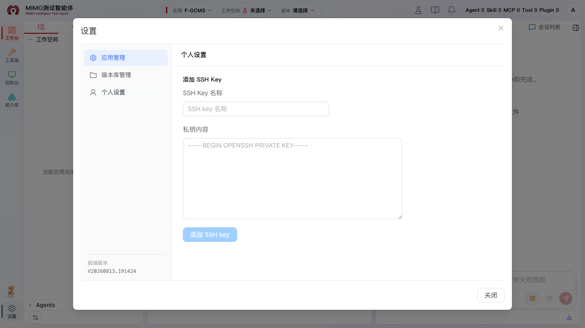
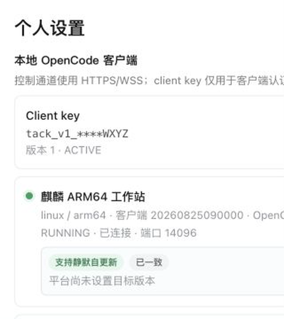

# 设置与权限内操作

设置弹窗会根据当前账号角色显示不同入口。普通用户先看“个人设置”；如果账号同时拥有应用管理员权限，还会看到应用和版本库相关管理入口，并可从左侧活动栏进入“系统管理”，但控制台只显示“配置管理 → 应用 Git 刷新”。超级管理员继续看到完整系统管理能力；点击定时任务、运行管理、通用参数等控制台二级菜单时，会在中央功能区打开或切换对应的应用内页面 Tab，不会替换或关闭其它已打开功能。页面不会把超级管理员专属的用户管理、公共配置和运行管理入口作为普通用户或应用管理员的操作步骤。

应用管理员的新手引导会把设置面板逐页打开：08“版本库管理”、09“应用人员管理”、10“应用与版本库关联”、11“工作空间管理”，每一步只说明当前页签的操作。

## 设置面板怎么用

打开工作台左侧活动栏的齿轮后，按下面顺序操作：

1. 普通用户进入“个人设置 → SSH Key”，填写 Key 名称、粘贴私钥并点击“添加 SSH key”；删除旧 Key 时点击对应的“删除”。
2. 应用管理员先在“版本库管理”登记 Git 版本库，再进入“应用管理”，在顶部下拉框选中目标应用，按“应用人员管理 → 应用与版本库关联 → 工作空间管理”的顺序操作。
3. 工作空间保存成功后，回到工作台顶部选择 workspace 并确认默认版本；也可使用左下角保留入口。只选应用、不选 workspace/version 时，文件树保持空白是正常的。

下面的配置对应这条操作链：用户配置负责“谁能进入应用”，版本库配置负责“应用使用哪些代码库”，应用工作区配置只负责创建测试 workspace；自动化代码库的应用级只读 Reference 统一在工作台“引用配置”中管理。

## 普通用户：个人设置

普通用户打开工作台左侧活动栏的齿轮，进入“设置 → 个人设置”，主要完成自己的 SSH Key 管理；已获客户端灰度的账号还可以在同一页接入本机目录。

### 自定义左侧菜单

**适用场景：** 把常用的内网页面或平台同源功能入口固定到自己的左侧活动栏，避免每次重新输入地址。

1. 在左侧活动栏的能力库之后，点击末尾的 `+`“添加自定义菜单”。
2. 输入不超过 12 个字符的菜单名，选择图标，并填写 URL；最多保存 10 项。URL 只能是 `http://`、`https://` 地址，或以 `/` 开头的平台同源路径，不能包含账号、密码、`javascript:` 或 `//` 这类省略协议写法。
3. 点击“添加菜单”。新项会按配置顺序显示在活动栏，点击后在中央区域打开独立页面 Tab；页面工具栏可刷新，也可在新窗口打开。
4. 需要调整时重新点击 `+`，在列表中编辑或删除。删除需再次确认。

自定义菜单仅保存到**当前账号在当前浏览器**的本地存储，不会写入应用、工作区、个人 worktree 或服务端，也不会同步到其他浏览器或设备；清理浏览器站点数据后需要重新配置。外部网站若禁止嵌入，使用页面右上角“在新窗口打开”。

### 接入本地客户端并创建 Client Key

1. 打开“本地 OpenCode 客户端”区域，在 **Client key** 卡片点击“创建”。创建或轮换后密钥只显示一次；立刻复制并只粘贴到客户端首次接入向导，不要粘贴到聊天、日志或命令行参数中。之后页面只显示掩码；遗失时只能“轮换”生成新 Key。
2. 首次安装、覆盖升级或重新下载时，点击本区域右上角“下载最新客户端包”。头像菜单不再提供重复下载入口。当前只支持麒麟 ARM64。
3. 完整解压下载的 `tar.gz`，双击解压目录中的 `TestAgent-Local-Client`，按向导输入统一认证号和 Client Key。安装仅写入当前账号的 `~/.local` / `~/.config`，不需要 sudo；不要在压缩包预览窗口中直接运行。

### 用客户端选择并使用本地目录（默认方式）

1. 等“本地 OpenCode 客户端”中的实例显示在线，或看到系统托盘中的 TestAgent 图标。点击该图标，在弹层中选择“选择并注册工作区…”。该项不可点时，先选择“重连”并等待客户端恢复在线。
2. 在系统目录窗口中选中要使用的项目根目录并确认。客户端会用目录名作为默认工作区名称；注册只建立受控连接和工作区记录，不会上传、复制、移动或删除本机文件。
3. 成功后客户端会自动打开对应工作台。本页的“已注册本地工作区”会列出该目录；以后直接在工作台顶部“工作空间 → 本地工作区”中选择名称即可重新打开，不必再次选目录。
4. 自动打开浏览器失败时，在同一托盘弹层点击“打开网页”，再从顶部“工作空间 → 本地工作区”选择刚注册的目录。客户端离线时该目录不能打开，先启动或重连客户端。

客户端重启、重新安装或更换为新的在线实例后，平台会在连接恢复期间逐项核验当前账号历史已注册目录的真实路径和文件系统身份；校验通过的目录会自动恢复到当前在线客户端，不需要在网页里再次选择。目录被移动、删除或身份已经变化时会跳过该项，再从托盘“选择并注册工作区…”选择实际目录。

### 没有系统托盘时：网页兜底注册

只有在桌面环境没有系统托盘，或默认托盘流程不能使用时，才在“本地 OpenCode 客户端”下方的“网页兜底注册本地工作区”操作：选择在线客户端，点击“网页浏览”，单击目录选中它，再点击“使用所选目录”。页面会自动带入目录名和绝对路径，最后点击“注册工作区”。双击目录是进入下一层，不是完成注册。

头像菜单只显示当前在线的本地客户端状态，历史离线版本不展示；在线但本地 OpenCode 异常时仍显示重启入口。
“个人设置 → 本地 OpenCode 客户端”始终保留“下载最新客户端包”，可用于首次安装、覆盖升级或人工恢复。

用户在托盘中主动退出后，客户端不会自行启动。需要恢复连接时，从系统应用菜单打开“Test Agent 本地客户端”；
若服务端已拒绝旧 Client key，启动器会提示重新输入统一认证号和当前 Key，成功后自动清除失效标记并重启连接。

只有超级管理员在“系统管理 → 用户管理”中为当前账号开启“客户端灰度”时，上述下载、状态、本地工作区和个人客户端设置才会显示；打开灰度不会自动安装、启动或连接客户端。
关闭灰度只隐藏网页功能，不停止客户端、不重启本地 OpenCode，也不撤销 client key。头像菜单会在每个本地
实例卡片上提供“重启本地 OpenCode”，并在 Key 有效时提供“撤销 Client Key”；前者不影响服务端 OpenCode，
后者会按确认提示断开所有本地客户端。若灰度关闭时正处于本地工作区，工作台优先返回进入本地前的服务端
工作区，其次恢复当前应用最近工作区，没有可用项时保持未选择状态。

1. 没有 Key 时，填写便于识别的 **SSH Key 名称**。
2. 粘贴完整的私钥内容（通常以 `-----BEGIN ... PRIVATE KEY-----` 开头）。
3. 点击“添加 SSH key”，看到名称和指纹后，说明保存成功。
4. 已添加的 Key 会显示名称和指纹；不再使用时点击“删除”。

平台不会回显私钥。公钥仍需提前登记到公司 Git 服务，并确认该账号有目标仓库和分支权限；设置里的 Key 只代表当前用户，不会借用管理员的 Key。SSH 失败时先回到这里检查 Key，再联系管理员确认 Git 权限。

## 超级管理员：分别开通客户端与记忆灰度

“客户端灰度”和“记忆灰度”都是按账号控制的独立开关，不会互相开启。在“系统管理 → 用户管理”的目标用户行中，分别打开对应列的开关并在二次确认后保存：

1. 打开“客户端灰度”后，用户会看到客户端下载、头像中的本地实例状态、本地工作区和“个人设置 → 本地 OpenCode 客户端”；不会自动启动客户端。
2. 关闭“客户端灰度”后，只隐藏这些网页功能和本地工作区投影；客户端、本地 OpenCode 与 Client Key 保持原状态。
3. 打开“记忆灰度”后，只有在平台全局记忆配置已经可用时，用户才会看到“长期记忆”，并能进行学习、检索和治理操作。全局模型、Embedding 和抽取策略在“系统管理 → 记忆能力”统一维护。
4. 关闭“记忆灰度”后，入口和访问立即收口，已有记忆不会被删除；应用管理员仍只能审核团队记忆，不能替用户开通灰度。

## 账号同时有应用管理员权限时

应用管理员在设置中还会看到“应用管理”和“版本库管理”。这些入口用于为普通用户准备应用和工作区，不是普通用户自己创建应用的入口。

三类配置与页面入口的对应关系如下：

| 配置 | 页面入口 | 用途 |
| --- | --- | --- |
| 用户配置 | 应用管理 → 应用人员管理 | 把用户加入应用，或移除已有应用成员 |
| 版本库配置 | 版本库管理；应用管理 → 应用与版本库关联 | 登记 Git 版本库，并决定哪些版本库属于当前应用 |
| 应用工作区配置 | 应用管理 → 工作空间管理 | 创建和启停测试工作空间 |
| 自动化引用配置 | 工作台 → 引用配置 → 自动化代码库 | 为每个关联版本库选择唯一当前分支、已有目录和共享描述 |

### 应用管理

先在顶部应用选择框选中目标应用，再按三个页签操作：

#### Tab 1：应用人员管理（用户配置）

1. 在“应用选择”下拉框先选目标应用；不先选应用时，下面的页签不会加载对应数据。
2. 在“添加成员”输入用户 ID、用户名或统一认证号。输入后从候选下拉中点选用户，再点击“添加”；空输入不会查询用户库。
3. 在“已有成员”列表核对成员是否出现。移除成员时点击对应行右侧删除按钮，并在页面内确认。

普通用户要进入应用，必须由管理员先在这里加入；这里加入的是应用成员，不会改变用户的全局角色。

#### Tab 2：应用与版本库关联

1. 在“应用与版本库关联”页签的“选择版本库”下拉框选择已登记的版本库，点击“关联”。如果下拉中没有目标版本库，先切换左侧“版本库管理”并完成新增。
2. 关联成功后，版本库会出现在下方列表；这里的关联只决定“当前应用可以使用哪些版本库”，不会自动创建 workspace。
3. 关联错误时点击对应版本库右侧的“解除”，在页面内确认后再重新选择。

#### Tab 3：工作空间管理（应用工作区配置）

1. 在“已关联版本库”下拉框选择测试工作库；自动化代码库、应用代码库和应用资产库都不会出现在创建 workspace 的下拉框中。
2. 选择“分支”。测试工作库只允许符合 `feature_testagent_yyyymmdd` 的分支，格式不符合的分支会被禁选。
3. 填写“工作空间别名”，默认值为 `ai-test`；同一应用已有相同别名时需要改名。
4. 等分支目录树加载后选择工作目录。测试工作库只能选择当前应用同名目录下的一级子目录，路径必须严格是 `应用名称/一级子目录`；例如当前应用是 `F-APIP` 时，可以选择 `F-APIP/f-apip-support`，不能选择 `F-APIP.SUPPORT/workspace` 或 `F-APIP/f-apip-support/workspace`，并可在应用目录下点击“新增目录”。文件不能作为 workspace。
5. 点击“保存”，等待“校验参数、保存工作空间配置、解析版本和分支、下载代码、创建运行态工作区、完成”全部成功；失败时按页面提示修正后重试。
6. 创建成功只代表管理员已准备好配置。普通用户回到工作台顶部选择 workspace 并确认默认版本；也可使用左下角保留入口，选中后文件树才会加载。自动化引用的目录与版本操作见[引用配置](./reference-config.md)。

如果目录树能展开但目录无法点击，优先检查目录第一段是否与当前应用名称完全一致，以及选择路径是否只有两级；测试工作库不允许跨应用根目录或选择三级及更深目录。

应用管理员不能点击“新建应用”。如果顶部或设置中没有目标应用，应让超级管理员创建应用，再由应用管理员把成员加入。

### 版本库配置：版本库管理

“版本库管理”用于维护应用可关联的 Git 版本库：

1. 点击“新增”，先选择“部署模式”。外部部署填写完整 Git URL；内部部署会显示 `ssh://统一认证号@` 前缀，输入框只填写主机、端口和仓库路径。
2. 填写“版本库地址”“版本库名称”“版本库英文名称”，再选择“版本库类型”。内部部署的英文名称可由仓库路径自动生成；英文名称只能使用字母、数字和连字符。
3. “测试工作库”按标准库分支规则创建可切换工作空间；“自动化代码库”登记并关联后，从工作台“引用配置 → 自动化代码库”为每个版本库选择唯一当前分支、已有目录和描述；“应用代码库”和“应用资产库”继续使用各自既有入口。
4. 点击“新增”后，在“应用管理 → 应用与版本库关联”把它挂到目标应用。已有版本库可点击“编辑”修改名称和英文名称；地址、部署模式和类型在编辑弹窗中只读。
5. 新增或读取远端分支使用当前操作者自己的 SSH Key，先完成“个人设置”，并确认该 Key 对目标 Git 仓库有访问权限。

## 超级管理员：管理外部 API Key

打开“系统管理 → API Key 管理”后：

1. 点击“新增 API Key”，填写稳定的工具编码、展示名称，至少勾选一个 scope，并选择是否立即启用。首版 scope 只有“读取用户 SSH 私钥”。
2. 保存后页面只显示一次完整 API Key。立即复制到调用工具的受控密钥配置；关闭弹窗、切换到其它功能 Tab 或返回工作台后，页面都会清除明文，列表只保留掩码提示。
3. 需要再次取得当前值时点击“查看”；查看完成后关闭弹窗。不要把 Key 粘贴到聊天、工单、浏览器存储或普通日志。
4. 展示名、scope 和启停状态可编辑，工具编码创建后不可修改。停用后外部调用立即失去资格，并在各后台节点刷新后统一返回未认证。
5. 怀疑泄露时点击“轮换”并确认。新 Key 生成后旧 Key 不保留宽限期；先复制新值并立即更新调用工具。
6. 删除会永久移除该工具及 scope；确认没有调用方继续使用后再操作。

调用方的 Header、错误码和 TAEK1 解密由管理员按 `docs/api/external-api.md` 交付，不应让普通用户接触 API Key。该功能仅供受信内网服务端工具，不用于浏览器脚本。

## 应用管理员或超级管理员：按分支或整个应用刷新 Git

当需要把某个应用关联的 feature 和相关个人 worktree 向远端收敛时，打开“系统管理 → 配置管理 → 应用 Git 刷新”：

1. 先在“个人设置”确认当前操作者自己的 SSH Key 可访问目标应用的全部 Git 仓库。
2. 应用管理员只会看到自己具有有效成员关系的启用应用；超级管理员仍可看到启用和停用应用。页面只列出已经创建具体 feature 分支的应用；在应用列表先核对“工作空间 / 版本 / 分支”列，不同工作空间或同一工作空间的不同版本会分别显示实际 feature 分支。
3. 只更新一个分支时，点击该分支右侧“刷新该分支”；需要整体收敛时，点击应用行的“刷新全部分支”。确认弹框会再次说明本次范围。
4. 等待页面显示仓库组汇总；单分支操作应显示 1 组，全量操作显示应用下全部组。“更新”和“已是最新”都表示对应组已重新触发相关 worktree 收敛，“失败”需要展开明细，按错误码和 `traceId` 排查。

刷新按“版本库 + 版本 + 分支”识别物理 feature；单分支操作不会处理同应用其它分支，全量操作处理应用下全部组。应用管理员必须是目标启用应用的有效成员；伪造或停用应用 ID 会被后端拒绝。超级管理员无需先加入应用，两类管理员都不需要启动个人 OpenCode。平台不会 stash、reset 或覆盖成员的个人修改：非重叠修改会保留并自动合并，存在覆盖风险或冲突的 worktree 会留给对应用户处理。该入口与工作台个人“拉取远程”不同；个人拉取仍只更新点击者自己的 worktree。公共配置仓库仍在“TestAgent公共配置管理”中单独维护。

## 超级管理员：刷新公共 Agent Git

打开“系统管理 → 配置管理 → TestAgent公共配置管理”后，未初始化的服务器仍需逐台选择分支初始化；已有仓库的更新只使用页面顶部一个“刷新公共 Agent Git”按钮：

1. 选择远端公共分支。平台先解析该分支当前 commit，并让所有服务器共享运行副本同步到这一固定 commit，不需要也不能选择单台服务器。
2. 如果页面列出某些服务器的共享运行副本存在本地变更，先核对服务器和路径。只有确认这些运行副本不需要保留时才继续；平台会恢复这些共享副本，并清理其中未跟踪内容。
3. 刷新期间按钮保持禁用。页面按服务器展示 Git 同步、旧进程排空、个人 worktree 待处理数、重试次数和 `last_error`；等待任务进入完成或终止状态。
4. 每位用户的公共个人 worktree 使用 Git 原生 merge。只要不会覆盖同一文件，已暂存、未暂存和未跟踪内容都会保留；存在覆盖风险或冲突时只暂停该用户的 worktree，其他服务器和用户继续更新。用户处理 Diff 或合并冲突后，后台会自动重试。

共享运行副本只负责运行，不能直接在 `/data/.../.config/opencode` 中创建或编辑 Skill。通过对话创建 Skill 时，先在当前个人 worktree 生成草稿，再进入公共 Agent 编辑区查看 Diff、提交并发布。

## 为什么我看不到某个设置入口？

设置菜单按权限显示：

| 账号权限 | 可见入口 | 普通使用重点 |
| --- | --- | --- |
| 普通用户 `USER` | 个人设置 | 配置或删除自己的 SSH Key，然后从顶部加入应用、从左下角选择 workspace/version |
| 应用管理员 `APP_ADMIN` | 应用管理、版本库管理、个人设置；系统管理（仅应用 Git 刷新） | 为应用成员准备版本库、关联和工作空间，刷新自己所属的启用应用 Git，并维护自己的 SSH Key |
| 超级管理员 `SUPER_ADMIN` | 应用管理、版本库管理、个人设置；系统管理 | 继承应用管理能力，并在独立“用户管理”页统一维护账号、用户名、角色、记忆灰度和客户端灰度；同时维护 API Key、应用 Git、全局记忆配置、公共配置和运行资源 |

看不到“应用管理”或“版本库管理”通常不是页面故障，而是当前账号没有应用管理员权限。应用管理员进入系统管理后只看到应用 Git 刷新属于正常权限边界；看不到“新建应用”、公共配置或运行管理也不是页面故障。普通用户应联系管理员处理应用和工作空间准备。
