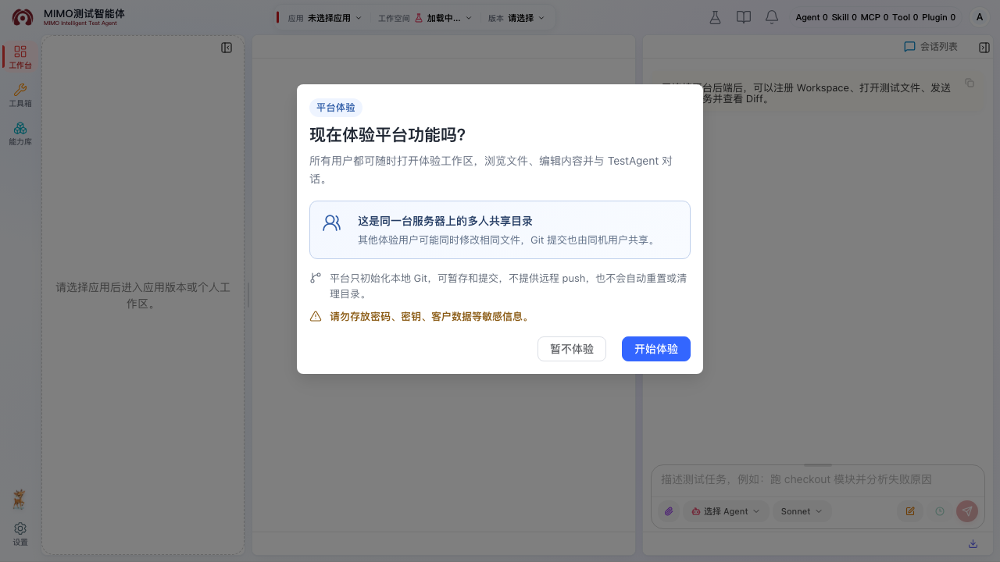
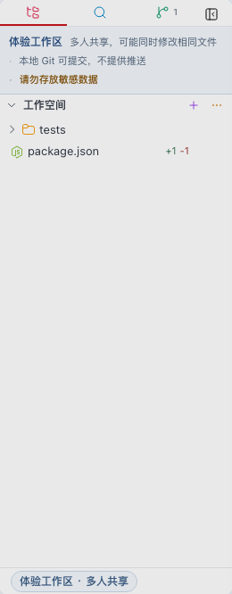
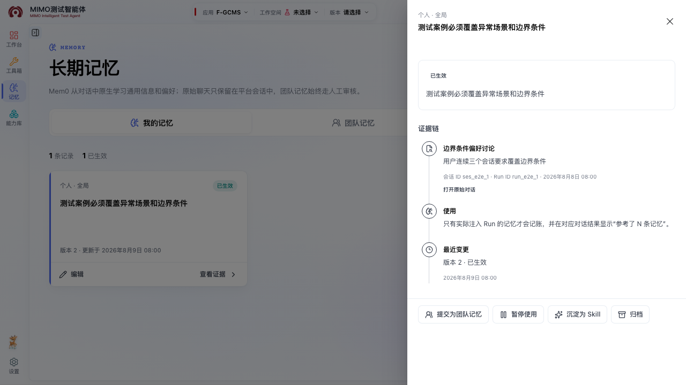
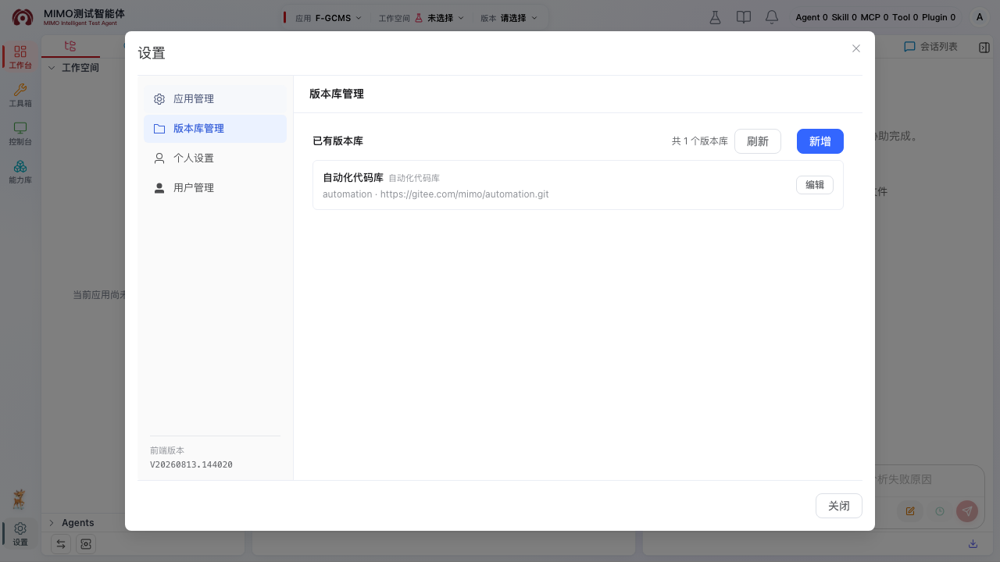
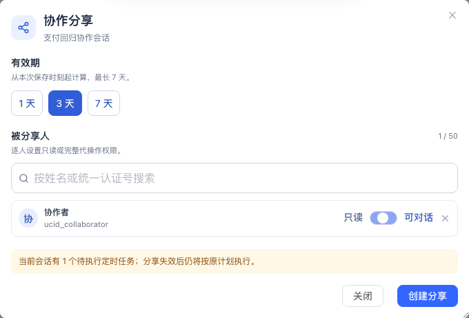

# 每周新功能

这里按周汇总已经在当前版本开放的新功能。每项都先说明适用场景，再给出使用前配置、实际操作路径和操作截图；需要完整规则时，可继续打开对应专题。后续更新会把最新一周放在最前面。

## 2026 年 8 月 10 日—8 月 16 日（更新至 8 月 13 日）

| 如果你想…… | 本周可以使用 |
| --- | --- |
| 还没准备应用，也想先体验文件、对话和 Git | 平台体验工作区 |
| 让新任务自动复用个人或团队经验 | 长期记忆（按账号开放） |
| 在测试工作区内只读参考指定日期版本的自动化脚本 | 自动化代码库 Reference |
| 把一条会话交给同事查看或继续处理 | 通知中心与会话协作 |
| 一次把多份测试资料带到关联页面 | 多选资料并缓存跳转 |

### 不进入应用，也能先体验完整工作台

**适用场景：** 第一次接触平台、暂时没有所属应用，或者想快速试用文件编辑、终端、对话和 Git，又不想先准备正式工作空间。

**使用前配置：** 普通用户无需加入应用，也无需自己配置目录；只要登录后本人的 TestAgent 进程可用即可。首次进入时如果进程尚未启动，按页面提示初始化。平台管理员通常无需改默认值；只有需要把体验目录放到指定磁盘时，才在通用参数中配置 `OPENCODE_EXPERIENCE_WORKSPACE_DIR`，并确认目标目录可写。

**怎么用：**

1. 点击顶部书本图标左侧的烧瓶按钮“进入平台体验”。
2. 第一次进入时阅读共享目录说明，点击“开始体验”；如果 TestAgent 尚未启动，按页面提示完成初始化。
3. 在左侧浏览或编辑普通文件，也可以使用搜索、终端和右侧对话。
4. 需要保留一组本机修改时，打开“变更”，暂存文件并建立本地提交。
5. 体验结束后再次点击同一个烧瓶按钮“退出平台体验”。有应用时会优先回到进入前的应用工作区；没有应用时回到普通空态。

进入后，左侧会固定显示“体验工作区”“多人共享”和“本地 Git 可提交，不提供推送”，可以据此确认自己没有误入正式应用工作区。

::: warning 先看清共享边界
体验目录和本地 Git 由同一台服务器上的体验用户共享，其他人可能同时修改相同文件。这里可以建立本地提交，但不提供远程推送或发布。不要存放密码、Token、SSH Key、客户数据等敏感内容。
:::

### 长期记忆会在新任务中自动复用经验

**适用场景：** 希望平台记住“回答先给结论”“缺陷结论要附复核证据”等可重复使用的个人偏好或团队经验，不想每次对话都重新说明。

**使用前配置：** 该能力按账号灰度开放。普通用户无需配置模型或服务参数；如果左侧没有“记忆”入口，联系平台超级管理员确认开放范围。超级管理员在“系统管理 → 记忆能力”统一配置一次 Mem0、Embedding profile、固定 CHAT 模型和抽取策略，再到“系统管理 → 用户管理”打开目标账号的“记忆灰度”。应用管理员只负责审核本应用的团队记忆候选，不能代替超级管理员开放账号。

**怎么用：**

1. 已开放账号从左侧活动栏打开“长期记忆”。未开放账号不会显示入口，直接访问记忆页面也会回到工作台；原有对话和任务仍可正常使用。
2. 在“我的记忆”中添加个人记忆，并选择只用于当前应用还是本人的所有应用；已暂停或已归档的记忆不会进入新任务。
3. 需要团队复用时，把记忆提交到“团队记忆”，等待应用管理员审核。团队候选在批准前不会影响其他成员。
4. 新任务真正引用记忆后，完成结果旁会显示“参考了 N 条记忆”；没有显示只代表本轮没有实际使用记忆。

已经稳定复用的经验还可以发起 Skill 提案，再到 Skill Hub 完成 Git 和发布流程。来源证据、审核与归档规则见[长期记忆](./memory.md)。

### 自动化代码库改为工作区内只读参考

**适用场景：** 在当前测试工作区中参考同一应用的自动化脚本，但不修改或切换进自动化仓库。

**入口在哪：** 进入测试工作空间后，左侧组合文件树根部会出现虚拟目录“自动化代码库”。顶部和左下角的主工作空间菜单不再列出自动化仓库。

**普通用户怎么用：**

1. 选择应用并进入一个测试工作空间。
2. 展开左侧“自动化代码库”，再展开需要参考的自动化配置。
3. 文件可以只读打开、下载或加入对话；不能编辑、上传、删除、移动、搜索或执行 Git 操作。
4. 管理员切换当前版本后，新展开或刷新使用新版；已经打开的标签继续显示打开时的旧版本，关闭后重新打开才更新。

**使用前配置（应用管理员或超级管理员）：**

1. 点击页面左下角齿轮“设置”。如果还没有 SSH Key，点击左侧“个人设置”，填写“SSH Key 名称”和“私钥内容”，再点击“添加 SSH key”。
2. 点击设置左侧“版本库管理”，再点击“已有版本库”右侧的“新增”。依次选择部署模式，填写版本库地址、名称和英文名称，把“版本库类型”选为“自动化代码库”，最后点击弹窗右下角“新增”。
3. 点击设置左侧“应用管理”，在页面上方“应用选择”中选中目标应用，再点击“应用与版本库关联”。从“选择未关联版本库”下拉框选中刚才的自动化代码库，点击“关联”。
4. 返回工作台并进入一个测试工作空间，打开左下角“引用配置”，切换到“自动化代码库”；选择刚关联的版本库并点击“新增目录引用”。
5. 依次选择分支、填写引用名称和 `yyyyMMdd` 版本日期，再从目录树点击任意已有目录并保存。首个版本会自动成为当前版本；后续版本在同一页新增并点击“设为当前版本”。普通用户在该页只读查看。

自动化代码库允许选择远端树中的任意已有目录，但不能在该表单中新建目录；文件也不能作为配置根目录。平台复用共享版本副本，不再为用户创建自动化个人 worktree。完整字段和权限见[引用配置](./reference-config.md)与[应用版本与个人工作区](./workspace.md)。

如果文件树没有“自动化代码库”，先确认当前是该应用的测试工作空间；仍未出现时，通常是管理员尚未保存启用的自动化配置。副本未就绪或没有当前版本时会显示局部告警，不影响主工作区和文档引用。

### 分享会话后，系统会直接通知同事

**适用场景：** 请同事评审结果、交接一个长任务，或让另一位成员在原上下文和原工作区中继续处理，不再手工复制聊天记录和文件路径。

**使用前配置：** 不需要平台管理员额外开通。分享人和被分享人都要有可登录的平台账号；分享人只需在当前会话中选择成员、有效期和权限。被分享人无需配置工作空间，进入后使用的是分享人的固定会话和工作区。

**怎么用：**

1. 在已有会话右上角点击“分享”，选择 1 天、3 天或 7 天有效期。
2. 添加平台用户，并逐人设置“只读”或“可对话”权限后保存。
3. 被分享人会在顶部通知铃铛中收到提醒；点击有效通知会在新标签页打开会话，成功进入后通知才变为已读。
4. 没看到通知时，可从“会话列表 → 分享给我”查找。需要收回权限时，由分享人再次打开分享设置并取消分享。

“可对话”成员使用的仍是分享人的会话和工作区，页面会记录实际操作人；同一条分享会话同时只能执行一个任务。完整协作边界见[对话与上下文](./conversation.md#把会话分享给同事)。

### 一次带多份测试资料去关联页面

**适用场景：** 测试设计或测试执行资料分散在多个文件中，需要一次带到关联的需求、案例或执行页面继续处理。

**使用前配置：** 普通用户无需逐个文件配置，只需确认文件位于“测试设计”或“测试执行”目录。平台交付管理员需要在前端构建配置中提供 `VITE_CACHE_DATA_URL`，指向受控的资料缓存服务；页面提示“缓存数据地址未配置”时，联系管理员处理。浏览器还需要允许当前站点打开新标签页。

**怎么用：**

1. 在工作空间文件树中按住 `Ctrl`（Windows）或 `Cmd`（macOS），选择多个文件或目录。
2. 点击工作空间标题右侧带数量的纸飞机按钮“缓存并跳转”。
3. 新标签页打开后继续处理；原文件不会被移动、改名或删除。

测试设计只支持文件，测试执行支持文件和目录。一次建议只选择同一类资料；路径中的 `S-数字` 子条目编号会一并带过去。更多限制见[应用版本与个人工作区](./workspace.md#把测试资料带到外部页面)。
