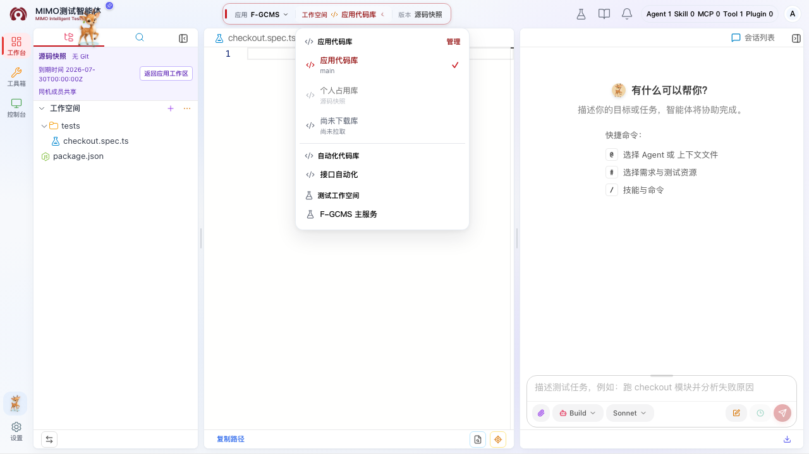
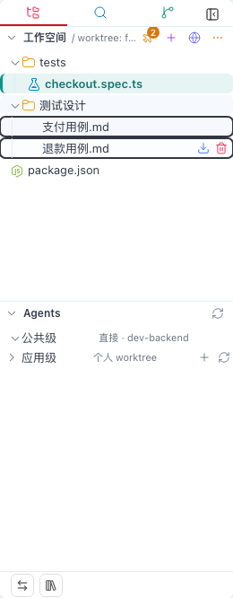

# 应用版本与个人工作区

工作区决定 Agent 能看到和修改哪些文件。当前平台使用两套物理 Git：应用 Git 保存业务文件、`docs/**`、应用配置和个人 `spec/**` 提交；公共 Git 保存跨应用 Agent/Skill 配置。为了避免多人互相覆盖，应用 Git 再分成应用版本 feature worktree 和每位用户自己的个人 worktree。

## 三个层级分别是什么

- 应用：业务系统或测试项目，例如某个具体系统。
- 应用版本：该应用的一条开发或测试版本线，关联远端 feature 分支及应用版本 worktree。
- 个人工作区：当前用户在该版本下的独立 worktree，默认名称通常是 `default`；它固定保存在当前用户 TestAgent 进程所属服务器的磁盘中。

切换应用或版本时，文件树、Git 变更和对话上下文都会变化。切换前先保存编辑中的文件，并确认是否有未提交修改。

同一版本库下的多个测试工作空间可能共用一棵个人 Git 仓库。切换版本时，系统会按 Git 原生规则合并该版本的固定提交：兄弟工作空间、`spec/**` 或 `.opencode/**` 中不会被覆盖的本地修改会原样保留，不会因为仓库“不干净”而阻止切换；只有目标更新确实会覆盖的文件才会被点名提示先提交或回退。若双方都修改了同一内容，工作区会保留合并现场，请在左侧“变更”中完成三方冲突处理；系统不会自动 stash、reset 或丢弃文件。

## 应用选中了，为什么工作区还是空白？

应用和 workspace 是两个选择动作：顶部应用下拉只确定业务范围，**不会自动选中 workspace**。顶部“工作空间”按钮会按分组列出“本地工作区、应用代码库和测试工作空间”；左下角入口也可切换受管工作空间。自动化代码库不再是主 workspace，而是在测试工作区文件树根部以只读 Reference 展示。

1. 要查看开发源码时，在“应用代码库”分组选择代码库；已拉取且可用的副本会直接打开，设置中尚未拉取的代码库以灰色显示但仍可点击，点击后进入原有下载/管理页面。
2. 进入开发代码库后，顶部版本按钮只读显示“源码快照”；它不是测试工作空间版本。
3. 进入测试工作空间后，从左侧紫色“自动化代码库”浏览各版本库的当前配置代次；自动化内容只读，不参与顶部版本切换、最近工作空间、个人 worktree 或 Git 操作。
4. 第一次进入测试版本时，按页面提示创建或切换自己的 `default` 个人工作区，再开始编辑或对话。

### 已经注册本地目录，怎样在工作台使用？

本地目录必须先由本机客户端注册，不能在浏览器中直接填写一条电脑路径。客户端注册成功后，打开顶部“工作空间”，在“本地工作区”分组点击该目录名称；文件树会通过客户端加载这个目录。目录显示“离线”或不能点击时，先在本机启动/重连 TestAgent 客户端，再刷新菜单。

本地工作区与服务器测试工作空间分开管理：它不参与顶部版本切换，也不会把本机绝对路径写入浏览器地址；切换到别的应用或测试工作空间后，仍可从同一菜单再次打开已注册本地目录。注册步骤和网页兜底方式见[个人设置](./settings.md#用客户端选择并使用本地目录默认方式)。

以下情况都会让文件区暂时为空，但含义不同：

| 页面状态 | 原因 | 下一步 |
| --- | --- | --- |
| 顶部已有应用，但版本仍显示“请选择” | 只选中了应用或工作空间尚未加载出版本 | 在顶部重新选择工作空间，或使用左下角入口完成选择 |
| 已选 workspace/version，提示准备个人工作区 | 个人 `default` worktree 尚未准备完成 | 等待完成，或按提示确认创建 |
| 菜单没有可选版本 | 还没有为该应用工作空间创建版本 | 打开顶部“版本”菜单并点击下方带「＋」的“按分支新建版本”，或在左下角工作空间菜单展开目标工作空间后创建 |
| 选中后仍报加载失败 | 文件通道或目标工作区暂时不可用 | 点击文件区“刷新”，仍失败时把应用、版本和 workspace 名称提供给管理员 |

## 第一次进入版本

1. 从顶部选择应用。
2. 在顶部选择 workspace 模板并确认默认版本；也可使用左下角“切换工作空间”。
3. 页面提示创建个人工作区时，确认使用默认工作区。
4. 等待工作区准备完成，确认左侧“工作空间”文件树出现内容。
5. 再开始对话或编辑文件。

进入“最近使用”但没有可反查的版本，或该版本还没有个人工作区记录时，页面可能保持空态。这不是文件丢失；请显式选择版本并创建或切换个人工作区。

## 基于已有工作空间新增版本

1. 先在顶部选择应用和目标测试工作空间。
2. 打开顶部“版本”菜单，点击已有版本列表下方带「＋」的“按分支新建版本”；左下角工作空间入口悬停目标工作空间后也保留同一入口。
3. 标准测试工作库直接选择已有的 `feature_testagent_yyyyMMdd` 远端分支后确认，平台会从分支名识别版本号，不再要求重复选择月和日；兼容的非标准工作空间仍需补充日期版本。
4. 创建成功后，平台准备当前用户的 `default` 个人 worktree 并自动切换到新版本。

两个入口复用工作空间配置和远端 Git 分支，不会复制当前个人 worktree 中尚未提交或尚未发布的修改；下拉没有目标标准分支时需要先在开发者门户创建。

## 用小地球引入需求子条目

选中可写 workspace 后，在左侧“工作空间”标题右侧找到小地球按钮（悬停提示为“从 TCDS 导入需求”）。点击后会在项目内打开同源需求导入页；页面不会把用户身份、服务器地址或工作区磁盘路径传给外部站点：

1. 选择 TCDS 授权应用和月份版本；默认显示当前月，也可以在前后各 3 个月内切换。
2. 搜索并勾选要导入的子条目。父条目可全选当前过滤结果，页面顶部可对当前过滤结果进行全选或取消；搜索不会清掉已有选择。
3. 点击“导入选中项”。平台会通过当前工作区文件通道创建 `spec/{父条目编号}-{父条目名称}/` 下的需求、设计、编码和测试目录，并把可转换的需求/设计文档写成 Markdown。
4. 全部成功时页面自动关闭并刷新文件树；部分成功时页面保留、文件树刷新，并列出可重试的失败项；完全失败时不关闭页面。
5. 在右侧对话输入框键入 `#`，可以选择已导入内容作为当前任务上下文。

切换应用或月份会清空选择并重新加载。一次最多选择 100 个子项；文档受单文件 20 MiB、单次总量 200 MiB 限制，未知格式只影响对应文件，不会回滚已经成功的目录和文档。重复导入会复用目录并覆盖同名导入文件，不会删除目录中的其它文件。

如果小地球不可点击，通常是因为还没有真正选中 workspace、当前工作区只读，或正在浏览支持访问、体验空间或源码快照；先切回有写权限的个人工作区。它不是“新建应用”、不是 workspace 切换按钮，也不是普通文件刷新按钮。

## 把测试资料带到外部页面

文件树里的纸飞机按钮叫“缓存并跳转”。它会读取你选中的测试资料，把内容交给已配置的外部页面，并在浏览器新标签页打开结果。原文件不会被移动、改名或删除。

1. 在当前工作空间的文件树中，按住 `Ctrl`（Windows）或 `Cmd`（macOS）点击，选择一个或多个文件或目录。
2. 选择后，“工作空间”标题右侧会出现纸飞机和已选数量。点击它即可跳转。
3. 测试设计只支持文件；测试执行支持文件，也支持整个目录。选择测试执行目录时，目录下的文件会一起带过去。
4. 如果文件路径中带有 `S-数字` 形式的子条目编号，系统会一并带到外部页面，便于直接定位对应子条目。

一次操作建议只选测试设计，或只选测试执行，不要混在一起。其它目录不会被带过去；如果所选内容里没有可用文件，页面会直接提示。点击后没有打开新标签页时，先检查浏览器是否拦截了弹窗；如果看到“缓存数据地址未配置”或请求失败，请联系平台管理员检查外部页面配置。

## 管理员怎样创建应用和工作空间

- 超级管理员：进入“设置 → 应用管理”，点击“新建应用”，填写唯一应用 ID 和应用名称。
- 应用管理员或超级管理员：先在“版本库管理”新增版本库，再到“应用管理 → 应用与版本库关联”完成关联。
- “工作空间管理”只接受测试工作库并创建可切换的测试工作空间。自动化代码库在工作台“引用配置 → 自动化代码库”中保存应用级只读目录引用并准备共享副本，不创建个人 worktree，也不进入主工作空间菜单；每个已关联自动化版本库只配置一个当前分支、一个任意已有目录和一段描述，不填写日期版本，也不支持新建目录。

这些远端 Git 操作使用当前操作者自己的 SSH Key；管理员也必须先在“个人设置”完成 Key 配置。字段含义和完整步骤见[首次使用前准备](./first-time-setup.md)。

### 目录显示但无法选择

测试工作库的目录树不是任意目录选择器。若目录可以展开但节点无法点击，请检查：

1. 第一段是否为当前应用名称，而不是相似的仓库工程名；名称比较区分大小写、连字符和点号。
2. 选择路径是否正好两级，即 `应用名称/一级子目录`；应用根目录本身、文件、其它应用目录和三级及更深目录只能浏览，不能作为 workspace。
3. 分支是否符合 `feature_testagent_yyyyMMdd` 格式；没有可用分支时目录树不会产生可选工作目录。

## OpenCode 实际读取哪个目录

OpenCode、内置编辑器、文件树和终端始终使用当前个人 worktree，不直接在应用版本 feature worktree 中工作。因此，同一轮任务里 Agent 读取和写入的是同一个磁盘目录，文件名和仓库相对路径不会因发布而变化。

发布时，后端利用个人 worktree 与应用 feature worktree 属于同一个应用 Git 的关系，按“个人工作区记录 → 个人 Git `HEAD` → 仓库相对路径”读取已提交内容，再把允许发布的路径投影到应用 feature worktree。两个 worktree 的绝对路径不同，但 `docs/example.md` 之类的仓库相对路径保持一致。

## 文件操作与 Git 变更

- 文件列表、读取、保存、重命名和搜索都通过平台文件通道完成。
- 中间编辑器默认按视口宽度自动换行；换行只影响显示，不会改写文件中的实际换行符。
- 左侧文件树支持按住 `Ctrl/Cmd` 单击增量多选，也可以先普通点击一个文件或目录建立锚点，再按住 `Shift` 单击另一项，从上到下连续选中两点之间当前可见的文件和目录；展开目录中的条目参与范围选择，折叠目录中的条目不参与，只读引用会自动跳过。右键可对选中内容统一删除或剪切；只有全为文件时才提供复制，也可把任一已选条目拖到目标目录。普通文件还可使用 `Ctrl/Cmd+C`、`Ctrl/Cmd+X` 和 `Ctrl/Cmd+V`，`Ctrl/Cmd+Z` 可撤销当前个人 worktree 最近一次复制、移动或上传。复制、移动都不会覆盖同名文件。
- 工作区标题或目标目录右侧的 `+` 会打开“新建/上传”面板，并明确显示文件将写入的目标目录；可从本机一次选择多个文件，也可选择整个文件夹并保留里面的子目录层级，还可以把本机文件拖到根目录或目标目录。上传不会覆盖同名文件，采用分片传输且不设置应用层单文件总大小上限；上传期间会显示遮罩、当前文件和字节进度。
- 上传带图片的 Markdown 时，请在系统选择窗口中同时多选 `.md` 和现有图片，或直接使用“上传目录”。浏览器不能在只选 `.md` 后自动扫描电脑上的同目录图片。文档引用 4 张图但只选择 3 张也可以继续上传：3 张已选图片正常预览，缺少的 1 张显示“图片未上传”并可稍后补传，不影响正文。
- 超过一次性读取阈值的大型 UTF-8 文件会以只读方式渐进预览。你可以选择“继续加载一段”，也可以选择“加载全部”；完整加载可能占用较多浏览器内存并造成编辑器卡顿，页面会持续提示当前已加载字节和总大小。
- 文件和文件夹行尾的 `−` 可打开删除确认；也可先聚焦目标行再按 `Delete/Del`。删除文件夹会递归删除其中全部内容，且不能通过 Ctrl/Cmd+Z 恢复；平台禁止删除工作区根目录和 `.git` 元数据。
- 普通工作区保存后，左侧 Git 变更会刷新真实差异。
- Git 变更数量按实际变更文件计算；新建目录中的未跟踪文件会逐个列出，不会把整个目录计为一个文件。
- “应用工作空间”的未暂存分组右侧提供“全部暂存”和“丢弃全部改动”；已暂存分组的“一键回退”只把全部已暂存普通文件移回未暂存区，不会丢弃文件内容。
- “应用Agent”和“公共Agent”的未暂存分组也提供“全部暂存”，一次把当前作用域的全部未暂存配置文件加入对应个人 worktree 的 Git index。
- 存在未解决的 Git 合并冲突时，批量暂存和丢弃全部改动不可用，已暂存区一键回退仍可使用；冲突本身请逐个解决、选择全部保留本地/远程，或取消整次合并。
- 暂存只影响当前个人工作区的 Git index；提交时会形成个人 `HEAD`，其中允许发布的已选文件才会成为 feature 投影白名单。
- 冲突期间可以继续编辑和暂存普通文件，但解决冲突前不能提交。
- 只有页面明确显示远端推送成功，才代表提交已经同步到远端。

### 拉取远程

当前 workspace 标题栏的“…”菜单同时提供“刷新文件树”和“拉取远程”。“刷新文件树”只重新读取磁盘；“拉取远程”只为点击者在当前应用的整棵个人 worktree 执行 Git fetch 和 merge，因此同一分支下其它 workspace 目录与应用 Agent 也可能一起更新，但不会提交、推送、更新共享版本或修改其他用户。

首次拉取会提示“应用 Agent 也会更新、系统会直接 merge”，可选择以后不再提示。Git 能安全合并时会保留 staged、unstaged 和 untracked 本地改动；只有远端会覆盖本地文件时才停止，并在“变更”中列出需要先提交或回退的文件。若本次包含应用 Agent 配置且当前 TestAgent 进程正在运行，后台只登记当前用户，等现有任务空闲后自动 dispose；关闭或刷新页面不会中断。当前页面会在后台处理完成后自动刷新 Agent 与 Skill Command 目录，`primary` 改为 `subagent` 后会从底部主 Agent 选择器移除并出现在 `@` 候选。进程未运行时不用处理，下次启动会直接读取最新文件。

## 本地提交与发布

“提交”与“提交并推送”都先提交当前个人 worktree。选择“提交并推送”后，平台只把允许发布且已进入个人 `HEAD` 的文件按相对路径投影到应用 feature worktree，再在 feature worktree 提交并推送；不会 merge 或 push 整个个人分支。

| 目录 | 当前用户可做的操作 | “提交并推送”的结果 |
| --- | --- | --- |
| `docs/**` | 所有应用成员都可编辑、暂存和本地提交 | 投影并推送到应用 feature 分支 |
| `spec/**` | 所有应用成员都可编辑、暂存和本地提交 | 所有角色都只保留个人提交，禁止投影和推送 |
| 其它普通应用文件 | 在个人 worktree 中编辑、暂存和本地提交 | 按选中文件投影并推送到应用 feature 分支 |
| `.opencode/agents/**`、`.opencode/skills/**` | 仅应用管理员和超级管理员可写 | 在同一个人 worktree 中提交，再按路径投影到 feature 分支 |

任意角色同时选择 `spec/**` 和可发布文件时，平台会先把它们一起提交到个人 `HEAD`，再只发布非 `spec/**` 文件；仅选择 `spec/**` 时，“提交并推送”不可用，只能执行本地“提交”。超级管理员也不能绕过该目录限制。发布成功后平台会广播版本同步通知，并在其他用户的个人 worktree 直接尝试原生 Git merge：干净或只有非重叠本地改动时自动更新，存在覆盖风险或真实冲突时保留本地文件并提示该用户处理。已经打开的文件树和标签仍需刷新或重新进入后读取最新磁盘内容。

## 初始化应用配置包

左侧 Agent 配置区的“初始化应用配置包”会在当前版本个人 worktree 创建应用自己的 `.opencode` 配置结构，用于维护应用级 Agent 和 Skill。它不会再创建独立应用配置 worktree，也不会启动 TestAgent 进程。

普通用户可以只读查看公共 Agent/Skill 和应用 Agent/Skill。公共 Git 仅超级管理员可写；应用 Git 中的 Agent、Skill、rules 和 templates 仅应用管理员或超级管理员可写。没有权限时，左侧 Agents 配置树不提供创建入口，配置文件以只读编辑器打开；所有写入、暂存和发布请求仍由后端再次校验权限。

应用管理员或超级管理员还可以从工作台底部的“引用配置”入口，把应用资产库中已同步的蓝色 SDD 根目录写入当前个人工作区的 `.opencode/opencode.jsonc`。该流程不复制资产文件，也不创建新的 worktree；保存后文件树会展示只读引用：合并模式把纯引用节点标为蓝色，工作区已有同名一级目录保持普通颜色，非合并模式以参考别名作为一级目录。完整步骤见[引用配置](./reference-config.md)。

## 常见空态

### 未选择工作区

先选择应用版本或个人工作区。不要在没有工作区时发送依赖文件的任务。

### 文件树为空

确认当前版本是否真的有个人工作区记录；必要时手动切换版本后创建 `default` 工作区。若仍为空，把应用、版本和工作区名称发给管理员排查。

### 该版本未关联运行态工作区

说明平台侧尚未完成版本工作区准备。联系应用管理员初始化版本，不要自行把本地目录当成平台工作区绕过。
