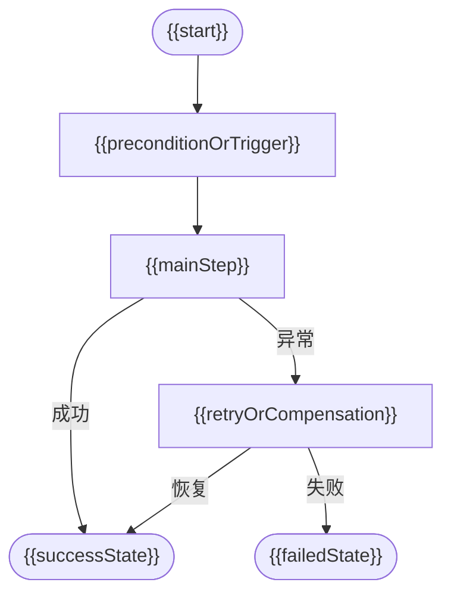

# 场景图

```mermaid
flowchart TD
  Start(["{{start}}"]) --> A["{{preconditionOrTrigger}}"]
  A --> B["{{mainStep}}"]
  B -->|成功| Success(["{{successState}}"])
  B -->|异常| C["{{retryOrCompensation}}"]
  C -->|恢复| Success
  C -->|失败| Failed(["{{failedState}}"])
```
