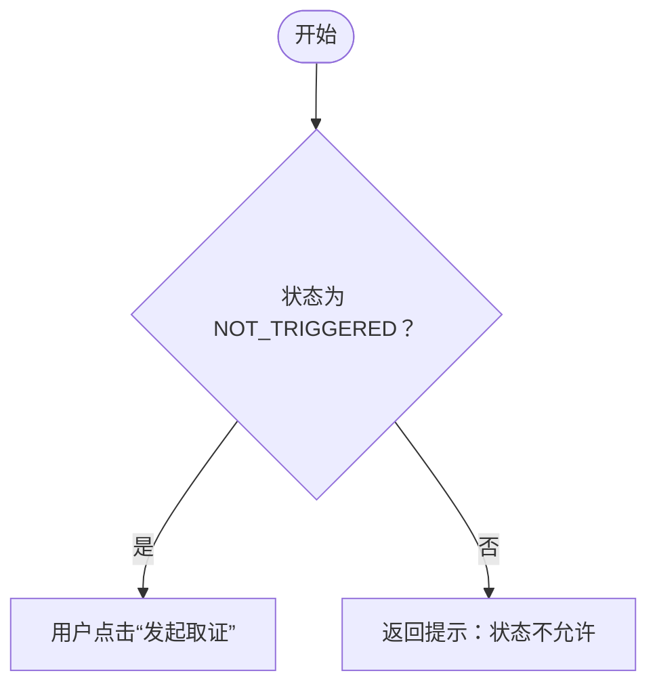

# Mermaid 11.16.0+ 编写规约

## 1. 兼容基线

- 所有正式 Mermaid 代码块必须以 Mermaid `11.16.0` 为最低兼容基线，并能够被 `11.16.0` 或更高版本的官方 parser 接受；不得依赖旧版本或宽松解析器偶然接受的语法；
- Markdown 使用 UTF-8，代码块必须以 ```` ```mermaid ```` 开始并正确闭合；路径图和场景图默认使用 `flowchart TD` 或 `flowchart LR`；
- 节点 ID、subgraph ID 使用稳定的 ASCII 标识符，例如 `Start`、`Decision_01`、`SCN_01`；中文业务文字只放在 label 中；
- 节点、条件、状态和流转必须来自材料证据，无法确认的内容写 `需确认`。

## 2. Label 与特殊字符

- 不得在旧式节点 label 或连线 label 中直接嵌入未转义的 ASCII 双引号 `"`。例如 `A[用户点击"发起取证"]` 在 Mermaid 11.16.0 中会解析失败；
- 业务文字需要引号时，优先改用中文引号 `“”`；必须保留 ASCII 双引号时使用 `&quot;`；文字中的竖线使用 `&#124;`，换行使用 `<br/>`；
- 使用带引号的 label 包住动态文字，并在替换模板占位符前完成转义；不得把未经处理的需求原文直接拼入 `[]`、`{}`、`()` 或连线 label；
- 一个稳定写法示例：



若必须保留 ASCII 双引号，写成：

```text
Trigger["用户点击&quot;发起取证&quot;"]
```

## 3. Subgraph 与可视化编辑

- 必须分组时使用显式 ASCII ID 和单独 label，例如 `subgraph SCN_01["场景 1：正常流程"]`；
- 当前 TestAgent 可视化编辑器会保留 `subgraph` 原文，但不会把 subgraph 内部节点全部转为可视化编辑模型。需要逐节点可视化编辑的正式图默认不要使用 `subgraph`；只有明确需要分组且接受脚本编辑时才使用。

## 4. 写入与冻结前校验

生成 Agent 在写入或冻结路径图/场景图前必须：

1. 重新读取落盘文件，确认 Mermaid fence 成对、图头存在、节点 ID 唯一、每条边两端都有明确节点；
2. 扫描 label，确认不存在未转义 ASCII 双引号、未闭合的 `[]` / `{}` / `()`、未闭合的边标签 `|...|`；
3. 当前运行环境提供 Mermaid `11.16.0` 或更高版本官方 parser 时，逐个代码块执行 `mermaid.parse(source)`；任一代码块失败时不得冻结中间物，也不得返回 `COMPLETED`；
4. 当前环境没有可调用 parser 时，只能记录 `parserCheck: UNAVAILABLE` 并完成上述静态检查，不得声称“已通过 Mermaid parser 校验”；
5. 在内部 `phaseAArtifactManifest` 或 `mermaidValidation` 中记录：`syntaxBaseline: ">=11.16.0"`、`staticCheck`、`parserCheck` 和失败位置。正式图文件不写这些内部元数据。

Review Agent 必须独立复核这些记录和图源码。发现语法错误、基线缺失、伪造 parser 通过记录或静态检查失败时，至少记为 `major`，Review 不得评为“通过”。
